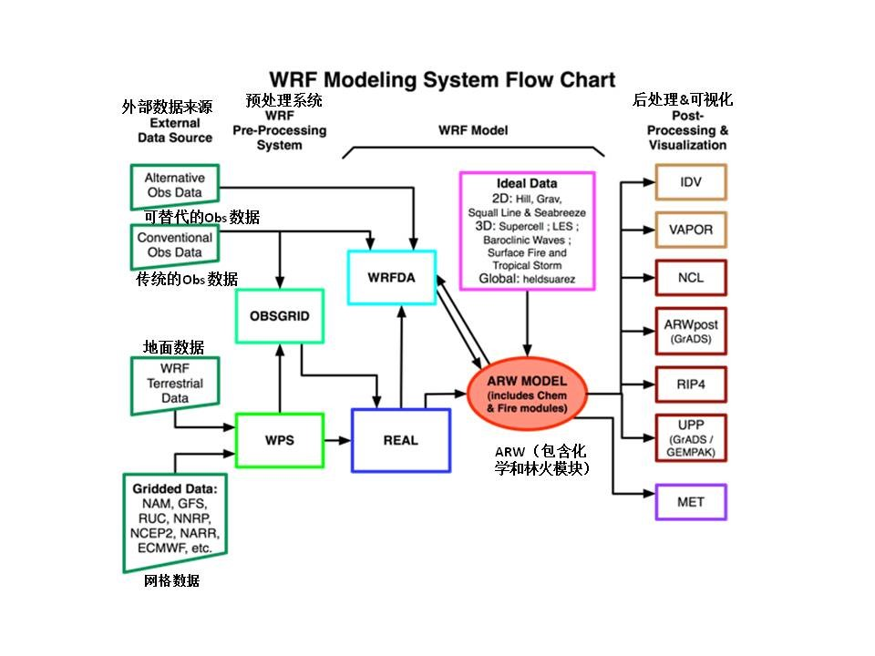

# 第一章 概述

## 目录

1 [简介](#Introduction)

2 [WRF ARW模型系统的构成](#WRF_Modeling_System)

## 简介

ARW（Advanced Research WRF）模型系统自开始开发已经18年了。当前版本是2018年6月发布的Version 4。ARW被设计为一个灵活的、最先进的大气模拟系统，在可用的并行计算平台上具有便携性和高效性。ARW可广泛适用于从数米到数千公里上不同级别尺度的研究，包括：
* 理想化模拟（如LES、对流、斜压波）
* 参数化研究
* 数据同化研究
* 预报研究
* 实时数值天气预报
* 飓风研究
* 区域气候研究
* 火灾研究
* 耦合模型应用
* 教学

NCAR的中尺度和微尺度气象学部门目前正在维护和支持WRF代码（V4版）的一个子集，其中包括：
* WRF软件框架（WRF Software Framework，WSF）
* ARW的动态求解方法，包括单向、双向嵌套和移动嵌套
* WRF预处理系统（WRF Preprocessing System，WPS）
* WRF数据同化（WRF Data Assimilation，WRF-DA）系统，目前支持3DVAR（三维同化）、4DVAR（四维同化）和混合数据同化能力
* WRF合作伙伴和研究团队提供的许多物理软件包
* 多个画图程序和其他画图工具的转换程序

这些是本文档的主题。

WRF建模系统软件属于公共领域，可免费使用。

## WRF的构成

下图显示了WRF模型系统（v4版本）的流程图。

  

由图可见，WRF模型系统主要包含以下几部分：
* WPS（WRF预处理系统）
* WRF-DA（数据同化系统）
* ARW解算器
* 后处理及可视化工具

### WPS（WRF预处理系统）

本程序用来为WRF模型准备输入数据，主要用于实时（真实）数据模拟。如果只是做理想化实验（idealized modeling），就不需要WPS处理真实数据。它的主要功能包括：1）定义模拟区域；2）将陆地数据（如地形、土地利用和土壤类型）插值到模拟区域；3）将其他模型的气象数据去噪和插值到该模拟区域。其主要特征包括：
* GRIB 1/2全球格点气象数据
* 美国地质调查局USGS的24类和MODIS 20类的土地利用数据集；USGS的GMTED2010高程数据集；联合国粮农组织全球5分和北美STATSGO 30秒土壤类别数据集；30秒和15秒MODIS绿度分数数据；30秒MODIS叶面积指数；MODIS 0.05度逐月地面反照率和雪反照率数据；1度的深层土壤温度数据；加上一些专门的数据集
* 地图投影：1）极球面投影，2）兰伯特共形投影，3）墨卡托投影，4）经纬度
* 嵌套
* 用于输入其他静态数据和气象数据的用户界面

### WRD-DA（数据同化系统）

此程序是可选的，但可用于将观测数据融入到WPS所创建的插值分析中（也就是数值求解模块）。当WRF模型在循环模式下运行时，它还可以用于更新WRF模型的初始条件。其主要特点如下：
* 它基于增量变分数据同化技术，同时具有3D-Var（3D同化）和4D-Var（4D同化）的能力
* 切线线性和WRF的相结合与4D-Var的WRF完全集成
* 它还包括3D和4D混合数据同化能力（变分+集合）
* 在分析控制变量空间 , 用共轭梯度法最小化成本函数
* 非交错的 Arakawa A网格分析
* 将分析增量插值到交错的Arakawa A网格，并将其添加到背景场（第一次猜测场）中，以获得WRF模型网格的最终分析
* 通过使用 “obsproc ” 工具 , 可以输入 ASCII 或者 “PREPEUFR” 格式的常规观测数据
* 多卫星观测数据输入可采用BUFR格式
* 两个快速辐射传输模型CRTM和RTTOV与WRFDA接口，作为卫星辐射观测操作平台
* 卫星辐射数据同化的变分偏差校正
* 全天辐射数据同化能力
* 复合雷达数据（反射率与雷达速度）以 ASCII 格式输入
* 多个外部环路，解决非线性问题
* 计算结合灵敏度的能力
* 背景场（初估计场）的水平分量误差通过递归滤波器（区域范围）或能量谱（全球范围）表现。垂直分量则通过气候学的平均特征向量以及其对应的特征值反映
* 水平与垂直背景场误差是不可分割的。每个特征向量的都有各自的水平气候学尺度
* 背景场的预处理函数是通过控制变量转换 U ，其定义为 B=UU^T
* 它包括通过 NMC 法或整体摄动法，用 “gen_be” 程序产生气候学背景场误差协方差估计
* 在 WRF-Var 后，用程序更新 WRF 的边界条件文件

### ARW解算器

这是模型系统的关键组成部分，它由几个理想化、实时同化以及数值积分的初始化程序组成。WRF模式的关键特征有：
* 完全可压缩非静力方程带有一个静力选项
* 区域以及全球的应用
* 完整的科氏力以及曲率的条件
* 带有多重嵌套和嵌套层次的双向嵌套
* 并行单向嵌套，具有多个嵌套和嵌套级别
* 离线单向嵌套和垂直嵌套移动嵌套
* 移动嵌套（规定的移动和涡流跟踪）
* 质量基础混合sigma压力垂直坐标
* 垂直格点大小随高度变化而变化
* 地图投影方案：1）极球面投影，2）兰伯特共形投影，3）墨卡托投影，4）经纬度（可旋转投影）
* Arakawa C 格点
* Runge-Kutta 二阶三阶时间积分
* 标量保守通量预测变量
* 二阶到六阶平流选项（水平与垂直）
* 单调传输以及正定平流选项的水汽，标量， TKE
* 加权基本无振荡（WENO）对流选项
* 分时小步长的声波以及重力波模式：
	* 小步长水平显显式，垂直隐式
	* 辐散阻尼选项和垂直时间
	* 外部模式滤波选项
* 上边界吸收和瑞利阻尼
* 横向边界条件
	* 理想情况：周期边界，对称边界以及开放辐射
	* 实际情况：指定的开放区域
* 完整的物理选项：陆面，行星边界层，大气与表面辐射，微物理与积云对流
* 海洋模型
* 使用单独的高空和地面数据进行网格分析推土，并进行观测推土
* 光谱推进
* 初始化数字滤波器
* 自适应时间步进
* 地形重力波阻力
* 随机参数化方案
* 一些理想化的例子

### 图形和验证工具 

支持多个程序，包括RIP4（基于NCAR图形）、NCAR图形命令语言（NCL）和其他现成图形包（如GrADS）的转换程序。

面向海洋、大气和太阳研究人员的可视化和分析平台程序[VAPOR]( http://www.VAPOR.ucar.edu/ )，它是一个三维数据可视化工具，由NCAR的[VAPOR团队]( mailto:VAPOR@ucar.edu )开发和支持。 

模型评估工具[MET]( http://www.dtcenter.org/MET/users/ )，由NCAR的[开发测试中心]( mailto:MET_help@ucar.edu )开发和支持。 

这些程序的详细信息（MET程序除外）将在本用户指南的后续章节中详细介绍。有关MET的信息，请参见上面的链接。