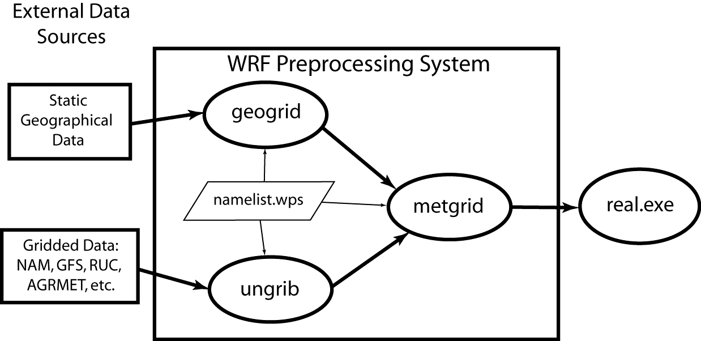
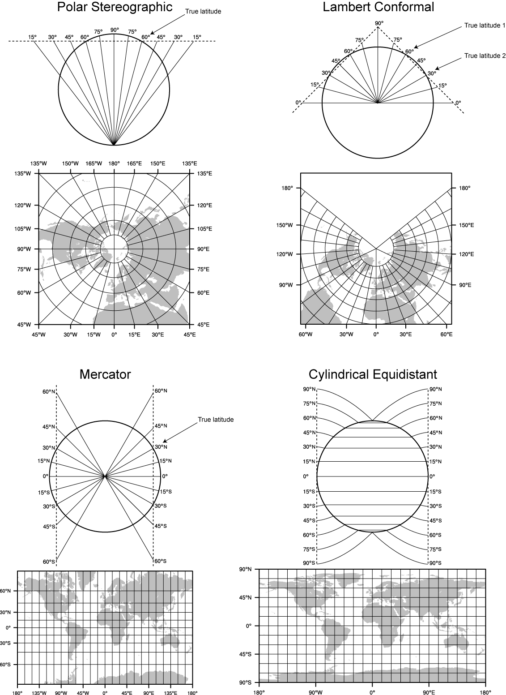
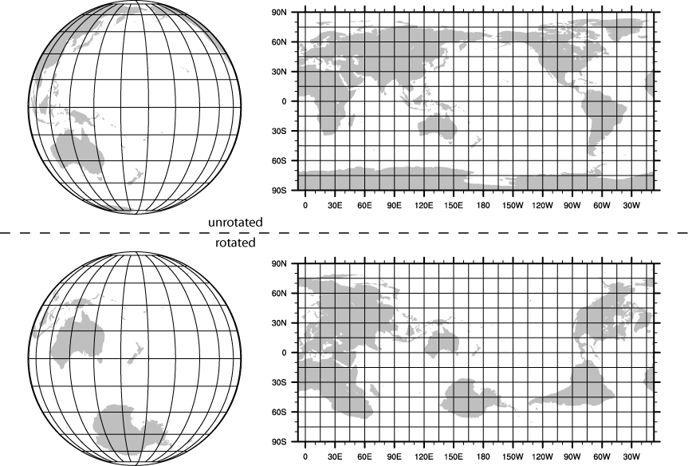
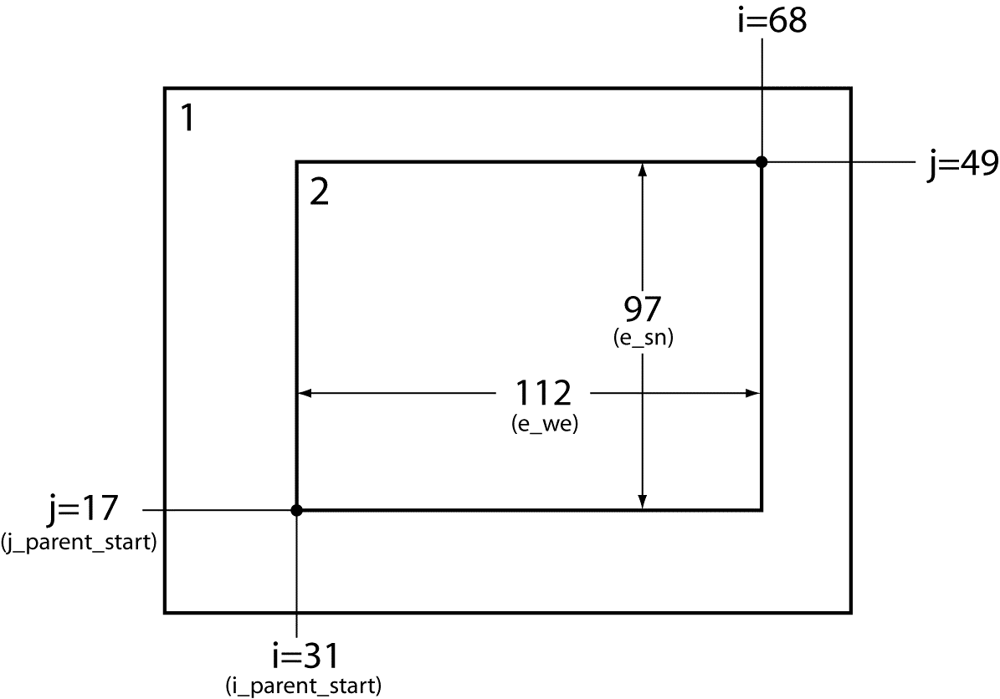
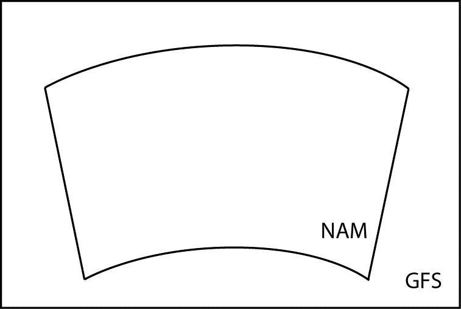

# 第三章 WRF预处理系统（WPS）

## 目录

1. [简介](#Introduction)

2. [每个WPS程序的功能](#Function_of_Each)

3. [安装WPS](#How_to_Install)

4. [运行WPS](#How_to_Run)

5. [使用WPS创建嵌套域](#Using_WRFSI_for_NESTED)

6. [在基于USGS和MODIS的土地利用分类之间进行选择](#Selecting_Between_USGS_MODIS)

7. [为重力波拖曳方案选择静态数据](#Selecting_Static_Data)

8. [使用多种气象数据源](#Using_Multiple_Meteorological)

9. [使用非等压气象数据集](#Using_Non-isobaric_Meteorological)

10. [湖SSTs的替代初始化](#Alternative_Initialization_of_Lake)

11. [WPS的并行计算](#Parallelism_in_WPS)

12. [检查WPS输出](#Checking_WPS_Output)

13. [WPS实用程序](#WPS_Utility_Programs)

14. [将气象数据写入中间格式](#Writing_Meteorological_Data)

15. [运行WRF所需的气象场](#Required_Meteorological_Fields)

16. [将MPAS输出用于WRF初始条件和横向边界条件](#Using_MPAS_Output)

17. [创建和编辑Vtables](#Creating_and_Editing_Vtables)

18. [将静态数据写入Geogrid二进制格式](#Writing_Static_Data)

19. [从NLCD数据创建城市分数字段](#Creating_Urban_Fraction)

20. [名称列表变量说明](#Namelist_Variables)

21. [Geogrid.TBL选项说明](#Geogrid_TBL_Options)

22. [索引选项说明](#index_Options)

23. [METGRID.TBL选项说明](#METGRID_TBL_Options)

24. [Geogrid和Metgrid中可用的插值选项](#Available_Interpolation_Options)

25. [静态数据中的土地利用和土壤类别](#Land_Use_and_Soil_Categories)

26. [WPS输出字段](#WPS_Output_Fields)

<a id=Introduction></a>

## 简介

WRF预处理系统（WPS）是一个由三个程序组成的集合，它们的共同作用是为真实数据模拟准备输入文件。每个程序执行一个准备阶段：*geogrid*定义/确定模拟区域并将静态地形数据插值到网格格点；*ungrib*从GRIB格式的文件中提取气象场；*metgrid*将*ungrib*提取的气象场水平插值到*geogrid*定义的模型网格中。将气象场垂直插值到WRF eta层的工作是在*real*程序中进行的。



上图给出了WPS三个程序之间的数据处理流程情况。如图所示，每个WPS程序都从一个公共namelist文件中读取参数。这个namelist文件包含了用于每个WPS程序单独的namelist数据，以及多个WPS程序共用的namelist数据。图中未显示的是单个程序使用的其他表文件。这些表提供了对程序操作的额外控制，尽管用户通常不需要更改它们。本文稍后将解释[GEOGRID.TBL](#Geogrid_TBL_Options)、[METGRID.TBL](#METGRID_TBL_Options)和[Vtable](#Creating_and_Editing_Vtables)文件，不过现在用户不必关注它们。

WPS的构建机制与WRF模型使用的构建机制非常相似，它提供了在各种平台上编译WPS的选项。当MPI库和合适的编译器可用时，可以将metgrid和geogrid程序编译为并行方式，这样可以在更短的时间内处理大区域的模拟工作。ungrib程序执行的工作不适合并行化，因此ungrib只能在单个处理器上运行。

<a id=Function_of_Each></a>

## 每个WPS程序的功能 

WPS由三个独立的程序组成：*geogrid*、*ungrib*和*metgrid*。WPS中还包括几个实用程序，这些程序在[实用程序](#WPS_Utility_Programs)一节中进行了描述。下面将对三个主要程序中的每一个程序进行简要说明，并在随后的章节中提供进一步的详细信息。 

### Geogrid程序 

geogrid的目的是定义模拟区域，并将各种地面数据集插值到模型网格中。用户在WPS namelist文件（namelist.WPS）的“geogrid”部分namelist记录中指定必要的信息，以定义模拟区域。除了计算每个网格点的经纬度和地图比例因子外，默认情况下，geogrid还会将土壤类别、土地利用类别、地形高度、年均深层土壤温度、逐月植被分数、逐月反照率、最大积雪反照率和坡度类别插值到模型网格中。每个字段的全球数据集都通过WRF下载页面提供，由于这些数据是不随时间变化的（一般情况下），所以只需要下载一次。其中一些数据集只提供了一种分辨率，还有一些数据集包括了“全分辨率”和“低分辨率”的下载选项。通常情况下，静态字段的“低分辨率”源仅适用于代码测试和教育目的，任何涉及模型精度的应用都应使用“全分辨率”地理数据集。

除了对默认的地面数据字段（fields）进行插值外，geogrid程序还具有足够的通用性，可以将大多数连续和分类的字段插值到模拟区域中。可以使用表格文件GEOGRID.TBL将新的或增加的数据集插值到模拟区域。GEOGRID.TBL文件可定义geogrid生成的每个字段；它描述要用于字段的插值方法，以及该字段的数据集在文件系统上的位置。

geogrid的输出文件是以WRF I/O API格式编写的，因此，通过选择NetCDF I/O格式，geogrid可以采用NetCDF格式输出文件，以便使用外部软件包（包括ncview、NCL和RIP4）进行可视化处理。

### Ungrib程序

ungrib程序读取GRIB文件，然后“degribs”数据，并以一种称为中间格式的简单格式写入数据（有关该格式的详细信息，请参阅[将气象数据写入中间格式](#Writing_Meteorological_Data)一节）。GRIB文件包含随时间变化的气象场，通常来自另一个区域或全球模型，如NCEP的NAM或GFS模型。ungrib程序默认可以读取GRIB Edition 1文件；如果使用“GRIB2”选项进行程序编译，则可以读取GRIB Edition 2文件。

GRIB文件通常包含的字段比初始化WRF所需的字段多。GRIB格式的两个版本都使用各种代码来标识GRIB文件中的变量和层级。Ungrib使用这些代码的表（称为Vtables，即“variable tables，变量表”）来定义要从GRIB文件中提取哪些字段并写入中间格式。有关这些代码的详细信息可以在WMO GRIB文档和originating center的文档中找到。通用GRIB模型输出文件的Vtables随ungrib软件提供。

提供的Vtables可用于NAM 104和212网格、NAM AWIP格式、GFS、NCEP/NCAR Reanalysis（NCAR存档）、RUC（压力级数据和混合坐标数据）、AFWA的AGRMET陆面模型输出、ECMWF和其他数据集。用户可以使用任何Vtables作为模板为其他模型输出文件创建自己的Vtable；有关Vtable中字段含义的更多详细信息，请参见[创建和编辑Vtables](#Creating_and_Editing_Vtables)一节。

用户可选择Ungrib用以下三种格式之一来生成中间数据文件：WPS格式——一种包含对下游程序有用的附加信息的新格式；SI格式——WRF系统以前的中间格式；以及MM5格式——这里包含MM5格式以便ungrib可用于向MM5模型系统提供GRIB2输入文件。WPS可以使用以上三种格式中的任何一种来初始化WRF——建议使用WPS格式。

### Metgrid程序

metgrid程序将ungrib程序提取的中间格式气象数据水平插值到geogrid程序定义的模拟区域中。插值后的metgrid输出文件可以被WRF real程序接收。metgrid将要运行插值计算的日期范围在WPS namelist文件的“共用”namelist记录中定义，并且必须在每个模拟区域的namelist中分别指定日期范围。由于metgrid程序的工作与ungrib程序的工作一样与时间相关，因此每次初始化新的模拟时都需要运行metgrid。

对每个气象字段如何插值是由METGRID.TBL文件控制的。METGRID.TBL文件为每个气象字段提供一节，并且在这一节中指定操作选项，例如用于该字段的插值方法、用作屏蔽插值的掩码的字段、以及被插值字段的网格交错（例如ARW中的U和V、NMM中的H和V）。

metgrid的输出文件是以WRF I/O API格式编写的，因此，通过选择NetCDF I/O格式，metgrid可以采用NetCDF格式输出文件，以便使用外部软件包（包括新版本的RIP4）进行可视化。

<a id=How_to_Install></a>

## 安装WPS

WPS使用与WRF模型相似的构建机制。geogrid和metgrid的外部库仅限于WRF模型所需的库，因为WPS使用WRF模型的WRF I/O API实现；因此，**必须在安装WPS之前编译WRF**，以便WPS程序可以使用WRF外部目录中的I/O API库。此外，ungrib程序需要三个压缩库来支持GRIB Edition 2；但是，如果不需要支持GRIB2数据，则可以在不使用这些压缩库的情况下编译ungrib。

### 需要的库

构建WRF模型所需的唯一库是NetCDF。用户可以在[UNIDATA主页]( http://www.UNIDATA.ucar.edu/software/netcdf/ )上找到源代码、预编译的二进制文件和文档。大多数用户为WPS选择NetCDF I/O选项，这样就可以使用很多支持NetCDF数据格式的实用程序。在配置WPS之前，用户应确保将环境变量NetCDF设置为NetCDF安装的路径。

WRF在模型和通信包之间添加了一个软件层，这样WPS程序geogrid和metgrid可以直接进行MPI调用。大多数多处理器计算机都预先配置了一个版本的MPI，因此用户不太可能需要自己安装此软件包。

ungrib程序需要三个库来支持GRIB Edition 2压缩。鼓励用户与其系统管理员联系安装这些包，以便维护传统的库文件路径和include文件路径。用户安装的压缩库的路径由`configure.wps`文件中的`COMPRESSION_LIBS`和`COMPRESSION_INC`变量来配置。除了手动编辑`configure.wps`文件中的`COMPRESSION_LIBS`和`COMPRESSION_INC`变量之外，用户还可以在配置wps之前将环境变量`JASPERLIB`和`JASPERINC`分别设置为保存JasPer库文件和inculde文件的目录；例如，如果JasPer库安装在`/usr/local/JasPer-1.900.1`中，则可以使用以下命令（在csh或tcsh中）：

```
> setenv JASPERLIB /usr/local/jasper-1.900.1/lib
> setenv JASPERINC /usr/local/jasper-1.900.1/include
```

如果zlib和PNG库不在编译器自动检查的标准路径中，则可以将这些库的路径添加到JasPer环境变量中；例如，如果PNG库安装在`/usr/local/libpng-1.2.29`中，zlib库安装在`/usr/local/zlib-1.2.3`中，则可以使用以下命令：

```
> setenv JASPERLIB “${JASPERLIB} -L/usr/local/libpng-1.2.29/lib -L/usr/local/zlib-1.2.3/lib”
> setenv JASPERINC “${JASPERINC} -I/usr/local/libpng-1.2.29/include -I/usr/local/zlib-1.2.3/include”
```

注意：以上命令应在先前设置了`JASPERLIB`和`JASPERINC`之后。 

（1）[Jasper（JPEG2000有损压缩标准的实现）]( http://www.ece.uvic.ca/~mdadams/jasper/ )

进入“Jasper软件”，其中一个“click here”部分是源代码。

```
> ./configure
> make
> make install
```

注意：GRIB2库需要在“jasper/jasper.h”中找到include文件，因此可能需要在jasper安装创建的“include”目录中手动创建一个“jasper”子目录，并在其中手动链接header文件。

（2）[PNG（用于“无损”压缩的压缩库）]( http://www.libpng.org/pub/png/libpng.html )

向下滚动到“源代码”并选择一个镜像站点。

```
> ./configure
> make check
> make install
```

（3）[zlib（PNG库使用的压缩库）](http://www.zlib.net/)

转到“当前版本在此处公开提供”部分并下载。

```
> ./configure
> make
> make install
```

为了解决便携性问题，WPS发行版中包含了NCEP GRIB库w3和g2。这些库的原始版本可从[NCEP网站]( http://www.nco.NCEP.noaa.gov/pmb/codes/GRIB2/ )下载。包括g2lib和w3lib的tar压缩包文件。由于ungrib程序需要这些文件中的模块，因此它们不适合在构建的链接阶段与传统库选项一起使用。

### 必需的编译器和脚本语言

WPS需要与构建WRF模型相同的Fortran和C编译器，因为WPS可执行文件链接到WRF的I/O API库。在WPS目录中执行`./configure`命令后，将显示当前系统架构上支持的编译器的列表。

### WPS安装步骤
1. 下载`WPS.TAR.gz`文件，然后解压到与WRF相同的目录级别，如下所示:

```
> ls
  -rw-r--r--  1  563863 WPSV4.0.TAR.gz
  drwxr-xr-x 18    4096 WRF

> gzip -d WPSV4.0.TAR.gz

> tar xf WPSV4.0.TAR 

> ls
  drwxr-xr-x  7     4096 WPS
  -rw-r--r--  1  3491840 WPSV4.0.TAR
  drwxr-xr-x 18     4096 WRF
```

2. 此时，当前工作目录的列表至少应包括WRF和WPS目录。首先，编译WRF（请参阅第2章中有关安装WRF的说明）。然后，在生成WRF可执行文件之后，切换到WPS目录并发出configure命令和compile命令，如下所示：

```
> cd WPS

> ./configure
	选择一个配置选项（configure options）
	
> ./compile >& compile.output
```

3. 发出compile指令后，当前工作目录的列表应显示指向三个WPS程序（geogrid.exe、ungrib.exe和metgrid.exe）的可执行文件的符号链接。如果这些链接中的任何一个不存在，请检查compile.output中的编译输出以查看出错的地方。

```
> ls
  drwxr-xr-x 2   4096 arch
  -rwxr-xr-x 1   1672 clean
  -rwxr-xr-x 1   3510 compile
  -rw-r--r-- 1  85973 compile.output
  -rwxr-xr-x 1   4257 configure
  -rw-r--r-- 1   2486 configure.wps
  drwxr-xr-x 4   4096 geogrid
  lrwxrwxrwx 1     23 geogrid.exe -> geogrid/src/geogrid.exe
  -rwxr-xr-x 1   1328 link_grib.csh
  drwxr-xr-x 3   4096 metgrid
  lrwxrwxrwx 1     23 metgrid.exe -> metgrid/src/metgrid.exe
  -rw-r--r-- 1   1101 namelist.wps
  -rw-r--r-- 1   1987 namelist.wps.all_options
  -rw-r--r-- 1   1075 namelist.wps.global
  -rw-r--r-- 1    652 namelist.wps.nmm
  -rw-r--r-- 1   4786 README
  drwxr-xr-x 4   4096 ungrib
  lrwxrwxrwx 1     21 ungrib.exe -> ungrib/src/ungrib.exe
  drwxr-xr-x 3   4096 util
```

<a id=How_to_Run></a>

## 运行WPS

运行WPS基本上主要有三个步骤：
 
1. 用*geogrid*定义模拟的粗糙区域和任何嵌套区域

2. 用*ungrid*为模拟时段提取GRIB数据集的气象场

3. 用*metgrid*将气象场水平插值到模拟区域

当要为同一模型区域进行多次模拟时，步骤1只需要执行一次；此后，使用步骤2和步骤3为每个模拟处理随时间变化的数据。同样，如果使用同一气象数据源在同一时间段内运行多个不同的模型区域，则不必为每个模拟分别运行ungrib。下面，对这三个步骤进行详细说明。

### 步骤1：使用Geogrid定义模型区域

如果成功安装了WPS软件，则在WPS目录结构的根目录中，应存在指向程序geogrid.exe，ungrib.exe和metgrid.exe的符号链接。除了这三个链接之外，还应该存在一个namelist.wps文件。因此，WPS根目录中的列表应类似于：

```
> ls
  drwxr-xr-x 2   4096 arch
  -rwxr-xr-x 1   1672 clean
  -rwxr-xr-x 1   3510 compile
  -rw-r--r-- 1  85973 compile.output
  -rwxr-xr-x 1   4257 configure
  -rw-r--r-- 1   2486 configure.wps
  drwxr-xr-x 4   4096 geogrid
  lrwxrwxrwx 1     23 geogrid.exe -> geogrid/src/geogrid.exe
  -rwxr-xr-x 1   1328 link_grib.csh
  drwxr-xr-x 3   4096 metgrid
  lrwxrwxrwx 1     23 metgrid.exe -> metgrid/src/metgrid.exe
  -rw-r--r-- 1   1101 namelist.wps
  -rw-r--r-- 1   1987 namelist.wps.all_options
  -rw-r--r-- 1   1075 namelist.wps.global
  -rw-r--r-- 1    652 namelist.wps.nmm
  -rw-r--r-- 1   4786 README
  drwxr-xr-x 4   4096 ungrib
  lrwxrwxrwx 1     21 ungrib.exe -> ungrib/src/ungrib.exe
  drwxr-xr-x 3   4096 util
```

在namelist.wps文件的“geogrid” namelist记录中定义了模型粗糙区域和任何嵌套域，此外，还需要设置“share” namelist记录中的参数。下面给出了这两个namelist记录的示例，用户可参看[名称列表变量说明](#Namelist_Variables)，以获取有关每个变量的目的和可能值的更多信息。

```
&share
 wrf_core = 'ARW',
 max_dom = 2,
 start_date = '2008-03-24_12:00:00','2008-03-24_12:00:00',
 end_date   = '2008-03-24_18:00:00','2008-03-24_12:00:00',
 interval_seconds = 21600,
 io_form_geogrid = 2
/

&geogrid
 parent_id         =   1,   1,
 parent_grid_ratio =   1,   3,
 i_parent_start    =   1,  31,
 j_parent_start    =   1,  17,
 e_we              =  74, 112,
 e_sn              =  61,  97,
 geog_data_res     = 'default','default',
 dx = 30000,
 dy = 30000,
 map_proj = 'lambert',
 ref_lat   = 34.83,
 ref_lon   = -81.03,
 truelat1  =  30.0,
 truelat2  =  60.0,
 stand_lon = -98.,
 geog_data_path = '/mmm/users/wrfhelp/WPS_GEOG/'
/
```

“share” namelist记录中与geogrid相关的部分，一般包括如下几项：必须首先使用`wrf_core`选择WRF动态核心。如果正在为ARW模拟运行WPS，则应将`wrf_core`设置为“`ARW`”，而如果是用于NMM模拟，则应将其设置为“`NMM`”。选择动态核心后，必须使用`max_dom`选择区域的总数（对于ARW）或嵌套级别（对于NMM）。由于geogrid仅生成与时间无关的数据，因此geogrid会忽略`start_date`，`end_date`和`interval_seconds`变量。作为一个可选项，可以使用`opt_output_from_geogrid_path`变量指示拟输出区域文件的位置（默认为当前工作目录），并且可以使用`io_form_geogrid`变量更改输出区域文件的格式。

在“geogrid” namelist记录中，定义了模拟区域的投影，以及所有模型网格的大小和位置。通过`map_proj`变量指定要用于模型区域的地图投影。下图中展示了ARW中四个可用的地图投影，下表中汇总了用于设置投影参数的namelist变量。



地图投影/`map_proj`取值 | 投影参数
------|------
兰伯特共形投影（Lambert Conformal） /`lambert` | truelat1<br>truelat2(optional)<br>stand_lon
墨卡托投影（Mercator） /`mercator` |	truelat1
极地立体投影（Polar stereographic） /`polar` |	truelat1<br>stand_lon
常规经纬度（Regular latitude-longitude）或圆柱等距投影（cylindrical equidistant） /`lat-lon` | pole_lat<br>pole_lon<br>stand_lon

在兰伯特共形投影、极地立体投影和墨卡托投影的图示中，可以看到所谓的真实纬度（true latitude）是投影表面与地球表面相交或相切的纬度。在此纬度上，地图投影中的距离没有失真，而在其他纬度上，地球表面上的距离与投影表面上的距离之间的关系取决于*地图比例因子*。理想情况下，应选择地图投影及其附带的参数，以减少模型网格覆盖区域内的最大失真。这是由于地图比例因子导致的明显不同于统一性的大量失真，可能限制模型时间步长超出必要的范围。**一般情况下，极地立体投影最适合于高纬度地区的WRF模拟，兰伯特共形投影非常适合于中纬度地区，而墨卡托投影则适合于低纬度地区或主要是东西方向范围的模拟区域。进行全球的ARW模拟需要采用圆柱等距投影，尽管在旋转方面它也非常适合于地球表面的任何区域（例如当`pole_lat`，`pole_lon`和`stand_lon`从其默认值更改时）。** 

在配置旋转的经纬度网格时，namelist参数`pole_lat`，`pole_lon`和`stand_lon`会从其默认值更改。参数`pole_lat`和`pole_lon`指定模型计算网格内地理北极的纬度和经度，`stand_lon`给出绕地球轴的旋转。在ARW的上下文中，计算网格是指规则的经纬度网格，在该网格上执行模型计算，并在其高纬度的纬度圆上应用傅立叶滤波器（Fourier filters）；对这种滤波细节感兴趣的用户可以参考《WRF Version 3技术说明》，在此只需注意，计算的经纬度网格总是用平行于模型网格x轴的计算纬度线和平行于网格y轴的计算经度线表示。

如果地球的地理经纬度网格与计算网格重合，则全球ARW区域显示了通常在常规经纬度网格上可视化的地球表面。相反，如果地理网格与模型计算网格不一致，则地理子午线和纬线将显示为复杂曲线。通过示例最容易说明差异。在下图的上半部分，显示的地球是地理经纬度网格与计算经纬度网格一致的。在下半部分，地理网格（未显示）已旋转，因此地球的地理极点不再位于计算网格的极点处。


 
如果要为某个地区范围配置运行WRF，则使用`ref_lat`和`ref_lon`变量来确定粗区域的位置，这两个变量分别指定了粗区域中心的纬度和经度。如果要处理嵌套区域，则使用`i_parent_start`和`j_parent_start`变量指定它们相对于父域的位置；在[使用WPS创建嵌套域](#Using_WRFSI_for_NESTED)一节中提供了设置嵌套区域的更多详细信息。接下来，由变量`dx`和`dy`确定粗区域的尺寸，变量`dx`和`dy`指定在x和y方向上的标称网格距离，而`e_we`和`e_sn`给出x和y方向上速度点的数量（如u交错点或v交错点）；对于兰伯特共形投影、极地立体投影和墨卡托投影，`dx`和`dy`以米为单位；对于经纬度投影，`dx`和`dy`以度为单位。对于嵌套区域，仅使用变量`e_we`和`e_sn`来确定网格的尺寸，并且不应为嵌套指定`dx`和`dy`，因为它们的值是根据`parent_grid_ratio`和`parent_id`变量的值递归确定的，这两个变量分别指定了嵌套的父网格距离与嵌套的网格距离之比和嵌套父网格的网格号。

如果将常规的经纬度投影用于某个地区范围，则必须注意确保该范围所覆盖的区域中的地图比例因子不会明显偏离统一性。这可以通过旋转投影以使该区域覆盖的区域位于投影的赤道附近来实现，因为对于常规的经纬度投影，x方向上的地图比例因子由计算纬度的余弦给出。例如，在上图中显示了未旋转和旋转的地球，可以看出，在旋转的地球中，新西兰位于计算网格的赤道沿线，因此，该旋转适用于覆盖新西兰区域的计算。作为用于地区范围模拟的旋转经纬度投影的一般准则，namelist参数中的`pole_lat`，`pole_lon`和`stand_lon`可以根据下表中的公式选择。

|   | 北半球(ref_lat, ref_lon) | 南半球(ref_lat, ref_lon) |
|---|---|---|
|pole_lat | 90.0 - ref_lat | 90.0 + ref_lat |
|pole_lon | 180.0 | 0.0 |
|stand_lon | -ref_lon | 180.0 - ref_lon |

对于全球WRF模拟，粗区域的覆盖范围当然是全球的，因此`ref_lat`和`ref_lon`不适用，并且不应指定`dx`和`dy`，因为标称网格距离是根据网格点数自动计算的。另外，应该注意的是，经纬度或圆柱等距投影（即`map_proj`取值为`'lat-lon'`）是WRF中唯一可以支持全球范围的投影。*全球范围内的嵌套区域不得覆盖计算纬度+45以北或计算纬度-45以南的任何区域，因为极坐标过滤器是向这些纬度的极点应用的（尽管可以在WRF namelist中更改截止纬度）。*

除了设置与模型区域的投影、位置和覆盖范围有关的变量外，还必须使用`geog_data_path`变量正确地指定静态地理数据集的路径。此外，用户可以使用`geog_data_res`变量选择geogrid程序要插入静态数据的分辨率，该变量的值应与GEOGRID.TBL中数据的分辨率之一匹配。

取决于`wrf_core` namelist变量的值，必须将适当的GEOGRID.TBL文件与geogrid程序一起使用，因为WPS插值的网格错位在不同的动态核心之间是不同的。对于ARW，应使用GEOGRID.TBL.ARW文件，对于NMM，应使用GEOGRID.TBL.NMM文件。通过将正确的文件链接到geogrid目录（或者在namelist中`opt_geogrid_tbl_path`参数指定的目录）中的GEOGRID.TBL，可以选择适当的GEOGRID.TBL。

```
> ls geogrid/GEOGRID.TBL
  lrwxrwxrwx 1      15 GEOGRID.TBL -> GEOGRID.TBL.ARW
```

有关每个变量的含义和可取值的更多详细信息，请参考[名称列表变量说明](#Namelist_Variables)。

在namelist.wps文件中合理定义了模拟粗区域和[嵌套区域](#Using_WRFSI_for_NESTED)之后，可以运行geogrid.exe可执行文件以生成区域文件。对于ARW区域，区域文件名为`geo_em.d0N.nc`，其中`N`是每个文件中定义的嵌套编号。在NMM区域中运行时，geogrid会为粗区域生成文件`geo_nmm.d01.nc`，并为每个嵌套级别`N`生成`geo_nmm_nest.l0N.nc`文件。此外，请注意，文件后缀名会根据所选的`io_form_geogrid`而有所不同。要运行geogrid，请发出以下命令：

```
> ./geogrid.exe
```

当geogrid.exe完成运行时，应该会输出以下消息

```
!!!!!!!!!!!!!!!!!!!!!!!!!!!!!!!!!!!!!!!!!!!!!
!  Successful completion of geogrid.        !
!!!!!!!!!!!!!!!!!!!!!!!!!!!!!!!!!!!!!!!!!!!!!
```

并且在WPS根目录（或`opt_output_from_geogrid_path`指定的目录，如果设置了此变量）中的列表应显示区域文件。如果没有，则应查询geogrid.log文件，以确定可能的失败原因。有关检查geogrid输出文件的更多信息，请参考[检查WPS输出](#Checking_WPS_Output)一节。

```
> ls
  drwxr-xr-x 2     4096 arch
  -rwxr-xr-x 1     1672 clean
  -rwxr-xr-x 1     3510 compile
  -rw-r--r-- 1    85973 compile.output
  -rwxr-xr-x 1     4257 configure
  -rw-r--r-- 1     2486 configure.wps
  -rw-r--r-- 1  1957004 geo_em.d01.nc
  -rw-r--r-- 1  4745324 geo_em.d02.nc
  drwxr-xr-x 4     4096 geogrid
  lrwxrwxrwx 1       23 geogrid.exe -> geogrid/src/geogrid.exe
  -rw-r--r-- 1    11169 geogrid.log
  -rwxr-xr-x 1     1328 link_grib.csh
  drwxr-xr-x 3     4096 metgrid
  lrwxrwxrwx 1       23 metgrid.exe -> metgrid/src/metgrid.exe
  -rw-r--r-- 1     1094 namelist.wps
  -rw-r--r-- 1     1987 namelist.wps.all_options
  -rw-r--r-- 1     1075 namelist.wps.global
  -rw-r--r-- 1      652 namelist.wps.nmm
  -rw-r--r-- 1     4786 README
  drwxr-xr-x 4     4096 ungrib
  lrwxrwxrwx 1       21 ungrib.exe -> ungrib/src/ungrib.exe
  drwxr-xr-x 3     4096 util
```

### 步骤2：使用ungrib从GRIB文件中提取气象场

已经下载了GRIB格式的气象数据后，将气象场提取为中间格式的第一步，需要编辑namelist.wps文件的“share”和“ungrib” namelist记录，以定义模拟区域。下面给出了两个namelist记录的示例。

```
&share
 wrf_core = 'ARW',
 max_dom = 2,
 start_date = '2008-03-24_12:00:00','2008-03-24_12:00:00',
 end_date   = '2008-03-24_18:00:00','2008-03-24_12:00:00',
 interval_seconds = 21600,
 io_form_geogrid = 2
/

&ungrib
 out_format = 'WPS',
 prefix     = 'FILE'
/
```

在“share” namelist记录中，与ungrib相关的变量是粗区域的开始和结束时间（`start_date`和`end_date`，或者是`start_year`、`start_month`、`start_day`、`start_hour`、`end_year`、`end_month`、`end_day`和`end_hour`），以及气象数据文件之间的间隔（`interval_seconds`）。在“ungrib” namelist记录中，`out_format`变量用于选择ungrib写入的中间数据的格式；metgrid程序可以读取ungrib支持的任何格式，因此`out_format`变量可以选择`“WPS”`、`“SI”`或`“MM5”`中的任何一种，一般建议使用`“WPS”`。同样在“ungrib” namelist中，用户可以使用`prefix`变量为中间文件指定路径和前缀。例如，如果将`prefix`变量设置为`“ARGRMET”`，则由ungrib创建的中间文件将命名为AGRMET：YYYY-MM-DD_HH，其中YYYY-MM-DD_HH是文件中数据的有效时间。

适当修改namelist.wps文件后，必须提供Vtable，并且必须将GRIB文件链接（或复制）到ungrib规定的文件名。WPS随Vtable文件一起提供了许多气象数据源，并且可以简单地将适当的Vtable符号链接到ungrib规定的Vtable文件名称。例如，如果GRIB数据来自GFS模型，则可以使用

```
> ln -s ungrib/Variable_Tables/Vtable.GFS Vtable
```

ungrib程序将尝试读取名为GRIBFILE.AAA，GRIBFILE.AAB，…，GRIBFILE.ZZZ的GRIB文件。为了简化将GRIB文件链接到这些文件名的工作，提供了一个shell脚本link_grib.csh。link_grib.csh脚本将要链接的GRIB文件的列表作为命令行参数。例如，如果将GRIB数据下载到`/data/gfs`目录，则可以采用link_grib.csh将这些文件进行链接，如下所示：

```
> ls /data/gfs
  -rw-r--r-- 1  42728372 gfs_080324_12_00
  -rw-r--r-- 1  48218303 gfs_080324_12_06
> ./link_grib.csh /data/gfs/gfs*
```

链接GRIB文件和Vtable之后，WPS目录的列表应如下所示：

```
> ls
  drwxr-xr-x 2     4096 arch
  -rwxr-xr-x 1     1672 clean
  -rwxr-xr-x 1     3510 compile
  -rw-r--r-- 1    85973 compile.output
  -rwxr-xr-x 1     4257 configure
  -rw-r--r-- 1     2486 configure.wps
  -rw-r--r-- 1  1957004 geo_em.d01.nc
  -rw-r--r-- 1  4745324 geo_em.d02.nc
  drwxr-xr-x 4     4096 geogrid
  lrwxrwxrwx 1       23 geogrid.exe -> geogrid/src/geogrid.exe
  -rw-r--r-- 1    11169 geogrid.log
  lrwxrwxrwx 1       38 GRIBFILE.AAA -> /data/gfs/gfs_080324_12_00
  lrwxrwxrwx 1       38 GRIBFILE.AAB -> /data/gfs/gfs_080324_12_06
  -rwxr-xr-x 1     1328 link_grib.csh
  drwxr-xr-x 3     4096 metgrid
  lrwxrwxrwx 1       23 metgrid.exe -> metgrid/src/metgrid.exe
  -rw-r--r-- 1     1094 namelist.wps
  -rw-r--r-- 1     1987 namelist.wps.all_options
  -rw-r--r-- 1     1075 namelist.wps.global
  -rw-r--r-- 1      652 namelist.wps.nmm
  -rw-r--r-- 1     4786 README
  drwxr-xr-x 4     4096 ungrib
  lrwxrwxrwx 1       21 ungrib.exe -> ungrib/src/ungrib.exe
  drwxr-xr-x 3     4096 util
  lrwxrwxrwx 1       33 Vtable -> ungrib/Variable_Tables/Vtable.GFS
```

编辑namelist.wps文件并链接适当的Vtable和GRIB文件后，可以运行ungrib.exe可执行文件，以生成中间格式的气象数据文件。只需输入以下内容即可运行ungrib：

```
> ./ungrib.exe >& ungrib.output
```

由于ungrib程序可能会产生大量输出信息，因此建议像上面的命令中一样，将ungrib输出信息重定向到文件中。如果ungrib.exe成功运行，则以下消息

```
!!!!!!!!!!!!!!!!!!!!!!!!!!!!!!!!!!!!!!!!!!!!!
!  Successful completion of ungrib.         !
!!!!!!!!!!!!!!!!!!!!!!!!!!!!!!!!!!!!!!!!!!!!!
```

将被写入ungrib.output文件的末尾，且中间文件应出现在当前工作目录中。ungrib编写的中间文件的名称格式为`FILE：YYYY-MM-DD_HH`（当然，除非将`prefix`变量设置为`'FILE'`以外的其他前缀）。

```
> ls
  drwxr-xr-x 2       4096 arch
  -rwxr-xr-x 1       1672 clean
  -rwxr-xr-x 1       3510 compile
  -rw-r--r-- 1      85973 compile.output
  -rwxr-xr-x 1       4257 configure
  -rw-r--r-- 1       2486 configure.wps
  -rw-r--r-- 1  154946888 FILE:2008-03-24_12
  -rw-r--r-- 1  154946888 FILE:2008-03-24_18
  -rw-r--r-- 1    1957004 geo_em.d01.nc
  -rw-r--r-- 1    4745324 geo_em.d02.nc
  drwxr-xr-x 4       4096 geogrid
  lrwxrwxrwx 1         23 geogrid.exe -> geogrid/src/geogrid.exe
  -rw-r--r-- 1      11169 geogrid.log
  lrwxrwxrwx 1         38 GRIBFILE.AAA -> /data/gfs/gfs_080324_12_00
  lrwxrwxrwx 1         38 GRIBFILE.AAB -> /data/gfs/gfs_080324_12_06
  -rwxr-xr-x 1       1328 link_grib.csh
  drwxr-xr-x 3       4096 metgrid
  lrwxrwxrwx 1         23 metgrid.exe -> metgrid/src/metgrid.exe
  -rw-r--r-- 1       1094 namelist.wps
  -rw-r--r-- 1       1987 namelist.wps.all_options
  -rw-r--r-- 1       1075 namelist.wps.global
  -rw-r--r-- 1        652 namelist.wps.nmm
  -rw-r--r-- 1       4786 README
  drwxr-xr-x 4       4096 ungrib
  lrwxrwxrwx 1         21 ungrib.exe -> ungrib/src/ungrib.exe
  -rw-r--r-- 1       1418 ungrib.log
  -rw-r--r-- 1      27787 ungrib.output
  drwxr-xr-x 3       4096 util
  lrwxrwxrwx 1         33 Vtable -> ungrib/Variable_Tables/Vtable.GFS
```

### 步骤3：使用metgrid水平插值气象数据

运行WPS的最后一步，将由ungrib提取的气象数据水平内插到geogrid定义的模拟网格中。为了运行metgrid，必须编辑namelist.wps文件。特别是“share”和“metgrid” namelist记录与metgrid程序相关。这些记录的示例如下所示。

```
&share
 wrf_core = 'ARW',
 max_dom = 2,
 start_date = '2008-03-24_12:00:00','2008-03-24_12:00:00',
 end_date   = '2008-03-24_18:00:00','2008-03-24_12:00:00',
 interval_seconds = 21600,
 io_form_geogrid = 2
/

&metgrid
 fg_name                      = 'FILE',
 io_form_metgrid              = 2, 
/
```

至此，通常无需更改“share” namelist记录中的任何变量，因为这些变量应该在之前的步骤中进行了适当设置。但是，如果在运行geogrid和ungrib时未编辑“share” namelist，则必须在“share”中设置WRF动态核心、区域数、开始和结束时间、气象数据之间的间隔、以及静态域文件的路径，如在运行geogrid和ungrib的步骤中所述。

在“metgrid” namelist记录中，中间格式气象数据文件的路径和前缀必须用`fg_name`参数给出，任何包含常量场的中间文件的完整路径和文件名都可以用`constants_name`变量指定，水平内插文件的输出格式可以使用`io_form_metgrid`变量指定。“metgrid” namelist记录中的其他变量，即`opt_output_from_metgrid_path`和`opt_metgrid_tbl_path`，允许用户指定metgrid输出内插数据文件的位置以及METGRID.TBL文件的位置。

与geogrid和GEOGRID.TBL文件一样，必须在metgrid目录（或者在`opt_metgrid_tbl_path`指定的目录，如果设置了此变量）中链接适合WRF核心的METGRID.TBL文件。

```
> ls metgrid/METGRID.TBL
  lrwxrwxrwx 1      15 METGRID.TBL -> METGRID.TBL.ARW
```

在适当地编辑namelist.wps文件并验证将使用正确的METGRID.TBL之后，可以通过发出以下命令来运行metgrid

```
> ./metgrid.exe
```

如果metgrid成功运行，则会输出以下消息

```
!!!!!!!!!!!!!!!!!!!!!!!!!!!!!!!!!!!!!!!!!!!!!
!  Successful completion of metgrid.        !
!!!!!!!!!!!!!!!!!!!!!!!!!!!!!!!!!!!!!!!!!!!!!
```

成功运行后，metgrid输出文件应出现在WPS根目录中（或者在`opt_metgrid_tbl_path`指定的目录，如果设置了此变量）。对于ARW区域，这些文件将被命名为`met_em.d0N.YYYY-MM-DD_HH：mm：ss.nc`，其中`N`是数据驻留在文件中的嵌套编号；对于NMM区域，为`met_nmm.d01.YYYY-MM-DD_HH:mm:ss.nc`。此处，`YYYY-MM-DD_HH:mm:ss`表示每个文件中插值数据的日期。如果在“share” namelist记录中指定的时间范围内不存在这些输出文件，则可以查阅metgrid.log文件以帮助确定运行metgrid时出现的问题。

```
> ls
  drwxr-xr-x 2       4096 arch
  -rwxr-xr-x 1       1672 clean
  -rwxr-xr-x 1       3510 compile
  -rw-r--r-- 1      85973 compile.output
  -rwxr-xr-x 1       4257 configure
  -rw-r--r-- 1       2486 configure.wps
  -rw-r--r-- 1  154946888 FILE:2008-03-24_12
  -rw-r--r-- 1  154946888 FILE:2008-03-24_18
  -rw-r--r-- 1    1957004 geo_em.d01.nc
  -rw-r--r-- 1    4745324 geo_em.d02.nc
  drwxr-xr-x 4       4096 geogrid
  lrwxrwxrwx 1         23 geogrid.exe -> geogrid/src/geogrid.exe
  -rw-r--r-- 1      11169 geogrid.log
  lrwxrwxrwx 1         38 GRIBFILE.AAA -> /data/gfs/gfs_080324_12_00
  lrwxrwxrwx 1         38 GRIBFILE.AAB -> /data/gfs/gfs_080324_12_06
  -rwxr-xr-x 1       1328 link_grib.csh
  -rw-r--r-- 1    5217648 met_em.d01.2008-03-24_12:00:00.nc
  -rw-r--r-- 1    5217648 met_em.d01.2008-03-24_18:00:00.nc
  -rw-r--r-- 1   12658200 met_em.d02.2008-03-24_12:00:00.nc
  drwxr-xr-x 3       4096 metgrid
  lrwxrwxrwx 1         23 metgrid.exe -> metgrid/src/metgrid.exe
  -rw-r--r-- 1      65970 metgrid.log
  -rw-r--r-- 1       1094 namelist.wps
  -rw-r--r-- 1       1987 namelist.wps.all_options
  -rw-r--r-- 1       1075 namelist.wps.global
  -rw-r--r-- 1        652 namelist.wps.nmm
  -rw-r--r-- 1       4786 README
  drwxr-xr-x 4       4096 ungrib
  lrwxrwxrwx 1         21 ungrib.exe -> ungrib/src/ungrib.exe
  -rw-r--r-- 1       1418 ungrib.log
  -rw-r--r-- 1      27787 ungrib.output
  drwxr-xr-x 3       4096 util
  lrwxrwxrwx 1         33 Vtable -> ungrib/Variable_Tables/Vtable.GFS
```

<a id=Using_WRFSI_for_NESTED></a>

## 使用WPS创建嵌套域

从本质上讲，WPS进行嵌套区域模拟并不比单一区域更困难。嵌套区域模拟的区别在于，geogrid和metgrid程序在运行时处理多个网格，而不是模拟一个网格。为了指定嵌套的大小和位置，必须为namelist.wps文件中的多个变量提供列表值，每个嵌套一个值。

```
&share
 wrf_core = 'ARW',
 max_dom = 2,
 start_date = '2008-03-24_12:00:00','2008-03-24_12:00:00',
 end_date   = '2008-03-24_18:00:00','2008-03-24_12:00:00',  
 interval_seconds = 21600,
 io_form_geogrid = 2
/

&geogrid
 parent_id         =   1,   1,
 parent_grid_ratio =   1,   3,
 i_parent_start    =   1,  31,
 j_parent_start    =   1,  17,
 e_we              =  74, 112,
 e_sn              =  61,  97,
 geog_data_res     = 'default','default',
 dx = 30000,
 dy = 30000,
 map_proj = 'lambert',
 ref_lat   = 34.83,
 ref_lon   = -81.03,
 truelat1  =  30.0,
 truelat2  =  60.0,
 stand_lon = -98.
 geog_data_path = '/mmm/users/wrfhelp/WPS_GEOG/'
/
```

受嵌套影响的namelist变量显示在上面的（部分）namelist记录中。该示例显示了用于运行两个区域的namelist变量（粗糙区域加一个嵌套区域），并且对namelist变量的影响以明显的方式推广到多个嵌套：必须指定N个值的列表，而不是指定两个值的列表，其中N是模型网格的总数。

在上面的示例中，对“share” namelist记录的第一次更改是对`max_dom`变量，该变量必须设置为模拟中嵌套的总数，包括粗糙区域。确定嵌套数量后，必须为所有其他受影响的名称列表变量提供N个值的列表，每个网格一个。“share” namelist记录的唯一不同是开始时间和结束时间。在此，必须为每个嵌套指定开始和结束时间，但限制一个嵌套不能在其父域之前开始或在其父域之后结束。另外，建议给嵌套的开始和结束时间与运行WPS时期望的嵌套开始时间相同。这是因为嵌套从其父域获取其横向边界条件，因此，仅嵌套的初始时间需要由WPS处理，除非在WRF中使用了网格微调（也称为分析微调）。重要的是要注意，在运行WRF时，必须在WRF namelist.input文件中给出所有嵌套的实际开始和结束时间。

其余更改是对“geogrid” namelist记录的。在此记录中，必须使用`parent_id`变量指定每个嵌套的父项。每个嵌套都必须是另一个嵌套的子代，并且粗区域是其自己的父代。与嵌套的父代的标识有关的是相对于其父代的嵌套比率，该比率由`parent_grid_ratio`变量给出，用于确定相对于其父级的网格间距的标称网格间距。


 
接下来，将嵌套的左下角指定为嵌套父域中的（i，j）位置；这是通过`i_parent_start`和`j_parent_start`变量完成的，并且相对于未交错的网格给出了指定的位置。最后，使用`s_we`、`e_we`、`s_sn`和`e_sn`变量为每个嵌套提供了以网格点为单位的每个嵌套的尺寸。上图中说明了我们的上述示例namelist中的嵌套设置，可以在其中看到如何确定上述每个变量。当前，必须将南北（`s_sn`）和西东（`s_we`）方向上的起始网格点值指定为1，而终止网格点值（`e_sn`和`e_we`）本质上确定了嵌套的完整尺寸；为确保嵌套网格的右上角与父域中未交错的网格点重合，`e_we`和`e_sn`都必须是嵌套比率的某个整数倍。另外，对于每个嵌套，要使用其插值的源数据的分辨率（或列表或分辨率，请参阅[名称列表变量说明](#Namelist_Variables)）由`geog_data_res`变量指定。有关这些名namelist变量的完整描述，请参阅[名称列表变量说明](#Namelist_Variables)。

<a id=Selecting_Between_USGS_MODIS></a>

## 在基于USGS和MODIS的土地利用分类之间进行选择

默认情况下，geogrid程序将根据MODIS IGBP 21种类别数据对土地使用类别进行插值。但是，用户可以根据USGS土地覆盖分类选择另一组土地使用类别。尽管基于MODIS的数据包含21种土地利用类别，但这些类别不是USGS类别中24种的子集；对这两个数据集中的特定类别感兴趣的用户可以在[静态数据中的土地利用和土壤类别](#Land_Use_and_Soil_Categories)一节中找到土地利用类别的列表。

在运行时，可以通过`&geogrid` namelist记录中的`geog_data_res`变量选择基于24类USGS的土地利用数据来代替MODIS数据。这是通过为静态数据的每个分辨率加上前缀字符串`“usgs_lakes+”`来实现的。例如，在两个区域的配置文件中，通常将`geog_data_res`变量指定为

```
geog_data_res = ‘default’, ‘default’,
```

如要使用USGS数据，则用户应改为：

```
geog_data_res = ‘usgs_lakes+default’, ‘usgs_lakes+default’,
```

此更改的结果是指示geogrid程序在GEOGRID.TBL文件的每个条目中查找具有以'usgs_lakes'表示的分辨率的静态数据的分辨率，如果该分辨率不可用，则改为查找由“+”后面的字符串表示的分辨率。因此，对于LANDUSEF字段的GEOGRID.TBL条目，将使用以字符串'usgs_lakes'标识的基于USGS的土地使用数据，而不是土地使用的分辨率（或来源）来替代上例中的'default'数据；对于所有其他字段，第一和第二个将使用'default'分辨率。顺便说一句，当在GEOGRID.TBL条目中找不到在`geog_data_res`中为区域指定的所有分辨率时，将使用'default'表示的分辨率。

从默认的21类MODIS土地使用数据更改时，用户还必须确保在WRF namelist.input文件的`&physics` namelist记录中正确设置了`num_land_cat` namelist变量。对于24类USGS数据，应将`num_land_cat`设置为24。

<a id=Selecting_Static_Data></a>

## 为重力波拖曳方案选择静态数据

ARW中的重力波拖曳地形（GWDO）方案需要WPS的十个静态场。实际上，这些字段将由geogrid程序内插，而不管模型中是否使用GWDO方案。当不使用GWDO方案时，将在WRF中忽略这些字段，并且用户不必担心从中插入字段的数据的分辨率。但是，建议从源数据的分辨率内插这些字段，该分辨率比模型网格的分辨率略低（即较粗糙）；因此，如果将使用GWDO方案，则应注意选择合适的GWDO静态数据分辨率。当前，可以使用五种分辨率的GWDO静态数据：2度、1度、30分、20分、和10分，由字符串“2deg”、“1deg”、“30m”、“20m”和“10m”表示。要选择要插值的分辨率，用户应在“geogrid” namelist记录中为`geog_data_res`变量指定的分辨率加上前缀字符串“XXX+”，其中XXX是GWDO静态数据的五个可用分辨率之一。例如，在网格间距为48公里的模型配置中，`geog_data_res`变量通常可以指定为

```
geog_data_res = ‘default’,
```

但是，如果采用GWDO方案，则仍比模型网格分辨率低的GWDO静态数据的最高分辨率是30分数据，在这种情况下，用户应指定

```
geog_data_res = ‘30m+default’,
```
	
如果在`geog_data_res`变量中未结合静态数据的其他分辨率指定“2deg”、“1deg”、“30m”或“20m”中的任何一个，则将使用“10m”GWDO静态数据，因为它也已指定作为GEOGRID.TBL文件中的“default”分辨率。值得注意的是，如果要使用10分分辨率的GWDO数据，但是对于其他静态字段（例如地形高度）需要不同的分辨率，则用户应该简单地将`geog_data_res`的值省略'10m'变量，因为例如指定了以下内容时：

```
geog_data_res = ‘10m+30s’,
```

将导致对于非GWDO字段（如地形高度和土地使用类别），Geogrid也会与GWDO字段一样优先使用10分数据而不是30秒数据。

<a id=Using_Multiple_Meteorological></a>

## 使用多种气象数据源

metgrid程序能够插值不随时间变化的字段，并且还可以从多个气象数据源插值。这些功能中的第一个使用`&metgrid` namelist记录中的`constants_name`变量。可以将此变量设置为中间格式文件的文件名列表（必要时包括路径信息），该文件包含不随时间变化的字段，并应在metgrid处理的每个时间段的输出中使用。例如，简短的模拟可能使用恒定的SST字段；该字段仅需使用一次，并且可以通过将`constants_name`变量设置为SST中间文件的路径和文件名来使用。`constants_name`的典型用法如下所示

```
&metgrid
 constants_name = '/data/ungribbed/constants/SST_FILE:2006-08-16_12'
/
```

or

```
&metgrid
 constants_name = 'LANDSEA', 'SOILHGT'
/
```

第二个metgrid功能（从多个源插入数据的功能）在需要组合两个或多个互补数据集以生成real.exe所需的完整输入数据的情况下可能很有用。要从随时间变化的气象数据的多个源进行插值，应将`&metgrid` namelist记录中的`fg_name`变量设置为中间文件的前缀列表，必要时还包括路径信息。如果给出多个路径前缀，并且来自多个源的同一气象场可用，那么来自最后指定源的数据将优先于所有先前源。因此，可以通过给定数据源的顺序来对数据源进行优先级排序。

作为此功能的一个示例，如果在一个数据源中提供了地表场，而在另一数据源中提供了高空数据，则分配给`fg_name`变量的值可能类似于：

```
&metgrid
 fg_name = '/data/ungribbed/SFC', '/data/ungribbed/UPPER_AIR'
/
```

为了简化从GRIB文件提取气象场的过程，可以使用`&ungrib`记录中的`prefix` namelist变量。该变量使用户可以控制由ungrib创建的中间文件的名称（和路径）。 通过示例最容易说明此namelist变量的实用程序。假设我们希望使用北美地区再分析（NARR）数据集，该数据集被分为三维大气数据、地表数据和固定场数据的单独GRIB文件。我们可以先使用`link_grib.csh`脚本链接所有“3D” GRIB文件，然后将NARR Vtable链接到文件名`Vtable`。然后，我们可以在运行ungrib.exe之前适当地编辑`&ungrib` namelist记录，以使生成的中间文件具有适当的前缀：

```
&ungrib
 out_format = 'WPS',
 prefix = 'NARR_3D',
/
```

运行ungrib.exe之后，以下文件应存在：

```
NARR_3D:2008-08-16_12
NARR_3D:2008-08-16_15
NARR_3D:2008-08-16_18
...
```

给定三维场的中间文件，我们可以通过链接地表GRIB文件并更改名称列表中的`prefix`变量来处理地表场：

```
&ungrib
 out_format = 'WPS',
 prefix = 'NARR_SFC',
/
```

再次运行ungrib.exe，除了NARR_3D文件之外，还应该存在以下内容：

```
NARR_SFC:2008-08-16_12
NARR_SFC:2008-08-16_15
NARR_SFC:2008-08-16_18
...
```

最后，将固定场文件与`link_grib.csh`脚本链接，并再次设置namelist中的`prefix`变量：

```
&ungrib
 out_format = 'WPS',
 prefix = 'NARR_FIXED',
/
```

第三次运行ungrib.exe之后，除了地表和“3D”字段外，还有固定场文件：

```
NARR_FIXED:1979-11-08_00
```

为了清楚起见，由于文件中的字段是静态的，因此可以重命名固定场以删除任何日期信息，例如，将其重命名为`NARR_FIXED`。在此示例中，我们注意到NARR固定数据仅在特定时间（1979年11月8日，0000 UTC）可用，因此，用户需要为`&share` namelist记录中的数据设置正确的开始和结束时间，然后才能在NARR固定场文件上运行ungrib；当然，还应该在运行metgrid之前重新设置时间。

给定NARR数据集的所有三个部分的中间文件，可以在设置`&metgrid` namelist记录中的`constants_name`和`fg_name`变量之后运行metgrid.exe：

```
&metgrid
 constants_name = 'NARR_FIXED',
 fg_name = 'NARR_3D', 'NARR_SFC'
/
```

尽管不那么常见，但另一个需要多个数据源的情况是，当区域模型中的气象数据源不足以覆盖整个模拟区域时，必须使用较大区域模型或全球模型中的数据插值到模拟网格的其余点。

例如，要在任何可能的地方使用NAM数据，在其他地方使用GFS数据，则可以在namelist中分配以下值：

```
&metgrid
 fg_name = '/data/ungribbed/GFS', '/data/ungribbed/NAM'
/
```

然后，生成的模型区域将使用如下图所示的数据。



如果在多个源中没有找到任何字段，则metgrid无需应用优先级，并且将像往常一样简单地对每个字段进行插值；当然，每个源都应覆盖整个模拟域，以避免出现丢失数据的区域。

<a id=Using_Non-isobaric_Meteorological></a>

## 使用非等压气象数据集

当使用非等压气象数据集初始化WRF模拟时，重要的是，将此类数据集提供给metgrid.exe程序，使其3-d压力和地势高度场的层与其他3-d大气变量相同，例如温度和湿度。WRF real.exe预处理程序将这些场用于WRF模型层的垂直插值、表面压力计算以及其他目的。

对于某些数据源，即ECMWF model-level数据和UK Met Office模型数据，可以使用一系列系数从表面压力和/或表面高度场中导出3-d压力和/或地势高度场，并且WPS提供了用于执行此导出的实用程序；请参见[WPS实用程序](#WPS_Utility_Programs)一节查看有关calc_ecmwf_p.exe和height_ukmo.exe程序的更多信息。

其他气象数据集明确提供了3-d压力和地势高度场，并且用户仅需确保这些场存在于提供给metgrid.exe程序的一组中间文件中。

<a id=Alternative_Initialization_of_Lake></a>

## 湖SSTs的替代初始化

metgrid程序中对海洋和湖泊的海面温度的默认处理方式是简单地将SST字段从中间文件插值到WRF区域中的所有水体格点。但是，如果在WRF区域中解析为湖泊，而在GRIB数据中未解析时，特别是如果这些湖泊在地理上与解析水体相距较远，则最有可能从GRIB数据的最近解析水体中推断出湖上的SST场；这种情况可能导致湖泊SST值过热或过冷，不符合实际情况。

如果没有高分辨率的SST字段供metgrid使用，则外推湖泊的SST值的另一种方法是在湖泊的SST上做出“最佳猜测”。在metgrid和real程序中，这可以通过将区分湖泊和海洋的特殊土地利用数据集与用作湖上SST代理的字段结合使用来完成。由于WRF的实际预处理程序需要知道应在哪里使用人造SST字段而不是GRIB数据中插补的SST字段，因此需要一个特殊的土地使用数据集。

以下步骤概述了初始化湖SSTs的替代过程：

1. 在运行geogrid之前，请确保`&geogrid` namelist记录中的`geog_data_res`规范指定具有内陆水体的基于USGS或基于MODIS的土地使用数据。geogrid程序中的默认行为是使用包含湖泊类别的基于MODIS的土地利用。但是，也可以使用包含湖泊类别的USGS土地利用数据集。例如，在两层嵌套区域的配置中，设置

```
geog_data_res = 'usgs_lakes+default', 'usgs_lakes+default',
```

会告诉geogrid在两层嵌套区域中都使用基于USGS的土地使用数据。

然后运行geogrid会使输出文件使用针对内陆水域的单独类别，而不是用于海洋的常规水类别。湖泊类别由geogrid输出文件中的全局属性ISLAKE标识；此属性应设置为28（对于基于USGS的数据）或21（对于基于MODIS的数据）。参见[WPS输出字段](#WPS_Output_Fields)，其中ISLAKE的值-1表示没有单独的湖泊类别。

2. 运行ungrib程序后，使用avg_tsfc.exe实用程序创建一个包含日平均地表气温场的中间文件，该文件将由real程序代替仅在湖泊上的SST字段。有关avg_tsfc.exe实用程序的更多信息，请参阅[WPS实用程序](#WPS_Utility_Programs)。

3. 在运行metgrid程序之前，将上一步中创建的TAVGSFC文件添加到namelist.wps文件的`&metgrid`记录中的`constants_name`规范中。

4. 在namelist.input文件的`&physics`记录中设置土地类别的数量（`num_land_cat`），使其与metgrid文件中的全局属性`NUM_LAND_CAT`的值匹配之后，照常运行WRF的real.exe程序。如果metgrid文件中的全局属性ISLAKE指示存在一个特殊的湖泊土地使用类别，则real程序将仅在类别与湖泊类别匹配的那些网格点上用TAVGSFC字段替代SST字段；此外，由于LANDUSE.TBL和VEGPARM.TBL文件都没有包含湖泊类别的条目，因此real程序会将湖泊的土地利用类别更改回一般的水类别（用于海洋的类别）。

<a id=Parallelism_in_WPS></a>

## WPS的并行计算

如果WPS要处理的区域的尺寸太大而无法容纳在单个CPU的内存中，则可以在分布式内存配置中运行geogrid和metgrid程序。为了编译geogrid和metgrid以执行分布式内存，用户必须在目标计算机上安装MPI库，并且必须使用“DM parallel”配置选项之一来编译WPS。成功编译后，取决于机器的不同，可以使用`mpirun`或`mpiexec`命令或通过批处理排队系统来运行geogrid和metgrid程序。

如前所述，ungrib程序的工作不适合并行化，此外，ungrib处理的内存要求独立于geogrid和metgrid的内存要求；因此，无论在配置期间是否选择了“DM parallel”配置选项，ungrib始终为单个处理器编译并在单个CPU上运行。

每种标准WRF I/O API格式（NetCDF、GRIB1、二进制）都有对应的并行格式，其编号是通过将标准格式的io_form值（即`io_form_geogrid`和`io_form_metgrid`的值）加100来给出的。使用并行的io_form不是必须的，但是如果使用一个并行的io_form时，每个CPU会将其输入/输出读/写到一个单独的文件中，该文件的名称只是在串行执行期间将使用的名称，但是名称后附加四位处理器ID数字。例如，在四个处理器上运行`io_form_geogrid=102`时，geogrid将为粗区域创建名为geo_em.d01.nc.0000，geo_em.d01.nc.0001，geo_em.d01.nc.0002和geo_em.d01.nc.0003的输出文件。

在分布式内存执行期间，模型域被分解为矩形块，每个处理器工作在单个块上。从WRF I/O API格式读/写时，每个处理器仅读/写其各自的块。因此，如果为geogrid的输出选择了并行的io_form，则必须使用与运行geogrid相同数量的处理器来运行metgrid。同样，如果为metgrid输出文件选择了并行的io_form，则real程序必须使用相同数量的处理器运行。当然，在多个处理器上运行时仍然可以使用标准的io_form，在这种情况下，将在输入/输出时分发/收集模型区域的所有数据。最后要注意的是，当在多个处理器上运行geogrid或metgrid时，每个处理器将写入自己的日志文件，日志文件名后会附加用于I/O API文件的相同四位处理器ID号。

<a id=Checking_WPS_Output></a>

## 检查WPS输出

运行WPS时，检查程序产生的输出信息可能会有所帮助。例如，当确定嵌套的位置时，查看插值的静态地理数据和纬度/经度字段可能会有所帮助。再举一个例子，当将新的数据源（静态数据或气象数据）导入WPS时，检查生成的插值字段通常有助于调整geogrid或metgrid使用的插值方法。

通过将NetCDF格式用于geogrid和metgrid I/O格式，可以使用多种读取NetCDF数据的可视化工具来检查geogrid处理的区域文件或metgrid产生的水平内插气象场。为了将geogrid和metgrid的文件格式设置为NetCDF，用户应在WPS namelist文件中将`io_form_geogrid`和`io_form_metgrid`指定为2（注意：2就是这些选项的默认设置）：

```
&share
 io_form_geogrid = 2,
/

&metgrid
 io_form_metgrid = 2, 
/
```

在可用的工具中，可能会感兴趣包括ncdump、ncview和新的RIP4程序。ncdump程序是随NetCDF库一起分发的紧凑实用程序，它列出了NetCDF文件中的变量和属性。这对于检查geogrid区域文件中的区域参数（例如东西向维度，南北向维度或区域中心点）或在文件中列出字段尤其有用。ncview程序提供了一种交互方式来查看NetCDF文件中的字段。同样，对于希望产生适用于出版物的图件的用户而言，RIP4程序的新版本可能会令人感兴趣。新的RIP4能够绘制水平等值线图、地图背景图并在同一张图中叠加多个场。

ungrib程序的输出文件始终以简单的二进制格式（“WPS”，“SI”或“MM5”）编写，因此用于查看NetCDF文件的软件几乎毫无用处。但是，WPS源代码提供了一个基于NCAR Graphics的实用程序`plotfmt`。该实用程序可以采用中间格式文件生成等值线图。如果正确安装了NCAR图形库，则在构建WPS时，plotfmt程序会与其他实用程序一起自动编译。

<a id=WPS_Utility_Programs></a>

## WPS实用程序

除了三个主要的WPS程序-geogrid，ungrib和metgrid-WPS附带的许多实用程序都在util目录中进行编译。这些实用程序可用于检查数据文件，可视化嵌套域的位置，计算压力场以及计算平均表面温度场。
A.avg_tsfc.exe
avg_tsfc.exe程序以中间格式为给定输入文件计算每日平均表面温度。根据namelist.wps文件的“共享”名称列表部分中指定的日期范围，并考虑中间文件之间的间隔，avg_tsfc.exe将在计算平均值时使用尽可能多的整天数据，从名称列表中指定的开始日期开始。如果没有一整天的可用数据，则不会写入任何输出文件，并且程序将在确定后立即停止。同样，任何无法用作完整24小时周期的日期的中间文件都将被忽略；例如，如果每隔六个小时有五个中间文件可用，则最后一个文件将被忽略。使用与输入文件相同的中间格式版本，将计算出的平均值字段写入名为TAVGSFC的新文件中。然后，通过在“ metgrid”名称列表部分中为constants_name变量指定“ TAVGSFC”，metgrid可以摄取该每日平均表面温度场。

B.mod_levs.exe
mod_levs.exe程序用于从中间格式文件中删除数据级别。要保留的级别在namelist.wps文件中的新名称列表记录中指定：
&mod_levs
 press_pa = 201300 , 200100 , 100000 , 
             95000 ,  90000 , 
             85000 ,  80000 , 
             75000 ,  70000 , 
             65000 ,  60000 , 
             55000 ,  50000 , 
             45000 ,  40000 , 
             35000 ,  30000 , 
             25000 ,  20000 , 
             15000 ,  10000 , 
              5000 ,   1000
/
在＆mod_levs名称列表记录中，变量press_pa用于指定要保留的级别列表。指定的级别应与中间格式文件中的xlvl值匹配（有关中间文件字段的更多信息，请参见WPS中间格式的讨论）。 mod_levs程序将两个命令行参数作为其输入。第一个参数是要操作的中间文件的名称，第二个参数是要写入的输出文件的名称。

例如，当将一个数据集用于模型初始条件而将第二个数据集用于侧向边界条件时，从气象数据集中删除除指定子集之外的所有子集特别有用。这可以通过提供将在第一个时间段内设置的初始条件数据集（由metgrid进行插值）以及所有其他时间设置的边界条件数据来完成。如果两个数据集的垂直级别数相同，则无需做任何工作；但是，当这两个数据集的级别数不同时，至少有必要删除（m – n）个级别，其中m> n且m和n是两个级别中每个级别的数量数据集，来自具有m个级别的数据集。在所有文件中具有相同数量的垂直级别的必要性是由于real.exe中的限制所致，该限制要求从中进行固定数量的垂直级别。
mod_levs实用程序是一种临时解决方案，用于容纳两个或多个具有不同垂直级别数的数据集。如果用户选择使用mod_levs，则应注意，尽管级别的垂直位置在数据集之间不必匹配，但是所有数据集都应具有表面数据级别，并且在运行real.exe和wrf.exe时，则必须将p_top的值选择为低于数据集中的最低值。
C.calc_ecmwf_p.exe
在垂直内插气象场的过程中，实际程序需要与其他大气场处于同一水平的3维压力场和地势高度场。 calc_ecmwf_p.exe实用工具可用于创建这些字段以用于ECMWF sigma级别的数据集。给定一个表面压力场（或表面压力场的对数）以及系数A和B的列表，calc_ecmwf_p.exe计算网格点（i，j）处ECMWF sigma级别k的压力为Pijk = Ak + Bk * Psfcij 。压力计算中使用的系数列表可以从以下链接之一的表格中复制，该表格与数据集中的sigma级数相对应：
http://www.ecmwf.int/en/forecasts/documentation-and-support/16-model-levels
http://www.ecmwf.int/en/forecasts/documentation-and-support/19-model-levels
http://www.ecmwf.int/en/forecasts/documentation-and-support/31-model-levels
http://www.ecmwf.int/en/forecasts/documentation-and-support/40-model-levels
http://www.ecmwf.int/en/forecasts/documentation-and-support/50-model-levels
http://www.ecmwf.int/en/forecasts/documentation-and-support/60-model-levels
http://www.ecmwf.int/en/forecasts/documentation-and-support/62-model-levels
http://www.ecmwf.int/en/forecasts/documentation-and-support/91-model-levels
http://www.ecmwf.int/en/forecasts/documentation-and-support/137-model-levels 
该表应以纯文本格式写入当前工作目录中的文件ecmwf_coeffs； 例如，对于16个sigma级别，文件emcwf_coeffs将包含以下内容：
1.	    0         0.000000      0.000000000
2.	    1      5000.000000      0.000000000
3.	    2      9890.519531      0.001720764
4.	    3     14166.304688      0.013197623
5.	    4     17346.066406      0.042217135
6.	    5     19121.152344      0.093761623
7.	    6     19371.250000      0.169571340
8.	    7     18164.472656      0.268015683
9.	    8     15742.183594      0.384274483
10.	    9     12488.050781      0.510830879
11.	   10      8881.824219      0.638268471
12.	   11      5437.539063      0.756384850
13.	   12      2626.257813      0.855612755
14.	   13       783.296631      0.928746223
15.	   14         0.000000      0.972985268
16.	   15         0.000000      0.992281914
17.	   16         0.000000      1.000000000
此外，如果有土壤高度（或土壤地势），3维温度和3维特定湿度场，则calc_ecmwf_p.exe计算3维地势高度场，这是在真实区域中获得准确的垂直插值所必需的程序。
给定ungrib生成的一组中间文件和ecmwf_coeffs文件，calc_ecmwf_p在namelist.wps中的所有时间段内循环，并每次生成一个附加的中间文件PRES：YYYY-MM-DD_HH，其中包含压力和地势高度每个完整sigma级别的数据，以及3-d相对湿度场。通过在fg_name namelist变量的前缀列表中添加“ PRES”，应将此中间文件与ungrib生成的中间数据一起指定给metgrid。
D. height_ukmo.exe
实际程序需要3维压力和地势高度场来垂直内插metgrid程序的输出；但是，来自UKMO统一模型的数据集包含3-d压力场，但不包含地势高度场。因此，height_ukmo.exe程序可用于计算来自UKMO统一模型的数据集的地势高度字段。 height_ukmo.exe程序不需要命令行参数，但会读取＆metgrid名称列表记录以获取ungrib.exe创建的中间文件的前缀；＆metgrid名称列表记录的fg_name变量中的第一个前缀所指示的中间文件应包含一个SOILHGT字段，height_ukmo.exe程序将通过该字段借助辅助表计算3-d地理高度字段。计算出的高度字段将被写入带有前缀HGT的新中间文件，然后应在运行metgrid.exe之前将前缀“ HGT”添加到＆metgrid名称列表记录中的fg_name名称列表变量中。当前，包含辅助表的文件名已硬连接到height_ukmo.exe程序的源代码中，用户有责任将WPS / util / src / height_ukmo.F中的此文件名更改为与ungrib.exe处理的GRIB数据具有相同级别级别的表的名称； WPS / util目录中分别提供了38、50和70级数据的数据表，文件名分别为vertical_grid_38_20m_G3.txt，vertical_grid_50_20m_63km.txt和vertical_grid_70_20m_80km.txt。
E.plotgrids.ncl
plotgrids.ncl程序是一个基于NCAR Graphics的实用程序，其目的是绘制在namelist.wps文件中定义的所有嵌套的位置。该程序在namelist.wps文件上运行，因此可以在不运行三个主要WPS程序中的任何一个的情况下运行。成功完成后，plotgrids将以所选格式生成图形文件（请参见plotgrids.ncl脚本内部，以对输出格式进行更改），绘制粗略域以填充图框，并绘制带有政治边界的地图轮廓粗略区域，所有嵌套区域都绘制为矩形，勾勒出每个嵌套区域的范围。该实用程序在域的初始放置期间特别有用，这时用户可以通过编辑namelist.wps文件，运行plotgrids.ncl并确定一组对嵌套位置的调整来迭代地调整嵌套的位置。要运行该程序，只需在WPS /目录中的命令行中键入“ ncl util / plotgrids.ncl”。目前，该实用程序不适用于使用纬度-经度投影的ARW域（即，当map_proj ='lat-lon'时）。
F.g1print.exe
g1print.exe程序将GRIB Edition 1文件的名称作为唯一的命令行参数。该程序将打印文件中数据的字段，级别和日期的列表。
G.g2print.exe
与g1print.exe相似，g2print.exe程序将GRIB Edition 2文件的名称作为唯一的命令行参数。该程序将打印文件中数据的字段，级别和日期的列表。
H.rd_intermediate.exe
在命令行中给定了singe中间格式文件的名称后，rd_intermediate.exe程序会打印有关文件中包含的字段的信息。

<a id=Writing_Meteorological_Data></a>

## 将气象数据写入中间格式

ungrib程序的作用是将GRIB数据集解码为metgrid可以理解的简单中间格式。如果GRIB Edition 1或GRIB Edition 2格式的气象数据不可用，则用户有责任将这些数据写入中间文件格式。幸运的是，中间格式相对简单，由一系列未格式化的Fortran写入组成。重要的是要注意，这些未格式化的写操作使用big-endian字节顺序，通常可以使用编译器标志指定该顺序。下面，我们描述WPS中间格式；对SI或MM5中间格式感兴趣的用户可以先熟悉非常相似的WPS格式，然后检查可读写所有三种中间格式（metgrid / src / read_met_module.F和metgrid / src /的Fortran子例程）。分别为write_met_module.F）。
将数据写入WPS中间格式时，二维字段被写入为实数值的矩形数组。 3维数组必须在垂直方向上分为2个独立编写的2维数组。还应注意，对于全局数据集，必须使用高斯或圆柱等距投影，对于区域数据集，可以使用墨卡托（Mercator），兰伯特共形，极坐标或圆柱等距。用于以WPS中间格式写入单个二维数组的写入顺序如下（请注意，并非下面声明的所有变量都用于给定的数据投影）。
integer :: version		! Format version (must =5 for WPS format)
integer :: nx, ny		! x- and y-dimensions of 2-d array
integer :: iproj		! Code for projection of data in array:
				! 	0 = cylindrical equidistant
				! 	1 = Mercator
				! 	3 = Lambert conformal conic
				! 	4 = Gaussian (global only!)
				! 	5 = Polar stereographic
real :: nlats			! Number of latitudes north of equator 
				! 	(for Gaussian grids)
real :: xfcst			! Forecast hour of data
real :: xlvl			! Vertical level of data in 2-d array
real :: startlat, startlon	! Lat/lon of point in array indicated by 
				! 	startloc string
real :: deltalat, deltalon	! Grid spacing, degrees
real :: dx, dy			! Grid spacing, km
real :: xlonc			! Standard longitude of projection
real :: truelat1, truelat2	! True latitudes of projection
real :: earth_radius		! Earth radius, km
real, dimension(nx,ny) :: slab	! The 2-d array holding the data
logical :: is_wind_grid_rel	! Flag indicating whether winds are 						
				! 	relative to source grid (TRUE) or 
				! 	relative to earth (FALSE)
character (len=8)  :: startloc	! Which point in array is given by 
				! 	startlat/startlon; set either 						
				! 	to 'SWCORNER' or 'CENTER  '
character (len=9)  :: field	! Name of the field
character (len=24) :: hdate	! Valid date for data YYYY:MM:DD_HH:00:00
character (len=25) :: units	! Units of data
character (len=32) :: map_source  !  Source model / originating center
character (len=46) :: desc	! Short description of data
  
    
!  1) WRITE FORMAT VERSION
write(unit=ounit) version

!  2) WRITE METADATA
! Cylindrical equidistant
if (iproj == 0) then
      write(unit=ounit) hdate, xfcst, map_source, field, &
                        units, desc, xlvl, nx, ny, iproj
      write(unit=ounit) startloc, startlat, startlon, &
                        deltalat, deltalon, earth_radius

! Mercator
else if (iproj == 1) then
      write(unit=ounit) hdate, xfcst, map_source, field, &
                        units, desc, xlvl, nx, ny, iproj
      write(unit=ounit) startloc, startlat, startlon, dx, dy, &
                        truelat1, earth_radius

! Lambert conformal
else if (iproj == 3) then
      write(unit=ounit) hdate, xfcst, map_source, field, &
                        units, desc, xlvl, nx, ny, iproj
      write(unit=ounit) startloc, startlat, startlon, dx, dy, &
                        xlonc, truelat1, truelat2, earth_radius

! Gaussian
else if (iproj == 4) then
      write(unit=ounit) hdate, xfcst, map_source, field, &
                        units, desc, xlvl, nx, ny, iproj
      write(unit=ounit) startloc, startlat, startlon, &
				nlats, deltalon, earth_radius

! Polar stereographic
else if (iproj == 5) then
      write(unit=ounit) hdate, xfcst, map_source, field, &
                        units, desc, xlvl, nx, ny, iproj
      write(unit=ounit) startloc, startlat, startlon, dx, dy, &
                        xlonc, truelat1, earth_radius
     
end if
  
!  3) WRITE WIND ROTATION FLAG 
write(unit=ounit) is_wind_grid_rel

!  4) WRITE 2-D ARRAY OF DATA
write(unit=ounit) slab

<a id=Required_Meteorological_Fields></a>

## 运行WRF所需的气象场

为了成功初始化WRF模拟，real.exe预处理程序要求metgrid.exe程序的输出中包含最小的气象和陆地表面字段集。 因此，这些必填字段必须在metgrid.exe处理的中间文件中可用。 下表描述了必填字段集。
Field name in intermediate file	Units	Description	Notes
TT	K	3-d air temperature	
RH	%	3-d relative humidity	Not needed if SPECHUMD is available
SPECHUMD	kg kg-1	3-d specific humidity	Not needed if RH is available
UU	m s-1	3-d wind u-component	
VV	m s-1	3-d wind v-component	
GHT	m	3-d geopotential height	
PRESSURE	Pa	3-d pressure	Only needed for non-isobaric datasets
PSFC	Pa	Surface pressure	
PMSL	Pa	Mean sea-level pressure	
SKINTEMP	K	Skin temperature	
SOILHGT	m	Soil height	
TT	K	2-meter air temperature	
RH	%	2-meter relative humidity	Not needed if SPECHUMD is available
SPECHUMD	kg kg-1	2-meter specific humidity	Not needed if RH is available
UU	m s-1	10-meter wind u-component	
VV	m s-1	10-meter wind v-component	
LANDSEA	fraction	Land-sea mask (0=water, 1=land)	
SMtttbbb	m3 m-3	Soil moisture	18.	'ttt' is the layer top depth in cm, and 'bbb' is the layer bottom depth in cm
STtttbbb	K	Soil temperature	
SOILMmmm	kg m-3	Soil moisture	19.	'mmm' is the level depth in cm, not needed if SMtttbbb available
SOILTmmm	K	Soil temperature	

<a id=Using_MPAS_Output></a>

## 将MPAS输出用于WRF初始条件和横向边界条件

从WPS v3.9版本开始，metgrid.exe程序能够从跨尺度预测模型（MPAS; https://mpas-dev.github.io/）读取netCDF格式的本机，非结构化网格输出。）; 然后，metgrid.exe程序可以将MPAS字段直接水平插值到geogrid.exe程序定义的任何域，以生成WRF real.exe程序可用的输出文件，其方式与从中间文件插值的metgrid输出完全相同。 这样，MPAS的输出可用于为WRF提供初始和横向边界条件。
运行MPAS模拟时，必须将输出流设置为包含初始化WRF模拟所需的最小字段集。 以下输出流对于MPAS v5.x和更高版本的代码应该足够了。
<stream name="wrf_ic_bc"
        type="output"
        filename_template="MPAS.$Y-$M-$D_$h.nc"
        output_interval="3:00:00" >
 
 <var name="xtime"/>
 <var_array name="scalars"/>
 <var name="pressure"/>
 <var name="zgrid"/>
 <var name="theta"/>
 <var name="uReconstructZonal"/>
 <var name="uReconstructMeridional"/>
 <var name="u10"/>
 <var name="v10"/>
 <var name="q2"/>
 <var name="t2m"/>
 <var name="skintemp"/>
 <var name="surface_pressure"/>
 <var name="mslp"/>
 <var name="tslb"/>
 <var name="smois"/>

</stream>
在定义了合适的输出流后运行MPAS之后，将生成一组包含本机MPAS网格上的字段的netCDF文件。 由于这些文件不包含描述MPAS网格单元的位置，几何形状和连接性的字段，因此必须使用来自MPAS模拟的“静态”文件将此信息提供给metgrid程序。 因此，有必要在＆metgrid名称列表记录中同时指定constants_name和fg_name变量，例如MPS netCDF文件（以mpas：前缀）。
&metgrid
 constants_name = ‘mpas:static.nc’
 fg_name = ‘mpas:MPAS’
/
在上面的示例中，metgrid.exe程序将首先读取MPAS'static.nc'文件以读取网格信息并计算从MPAS网格到geogrid.exe程序定义的WRF域的重映射权重，然后是前缀为“ MPAS”（后缀为YYYY-MM-DD_HH.nc）的MPAS文件将被处理。然后可以正常运行real.exe程序。
ungrib.exe程序可以将来自ungrib.exe程序创建的中间文件中的数据与MPAS数据合并。例如，在使用SST，海冰或其他来源的陆地表面时，这可能会很有用。下面显示了将MPAS数据与带有土壤数据（带有前缀“ ERAI_SOIL”）的ERA-Interim中间文件相结合的示例。
&metgrid
  constants_name = ‘mpas:static.nc’
  fg_name = ‘mpas:MPAS’, ‘ERAI_SOIL’
/
由于MPAS的“ zgrid”字段不会随时间变化，因此可以从MPAS定期输出流中将其省略；但是，在这种情况下，必须将“ zgrid”字段放入其自己的netCDF文件中，该文件还必须将“时间”维度定义为netCDF无限维度。然后，可以使用constants_name namelist变量将该文件（例如“ zgrid.nc”）提供给metgrid程序，例如，
&metgrid
 constants_name = ‘mpas:static.nc’, ‘mpas:zgrid.nc’
 fg_name = ‘mpas:MPAS’
/
当长时间运行MPAS仿真时，或者以较高的时间频率写出用作WRF初始和边界条件的输出流时，将“ zgrid”字段放在其自己的文件中可以节省大量空间。下面的python脚本可以作为如何将“ zgrid”字段提取到其自己的netCDF文件的示例。
from netCDF4 import Dataset

fin = Dataset('init.nc')
fout = Dataset('zgrid.nc','w',format='NETCDF3_64BIT')

nCells = fin.dimensions['nCells'].size
nVertLevelsP1 = fin.dimensions['nVertLevelsP1'].size

fout.createDimension(dimname='Time',size=None)
fout.createDimension(dimname='nCells',size=nCells)
fout.createDimension(dimname='nVertLevelsP1',size=nVertLevelsP1)
fout.createVariable(varname='zgrid',datatype='f',dimensions=('nCells', 'nVertLevelsP1'))
fout.variables['zgrid'][:] = fin.variables['zgrid'][:]
fout.close()
fin.close()
值得注意的是，尚未对megrid.exe使用本机MPAS输出针对WPS的并行（即“ dmpar”）构建进行全面测试；从WPS v4.0版本开始，因此建议在处理MPAS数据集时以串行方式运行metgrid.exe。
同样，在大型MPAS网格的情况下，可能有必要增加metgrid代码中两个常量的值，该常量用于静态分配从MPAS网格到WRF域的重映射权重的计算中使用的几个数据结构。如下所示，这两个常量位于WPS / src / metgrid / remapper.F文件中。
! should be at least (earth circumference / minimum grid distance)
integer, parameter :: max_queue_length    = 2700

! should be at least (nCells/32)
integer, parameter :: max_dictionary_size = 82000   
更改这些常量的值后，必须重新编译metgrid。

<a id=Creating_and_Editing_Vtables></a>

## 创建和编辑Vtables

尽管为许多常用数据集提供了Vtables，但是对于那些ungrib文件来说，不可能以GRIB格式预测气象数据的所有可能来源。当ungrib.exe处理新的数据源时，用户可以从头开始创建新的Vtable，也可以使用现有的Vtable作为示例。无论哪种情况，对Vtable各个字段的含义和用法的基本了解都会有所帮助。
每个Vtable分别包含七个或十一个字段，具体取决于该Vtable是用于GRIB Edition 1数据源或者用于GRIB Edition 2数据源。 Vtable的字段属于以下三类之一：描述如何在GRIB文件中标识数据的字段，描述通过ungrib和metgrid程序如何标识数据的字段以及特定于GRIB Edition 2的字段。每个变量要由ungrib.exe提取的对象，在Vtable中将包含一行或多行，其中多行用于数据，这些数据被划分为不同的级别类型，例如，表面级别和高空级别。 Vtable中必须为行或条目指定的字段取决于字段和级别的具体情况。
第一组字段-描述如何在GRIB文件中标识数据的字段-在下面显示的Vtable的列标题下给出。
GRIB1| Level| From |  To  |
Param| Type |Level1|Level2|
-----+------+------+------+
 “ GRIB1参数”字段为气象字段指定GRIB代码，这是数据集中该字段唯一的数字。但是，不同的数据集可能对同一字段使用不同的GRIB代码-例如，高空温度在GFS数据中具有GRIB代码11，而在ECMWF数据中具有GRIB代码130。要查找某个字段的GRIB代码，可以使用g1print.exe和g2print.exe实用程序。
给定GRIB代码，“级别类型”，“从级别1”和“从级别2”字段用于指定可在哪个级别找到字段。与“ GRIB1 Param”字段一样，g1print.exe和g2print.exe程序可用于查找级别字段的值。级别字段的含义取决于“级别类型”字段，并在下表中进行了概述。
Level	Level Type	From Level1	To Level2
Upper-air	100	*	(blank)
Surface	1	0	(blank)
Sea-level	102	0	(blank)
Levels at a specified height AGL	105	Height, in meters, of the level above ground	(blank)
Fields given as layers	112	Starting level for the layer	Ending level for the layer
指定图层字段（Level Type 112）时，图层的起点和终点具有取决于字段本身的单位。在g1print.exe和g2print.exe实用程序中可以找到适当的值。
Vtable中的第二组字段，描述了如何在metgrid和实际程序中标识数据，这些字段属于下面显示的列标题。
| metgrid  | metgrid | metgrid                                 |
| Name     |  Units  | Description                             |
+----------+---------+-----------------------------------------+
这三个字段中最重要的是“ metgrid Name”字段，该字段确定在由ungrib写入中间文件时将分配给气象字段的变量名称。此名称还应该与METGRID.TBL文件中的条目匹配，以便metgrid程序可以确定如何水平内插该字段。“ metgrid单位”和“ metgrid描述”字段分别指定该字段的单位和简短描述。在此，重要的是要注意，如果未对字段进行描述，则ungrib不会将该字段写到中间文件中。
在下面的列标题下可以找到提供GRIB2特定信息的最后一组字段。
|GRIB2|GRIB2|GRIB2|GRIB2|
|Discp|Catgy|Param|Level|
+-----------------------+
仅在将用于GRIB Edition 2数据集的Vtable中需要GRIB2字段，尽管在Vtable中具有这些字段不会阻止该Vtable也用于GRIB Edition 1数据。例如，Vtable.GFS文件包含GRIB2 Vtable字段，但用于1度（GRIB1）GFS和0.5度（GRIB2）GFS数据集。由于Vtables是为大多数已知的GRIB Edition 2数据集提供的，因此此处不介绍相应的Vtable字段。

<a id=Writing_Static_Data></a>

## 将静态数据写入Geogrid二进制格式

由geogrid程序内插的静态地理数据集存储为以简单二进制栅格格式编写的常规2维和3维数组。对于给定静态字段具有新来源的用户，可以通过将数据集写入此二进制格式来使用WPS提取其数据。土工格栅格式能够支持单级和多级连续字段，表示为主要类别的类别字段以及为每个类别指定为分数字段的类别字段。就以二进制格式表示而言，这些字段类型中最简单的是在每个源网格点处被指定为主要类别的分类字段，其中一个例子是30秒的USGS土地使用数据集。
 
对于作为主要类别指定的类别字段，必须首先将数据存储在规则的2维整数数组中，每个整数在对应的源网格点处给出主要类别。给定此数组，数据将从最底部或最南端的行开始逐行写入文件。例如，在上图中，n´m数组的元素将按x11，x12，...，x1m，x21，...，x2m，...，xn1，...， xnm。写入文件时，每个元素以大端字节顺序存储为1、2、3或4字节整数（即，对于4字节整数ABCD，字节A存储在最低位）。地址和字节D最高），尽管可以通过在数据集的“索引”文件中设置endian = little来使用little-endian文件。文件中的每个元素都必须使用相同数量的字节进行存储，当然，使用最少的字节数来表示数组中值的完整范围是有利的。
将二进制数据写入文件时，不应写入标头，记录标记或其他字节。例如，一个2字节的1000×1000数组将导致一个文件，其大小恰好是2,000,000字节。由于未格式化的Fortran写入会添加记录标记，因此无法直接从Fortran写入地理网格二进制格式的文件。相反，建议在从C或Fortran代码写入数据时，调用read_geogrid.c和write_geogrid.c（在geogrid / src目录中）中的C例程。
格式与主要类别的字段相似的是连续值或实值字段的情况。像主要类别字段一样，单级连续字段首先被组织为规则的2维数组，然后逐行写入二进制文件。但是，由于连续字段可能包含非整数或负值，因此文件内每个元素的存储表示会稍微复杂一些。数组中的所有元素必须首先转换为整数值。首先，将所有元素缩放一个常数，选择该元素以保持所需的精度，然后通过舍入除去任何剩余的小数部分。例如，如果需要三个小数位精度，则值-2.71828将需要除以0.001，并四舍五入为-2718。在将所有数组元素转换为整数值之后，如果在数组中发现任何负值，则必须进行第二次转换：如果每个元素使用1个字节存储，则每个负元素加28。为了使用2个字节存储，在每个负元素中添加216；为了使用3个字节存储，将224添加到每个否定元素；为了使用4个字节进行存储，将232值添加到每个负元素。重要的是要注意，没有转换应用于阳性元素。最终，将生成的正整数数组写入显性类别字段中。
多级连续字段的处理与单级连续字段几乎相同。对于n´m´r阵列，首先如上所述将其转换为正整数场。然后，从最小的r-index开始，每个n´m子数组都像以前一样连续写入二进制文件。可以将针对每个可能类别的分数字段给出的分类字段视为多级连续字段，其中每个级别k（1≤k≤r）是类别k的分数字段。
将字段以Geogrid二进制格式写入文件时，用户应遵守geogrid程序使用的命名约定，该约定要求数据文件的名称格式为xstart-xend.ystart-yend，其中xstart，xend， ystart和yend是五位数的正整数，分别指定文件中包含的数组的起始x-index，数组的结束x-index，数组的起始y-index和结尾的y-数组的索引；在这里，索引从1开始，而不是从0开始。因此，例如，一个800×1200数组（即800行和1200列）的名称可能是00001-01200.00001-00800。
当数据集被分成几段时，每段都可以形成为规则的矩形阵列，并且每个阵列都可以写入单独的文件中。在这种情况下，数组的相对位置由每个数组的文件名中x和y索引的范围确定。但是，必须注意的是，数据集中的每个图块必须具有相同的x和y维，并且数据集中的数据图块不得重叠；此外，所有图块都必须在索引范围的倍数处开始和结束。例如，全球30秒的USGS地形数据集被划分为尺寸为1200´1200的数组，每个数组包含该数据集的10度´10度片段。西南角位于（90S，180W）的文件名为00001-01200.00001-01200，东北角位于（90N，180E）的文件名为42001-43200.20401-21600。
如果要将数据集拆分为多个图块，并且x方向上的网格点数未均匀除以x方向上的图块数，则必须填充图块的最后一列带有标志值（在索引文件中使用missing_value关键字指定），以便所有图块都具有相同的尺寸。例如，如果数据集在x方向上有2456个点，并且将使用在x方向上的三个图块，则图块的x坐标范围可能为1 – 820、821 – 1640和1641 – 2460，并在第2457至2460列中填充标志值。
显然，由于起始索引和结束索引必须具有五位数字，因此一个字段在x或y方向上的数据点不能超过99999。如果一个字段在任一维度上都具有超过99999个数据点，则用户可以简单地将数据集拆分为几个较小的数据集，这些数据集将分别通过土工格栅进行标识。例如，非常大的全球数据集可以分为东半球和西半球的数据集。
除二进制数据文件外，geogrid每个数据集还需要一个额外的元数据文件。该元数据文件始终被命名为“索引”，因此，两个数据集不能位于同一目录中。本质上，此元数据文件是geogrid在处理数据集时要查找的第一个文件，并且文件的内容为geogrid提供了构造可能的数据文件的名称所需的所有信息。下面给出了示例索引文件的内容。
	type = continuous
	signed = yes
	projection = regular_ll
	dx = 0.00833333
	dy = 0.00833333
	known_x = 1.0
	known_y = 1.0
	known_lat = -89.99583
	known_lon = -179.99583
	wordsize = 2
	tile_x = 1200
	tile_y = 1200
	tile_z = 1
	tile_bdr=3
	units="meters MSL"
	description="Topography height"
有关可能出现在索引文件中的关键字的完整列表以及每个关键字的含义，请参考索引文件选项部分的内容。

<a id=Creating_Urban_Fraction></a>

## 从NLCD数据创建城市分数字段

注意：自WPS v4.0版本发布以来，美国大陆地区已经可以使用基于30米NLCD 2011土地覆盖而准备的城市分数字段。该数据集可从WPS地理下载页面的“可选字段”部分下获得。以下详细信息可能仍有助于准备其他地区的城市分数场。
为了创建更不均匀和详细的城市分数域以供NUDAPT使用，用户可以通过多分辨率土地特征协会从国家土地覆盖数据库（NLCD）获取高分辨率的土地覆盖信息。在WRF中生成称为FRC_URB2D的城市分数字段的过程包括：首先下载WRF域覆盖的区域上的NLCD数据，将数据转换为Geogrid使用的二进制格式（binary format），最后仅将城市类别提取为新的城市分数领域。以下步骤可作为完成此过程的指南。
1.从http://gisdata.usgs.net/website/MRLC/viewer.php 下载NLCD数据。可以使用1992、2001或2006数据集。选择要下载的区域后，请确保通过单击“修改数据请求”在“请求摘要页面”中选择GeoTIFF格式。如果可用，则可以以BIL格式下载数据，在这种情况下，可以跳过下一步中描述的格式转换。

2.下载数据后，解压缩存档将产生一个目录，其中包含.tif文件和.tfw文件等。为了使GeoTIFF文件中的信息有用，必须将.tif图像转换为WPS使用的二进制格式。可以使用GDAL转换工具gdal_translate（http://gdal.org ）通过运行以下命令来完成此转换
   > gdal_translate -of ENVI foo.tif data.bil

其中foo.tif是在步骤1中下载的GeoTIFF图像的名称。输出格式“ ENVI”是一种简单的二进制栅格格式，与geogrid使用的格式匹配。将GeoTIFF转换为二进制文件后，必须将生成的data.bil文件重命名为00001-ncols.00001-nrows，其中ncols是列数（采用i5.5格式），nrows是行数（也就是图片中的i5.5格式）；运行gdal_translate程序时，这些值应已打印到屏幕上。
3.使用可从http://www2.mmm.ucar.edu/people/duda/uf/ 获得的转换器程序从二进制图块中提取城市类别，并编写一个包含城市分数的新数据图块。此转换器的输出文件应复制到原始土地用途图块上，即，城市分数文件应重命名为00001-ncols.00001-nrows，其中ncols是列数（采用i5.5格式）和nrows是磁贴中的行数（也为i5.5格式），如步骤2所示。
4.为城市分数数据创建索引元数据文件。在通过解压缩土地使用数据而创建的目录中，.tfw文件也应该存在。该文件的最后两行给出了数据图块西北角的位置，该位置在索引文件中用于变量known_lat和known_lon。如果此位置是以米为单位的（x，y）坐标，则可以使用http://www2.mmm.ucar.edu/people/duda/uf/ 提供的坐标转换器实用程序将其转换为（纬度，经度），这是索引文件所必需的。基本索引文件应包含以下元素：
type=continuous
projection=albers_nad83
dx=30.0
dy=30.0
known_x=1.0
known_y=2351.0            # <- edit
known_lat =   40.096571   # <- edit
known_lon = -105.405615   # <- edit
truelat1=29.5
truelat2=45.5
stdlon=-96.0
wordsize=1
scale_factor=0.01
row_order=top_bottom
tile_x=2407               # <- edit
tile_y=2351               # <- edit
tile_z=1
units="unitless"
description="urban fraction"
5.在重新运行geogrid.exe程序之前，将以下条目添加到GEOGRID.TBL文件中：
=============================== 
name=FRC_URB2D 
        priority=1 
        dest_type=continuous 
        fill_missing = 0. 
        interp_option=default: average_gcell(1.0)+four_pt
        abs_path=default:/path/to/dataset/ ===============================
分别在上面的条目中用“ / path / to / dataset /”替换分别在第3步和第4步中创建的数据集和索引文件的路径。

<a id=Namelist_Variables></a>

## 名称列表变量说明
A.SHARE section
本节描述了多个WPS程序使用的变量。例如，wrf_core变量指定WPS是为ARW还是NMM核心生成数据-geogrid和metgrid程序都需要该信息。
1. WRF_CORE：设置为'ARW'或'NMM'的字符串，它告诉WPS正在为输入数据准备哪个动态核心。默认值为“ ARW”。
2. MAX_DOM：一个整数，指定模拟中的域/嵌套总数，包括父域。预设值为1。
3. START_YEAR：MAX_DOM 4位整数的列表，指定每个嵌套的模拟开始UTC年。无默认值。
4. START_MONTH：MAX_DOM 2位整数的列表，指定每个嵌套的模拟开始UTC月。无默认值。
5. START_DAY：MAX_DOM 2位整数的列表，指定每个嵌套的模拟开始UTC日。无默认值。
6. START_HOUR：MAX_DOM 2位整数的列表，指定每个嵌套的模拟开始UTC小时。无默认值。
7. END_YEAR：MAX_DOM 4位整数的列表，指定每个嵌套的模拟结束UTC年。无默认值。
8. END_MONTH：MAX_DOM 2位整数的列表，指定每个嵌套的模拟结束UTC月。无默认值。
9. END_DAY：MAX_DOM 2位整数的列表，指定每个嵌套的模拟结束UTC日。无默认值。
10. END_HOUR：MAX_DOM 2位整数的列表，指定每个嵌套的模拟结束UTC小时。无默认值。
11. START_DATE：格式为'YYYY-MM-DD_HH：mm：ss'的MAX_DOM字符串列表，指定每个嵌套的模拟开始UTC日期。 start_date变量是指定start_year，start_month，start_day和start_hour的替代方法，并且如果两种方法都用于指定开始时间，则start_date变量将优先。无默认值。
12. END_DATE：格式为“ YYYY-MM-DD_HH：mm：ss”的MAX_DOM字符串列表，指定每个嵌套的模拟结束UTC日期。 end_date变量是指定end_year，end_month，end_day和end_hour的替代方法，并且如果两种方法都用于指定结束时间，则end_date变量将优先。无默认值。
13. INTERVAL_SECONDS：随时间变化的气象输入文件之间的秒数的整数。无默认值。
14. ACTIVE_GRID：MAX_DOM逻辑值的列表，为每个网格指定是否应由geogrid和metgrid处理该网格。默认值为.TRUE。
15. IO_FORM_GEOGRID：将写入由Geogrid程序创建的域文件的WRF I / O API格式。 NetCDF为2； GRIB1为3。给定选项1时，域文件的后缀为.int；给定选项2时，域文件的后缀为.nc；给定选项3时，域文件的后缀为.gr1。默认值为2（NetCDF）。
16. OPT_OUTPUT_FROM_GEOGRID_PATH：一个字符串，提供相对于或绝对的指向应该写入和读取来自geogrid的输出文件的位置的路径。默认值为“ ./”。
17. DEBUG_LEVEL：一个整数值，指示应将不同类型的消息发送到标准输出的程度。当debug_level设置为0时，仅一般有用的消息和警告消息将被写入标准输出。当debug_level大于100时，提供更多运行时详细信息的参考消息也将写入标准输出。调试消息和专门用于日志文件的消息永远不会写入标准输出，而始终会写入日志文件。预设值为0。

B. GEOGRID部分
本部分指定了特定于geogrid程序的变量。geogrid部分中的变量主要定义所有模型域的大小和位置，以及定义静态地理数据的位置。
1. PARENT_ID：MAX_DOM整数列表，为每个嵌套指定嵌套父级的域名；对于最粗糙的域，此变量应设置为1。默认值为1。
2. PARENT_GRID_RATIO：MAX_DOM整数列表，为每个嵌套指定相对于域父级的嵌套比例。无默认值。
3. I_PARENT_START：MAX_DOM整数列表，为每个嵌套指定父级未交错网格中嵌套左下角的x坐标。对于最粗糙的域，应将值指定为1。无默认值。
4. J_PARENT_START：MAX_DOM整数列表，为每个嵌套指定父级未交错网格中嵌套左下角的y坐标。对于最粗糙的域，应将值指定为1。无默认值。
5. S_WE：MAX_DOM整数列表，应将其全部设置为1。默认值为1。
6. E_WE：MAX_DOM整数列表，为每个嵌套指定嵌套的整个东西向尺寸。对于嵌套域，e_we必须大于嵌套的parent_grid_ratio的整数倍（即，对于某个正整数n，e_we = n * parent_grid_ratio + 1）。无默认值。
7. S_SN：MAX_DOM整数列表，应将其全部设置为1。默认值为1。
8. E_SN：MAX_DOM整数列表，为每个嵌套指定嵌套的整个南北维度。对于嵌套域，e_sn必须比嵌套的parent_grid_ratio的整数倍大1（即，对于某个正整数n，e_sn = n * parent_grid_ratio + 1）。无默认值。
9. GEOG_DATA_RES：MAX_DOM字符串的列表，为每个嵌套指定相应的分辨率或分辨率列表，该列表由将静态地面数据插入到嵌套网格的源数据的+符号分隔。对于每个嵌套，此字符串应包含与每个字段的GEOGRID.TBL文件中的rel_path或abs_path规范（请参见GEOGRID.TBL选项的描述）中的冒号前面的字符串匹配的分辨率。如果字符串的分辨率与GEOGRID.TBL中某个字段的rel_path或abs_path规范中的任何此类字符串都不匹配，则将使用该字段的默认数据分辨率（如果已指定）。如果多个分辨率匹配，将使用与GEOGRID.TBL文件中的rel_path或abs_path规范中的字符串匹配的第一个分辨率。默认值为“默认”。
10. DX：一个实值，指定地图比例因子为1时在x方向上的网格距离。对于ARW，“极坐标”，“兰伯特”和“墨卡托”投影的网格距离以米为单位，并且“经纬度”投影的经度；对于NMM，网格距离以经度为单位。嵌套的网格距离是根据为parent_grid_ratio和parent_id指定的值递归确定的。无默认值。
11. DY：这是一个实值，指定了地图比例因子为1时在y方向上的标称网格距离。对于ARW，“极坐标”，“兰伯特”和“墨卡托”投影的网格距离以米为单位， “纬度”投影的纬度；对于NMM，网格距离以纬度为单位。嵌套的网格距离是根据为parent_grid_ratio和parent_id指定的值递归确定的。无默认值。
12. MAP_PROJ：一个字符串，指定模拟域的投影。对于ARW，可接受的预测是“朗伯”，“极地”，“水星”和“拉特”。对于NMM，必须指定“ rotated_ll”的投影。默认值为“朗伯”。
13. REF_LAT：一个实值，指定（纬度，经度）位置的纬度部分，其（i，j）位置在模拟域中是已知的。对于ARW，默认情况下（即，当未指定ref_x和ref_y时），ref_lat给出粗略区域中心点的纬度。对于NMM，ref_lat始终给出原点旋转到的纬度。无默认值。
14. REF_LON：一个实数值，指定（纬度，经度）位置的经度部分，其（i，j）位置在模拟域中是已知的。对于ARW，默认情况下（即，当未指定ref_x和ref_y时），ref_lon给出粗略区域中心点的经度。对于NMM，ref_lon始终给出原点旋转到的经度。对于ARW和NMM，西经均为负，并且ref_lon的值应在[-180，180]范围内。无默认值。
15. REF_X：一个实数值，指定（i，j）位置的i部分，该位置在模拟域中的（纬度，经度）位置已知。 （i，j）位置始终相对于质量交错网格给出，其质量比未交错网格的尺寸小一。默认值为（（（E_WE-1。）+ 1。）/ 2。）=（E_WE / 2。）
16. REF_Y：一个实数值，指定（i，j）位置的j部分，该位置的模拟域中的（纬度，经度）位置已知。 （i，j）位置始终相对于质量交错网格给出，其质量比未交错网格的尺寸小一。默认值为（（（E_SN-1。）+ 1。）/ 2。）=（E_SN / 2。）
17. TRUELAT1：一个实值，对于ARW，指定Lambert保角投影的第一个真实纬度，或墨卡托投影和极地立体投影的唯一真实纬度。对于NMM，将忽略truelat1。无默认值。
18. TRUELAT2：一个实值，对于ARW，指定Lambert保形圆锥投影的第二个真实纬度。对于所有其他投影，将忽略truelat2。无默认值。
19. STAND_LON：一个实值，对于ARW，指定与Lambert共形投影和极坐标立体投影中的y轴平行的经度。对于常规的经纬度投影，此值给出了绕地球地理极的旋转。对于NMM，将忽略stand_lon。无默认值。
20. POLE_LAT：对于ARW的纬度-经度投影，相对于计算纬度-经度网格的北极纬度，其中-90.0°纬度在全局域的底部，90.0°纬度在顶部，并且180.0°经度位于中心。默认值为90.0。
21. POLE_LON：对于ARW的纬度-经度投影，相对于计算纬度/经度网格的北极经度，其中-90.0°纬度在全局域的底部，90.0°纬度在顶部，并且180.0°经度位于中心。默认值为0.0
22. GEOG_DATA_PATH：一个字符串，提供了可以找到地理数据目录的目录的相对路径或绝对路径。此路径是与GEOGRID.TBL文件中的rel_path规范相关的路径。无默认值。
23. OPT_GEOGRID_TBL_PATH：一个字符串，给出了GEOGRID.TBL文件的相对路径或绝对路径。该路径不应包含实际的文件名（如假定为GEOGRID.TBL），而应仅提供此文件所在的路径。默认值为“ ./geogrid/”。

C. UNGRIB部分
当前，此部分仅包含两个变量，这些变量确定ungrib编写的输出格式和输出文件的名称。
1. OUT_FORMAT：设置为“ WPS”，“ SI”或“ MM5”的字符串。如果设置为“ MM5”，则ungrib将以MM5预网格程序的格式写入输出；如果设置为“ SI”，则ungrib将以grib_prep.exe格式写入输出；如果设置为“ WPS”，则ungrib将以WPS中间格式写入数据。默认值为“ WPS”。
2. PREFIX：一个字符串，将用作由ungrib创建的中间格式文件的前缀；在这里，前缀是指中间文件的文件名PREFIX：YYYY-MM-DD_HH中的字符串PREFIX。前缀可以包含相对或绝对的路径信息，在这种情况下，中间文件将写入指定的目录中。如果要在多个GRIB数据源上运行ungrib，则此选项对于避免重命名中间文件可能很有用。默认值为“ FILE”。
3. ADD_LVLS：一种逻辑，用于确定非固定对象是否会尝试垂直插入到使用NEW_PLVL和INTERP_TYPE名称列表选项指定的一组其他垂直级别。默认值为.FALSE ..
4. INTERP_TYPE：一个整数值，指定在垂直内插到新级别时，ungrib将使用的方法。值为0会导致ungrib在压力中线性插值，而值为1会导致ungrib在对数压力中线性插值。预设值为0。
5. NEW_PLVL：一个实数值数组，用于指定附加垂直级别（以Pa为单位），当ADD_LVLS为true时，ungrib程序将尝试对其进行插值。可以显式指定一组新的水平，或者，如果这些水平在压力中均匀分布，则可以精确地指定三个值：起始压力，结束压力和压力增量。当指定了起始压力，结束压力和增量时，压力增量必须为负数，以向ungrib程序发出信号，该值不是目标压力水平，而是在第一和第二压力之间使用的增量价值观。无默认值。
6. PMIN：一个实际值，指定要从GRIB数据中处理的最小压力水平，单位为Pa。此选项仅适用于等压数据集。预设值为100。

D. METGRID部分
本节定义仅由metgrid程序使用的变量。通常，用户将主要对fg_name变量感兴趣，并且可能需要较少地修改此部分的其他变量。
1. FG_NAME：字符串列表，指定未编排数据文件的路径和前缀。路径可以是相对路径，也可以是绝对路径，并且前缀应包含文件名中的所有字符，直到（但不包括）日期前的冒号。如果指定了多个fg_name，并且在两个或多个输入源中找到了相同的字段，则最后遇到的源中的数据将优先于该字段的所有先前源。默认值为空列表（即没有气象字段）。
2. CONSTANTS_NAME：字符串列表，用于指定时不变的非肋状数据文件的路径和完整文件名。路径可以是相对路径，也可以是绝对路径，文件名应该是完整的文件名；由于假定数据是时不变的，因此不会在指定的文件名后附加日期。默认值是一个空列表（即没有常量字段）。
3. IO_FORM_METGRID：将写入由metgrid程序创建的输出的WRF I / O API格式。可能的选项是：1表示二进制； 2表示可选。 NetCDF为2； GRIB1为3。给定选项1时，输出文件的后缀为.int；给定选项2时，输出文件的后缀为.nc；给定选项3时，输出文件的后缀为.gr1。默认值为2（NetCDF）。
4. OPT_OUTPUT_FROM_METGRID_PATH：一个字符串，给出到metgrid输出文件应写入的位置的相对或绝对路径。默认值为当前工作目录（即默认值为“ ./”）。
5. OPT_METGRID_TBL_PATH：字符串，提供到METGRID.TBL文件的相对或绝对路径；该路径不应包含实际的文件名（如假定为METGRID.TBL），而应仅提供此文件所在的路径。默认值为“ ./metgrid/”。
6. PROCESS_ONLY_BDY：一个整数，指定在初始时间之后的时间段内由metgrid处理的边界行和列的数目；对于最初的时间，metgrid将始终插值到每个网格点。将此选项设置为WRF namelist.input中spec_bdy_width的预期值将加速metgrid中的处理，但是如果在域内部需要插值数据，则不应设置此选项。如果将此选项设置为零，则metgrid会将气象数据水平插值到模型域中的每个网格点。此选项仅适用于ARW。默认值为0。

<a id=Geogrid_TBL_Options></a>

## Geogrid.TBL选项说明

GEOGRID.TBL文件是一个文本文件，定义了要由geogrid插值的每个数据集的参数。每个数据集都在一个单独的部分中定义，各部分之间用一行等号符号（例如'=============='）分隔。在每个部分中，都有规范，每个规范都具有关键字=值的形式。每个数据集部分中都需要一些关键字，而其他则是可选的。一些关键字与其他关键字互斥。下面，描述了可能的关键字及其期望的值范围。
1.NAME：一个字符串，指定输出时将分配给插值字段的名称。无默认值。
2. PRIORITY：一个整数，指定表部分中标识的数据源相对于同一字段的其他数据源所具有的优先级。如果一个字段具有n个数据源，则该字段必须有n个单独的表条目，每个表条目都必须被赋予唯一的值，优先级范围为[1，n]。无默认值。
3. DEST_TYPE：字符串，无论是分类字符串还是连续字符串，它指示将表部分中给出的数据源中的插值字段视为连续字段还是分类字段。无默认值。
4. INTERP_OPTION：一个或多个字符串的序列，它们是在水平内插字段时要使用的内插方法的名称。可用的插值方法是：average_4pt，average_16pt，wt_average_4pt，wt_average_16pt，neighborst_neighbor，four_pt，steenteen_pt，search（r）和average_gcell（r）。对于搜索方法（搜索），可选参数r以源数据网格中的网格点为单位指定最大搜索半径；默认搜索半径为1200点。对于网格单元平均方法（average_gcell），可选参数r指定将应用该方法的源数据分辨率与模拟网格分辨率的最小比率；除非指定，否则r = 0.0，并且该选项可用于任何比率。当给出两个或多个方法的序列时，方法应以+号分隔。无默认值。
5. SMOOTH_OPTION：一个字符串，给出要在插值后应用于字段的平滑方法的名称。可用的平滑选项为：1-2-1，smth-desmth和smth-desmth_special（仅适用于ARW）。默认值为null（即不应用任何平滑处理）。
6. SMOOTH_PASSES：如果要对插值字段执行平滑处理，则smooth_passes指定要应用于该字段的整数次平滑处理方法。预设值为1。
7. REL_PATH：一个字符串，指定相对于名称列表变量geog_data_path中给定的路径的路径。规范的格式为RES_STRING：REL_PATH，其中RES_STRING是一个字符串，以某种独特的方式标识数据的来源或分辨率，可以在名称列表变量geog_data_res中指定，REL_PATH是相对于geog_data_path的路径，其中索引并找到数据源的数据图块。如果有多个数据源或数据源的分辨率，则在表节中可以给出一个以上的rel_path规范，就像可以为geog_data_res指定多个分辨率（以+符号分隔的顺序）一样。另请参见abs_path。无默认值。
8. ABS_PATH：一个字符串，它指定数据源的索引和数据切片的绝对路径。规范的格式为RES_STRING：ABS_PATH，其中RES_STRING是一个以某种独特的方式标识数据源或分辨率的字符串，可以在名称列表变量geog_data_res中指定，而ABS_PATH是数据源文件的绝对路径。 。如果有多个源或数据源的分辨率，则在表节中可以给出一个以上的abs_path规范，就像可以为geog_data_res指定多个分辨率（以+符号分隔的顺序）一样。另请参见rel_path。无默认值。
9. OUTPUT_STAGGER：一个字符串，指定要插入字段的交错网格。对于ARW域，可能的值为U，V和M；对于NMM域，可能的值为HH和VV。 ARW的默认值为M； NMM的默认值为HH。
10. LANDMASK_WATER：一个或多个逗号分隔的整数值，给出表示水的字段中类别的索引。在dest_type = categorical的字段的表部分中指定了landmask_water时，将使用指定的类别作为水类别从该字段计算LANDMASK字段。关键字landmask_water和landmask_land是互斥的。默认值为null（即，不会从该字段计算出地面遮罩）。
11. LANDMASK_LAND：一个或多个逗号分隔的整数值，给出表示土地的字段中类别的索引。在dest_type = categorical的字段的表部分中指定了landmask_water时，将使用指定的类别作为土地类别从该字段计算LANDMASK字段。关键字landmask_water和landmask_land是互斥的。默认值为null（即，不会从该字段计算出地面遮罩）。
12.MASKED：无论是陆地还是水域，分别表示该字段在陆地或水域无效。如果将masked关键字用于字段，则将为那些具有masked类型（土地或水域）的网格点分配由fill_missing指定的值。默认值为null（即未屏蔽该字段）。
13. FILL_MISSING：一个实数值，用于填充内插字段中所有丢失或掩盖的网格点。默认值为1.E20。
14. HALT_ON_MISSING：是或否，指示当在插值字段中遇到缺失值时，土工格栅是否应以致命消息停止。默认值为“否”。
15. DOMINANT_CATEGORY：指定为字符串时，其作用是使Geogrid从分数分类字段中计算出主要类别，并输出具有由dominant_category值指定的名称的主要类别字段。此选项只能用于具有dest_type = categorical的字段。默认值为空（即，不会从分数分类字段中计算出主要类别）。
16. DOMINANT_ONLY：当指定为字符串时，其效果类似于dominant_category关键字的效果：geogrid将根据分数分类字段计算优势类别，并输出名称由dominant_only值指定的优势类别字段。但是，与dominant_category不同，当使用dominant_only时，分数分类字段将不会出现在土工格栅输出中。此选项只能用于具有dest_type = categorical的字段。默认值为空（即，不会从分数分类字段中计算出主要类别）。
17. DF_DX：为df_dx分配一个字符串值时，其作用是使Geogrid使用沿域内部的中心差或在处的单向差来计算x方向上场的方向导数。域的边界；派生字段将根据分配给关键字df_dx的字符串命名。默认值为null（即不计算任何派生字段）。
18. DF_DY：为df_dy分配了字符串值时，其作用是使Geogrid使用沿域内部的中心差或在处的单向差来计算y方向上场的方向导数。域的边界；派生字段将根据分配给关键字df_dy的字符串命名。默认值为null（即不计算任何派生字段）。
19. Z_DIM_NAME：对于3维输出字段，是一个字符串，给出了垂直尺寸或z尺寸的名称。连续字段可以具有多个级别，因此是3维字段，并且如果将其写为每个类别的分数字段，则分类字段可以采用3维字段的形式。无默认值。
20. FLAG_IN_OUTPUT：给出全局属性名称的字符串，该属性将被赋值为1并写入到geogrid输出中。默认值为null（即，不会为该字段写入任何标志）。
21.OPTIONAL：是或否，表示由geog_data_res名称列表选项中指定的分辨率标识的数据集是否可选。如果GEOGRID.TBL文件中的条目是可选的，并且无法读取指定的数据分辨率，则geogrid将打印一条信息消息，指示未插值数据集并继续；否则，如果该条目不是可选的，并且无法读取指定的数据分辨率，则geogrid会因错误而停止。同一字段的不同优先级级别条目可以指定可选关键字的不同值，例如，某个字段的priority = 2条目可以是可选的，而priority = 1条目可以是非可选的（即，可选的=否）。默认值为“否”。

<a id=index_Options></a>

## 索引选项说明

与GEOGRID.TBL相关的是与每个静态数据集关联的索引文件。索引文件定义了特定于该数据集的参数，而GEOGRID.TBL文件描述了Geogrid应该如何处理每个数据集。与GEOGRID.TBL文件一样，索引文件中的规范的格式为keyword = value。以下是可能的关键字及其可能的值。
1.PROJECTION：指定数据投影的字符串，可以是lambert，polar，mercator，regular_ll，albers_nad83或polar_wgs84。无默认值。
2. TYPE：字符串，可以是分类CATEGORICAL的或连续CONTINUOUS的，用于确定是将数据文件中的数据解释为连续字段还是离散索引。对于每个可能类别的分数字段表示的类别数据，TYPE应设置为连续CONTINUOUS。无默认值。
3. SIGNED（已签名）：是YES或否NO，指示数据文件中的值（始终以整数表示）是否以二进制补码形式签名。默认值为“否”。
4. UNITS：一个字符串，用引号（“）括起来，指定插值字段的单位；该字符串将作为变量与时间无关的属性写入到geogrid输出文件中。无默认值。
5.描述：字符串，用引号（“）括起来，对插值字段进行简短描述；该字符串将作为变量与时间无关的属性写入到geogrid输出文件中。无默认值。
6. DX：一个实数值，给出数据集在x方向上的网格间距。如果投影是lambert，polar，mercator，albers_nad83或polar_wgs84之一，则dx以米为单位给出网格间距；如果投影为regular_ll，则dx以度为单位给出网格间距。无默认值。
7. DY：一个实数值，给出了数据集y方向上的网格间距。如果投影是兰伯特，极地，墨卡托，albers_nad83或polar_wgs84之一，则dy给出以米为单位的网格间距；如果投影为regular_ll，则dy以度为单位给出网格间距。无默认值。
8. KNOWN_X：一个实数值，指定与投影中已知的（纬度，经度）位置相对应的（i，j）位置的i坐标。预设值为1。
9. KNOWN_Y：一个实数值，指定与投影中已知的（纬度，经度）位置相对应的（i，j）位置的j坐标。预设值为1。
10. KNOWN_LAT：一个实数值，指定投影中已知的（纬度，经度）位置的纬度。无默认值。
11. KNOWN_LON：一个实数值，指定投影中已知的（纬度，经度）位置的经度。无默认值。
12. STDLON：一个实值，指定在圆锥形和方位角投影中与y轴平行的经度。无默认值。
13. TRUELAT1：一个实值，指定圆锥投影的第一个真实纬度或方位角投影的唯一真实纬度。无默认值。
14. TRUELAT2：一个实际值，它指定圆锥投影的第二个真实纬度。无默认值。
15. WORDSIZE：一个整数，给出用于表示数据文件中每个网格点的值的字节数。无默认值。
16. TILE_X：一个整数，指定源数据的单个图块在x方向上的网格点数（不包括任何光晕点）。无默认值。
17. TILE_Y：一个整数，指定源数据的单个图块在y方向上的网格点数（不包括任何光晕点）。无默认值。
18. TILE_Z：一个整数，指定源数据的单个图块在z方向上的网格点数；此关键字可以替代一对tile_z_start和tile_z_end关键字，并且使用此关键字时，起始z-index假定为1。没有默认值。
19. TILE_Z_START：一个整数，指定数据文件中数组在z方向上的起始索引。如果使用此关键字，则还必须指定tile_z_end。无默认值。
20. TILE_Z_END：一个整数，指定数据文件中数组在z方向上的结束索引。如果使用此关键字，则还必须指定tile_z_start。无默认值
21. CATEGORY_MIN：对于分类数据（类型=分类），一个整数，指定在数据集中找到的最小类别索引。如果使用此关键字，则还必须指定category_max。无默认值。
22. CATEGORY_MAX：对于分类数据（类型=分类），一个整数，指定在数据集中找到的最大类别索引。如果使用此关键字，则还必须指定category_min。无默认值。
23. TILE_BDR：一个整数，指定每个数据图块的晕轮宽度（以网格点为单位）。预设值为0。
24. MISSING_VALUE：当在数据集中遇到时，应将其解释为缺失数据的实数值。无默认值。
25. SCALE_FACTOR：一个实际值，在从数据集的切片中以整数形式读取数据后，应该对数据进行缩放（通过乘法）。预设值为1。
26. ROW_ORDER：一个字符串，bottom_top或top_bottom，指定写入数据集数组的行是从最低索引行到最高索引（bottom_top），还是从最高索引行到最低索引（top_bottom）。当利用某些以top_bottom顺序提供的USGS数据集时，此关键字可能很有用。默认值为bottom_top。
27. ENDIAN：大或小字符串，用于指定静态数据集数组中的值是以big-endian还是little-endian字节顺序排列。默认值是大。
28. ISWATER：一个整数，指定水的土地使用类别。预设值为16。
29. ISLAKE：一个整数，指定内陆水域的土地使用类别。默认值为-1（即没有单独的内陆水域类别）。
30. ISICE：一个整数，指定冰的土地使用类别。预设值为24。
31. ISURBAN：一个整数，指定城市区域的土地使用类别。 预设值为1。
32. ISOILWATER：一个整数，指定水的土壤类别。 预设值为14。
33. MMINLU：一个字符串，用引号（“）括起来，指示在查找土地使用类别的参数时将使用WRF的LANDUSE.TBL和VEGPARM.TBL的哪一部分。默认值为” USGS“。
34. FILENAME_DIGITS：一个整数，指定数据切片名称中使用的位数。 可能的值为5或6。默认值为5。

<a id=METGRID_TBL_Options></a>

## METGRID.TBL选项说明

METGRID.TBL文件是一个文本文件，定义了要由metgrid插入的每个气象字段的参数。每个字段的参数均在单独的部分中定义，各部分之间用一排等号（例如='============='）分隔。在每个部分中，都有规范，每个规范都具有关键字=值的形式。部分中的某些关键字是必需的，而其他则是可选的。一些关键字与其他关键字互斥。下面，描述了可能的关键字及其期望的值范围。
1.NAME：一个字符串，给出表的包含部分所属的气象字段的名称。该名称应与中间文件中给出的字段名称完全匹配（因此，应与在生成中间文件时使用的Vtable中给出的名称相匹配）。这是必填栏。无默认值。
2. OUTPUT：是YES或否NO，指示是否将字段写入metgrid输出文件。默认值为是YES。
3.MANDATORY：是或否，指示成功完成metgrid是否需要该字段。默认值为“否NO”。
4. OUTPUT_NAME：一个字符串，给出应将内插字段输出为的名称。为output_name指定值时，将使用表部分中与具有指定名称的字段有关的插值选项。因此，指定output_name的效果有两个方面：内插字段在写出之前被分配了指定的名称，并且内插方法取自与该字段名称匹配分配给output_name关键字的值的字段有关的部分。无默认值。
5. FROM_INPUT：一个字符串，用于与fg_name名称列表变量中的值进行比较；如果指定了from_input，则仅当时变输入源的文件名包含from_input的值作为子字符串时，才使用包含表部分。因此，取决于正在处理字段的哪个源，from_input可用于为同一字段指定不同的插值选项。无默认值。
6. OUTPUT_STAGGER：应将字段插值到的模型网格错开。对于ARW，它必须是U，V和M之一；对于NMM，它必须是HH和VV之一。 ARW的默认值为M； NMM的默认值为HH。
7. IS_U_FIELD：是或否，指示是否将该字段用作风U分量字段。对于ARW，必须将风的U分量字段内插到U交错（output_stagger = U）；对于NMM，必须将风U分量字段内插到V交错（output_stagger = VV）。默认值为“否”。
8. IS_V_FIELD：是或否，指示是否将该字段用作风V分量字段。对于ARW，必须将风的V分量字段内插到V交错（output_stagger = V）；对于NMM，必须将风的V分量字段内插到V交错（output_stagger = VV）。默认值为“否”。
9. INTERP_OPTION：一个或多个字符串的序列，它们是在水平内插字段时要使用的内插方法的名称。可用的插值方法是：average_4pt，average_16pt，wt_average_4pt，wt_average_16pt，neighborst_neighbor，four_pt，steenteen_pt，search（r）和average_gcell（r）。对于搜索方法（搜索），可选参数r以源数据网格中的网格点为单位指定最大搜索半径；默认搜索半径为1200点。对于网格单元平均方法（average_gcell），可选参数r指定将应用该方法的源数据分辨率与模拟网格分辨率的最小比率；除非指定，否则r = 0.0，并且该选项可用于任何比率。当给出两个或多个方法的序列时，方法应以+号分隔。默认值是最近邻。
10. INTERP_MASK：用作插值掩码的字段的名称，以及该字段中的值，该值指示被掩码的点和可选的关系符号<或>。规范的形式为field（？maskval），其中field是字段的名称，？是一个可选的关系符号（<或>），而maskval是一个实数值。如果字段字段中的对应点分别等于，大于或小于没有关系符号，>符号或<符号的maskval的值，则不会在插值中使用源数据点。默认值为无掩码。
11. INTERP_LAND_MASK：插值到水位时将用作插值掩码的字段名称（由静态LANDMASK字段确定），以及该字段中的值，该值表示着陆点和可选的关系符号<或> 。规范的形式为field（？maskval），其中field是字段的名称，？是一个可选的关系符号（<或>），而maskval是一个实数值。默认值为无掩码。
12. INTERP_WATER_MASK：插值到陆地点时将用作插值掩码的字段名称（由静态LANDMASK字段确定），以及该字段中的值（表示水位）和可选的关系符号<或> 。规范的形式为field（？maskval），其中field是字段的名称，？是一个可选的关系符号（<或>），而maskval是一个实数值。默认值为无掩码。
13. FILL_MISSING：一个实数，指定要分配给没有插值的模型网格点的值，例如，由于缺少或不完整的气象数据。默认值为1.E20。
14. Z_DIM_NAME：对于3维气象字段，是一个字符串，给出了要用于输出字段的垂直维度的名称。默认值为num_metgrid_levels。
15. DERIVED（是）：是或否，指示该字段是否要从其他插值字段派生，而不是从输入字段插值。默认值为“否”。
16. FILL_LEV：fill_lev关键字（可以在表节中多次指定）指定如果该级别尚不存在，应如何填充该字段的级别。关键字的通用值格式为DLEVEL：FIELD（SLEVEL），其中DLEVEL指定要填充的字段中的级别，FIELD指定要从中复制级别的源字段，而SLEVEL指定要使用的源字段中的级别。 DLEVEL可以是整数，也可以是字符串all。 FIELD可以是另一个字段的名称，字符串const或字符串vertical_index。如果将FIELD指定为const，则SLEVEL是将用于填充的常量值；如果将FIELD指定为vertical_index，则必须不指定（SLEVEL），并且使用源字段的垂直索引的值；如果DLEVEL为'all'，则使用level_template关键字指定的字段中的所有级别填充一次该字段中的相应级别。无默认值。
17. LEVEL_TEMPLATE：一个字符串，提供字段名称，应从该字段中获取垂直级别列表并将其用作模板。此关键字与fill_lev规范结合使用，该规范在其规范的DLEVEL部分中全部使用。无默认值。
18.MASKED：土地，水域或两者兼有。将“屏蔽”设置为陆地或水域表示该字段不应分别插入WRF陆地或水域点；但是，将MASKED设置为两者都表示应该仅使用源数据中的陆地点将字段插值到WRF陆地点，而仅使用源数据中的水点插值到WRF水点。当某个字段被屏蔽或无效时，将使用静态LANDMASK字段来确定应将该字段插入到哪个模型网格点；将为无效点分配FILL_MISSING关键字给出的值。源数据点是陆地还是水是由使用INTERP_LAND_MASK和INTERP_WATER_MASK选项指定的掩码确定的。默认值为空（即该字段对陆地和水位均有效）。
19. MISSING_VALUE：实数，用于在输入字段中提供值，假定该值代表丢失的数据。无默认值。
20. VERTICAL_INTERP_OPTION：一个字符串，用于指定垂直插值到缺失点时应使用的垂直插值方法。当前，此选项未实现。无默认值。
21. FLAG_IN_OUTPUT：一个字符串，给出全局属性的名称，如果要输出插值字段，则该字符串将被赋值为1并写入metgrid输出（输出=是）。默认值为null（即，不会为该字段写入任何标志）。

<a id=Available_Interpolation_Options></a>

## Geogrid和Metgrid中可用的插值选项

通过GEOGRID.TBL和METGRID.TBL文件，用户可以控制插值源数据的方法-土工格栅是静态字段，气象数据是梅格里德。实际上，可以给出内插方法的列表，在这种情况下，如果不可能在列表中采用第i种方法，则第（i + 1）-st
将使用method方法，直到可以使用某些方法或列表中没有其他方法可以尝试为止。例如，要对字段使用四点双线性插值方案，我们可以指定interp_option = four_pt。但是，如果字段中缺少值的区域，这可能会阻止使用four_pt选项，则可以通过指定interp_option = four_pt + average_4pt来请求如果无法使用four_pt方法，则尝试尝试简单的四点平均值。下面，从概念上描述了WPS中的每个可用插值选项。有关每种方法的详细信息，请参考文件WPS / geogrid / src / interp_options.F中的源代码。
1. four_pt：四点双线性插值
 
四点双线性插值方法需要四个有效的源点aij，围绕点（x，y），土工格栅或metgrid必须对其进行插值，如上图所示。 直观地讲，该方法通过线性内插到a11和a12之间以及a21和a22之间的点（x，y）的x坐标，然后使用这两个内插值线性内插到y坐标。

2. sixteen_pt：十六点重叠抛物线插值
 
如上图所示，sixteen_pt重叠抛物线插值方法需要围绕点（x，y）的十六个有效源点。对于第i行，该方法的工作原理是将一个抛物线拟合到点ai1，ai2和ai3，将另一个抛物线拟合到点ai2，ai3和ai4。然后，通过取在x处评估的两个抛物线的平均值，计算在第i行在该点的x坐标处的中间插值pi，该平均值通过x与ai2和ai3的距离线性加权。最后，通过执行与对一行行相同的操作找到在（x，y）处的内插值，但是对于到（x，y）y坐标的内插值pi的列。

3. average_4pt：简单的四点平均插值
四点平均插值方法需要从点（x，y）周围的四个源点中至少获取一个有效源数据点。插值只是这四个点中所有有效值的平均值。

4. wt_average_4pt：加权四点平均插值
加权四点平均插值方法可以处理丢失或掩盖的源数据点，并且插值作为所有有效值的加权平均值给出，其中源点aij的权重wij为
 
在这里，xi是aij的x坐标，而yj是aij的y坐标。

5. average_16pt：简单的十六点平均插值
十六点平均插值方法的工作方式与四点平均相同，但是考虑了围绕点（x，y）的十六个点。

6. wt_average_16pt：加权十六点平均插值
加权十六点平均插值方法的工作原理类似于加权四点平均值，但是考虑了围绕（x，y）的十六个点； 该方法的权重为
 
其中xi和yj如加权四点法所定义，而。
7.nearest_neighbor：最近邻插值
当用于连续数据集（即，其索引文件中具有type = continuous的数据集）时，最邻近插值方法仅将（x，y）处的插值设置为最接近的源数据点的值，无论是否最近的源点有效，丢失或被遮罩。对于分类数据集（即，其索引文件中具有type = categorical的数据集），此选项实际上使geogrid程序考虑位于每个WRF网格单元中的所有源像素，并找到WRF网格单元中由源数据中的每个类别组成。

8.search：广度优先搜索插值
广度优先搜索选项通过将源数据数组视为二维网格图来工作，其中每个源数据点（无论有效与否）均由一个顶点表示。然后，通过在与（x，y）的最近邻居相对应的顶点处开始广度优先搜索，并停止一次代表有效点（即未屏蔽）的顶点，找到分配给点（x，y）的值或缺少）找到源数据点。实际上，该方法可以被认为是“最近有效邻居”。

9. average_gcell：模型网格单元平均值
 
当源数据的分辨率高于模型网格的分辨率时，可以使用网格单元平均插值器。对于模型网格单元Γ，该方法对所有源数据点的值进行简单的平均，该值比任何其他网格单元的中心更靠近Γ的中心。网格单元平均方法的操作如上图所示，其中模型网格单元的内插值（表示为大矩形）由所有阴影源网格单元的值的简单平均值给出。

<a id=Land_Use_and_Soil_Categories></a>

## 静态数据中的土地利用和土壤类别

作为WPS静态数据tar文件的一部分提供的默认土地使用和土壤类别数据集包含与WRF运行目录中VEGPARM.TBL和SOILPARM.TBL文件中描述的USGS类别匹配的类别。下表提供了24种土地利用类别和16种土壤类别的描述。
表1：USGS 24类土地使用类别
Land Use Category	Land Use Description
1	Urban and Built-up Land城市和建筑用地
2	Dryland Cropland and Pasture旱地农田
3	Irrigated Cropland and Pasture农田灌溉
4	Mixed Dryland/Irrigated Cropland and Pasture混合旱地/灌溉农田和牧场
5	Cropland/Grassland Mosaic农田/草原
6	Cropland/Woodland Mosaic农田/林地
7	Grassland草地
8	Shrubland灌木丛
9	Mixed Shrubland/Grassland灌木/草原混合
10	Savanna稀树草原
11	Deciduous Broadleaf Forest落叶阔叶林
12	Deciduous Needleleaf Forest落叶针叶林
13	Evergreen Broadleaf常绿阔叶
14	Evergreen Needleleaf常绿针叶
15	Mixed Forest混交林
16	Water Bodies水体
17	Herbaceous Wetland草本湿地
18	Wooden Wetland木制湿地
19	Barren or Sparsely Vegetated贫瘠or稀疏的植被
20	Herbaceous Tundra草本苔原
21	Wooded Tundra树木繁茂苔原
22	Mixed Tundra混合苔原
23	Bare Ground Tundra裸露苔原
24	Snow or Ice雪地or冰原
表2：IGBP修改的MODIS 20类土地使用类别
Land Use Category	Land Use Description
1	Evergreen Needleleaf Forest常绿针叶林
2	Evergreen Broadleaf Forest常绿阔叶林
3	Deciduous Needleleaf Forest落叶针叶林
4	Deciduous Broadleaf Forest落叶阔叶林
5	Mixed Forests混合林
6	Closed Shrublands密闭灌木丛
7	Open Shrublands开放灌木丛
8	Woody Savannas多树草原
9	Savannas稀树草原
10	Grasslands草原
11	Permanent Wetlands永久湿地
12	Croplands更低
13	Urban and Built-Up城市和建筑
14	Cropland/Natural Vegetation Mosaic农田/自然植被
15	Snow and Ice雪地和冰原
16	Barren or Sparsely Vegetated贫瘠or稀疏的植被
17	Water水体
18	Wooded Tundra树木繁茂的苔原
19	Mixed Tundra混合苔原
20	Barren Tundra贫瘠苔原
表3:16种土壤类型
Soil Category	Soil Description
1	Sand沙沙地
2	Loamy Sand壤沙地
3	Sandy Loam
4	Silt Loam
5	Silt
6	Loam
7	Sandy Clay Loam
8	Silty Clay Loam
9	Clay Loam
10	Sandy Clay
11	Silty Clay
12	Clay
13	Organic Material
14	Water
15	Bedrock
16	Other (land-ice)

<a id=WPS_Output_Fields></a>

## WPS输出字段
下面列出了写入Geogrid程序输出文件的全局属性和字段。 当在典型的geo_em.d01.nc文件上运行时，此清单是ncdump程序输出的摘要版本。
netcdf geo_em.d01 {
dimensions:
	Time = UNLIMITED ; // (1 currently)
	DateStrLen = 19 ;
	west_east = 73 ;
	south_north = 60 ;
	south_north_stag = 61 ;
	west_east_stag = 74 ;
	land_cat = 21 ;
	soil_cat = 16 ;
	month = 12 ;
	num_urb_params = 132 ;
variables:
	char Times(Time, DateStrLen) ;
	float XLAT_M(Time, south_north, west_east) ;
		XLAT_M:units = "degrees latitude" ;
		XLAT_M:description = "Latitude on mass grid" ;
	float XLONG_M(Time, south_north, west_east) ;
		XLONG_M:units = "degrees longitude" ;
		XLONG_M:description = "Longitude on mass grid" ;
	float XLAT_V(Time, south_north_stag, west_east) ;
		XLAT_V:units = "degrees latitude" ;
		XLAT_V:description = "Latitude on V grid" ;
	float XLONG_V(Time, south_north_stag, west_east) ;
		XLONG_V:units = "degrees longitude" ;
		XLONG_V:description = "Longitude on V grid" ;
	float XLAT_U(Time, south_north, west_east_stag) ;
		XLAT_U:units = "degrees latitude" ;
		XLAT_U:description = "Latitude on U grid" ;
	float XLONG_U(Time, south_north, west_east_stag) ;
		XLONG_U:units = "degrees longitude" ;
		XLONG_U:description = "Longitude on U grid" ;
	float CLAT(Time, south_north, west_east) ;
		CLAT:units = "degrees latitude" ;
		CLAT:description = "Computational latitude on mass grid" ;
	float CLONG(Time, south_north, west_east) ;
		CLONG:units = "degrees longitude" ;
		CLONG:description = "Computational longitude on mass grid" ;
	float MAPFAC_M(Time, south_north, west_east) ;
		MAPFAC_M:units = "none" ;
		MAPFAC_M:description = "Mapfactor on mass grid" ;
	float MAPFAC_V(Time, south_north_stag, west_east) ;
		MAPFAC_V:units = "none" ;
		MAPFAC_V:description = "Mapfactor on V grid" ;
	float MAPFAC_U(Time, south_north, west_east_stag) ;
		MAPFAC_U:units = "none" ;
		MAPFAC_U:description = "Mapfactor on U grid" ;
	float MAPFAC_MX(Time, south_north, west_east) ;
		MAPFAC_MX:units = "none" ;
		MAPFAC_MX:description = "Mapfactor (x-dir) on mass grid" ;
	float MAPFAC_VX(Time, south_north_stag, west_east) ;
		MAPFAC_VX:units = "none" ;
		MAPFAC_VX:description = "Mapfactor (x-dir) on V grid" ;
	float MAPFAC_UX(Time, south_north, west_east_stag) ;
		MAPFAC_UX:units = "none" ;
		MAPFAC_UX:description = "Mapfactor (x-dir) on U grid" ;
	float MAPFAC_MY(Time, south_north, west_east) ;
		MAPFAC_MY:units = "none" ;
		MAPFAC_MY:description = "Mapfactor (y-dir) on mass grid" ;
	float MAPFAC_VY(Time, south_north_stag, west_east) ;
		MAPFAC_VY:units = "none" ;
		MAPFAC_VY:description = "Mapfactor (y-dir) on V grid" ;
	float MAPFAC_UY(Time, south_north, west_east_stag) ;
		MAPFAC_UY:units = "none" ;
		MAPFAC_UY:description = "Mapfactor (y-dir) on U grid" ;
	float E(Time, south_north, west_east) ;
		E:units = "-" ;
		E:description = "Coriolis E parameter" ;
	float F(Time, south_north, west_east) ;
		F:units = "-" ;
		F:description = "Coriolis F parameter" ;
	float SINALPHA(Time, south_north, west_east) ;
		SINALPHA:units = "none" ;
		SINALPHA:description = "Sine of rotation angle" ;
	float COSALPHA(Time, south_north, west_east) ;
		COSALPHA:units = "none" ;
		COSALPHA:description = "Cosine of rotation angle" ;
	float LANDMASK(Time, south_north, west_east) ;
		LANDMASK:units = "none" ;
		LANDMASK:description = "Landmask : 1=land, 0=water" ;
	float XLAT_C(Time, south_north_stag, west_east_stag) ;
		XLAT_C:units = "degrees latitude" ;
		XLAT_C:description = "Latitude at grid cell corners" ;
	float XLONG_C(Time, south_north_stag, west_east_stag) ;
		XLONG_C:units = "degrees longitude" ;
		XLONG_C:description = "Longitude at grid cell corners" ;
	float LANDUSEF(Time, land_cat, south_north, west_east) ;
		LANDUSEF:units = "category" ;
		LANDUSEF:description = "Noah-modified 21-category IGBP-MODIS landuse" ;
	float LU_INDEX(Time, south_north, west_east) ;
		LU_INDEX:units = "category" ;
		LU_INDEX:description = "Dominant category" ;
	float HGT_M(Time, south_north, west_east) ;
		HGT_M:units = "meters MSL" ;
		HGT_M:description = "GMTED2010 30-arc-second topography height" ;
	float SOILTEMP(Time, south_north, west_east) ;
		SOILTEMP:units = "Kelvin" ;
		SOILTEMP:description = "Annual mean deep soil temperature" ;
	float SOILCTOP(Time, soil_cat, south_north, west_east) ;
		SOILCTOP:units = "category" ;
		SOILCTOP:description = "16-category top-layer soil type" ;
	float SCT_DOM(Time, south_north, west_east) ;
		SCT_DOM:units = "category" ;
		SCT_DOM:description = "Dominant category" ;
	float SOILCBOT(Time, soil_cat, south_north, west_east) ;
		SOILCBOT:units = "category" ;
		SOILCBOT:description = "16-category top-layer soil type" ;
	float SCB_DOM(Time, south_north, west_east) ;
		SCB_DOM:units = "category" ;
		SCB_DOM:description = "Dominant category" ;
	float ALBEDO12M(Time, month, south_north, west_east) ;
		ALBEDO12M:units = "percent" ;
		ALBEDO12M:description = "Monthly surface albedo" ;
	float GREENFRAC(Time, month, south_north, west_east) ;
		GREENFRAC:units = "fraction" ;
		GREENFRAC:description = "MODIS FPAR" ;
	float LAI12M(Time, month, south_north, west_east) ;
		LAI12M:units = "m^2/m^2" ;
		LAI12M:description = "MODIS LAI" ;
	float SNOALB(Time, south_north, west_east) ;
		SNOALB:units = "percent" ;
		SNOALB:description = "Maximum snow albedo" ;
	float SLOPECAT(Time, south_north, west_east) ;
		SLOPECAT:units = "category" ;
		SLOPECAT:description = "Dominant category" ;
	float CON(Time, south_north, west_east) ;
		CON:units = "" ;
		CON:description = "Subgrid-scale orographic convexity" ;
	float VAR(Time, south_north, west_east) ;
		VAR:units = "" ;
		VAR:description = "Subgrid-scale orographic variance" ;
	float OA1(Time, south_north, west_east) ;
		OA1:units = "" ;
		OA1:description = "Subgrid-scale orographic asymmetry" ;
	float OA2(Time, south_north, west_east) ;
		OA2:units = "" ;
		OA2:description = "Subgrid-scale orographic asymmetry" ;
	float OA3(Time, south_north, west_east) ;
		OA3:units = "" ;
		OA3:description = "Subgrid-scale orographic asymmetry" ;
	float OA4(Time, south_north, west_east) ;
		OA4:units = "" ;
		OA4:description = "Subgrid-scale orographic asymmetry" ;
	float OL1(Time, south_north, west_east) ;
		OL1:units = "" ;
		OL1:description = "Subgrid-scale effective orographic length scale" ;
	float OL2(Time, south_north, west_east) ;
		OL2:units = "" ;
		OL2:description = "Subgrid-scale effective orographic length scale" ;
	float OL3(Time, south_north, west_east) ;
		OL3:units = "" ;
		OL3:description = "Subgrid-scale effective orographic length scale" ;
	float OL4(Time, south_north, west_east) ;
		OL4:units = "" ;
		OL4:description = "Subgrid-scale effective orographic length scale" ;
	float VAR_SSO(Time, south_north, west_east) ;
		VAR_SSO:units = "meters2 MSL" ;
		VAR_SSO:description = "Variance of Subgrid Scale Orography" ;
	float LAKE_DEPTH(Time, south_north, west_east) ;
		LAKE_DEPTH:units = "meters MSL" ;
		LAKE_DEPTH:description = "Topography height" ;
	float URB_PARAM(Time, num_urb_params, south_north, west_east) ;
		URB_PARAM:units = "dimensionless" ;
		URB_PARAM:description = "Urban_Parameters" ;

// global attributes:
		:TITLE = "OUTPUT FROM GEOGRID V4.0" ;
		:SIMULATION_START_DATE = "0000-00-00_00:00:00" ;
		:WEST-EAST_GRID_DIMENSION = 74 ;
		:SOUTH-NORTH_GRID_DIMENSION = 61 ;
		:BOTTOM-TOP_GRID_DIMENSION = 0 ;
		:WEST-EAST_PATCH_START_UNSTAG = 1 ;
		:WEST-EAST_PATCH_END_UNSTAG = 73 ;
		:WEST-EAST_PATCH_START_STAG = 1 ;
		:WEST-EAST_PATCH_END_STAG = 74 ;
		:SOUTH-NORTH_PATCH_START_UNSTAG = 1 ;
		:SOUTH-NORTH_PATCH_END_UNSTAG = 60 ;
		:SOUTH-NORTH_PATCH_START_STAG = 1 ;
		:SOUTH-NORTH_PATCH_END_STAG = 61 ;
		:GRIDTYPE = "C" ;
		:DX = 30000.f ;
		:DY = 30000.f ;
		:DYN_OPT = 2 ;
		:CEN_LAT = 34.83001f ;
		:CEN_LON = -81.03f ;
		:TRUELAT1 = 30.f ;
		:TRUELAT2 = 60.f ;
		:MOAD_CEN_LAT = 34.83001f ;
		:STAND_LON = -98.f ;
		:POLE_LAT = 90.f ;
		:POLE_LON = 0.f ;
		:corner_lats = 28.17127f, 44.36657f, 39.63231f, 24.61906f, 28.17842f, 44.37617f, 39.57812f, 24.57806f, 28.03771f, 44.50592f, 39.76032f, 24.49431f, 28.04485f, 44.51553f, 39.70599f, 24.45341f ;
		:corner_lons = -93.64893f, -92.39661f, -66.00165f, -72.64047f, -93.80048f, -92.59155f, -65.83557f, -72.5033f, -93.65717f, -92.3829f, -65.9313f, -72.68539f, -93.80841f, -92.57831f, -65.76495f, -72.54843f ;
		:MAP_PROJ = 1 ;
		:MMINLU = "MODIFIED_IGBP_MODIS_NOAH" ;
		:NUM_LAND_CAT = 21 ;
		:ISWATER = 17 ;
		:ISLAKE = 21 ;
		:ISICE = 15 ;
		:ISURBAN = 13 ;
		:ISOILWATER = 14 ;
		:grid_id = 1 ;
		:parent_id = 1 ;
		:i_parent_start = 1 ;
		:j_parent_start = 1 ;
		:i_parent_end = 74 ;
		:j_parent_end = 61 ;
		:parent_grid_ratio = 1 ;
		:FLAG_MF_XY = 1 ;
		:FLAG_LAI12M = 1 ;
		:FLAG_LAKE_DEPTH = 1 ;
}

全局属性corner_lats和corner_lons包含相对于不同网格交错（质量，u，v和未交错）的域角的lat-lon位置。 下表和下表总结了corner_lats和corner_lons数组的每个元素所引用的位置。
Array index	Staggering	Corner
1	Mass	Lower-left
2		Upper-left
3			Upper-right
4		Lower-right
5	U	Lower-left
6		Upper-left
7		Upper-right
8		Lower-right
9	V	Lower-left
10		Upper-left
11		Upper-right
12		Lower-right
13	Unstaggered	Lower-left
14		Upper-left
15		Upper-right
16		Lower-right
 
除了geogrid输出文件（例如geo_em.d01.nc）中的字段外，以下字段和全局属性还将出现在metgrid程序的典型输出文件中，并使用默认的METGRID.TBL文件和气象信息运行 来自NCEP的GFS模型的数据。
netcdf met_em.d01.2016-04-07_00\:00\:00 {
dimensions:
	Time = UNLIMITED ; // (1 currently)
	DateStrLen = 19 ;
	west_east = 73 ;
	south_north = 60 ;
	num_metgrid_levels = 27 ;
	num_st_layers = 4 ;
	num_sm_layers = 4 ;
	south_north_stag = 61 ;
	west_east_stag = 74 ;
	z-dimension0132 = 132 ;
	z-dimension0012 = 12 ;
	z-dimension0016 = 16 ;
	z-dimension0021 = 21 ;
variables:
	char Times(Time, DateStrLen) ;
	float PRES(Time, num_metgrid_levels, south_north, west_east) ;
		PRES:units = "" ;
		PRES:description = "" ;
	float SOIL_LAYERS(Time, num_st_layers, south_north, west_east) ;
		SOIL_LAYERS:units = "" ;
		SOIL_LAYERS:description = "" ;
	float SM(Time, num_sm_layers, south_north, west_east) ;
		SM:units = "" ;
		SM:description = "" ;
	float ST(Time, num_st_layers, south_north, west_east) ;
		ST:units = "" ;
		ST:description = "" ;
	float GHT(Time, num_metgrid_levels, south_north, west_east) ;
		GHT:units = "m" ;
		GHT:description = "Height" ;
	float HGTTROP(Time, south_north, west_east) ;
		HGTTROP:units = "m" ;
		HGTTROP:description = "Height of tropopause" ;
	float TTROP(Time, south_north, west_east) ;
		TTROP:units = "K" ;
		TTROP:description = "Temperature at tropopause" ;
	float PTROPNN(Time, south_north, west_east) ;
		PTROPNN:units = "Pa" ;
		PTROPNN:description = "PTROP, used for nearest neighbor interp" ;
	float PTROP(Time, south_north, west_east) ;
		PTROP:units = "Pa" ;
		PTROP:description = "Pressure of tropopause" ;
	float VTROP(Time, south_north_stag, west_east) ;
		VTROP:units = "m s-1" ;
		VTROP:description = "V                 at tropopause" ;
	float UTROP(Time, south_north, west_east_stag) ;
		UTROP:units = "m s-1" ;
		UTROP:description = "U                 at tropopause" ;
	float HGTMAXW(Time, south_north, west_east) ;
		HGTMAXW:units = "m" ;
		HGTMAXW:description = "Height of max wind level" ;
	float TMAXW(Time, south_north, west_east) ;
		TMAXW:units = "K" ;
		TMAXW:description = "Temperature at max wind level" ;
	float PMAXWNN(Time, south_north, west_east) ;
		PMAXWNN:units = "Pa" ;
		PMAXWNN:description = "PMAXW, used for nearest neighbor interp" ;
	float PMAXW(Time, south_north, west_east) ;
		PMAXW:units = "Pa" ;
		PMAXW:description = "Pressure of max wind level" ;
	float VMAXW(Time, south_north_stag, west_east) ;
		VMAXW:units = "m s-1" ;
		VMAXW:description = "V                 at max wind" ;
	float UMAXW(Time, south_north, west_east_stag) ;
		UMAXW:units = "m s-1" ;
		UMAXW:description = "U                 at max wind" ;
	float SNOWH(Time, south_north, west_east) ;
		SNOWH:units = "m" ;
		SNOWH:description = "Physical Snow Depth" ;
	float SNOW(Time, south_north, west_east) ;
		SNOW:units = "kg m-2" ;
		SNOW:description = "Water equivalent snow depth" ;
	float SKINTEMP(Time, south_north, west_east) ;
		SKINTEMP:units = "K" ;
		SKINTEMP:description = "Skin temperature" ;
	float SOILHGT(Time, south_north, west_east) ;
		SOILHGT:units = "m" ;
		SOILHGT:description = "Terrain field of source analysis" ;
	float LANDSEA(Time, south_north, west_east) ;
		LANDSEA:units = "proprtn" ;
		LANDSEA:description = "Land/Sea flag (1=land, 0 or 2=sea)" ;
	float SEAICE(Time, south_north, west_east) ;
		SEAICE:units = "proprtn" ;
		SEAICE:description = "Ice flag" ;
	float ST100200(Time, south_north, west_east) ;
		ST100200:units = "K" ;
		ST100200:description = "T 100-200 cm below ground layer (Bottom)" ;
	float ST040100(Time, south_north, west_east) ;
		ST040100:units = "K" ;
		ST040100:description = "T 40-100 cm below ground layer (Upper)" ;
	float ST010040(Time, south_north, west_east) ;
		ST010040:units = "K" ;
		ST010040:description = "T 10-40 cm below ground layer (Upper)" ;
	float ST000010(Time, south_north, west_east) ;
		ST000010:units = "K" ;
		ST000010:description = "T 0-10 cm below ground layer (Upper)" ;
	float SM100200(Time, south_north, west_east) ;
		SM100200:units = "fraction" ;
		SM100200:description = "Soil Moist 100-200 cm below gr layer" ;
	float SM040100(Time, south_north, west_east) ;
		SM040100:units = "fraction" ;
		SM040100:description = "Soil Moist 40-100 cm below grn layer" ;
	float SM010040(Time, south_north, west_east) ;
		SM010040:units = "fraction" ;
		SM010040:description = "Soil Moist 10-40 cm below grn layer" ;
	float SM000010(Time, south_north, west_east) ;
		SM000010:units = "fraction" ;
		SM000010:description = "Soil Moist 0-10 cm below grn layer (Up)" ;
	float PSFC(Time, south_north, west_east) ;
		PSFC:units = "Pa" ;
		PSFC:description = "Surface Pressure" ;
	float RH(Time, num_metgrid_levels, south_north, west_east) ;
		RH:units = "%" ;
		RH:description = "Relative Humidity" ;
	float VV(Time, num_metgrid_levels, south_north_stag, west_east) ;
		VV:units = "m s-1" ;
		VV:description = "V" ;
	float UU(Time, num_metgrid_levels, south_north, west_east_stag) ;
		UU:units = "m s-1" ;
		UU:description = "U" ;
	float TT(Time, num_metgrid_levels, south_north, west_east) ;
		TT:units = "K" ;
		TT:description = "Temperature" ;
	float PMSL(Time, south_north, west_east) ;
		PMSL:units = "Pa" ;
		PMSL:description = "Sea-level Pressure" ;

// global attributes:
		:TITLE = "OUTPUT FROM METGRID V4.0" ;
		:SIMULATION_START_DATE = "2016-04-07_00:00:00" ;
		:WEST-EAST_GRID_DIMENSION = 74 ;
		:SOUTH-NORTH_GRID_DIMENSION = 61 ;
		:BOTTOM-TOP_GRID_DIMENSION = 27 ;
		:WEST-EAST_PATCH_START_UNSTAG = 1 ;
		:WEST-EAST_PATCH_END_UNSTAG = 73 ;
		:WEST-EAST_PATCH_START_STAG = 1 ;
		:WEST-EAST_PATCH_END_STAG = 74 ;
		:SOUTH-NORTH_PATCH_START_UNSTAG = 1 ;
		:SOUTH-NORTH_PATCH_END_UNSTAG = 60 ;
		:SOUTH-NORTH_PATCH_START_STAG = 1 ;
		:SOUTH-NORTH_PATCH_END_STAG = 61 ;
		:GRIDTYPE = "C" ;
		:DX = 30000.f ;
		:DY = 30000.f ;
		:DYN_OPT = 2 ;
		:CEN_LAT = 34.83001f ;
		:CEN_LON = -81.03f ;
		:TRUELAT1 = 30.f ;
		:TRUELAT2 = 60.f ;
		:MOAD_CEN_LAT = 34.83001f ;
		:STAND_LON = -98.f ;
		:POLE_LAT = 90.f ;
		:POLE_LON = 0.f ;
		:corner_lats = 28.17127f, 44.36657f, 39.63231f, 24.61906f, 28.17842f, 44.37617f, 39.57812f, 24.57806f, 28.03771f, 44.50592f, 39.76032f, 24.49431f, 28.04485f, 44.51553f, 39.70599f, 24.45341f ;
		:corner_lons = -93.64893f, -92.39661f, -66.00165f, -72.64047f, -93.80048f, -92.59155f, -65.83557f, -72.5033f, -93.65717f, -92.3829f, -65.9313f, -72.68539f, -93.80841f, -92.57831f, -65.76495f, -72.54843f ;
		:MAP_PROJ = 1 ;
		:MMINLU = "MODIFIED_IGBP_MODIS_NOAH" ;
		:NUM_LAND_CAT = 21 ;
		:ISWATER = 17 ;
		:ISLAKE = 21 ;
		:ISICE = 15 ;
		:ISURBAN = 13 ;
		:ISOILWATER = 14 ;
		:grid_id = 1 ;
		:parent_id = 1 ;
		:i_parent_start = 1 ;
		:j_parent_start = 1 ;
		:i_parent_end = 74 ;
		:j_parent_end = 61 ;
		:parent_grid_ratio = 1 ;
		:NUM_METGRID_SOIL_LEVELS = 4 ;
		:FLAG_METGRID = 1 ;
		:FLAG_EXCLUDED_MIDDLE = 0 ;
		:FLAG_SOIL_LAYERS = 1 ;
		:FLAG_SNOW = 1 ;
		:FLAG_PSFC = 1 ;
		:FLAG_SM000010 = 1 ;
		:FLAG_SM010040 = 1 ;
		:FLAG_SM040100 = 1 ;
		:FLAG_SM100200 = 1 ;
		:FLAG_ST000010 = 1 ;
		:FLAG_ST010040 = 1 ;
		:FLAG_ST040100 = 1 ;
		:FLAG_ST100200 = 1 ;
		:FLAG_SLP = 1 ;
		:FLAG_SNOWH = 1 ;
		:FLAG_SOILHGT = 1 ;
		:FLAG_UTROP = 1 ;
		:FLAG_VTROP = 1 ;
		:FLAG_TTROP = 1 ;
		:FLAG_PTROP = 1 ;
		:FLAG_PTROPNN = 1 ;
		:FLAG_HGTTROP = 1 ;
		:FLAG_UMAXW = 1 ;
		:FLAG_VMAXW = 1 ;
		:FLAG_TMAXW = 1 ;
		:FLAG_PMAXW = 1 ;
		:FLAG_PMAXWNN = 1 ;
		:FLAG_HGTMAXW = 1 ;
		:FLAG_MF_XY = 1 ;
		:FLAG_LAI12M = 1 ;
		:FLAG_LAKE_DEPTH = 1 ;
