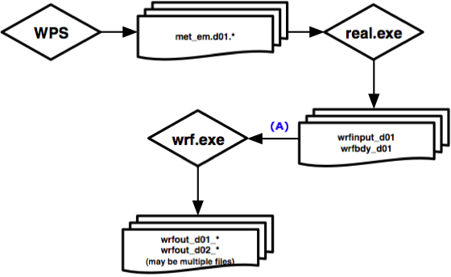

# 第五章 WRF模型

## 目录

1. [简介](#Introduction)

2. [安装WRF](#Installing_WRF)

3. [运行WRF](#Running_WRF)
	
	3.1 [ideal案例](#Idealized_Case)

	3.2 [real-data案例](#Real_Data_Case)
	
	3.3 [重启动](#Restart_Run)
	
	3.4 [双向反馈嵌套](#Two_Way_Nested)
	
	3.5 [使用ndown的单向嵌套](#One_Way_ndown)
	
	3.6 [移动嵌套](#Moving_Nested)
	
	3.7 [分析微调](#Analysis_Nudging)
	
	3.8 [观测微调](#Observation_Nudging)
	
	3.9 [全球范围运行](#Global_Run)
	
	3.10 [使用数字滤波器初始化（DFI）](#DFI_Run)
	
	3.11 [使用sst_update选项](#SST_Update)
	
	3.12 [使用bucket_mm和bucket_J选项](#bucket_mm_and_J)
	
	3.13 [自适应时间步长](#Adaptive_Time_Stepping)
	
	3.14 [随机参数化方案](#Stochastic_Parameterization_Schemes)
	
	3.15 [Run-Time IO](#Run_Time_IO)
	
	3.16 [输出诊断](#Output_Diagnostics)
	
	3.17 [WRF-Hydro](#Hydro)
	
	3.18 [使用IO Quilting](#IO_Quilting)
	
	3.19 [使用物理套件](#Physics_Suites)
	
	3.20 [混合垂直坐标](#HVC)
	
	3.21 [使用多个横向条件文件](#Multiple_Lateral_Condition)

4. [各种应用的namelist示例](#Examples_namelists)

5. [检查输出文件](#Check_Output)

6. [故障排除](#Trouble_Shooting)

7. [物理与动力学选项](#Physics_Dynamics)

8. [PBL物理选项摘要](#PBL_Physics)

9. [微物理学选项摘要](#Microphysics)

10. [积云参数化选项摘要](#Cumulus_Parameterization)

11. [辐射物理选项摘要](#Radiation)

12. [namelist变量描述](#Namelist_Variables)

13. [WRF输出字段](#Output_Fields)

14. [特殊的WRF输出变量](#Special_Output)

<a id=Introduction></a>

## 简介

Advanced Research WRF（ARW）模型是完全可压缩的非静力模型（带有运行时的静水压选项）。它的垂直坐标可以选择为地形跟随（TF）或混合垂直坐标（HVC）静水压力坐标。网格交错采用Arakawa C-grid网格。模型在水平和垂直方向上均使用Runge-Kutta二阶和三阶时间积分方案，以及二阶至六阶对流方案。对声波和重力波模式使用了一个时间分割的小步长。动力学守恒的是标量变量。

WRF模型代码包含一个初始化程序（用于real-data、real.exe或ideal数据、ideal.exe，详见第4章），一个数值积分程序（wrf.exe），一个单独运行的对区域进行单向嵌套的程序（ndown.exe）和一个用于进行热带风暴模拟的程序（tc.exe）。WRF第4带版本支持多种功能，包括：

* real数据和ideal模拟

* 各种横向边界条件选项，用于real数据和ideal模拟

* 完整的物理选项和各种过滤器选项

* 正定对流方案

* 非静水压和静水压（运行时选项）

* 单向和双向反馈嵌套，以及移动嵌套

* 三维分析数据推动

* 观测数据推动

* 区域和全球应用

* 数字滤波器初始化

* 子区域中的垂直细化

### 其他参考资料

* [WRF教程演示](http://www.mmm.ucar.edu/wrf/users/supports/tutorial.html)

* [WRF-ARW技术说明](https://www2.mmm.ucar.edu/wrf/users/docs/technote/contents.html)

* 有关软件需求请参见本文档第2章。

<a id=Installing_WRF></a>

## 安装WRF

在编译WRF代码之前，请按照[How to Compile WRF](https://www2.mmm.ucar.edu/wrf/OnLineTutorial/compilation_tutorial.php )页面上的`System Environment Tests`检查系统是否满足所有要求。

下一步是确保安装必要的库。netCDF库是构建WRF的唯一必需库，但根据需要的应用程序，可能需要其他库（例如，使用多个处理器运行的MPI库等）。如果尚未安装netCDF，请按照[How to Compile WRF](https://www2.mmm.ucar.edu/wrf/OnLineTutorial/compilation_tutorial.php )页面的`Building Libraries`部分中的安装说明（以及其他说明）操作。否则，跳转到`Library Compatibility Tests`部分，以确保您的库与将用于构建WRF的编译器兼容。通过以下命令，确保正确设置netCDF库的环境变量路径（示例为csh）

```
setenv NETCDF path-to-netcdf-library/netcdf
setenv PATH path-to-netcdf-library/netcdf/bin
```

通常，netCDF库及其include/目录是并置的。如果不是这种情况，请手动创建目录，同时链接netCDF lib和include目录到此目录中，并使用环境变量设置该目录的路径。例如：

```
netcdf_links/lib -> /netcdf-lib-dir/lib 
netcdf_links/include -> /where-include-dir-is/include

setenv NETCDF /directory-where-netcdf_links-is/netcdf_links
```

如果在Linux计算机上使用了PGI、Intel或gfortran编译器，请确保使用相同的编译器安装netCDF。使用NETCDF环境变量指向PGI/Intel/gnu编译的netCDF库。

**提示**：如果使用netCDF-4，请确保在安装时未激活新功能（例如基于HDF5的并行I/O），除非您打算使用netCDF-4的压缩功能（更新信息详见下述）。

可以从[WRF网站](http://www2.mmm.ucar.edu/wrf/users/download/get_source.html )下载WRF的源代码。在WRF/目录中包含：

文件/目录名称|描述
-------------|----
Makefile     |顶级makefile文件
README       |WRF/ARW核心的一般信息
README.md    |重要链接和注册信息
Registry/    |WRF注册文件目录
arch/        |收集编译选项的目录
chem/        |WRF-chem模型，由NOAA/GSD提供支持
clean        |用于清除创建的文件和可执行文件的脚本
compile      |用于编译WRF代码的脚本
configure    |用于创建configure.wrf编译文件的脚本
doc/         |有关模型各种功能的信息
dyn_em/      |ARW动力学与数值目录
dyn_nmm/     |NMM动力学和数值目录，由DTC提供支持
external/    |包含外部程序包的目录，例如IO、计时和MPI的程序包
frame/       |包含WRF框架模块的目录
hydro/       |WRF-hydro，由[NCAR/RAL提供支持](https://ral.ucar.edu/projects/wrf_hydro/overview)
inc/         |包含“include”文件的目录
main/        |包含主要例程（如wrf.F）和编译后所有可执行文件的目录
phys/        |包含所有物理模块的目录
run/         |运行WRF的目录
share/       |包含主要WRF中间层和WRF I/O的模块的目录
test/        |包含测试案例的目录，可用于运行WRF
tools/       |包含开发人员工具的目录
var/         |WRF数据同化
wrftladj/    |WRFPLUS

编译和运行模型的步骤为：

1. 配置：生成配置文件用于编译

2. 编译：编译代码

3. 运行模型

转到WRF顶级目录并输入：

`./configure`

WRF模型的构建允许在configure命令中使用附加选项。

`./configure –d`：在打开调试选项的情况下构建代码

`./configure –D`：与–d相同，但加上了边界和范围检查、未初始化的变量、浮动陷阱

`./configure –r8`：构建代码以使用64位实数进行计算和输出

对于任何`./configure`命令，都会显示计算机的选项列表。每个选项组合了一个操作系统、一个编译器类型和一个并行选项。由于配置脚本不会检查系统上实际安装了哪些编译器，因此请确保只在可用的选项中进行选择。并行选项包括：

1. 编译为单处理器作业（serial）

2. 使用OpenMP共享内存（smpar）

3. 为多处理器作业使用分布式内存并行化（dmpar）选项

4. 共享内存和分布式内存选项的组合（dm+sm）

做出选择后，将出现用于编译嵌套的第二个选择。例如，在Linux计算机上，上述步骤可能类似于：

```
> setenv NETCDF /usr/local/netcdf-pgi 
> ./configure

checking for perl5... no

checking for perl... found /usr/bin/perl (perl)

Will use NETCDF in dir: /glade/apps/opt/netcdf/4.3.0/intel/12.1.5

HDF5 not set in environment. Will configure WRF for use without.

PHDF5 not set in environment. Will configure WRF for use without.

Will use 'time' to report timing information

$JASPERLIB or $JASPERINC not found in environment, configuring to build without grib2 I/O...

-------------------------------------------------- ----------------------

Please select from among the following Linux x86_64 options:

  1. (serial)   2. (smpar)   3. (dmpar)   4. (dm+sm)   PGI (pgf90/gcc)
  5. (serial)   6. (smpar)   7. (dmpar)   8. (dm+sm)   PGI (pgf90/pgcc): SGI MPT 
  9. (serial)  10. (smpar)  11. (dmpar)  12. (dm+sm)   PGI (pgf90/gcc): PGI accelerator
 13. (serial)  14. (smpar)  15. (dmpar)  16. (dm+sm)   INTEL (ifort/icc)
                                         17. (dm+sm)   INTEL (ifort/icc): Xeon Phi (MIC architecture)
 18. (serial)  19. (smpar)  20. (dmpar)  21. (dm+sm)   INTEL (ifort/icc): Xeon (SNB with AVX mods)
 22. (serial)  23. (smpar)  24. (dmpar)  25. (dm+sm)   INTEL (ifort/icc): SGI MPT 
 26. (serial)  27. (smpar)  28. (dmpar)  29. (dm+sm)   INTEL (ifort/icc): IBM POE 
 30. (serial)               31. (dmpar)                PATHSCALE (pathf90/pathcc)
 32. (serial)  33. (smpar)  34. (dmpar)  35. (dm+sm)   GNU (gfortran/gcc)
 36. (serial)  37. (smpar)  38. (dmpar)  39. (dm+sm)   IBM (xlf90_r/cc_r)
 40. (serial)  41. (smpar)  42. (dmpar)  43. (dm+sm)   PGI (ftn/gcc): Cray XC CLE 
 44. (serial)  45. (smpar)  46. (dmpar)  47. (dm+sm)   CRAY CCE (ftn/cc): Cray XE and XC
 48. (serial)  49. (smpar)  50. (dmpar)  51. (dm+sm)   INTEL (ftn/icc): Cray XC
 52. (serial)  53. (smpar)  54. (dmpar)  55. (dm+sm)   PGI (pgf90/pgcc)
 56. (serial)  57. (smpar)  58. (dmpar)  59. (dm+sm)   PGI (pgf90/gcc): -f90=pgf90
 60. (serial)  61. (smpar)  62. (dmpar)  63. (dm+sm)   PGI (pgf90/pgcc): -f90=pgf90
 64. (serial)  65. (smpar)  66. (dmpar)  67. (dm+sm)   INTEL (ifort/icc): HSW/BDW
 68. (serial)  69. (smpar)  70. (dmpar)  71. (dm+sm)   INTEL (ifort/icc): KNL MIC 
 72. (serial)  73. (smpar)  74. (dmpar)  75. (dm+sm)   FUJITSU (frtpx/fccpx): FX10/FX100 SPARC64 IXfx/Xlfx

Enter selection [1-75] : ------------------------------------------------------------------------

Compile for nesting? (0=no nesting, 1=basic, 2=preset moves, 3=vortex following) [default 0]: 
```

输入最适合您的计算机和应用程序的适当选项。

当按下回车键时，将创建一个`configure.wrf`文件。如有必要，你可以在此文件中编辑编译选项/路径。

**提示**：从简单的事情开始（例如串行构建）是有帮助的。如果成功，则继续构建dmpar或smpar代码（除非您非常熟悉dm+sm，否则不建议使用它）。当您更改一个注册文件或在配置步骤中更改了选项时，请记住在每次编译之间输入`./clean –a`命令。

**提示**：如果您想使用由Argonne国家实验室开发的[并行netCDF（p-netCDF）](http://trac.mcs.anl.gov/projects/parallel-netcdf )，则需要单独安装p-netCDF，并使用环境变量PNETCDF设置路径：

`setenv PNETCDF path-to-pnetcdf-library`

要编译代码，请键入:

`./compile`

然后将出现以下选择：

```
Usage:

compile [-j n] wrf           compile wrf in run dir (Note, no real.exe, ndown.exe or ideal.exe generated)

or choose a test case (see README_test_cases for details):
 
	compile [-j n] em_b_wave
	compile [-j n] em_convrad 

	compile [-j n] em_esmf_exp (example only)
	compile [-j n] em_fire
	compile [-j n] em_grav2d_x

	compile [-j n] em_heldsuarez
	compile [-j n] em_hill2d_x

	compile [-j n] em_les
	compile [-j n] em_quarter_ss
	compile [-j n] em_real

	compile [-j n] em_seabreeze2d_x
	compile [-j n] em_squall2d_x
	compile [-j n] em_squall2d_y
	compile [-j n] em_tropical_cyclone

	compile [-j n] nmm_real (NMM solver)
	compile [-j n] nmm_tropical_cyclone (NMM solver)
 
compile -j n            parallel make using n tasks if supported (default 2)
compile –h              help message
```

其中cm代表ARW动态解算器（即“Eulerian mass-coordinate”解算器）。键入以上内容之一进行编译。如果你想切换到一个不同的测试案例，则需要重新编译新的案例。重新编译是创建新的初始化可执行文件（即real.exe和ideal.exe——对于每个ideal测试用案例需要不同的ideal.exe），而wrf.exe文件对于所有测试案例都是相同的。

如果要删除所有目标文件（除了那些在external/目录下的）和可执行文件，则输入`./clean`命令。

输入`./clean -a`命令以删除所有目录中的编译文件，包括configure.wrf（原始的configure.wrf将保存为configure.wrf.backup）。如果您已编辑configure.wrf或任何注册文件，则需要使用`./clean -a`命令。

如果检测到所有支持库都可用的前提下，则默认将使用netCDF4压缩函数进行编译。此选项通常会将文件大小减少50%以上，但请注意，输出可能需要更长的写入时间。如果所需的库不存在，将自动使用经典netCDF进行编译。也可以通过在编译前设置环境变量NETCDF_classic（setenv NETCDF_classic 1）来强制使用经典netCDF进行编译。

有关为WRF安装netCDF4的更多详细信息，请访问[此网站](http://www2.mmm.ucar.edu/wrf/users/building_netcdf4.html )。

### Ideal案例

Ideal案例是一种用于模拟简单的测试范围广泛的空间和时间尺度的手段。测试案例再现已知的解决方案（解析的、收敛的等）。这些案例为其他Ideal实验提供了一个起点（例如，修改一个测试案例来衡量结果的差异）。

对于任何2D测试案例（在案例名称中有“2d”标记），必须使用串行或OpenMP（smpar）编译选项。此外，在配置时只能选择`0=no nesting`选项。对于其他所有案例，可以使用串行或并行（dmpar）和嵌套（除了`em_scm_xy`案例，它是一个1-D案例，必须串行编译，没有嵌套）。假设您要编译并运行二维案例，请键入：

`./compile em_squall2d_x >& compile.log`

成功编译后，您应该在`main/`目录中创建两个可执行文件：`ideal.exe`和`wrf.exe`。这两个可执行文件将链接到相应的`test/case_name`和`run/`目录。`cd`到任一目录以运行模型。

将整个编译的标准错误和输出信息保存到文件是一个好的操作习惯（如上所示使用`>&`命令）。当不存在可执行文件时，此输出可用于帮助诊断编译错误。

### real-data案例

一个real-data案例使用的气象输入主要来源于以前的预测或分析，可能来自具有相对粗略分辨率的大尺度区域（例如全球）。一个real-data案例将提供一个三维预测或模拟。对于一个real-data案例，键入：

`./compile em_real >& compile.log`

编译成功后，它将在`main/`目录中创建四个可执行文件：

real.exe：用于real-data案例的WRF初始化

ndown.exe：用于单向嵌套

wrf.exe：WRF模型

tc.exe：TC模型

这些可执行文件将链接到`test/em_real`和`run/`目录。`cd`到这两个目录之一以运行模型。

<a id=Running_WRF></a>

## 运行WRF

可以在`run/`目录或`test/case_name`目录中运行模型可执行文件。在这两种情况下，您都应该在目录下看到可执行文件、链接文件（主要用于real-data情况）和一个或多个namelist.input文件。

**提示**：如果您想在其他目录中运行模型可执行文件，请将`test/em_*`目录中的文件复制或链接到该目录，然后从那里运行。

<a id=Idealized_Case></a>

### ideal案例

假设测试案例`em_squall2d_x`已编译。要运行，请键入:

`cd test/em_squall2d_x`

编辑namelist.input文件以更改积分长度、输出频率、区域大小、时间步长、物理选项和其他参数（详细信息请参阅`WRF/run/`目录下的README.namelist，或者[namelist变量描述](#Namelist_Variables)）。

如果在测试用例目录中看到一个名为`run_me_first.csh`的脚本，请通过键入以下内容首先运行该脚本：

`./run_me_first.csh`

这会链接一些运行案例所需的物理数据文件。

要运行初始化程序，请键入:

`./ideal.exe >& ideal.out`

该程序通常将读取位于案例目录中的输入探测文件，并生成初始条件文件`wrfinput_d01`。由于ideal案例不需要横向边界文件，因为边界条件通过namelist选项在代码中进行处理。如果工作成功，`ideal.out`文件的结尾应该是：

`wrf: SUCCESS COMPLETE IDEAL INIT`

要运行模型，请键入

`./wrf.exe >& wrf.out`

或者对于使用MPI（dmpar）选项编译的3D测试案例（注意，对于不同的机器和不同的MPI安装，MPI运行的执行命令可能不同），请键入

`mpirun –np 4 ./wrf.exe`

如果成功，则将wrf输出文件写入到名为`wrfout_d01_0001-01-01_00:00:00.`的文件中。

成对的`rsl.out.*`和`rsl.error.*`文件将与MPI运行一起出现。这些是标准输出和错误文件。使用的每个处理器将有一对。

如果模型运行成功，则在`wrf.out`或`rsl.*.0000`文件结尾，打印的内容应为：`wrf: SUCCESS COMPLETE WRF`。

输出文件`wrfout_d01_0001-01-01*`和`wrfrst*`应该存在于运行目录中，具体取决于为输出指定namelist变量的方式。这些文件上的时间戳记开始于namelist文件中的开始时间。

<a id=Real_Data_Case></a>

### real-data案例

要运行real-data案例，请通过键入`cd`进入工作目录：

`cd test/em_real (or cd run)`

按照您的案例编辑目录中的默认namelist.input文件。

运行real-data案例需要先成功运行WRF预处理系统（WPS）。确保来自WPS的`met_em.*`文件在运行目录中可见（可采用链接或复制文件的方式）：

```
cd test/em_real
ln –s ../../..WPS/met_em* .
```

确保在namelist.input文件的`&time_control`和`&domains`部分中编辑变量，以匹配您的案例（详见[namelist变量描述](#Namelist_Variables)）：

```
&time_control
 run_days                            = 0,
 run_hours                           = 36,
 run_minutes                         = 0,
 run_seconds                         = 0,
 start_year                          = 2019, 2019, 2019,
 start_month                         = 09,   09,   09,
 start_day                           = 04,   04,   04,
 start_hour                          = 12,   12,   12,
 end_year                            = 2019, 2019, 2019,
 end_month                           = 09,   09,   09,
 end_day                             = 06,   06,   06,
 end_hour                            = 00,   00,   00,
 interval_seconds                    = 21600
 input_from_file                     = .true.,.true.,.true.,
 history_interval                    = 180,  60,   60,
 frames_per_outfile                  = 1000, 1000, 1000,
/
 
&domains
 time_step                           = 90,
 max_dom                             = 1,
 e_we                                = 150,    220,   200,
 e_sn                                = 130,    214,   210,
 e_vert                              = 45,     45,    45,
 p_top_requested                     = 5000,
 num_metgrid_levels                  = 34,
 num_metgrid_soil_levels             = 4,
 dx                                  = 15000,
 dy                                  = 15000,
 grid_id                             = 1,     2,     3,
 parent_id                           = 0,     1,     2,
 i_parent_start                      = 1,     53,    30,
 j_parent_start                      = 1,     25,    30,
 parent_grid_ratio                   = 1,     3,     3,
 parent_time_step_ratio              = 1,     3,     3,
/
```

确保区域的日期和维度与WPS中设置的一致。如果只使用一个区域，则只读取第一列中的条目，而忽略其他列。

在`&domains`中用于辅助垂直插值的其他选项包括：

```
interp_type                         = 2
extrap_type                         = 2
t_extrap_type                       = 2
lowest_lev_from_sfc                 = .false.
use_levels_below_ground             = .true.
use_surface                         = .true.
lagrange_order                      = 1
force_sfc_in_vinterp                = 1
zap_close_levels                    = 500
sfcp_to_sfcp                        = .false.
adjust_heights                      = .false.
smooth_cg_topo                      = .false.
```

real.exe程序是针对real-data案例的初始化程序。它获取WPS程序的二维输出（在`met_em*`文件中），对三维气象场和地下土壤数据执行垂直插值，并创建边界和初始条件文件以输入到wrf.exe程序。

要运行使用串行或OpenMP（smpar）选项进行编译的real-data初始化程序，请键入：

`./real.exe >& real.out`

成功完成工作后，应在`real.out`文件的末尾打印`real_em: SUCCESS EM_REAL INIT`。它还应产生`wrfinput_d0*`（每个区域一个文件）和`wrfbdy_d01`文件，这个文件都是运行wrf.exe前必要的。

运行WRF：

`./wrf.exe >& wrf.out`

成功运行后，应产生一个或几个名称为`wrfout_d<domain>_<date>`的输出文件，其中<domain>代表区域ID，<date>代表日期字符串，格式为yyyy-mm-dd_hh:mm:ss。例如，如果您在UTC时间2000年1月24日12：00启动模型，则第一个输出文件应具有以下名称：

`wrfout_d01_2000-01-24_12:00:00`

文件名上的时间戳始终是第一次写入输出文件的时间。键入以下命令检查写入输出文件的时间：

`ncdump -v Times wrfout_d01_2000-01-24_12:00:00`

您可能还有其他wrfout文件，具体取决于namelist选项（分割输出文件的频率由namelist选项`frames_per_outfile`来确定）。如果您在总积分时间内设置了重启动文件频率（在namelist.input中的`restart_interval`选项），则也可以创建重启动文件。重启动文件应具有以下命名：

`wrfrst_d<domain>_<date>`

重启动文件上的时间戳记是该重新启动文件的时刻。

对于DM（分布式内存）并行系统，将需要某种形式的`mpirun`命令来运行可执行文件。例如，在Linux群集上，使用4个处理器运行MPI代码的命令可能类似于：

```
mpirun -np 4 ./real.exe
mpirun -np 4 ./wrf.exe
```

或者

`mpiexec_mpt ./wrf.exe`（在NCAR的cheyenne上）  

<a id=Restart_Run></a>

### 重启动

重启动运行允许您如果因为某些原因不能一次完成运行时（例如，运行超出了可用的挂钟时间），也可以将运行延长到更长的模拟周期。它实际上是由多个较短的运行组成的连续运行。因此，一个或多个重新启动运行结束时的结果应与没有任何重新启动的单个运行结果相同。

为了使用重新启动选项，必须首先通过将namelist变量`restart_interval`（默认单位为分钟）设置为等于或小于初始模型运行中的模拟时长来创建重新启动文件。当模型到达设置的重新启动间隔（`restart_interval`）时，将写入名为`wrfrst_d<domain>_<date>`的重新启动文件。日期字符串表示重新启动文件中的有效时间。

当开始重新启动运行时，编辑namelist.input文件，以便将`start_*`时间设置为重新启动时间（即重新启动文件的写入时间`<date>`），同时必须设置`restart=.true.`。

总之，应修改以下namelist条目：

```
start_*, end_*：重新启动模型积分的开始和结束时间
restart：用于指示运行是否为重新启动的开关
```

* 如果在重新启动运行中更改了输出历史文件（`history`）和/或重新启动文件间隔（`restart_interval`），并且新的输出文件时间与预期不符，请在namelist的`time_control`部分增加`override_restart_timers=.true.`。

* 如果在重新启动运行的初始时刻需要输出历史文件（`history`），请使用参数`write_hist_at_0h_rst=.true.`。

* 通常情况下，重新启动文件的大小是历史文件的几倍。您可能会发现模型能够以netCDF格式写入历史文件（`wrfout*`），但可能无法写入重新启动文件。这是因为基本的netCDF文件只支持最大2GB；但是，默认的WRF编译使用大文件支持构建代码，这允许文件达到4GB。如果仍然达到这个最大值，可以设置`io_form_restart=102`（而不是2），这将强制将重新启动文件分为多个部分写入，每个处理器一个。只要使用相同数量的处理器重新启动模型（无论如何这都是推荐的做法），这个选项就可以很好地工作。

<a id=Two_Way_Nested></a>

### 双向反馈嵌套

双向反馈嵌套运行是指同时运行具有不同网格分辨率的多个区域并彼此相互通信。较粗的（父）域为更高分辨率的嵌套（子）域提供边界值，嵌套将其计算反馈给较粗的域。模型可以在同一嵌套级别（无重叠嵌套）或多个嵌套级别（伸缩）处理多个域。

在准备嵌套运行时，请确保使用基本的嵌套选项（option1）编译代码。

嵌套运行的选项在namelist中设置。namelist.input文件中所有具有多列条目的变量都需要小心地编辑（不要向默认的namelist中没有多列值的参数添加其他列）。从一个默认的namelist开始。以下是要修改的关键namelist变量：

`start_*, end_*`：开始和结束模拟的时间

`input_from_file`：嵌套是否需要输入文件（例如wrfinput_d02）。这通常用于real data案例，因为嵌套输入文件包含了嵌套的地形和土地信息。

`fine_input_stream`：决定在嵌套初始化中使用嵌套输入文件中的哪些字段。要使用的字段在`Registry/Registry.EM_COMMON`文件中定义。通常，它们包括静态场（例如地形和土地利用）和遮盖的地表场（例如地表温度、土壤湿度和温度）。此选项对于在比粗域晚的时间开始的嵌套很有用。更多信息详见[namelist变量描述](#Namelist_Variables)。

`max_dom`：要运行的区域总数。例如，如果要有一个粗略域和一个嵌套域，请将此变量设置为2。

`grid_id`：wrfout命名约定中使用的域标识符。最粗糙的网格的`grid_id`必须为1。

`parent_id`：用于指示嵌套的父域。这应该设置为父域的`grid_id`值（例如对于d02，它的父域是d01，所以第二列的`parent_id`应该设置为1）。

`i_parent_start/j_parent_start`：嵌套域在其父域中的左下角起点编号。这些参数应与namelist.wps中的相同。

`parent_grid_ratio`：父域到嵌套域的网格尺寸整数比。通常，在real-data数据应用中使用奇数比率（3:1或5:1的比例一般会得到最好的结果）。

`parent_time_step_ratio`：嵌套域的时间步长整数比。它可能与`parent_grid_ratio`不同，尽管通常将它们设置为相同。

`feedback`：这是定义双向嵌套（或单向嵌套）运行的关键设置。启用`feedback`后，在嵌套的重合点处，内层嵌套变量的值（质量点的单元格值的平均值和水平动量点的单元格面值的平均值——average of cell values for mass points, and average of the cell-face values for horizontal momentum points）将覆盖粗糙域的值。对于遮盖的场，仅反馈并置点处的单点值。如果`parent_grid_ratio`是偶数，则将西南角点值的任意选择用于反馈。这就是最好在此选项中（feedback=1时）使用奇数`parent_grid_ratio`的原因。禁用反馈后（=0），等效于单向嵌套运行，因为嵌套结果不会反映在父域中。

`smooth_option`：如果启用了反馈（feedback=1），则这是嵌套区域中父域的平滑选项。共有三个选项：0=不平滑；1=1-2-1平滑；2=平滑-去平滑。

#### 3-D ideal案例

对于3-D ideal案例，不需要嵌套输入文件。模型从粗域字段中插入嵌套中所需的所有变量。必须在namelist.input文件中设置以下内容：

`input_from_file = T, F,`

#### Real Data案例

对于Real Data案例，支持三个输入选项。在第一种方法，嵌套的所有字段都是从粗域内插的（`input_from_file=T, F`）。此选项的缺点是无法从更高分辨率的静态场（如地形、土地利用等）中获益。

第二种方法是为每个域设置`input_from_file=T`，这意味着该嵌套将有一个嵌套的wrfinput文件可读取。此选项的局限性在于，它仅允许该嵌套与粗域同时启动。

第三种方法是，除了为每个域设置`input_from_file=T`，还要为每个域设置`fine_input_stream=2`。取值为2是基于Registry设置，该设置指定要从辅助输入流2中读取的某些字段。嵌套初始化使用从粗域内插的三维气象场，从嵌套wrfinput文件内插的静态、遮罩和时间变化的表面场；因此它允许嵌套在比其父嵌套晚的时间开始。设置`fine_input_stream=0`相当于第二种方法（如上）。

要运行real.exe进行嵌套运行，必须首先运行WPS并为所有嵌套创建数据。假设WPS运行输出从UTC时间2000年1月24日12点开始的24小时的两个域的嵌套案例。然后，应在WPS目录中生成以下文件：

```
met_em.d01.2000-01-24_12:00:00
met_em.d01.2000-01-24_18:00:00
met_em.d01.2000-01-25_00:00:00
met_em.d01.2000-01-25_06:00:00
met_em.d01.2000-01-25_12:00:00
met_em.d02.2000-01-24_12:00:00 
```

通常，仅需要嵌套输入文件的第一个时刻即可创建嵌套wrfinput文件。然后将所有这些文件链接或移动到WRF运行目录（如`test/em_real`）。

`ln -s ../../../WPS/met_em.d0* .`

编辑namelist.input文件，并为所有相关变量设置正确的值（如上所述）（特别是设置`max_dom=2`，即要运行的域的总数），物理选项也需要正确设置。然后输入以下内容以运行：

`./real.exe >& real.out`

或者

`mpirun –np 4 ./real.exe`

如果成功，将为粗糙域和嵌套域创建输入文件。对于两个域的示例，将创建以下内容：

```
wrfinput_d01
wrfinput_d02
wrfbdy_d01
```

要运行WRF，请键入

`./wrf.exe`

或者

`mpirun –np 4 ./wrf.exe`

如果运行成功，则模型应为域1和域2创建wrfout文件：

```
wrfout_d01_2000-01-24_12:00:00
wrfout_d02_2000-01-24_12:00:00
```

<a id=One_Way_ndown></a>

### 使用ndown的单向嵌套

WRF支持两个独立的单向嵌套选项。在本节中，单向嵌套定义为：粗糙网格首先运行，其中运行ndown程序，最后运行嵌套的精细网格。精细网格运行的初始和横向边界条件是从粗网格运行获得的，同时再输入高分辨率的地面场（例如地形、土地利用等）和遮罩的地面场（例如土壤温度和湿度）。执行此任务的程序就是`ndown.exe`。

**注意**：使用ndown程序需要编译代码以进行嵌套。

**第一步**：运行粗网格。

如上所述，这与任何单域WRF运行没有什么不同。建议在粗网格运行中设置频繁的输出（例如每小时），以提供更好的边界条件。

**第二步**：为两个域运行`geogrid.exe`和`metgrid.exe`（就像您要进行双向嵌套运行一样）。

**第三步**：为2个域运行`real.exe`。

此步骤的目的是摄取更高分辨率的陆地场和相应的陆水遮罩土壤场。

* 将`met_em*`文件复制或链接到将要运行`real.exe`的目录中。

* 编辑namelist.input文件，设置`max_dom=2`，并确保为第2个域运行设置了第1列和第2列参数（编辑正确的开始时间和网格尺寸）。

* 运行`real.exe`。这将产生一个`wrfinput_d01`文件，一个`wrfinput_d02`文件和一个`wrfbdy_d01`文件。

* 将`wrfinput_d02`文件重命名为`wrfndi_d02`。

**第四步**：通过运行`ndown.exe`制作最终的细网格初始条件和边界条件文件。

* 必须在namelist.input的`&time_control`部分添加`io_form_auxinput2=2`才能成功运行ndown.exe。

* 如果希望在运行ndown时优化垂直分辨率，请设置`vert_refine_fact`（详见[namelist变量描述](#Namelist_Variables)）。另一种优化垂直分辨率的方法是使用实用程序程序`v_interp`（有关详细信息，请参见“实用程序和工具”一章）。

* 更改namelist变量`interval_seconds`以反映来自粗略域模型运行的历史记录输出间隔。

* 在运行ndown程序之前，请勿更改物理选项。

* 不要从Registry中删除任何字段。

* 运行`ndown.exe`，它使用来自粗网格的`wrfout*`文件，以及从上面第三步生成的`wrfndi_d02`文件。这将产生一个`wrfinput_d02`和`wrfbdy_d02`文件。

请注意，取决于选择的编译选项，ndown可以串行运行，也可以在分布式内存中运行。要运行该程序，请键入

`./ndown.exe >& ndown.out`

或者

`mpirun –np 4 ./ndown.exe`

**第五步**：运行细网格WRF

* 将`wrfinput_d02`和`wrfbdy_d02`分别重命名为`wrfinput_d01`和`wrfbdy_d01`。

* 将原始的`wrfout_d01*`文件重命名（或移动）到其他文件（或其他目录），以免覆盖它们。

* 编辑namelist.input，将所有精细网格域数据从第2列移至第1列，以便此运行仅适用于精细网格域。确保将`time_step`设置为符合精细网格域（通常为6×dx）。如果您将来需要重复此过程，则在此步骤之前最好将namelist.input另存到其他文件。

* 在这一阶段，WRF模型的物理选项可以从最初的单域运行中使用的选项进行修改（即ndown之前的WRF模型和ndown之后的WRF模型可采用不同的物理选项，但是在运行ndown时必须使用与第一次运行相同的物理选项），但陆面方案（`sf_surface_physics`）除外，该方案选项具体取决于方案的土壤深度数量的不同。

* 如果需要，可以利用允许初始边界和横向边界同时使用`moist`数组和`scalar`数组的功能（分别为`have_bcs_moist`和`have_bcs_scalar`）。此选项仅在ndown处理之后的WRF模型运行期间使用。使用此选项，必须在两次预测之间保持相同的微物理选项。优点是，先前的WRF模型为所有微物理变量提供了实际的横向边界趋势，而不是简单的“零流入”或“零梯度流出”。

* 为此网格运行WRF。

请记住，此运行输出的文件名为`wrfout_d01*`，但实际上是域2精细网格的输出文件。重命名这些文件有助于避免将来造成混淆。

#### 为三个或更多域运行ndown.exe

可以使用ndown程序运行多个嵌套，但是此过程有点麻烦。由于编写代码的方式不同，它需要特定的文件名（特别是d01和d02），因此，准确地遵循以下步骤很重要：

**注意**：此示例用于嵌套到第三个域（总共3个域），并假定您已经具有上一次运行的`wrfout_d01*`文件。

**步骤A**：为3个域运行`geogrid.exe`和`metgrid.exe`程序。

**步骤B**：为3个域运行`real.exe`。

* 将`met_em*`文件复制到将要运行`real.exe`的目录中。

* 编辑namelist.input文件，设置`max_dom=3`，并确保为第3个域运行设置了第1、2和3列（编辑了正确的开始时间和网格尺寸）。

* 运行`real.exe`，生成`wrfinput_d01`，`wrfinput_d02`，`wrfinput_d03`和`wrfbdy_d01`文件。

* 将`wrfinput_d02`文件重命名为`wrfndi_d02`。

**步骤C**：运行`ndown.exe`，生成域2的网格初始条件和边界条件文件（请参阅上面的步骤4中的详细信息）。

**步骤D**：运行域2 WRF（请参阅上面步骤5中的详细信息）。现在，您将拥有名为`wrfout_d01*`的新文件，该文件将对应于域2。

**步骤E**：运行`ndown.exe`，生成域3网格的初始条件和边界条件文件。

* 将`wrfinput_d03`文件重命名为`wrfndi_d02`（这是程序要求的名称）。

* 确保namelist的`&time_control`部分中设置`io_form_auxinput2=2`。

* 更改namelist的`interval_seconds`变量以反映粗略域模型运行的历史记录输出间隔。

* 在运行ndown程序之前，请勿更改物理选项。

* 运行`ndown.exe`，它使用来自（新）粗网格的wrfout文件和`wrfndi_d02`文件的输入。这将产生一个`wrfinput_d02`和`wrfbdy_d02`文件（这两个文件实际上都对应于域3）。

**步骤F**：运行细网格（d03）WRF。

* 将`wrfinput_d02`和`wrfbdy_d02`分别重命名为`wrfinput_d01`和`wrfbdy_d01`。

* 将`wrfout_d01*`文件重命名（或移动）到其他文件（或其他目录），以免覆盖它们（记得这些文件与d02相对应）。

* 编辑namelist.input，将所有精细网格域数据从第3列移至第1列，以便此运行仅适用于精细网格域。确保将`time_step`设置为符合精细网格域（通常为6×dx）。如果您将来需要重复此过程，则在此步骤之前最好将namelist.input另存到其他文件。

运行`wrf.exe`后，您将拥有新的`wrfout_d01*`文件。这些将对应于域03。如果需要添加更多的嵌套，请遵循相同的格式，并保持前述规定的命名方式（即永远使用d02的命名）。

下图总结了使用ndown程序进行单向嵌套运行的数据流。




<a id=Moving_Nested></a>

### 移动嵌套

WRF中有两种类型的移动嵌套选项。在第一种选项中，在namelist中指定嵌套移动。第二种选项则允许嵌套根据自动涡流跟踪算法（跟踪最低压力）来自动移动。这一方案的目的是跟踪确定的热带气旋的移动。

#### 指定移动嵌套

指定的嵌套移动运行选项允许用户准确地指定嵌套移动的位置；但是，设置起来可能相当复杂。必须使用嵌套选项“预设移动（preset moves）”来编译代码。且必须采用分布式内存并行化（dmpar）来编译代码，以使用多个处理器。**请注意，使用“预设移动（preset moves）”选项编译的代码将不支持静态嵌套运行。**要运行模型，只需要粗网格输入文件。在本选项中，嵌套的初始化是从粗网格数据定义的——不需要任何嵌套输入。除了将namelist选项应用于嵌套运行之外，还需要在namelist的&domains部分中添加以下内容：

`num_moves`：模型运行中进行的移动总数。任何域的移动都将计入该总数。当前最大值设置为50，但可以通过更改`frame/module_driver_constants.F`中的`MAX_MOVES`来更改（如果修改此文件，则需要重新编译WRF以反映更改，但不需要`clean-a`或重新配置）。

`move_id`：嵌套ID的列表，每个动作一个，用于确定将要移动的域。

`move_interval`：从运行开始到发生移动之间的分钟数。在指定的模型时间过去之后，嵌套将在下一个时间步长移动。

`move_cd_x`，`move_cd_y`：以网格点数表示的嵌套移动的距离和方向（正数表示向东和北移动，负数表示向西和南移动）。

#### 自动移动嵌套

要进行自动移动嵌套运行，请在模型的编译配置时选择“跟随涡流（vortex-following）”选项，且同时配置采用分布式内存并行化选项（dmpar）以使用多个处理器。此编译将仅支持自动移动嵌套，而不支持指定移动嵌套运行或静态嵌套运行。同样，无需输入嵌套数据，但请注意，自动移动嵌套最适合于发育良好的漩涡。如果要使用默认值以外的其他值，请在namelist的&domains部分中添加并编辑以下变量：

`vortex_interval`：计算涡旋位置的频率，以分钟为单位（默认为15分钟）。

`max_vortex_speed`：与`vortex_interval`一起用以计算新涡旋中心位置的搜索半径（默认值为40m/s）。

`corral_dist`：允许移动嵌套的边界和上层父域边界的最近距离（以粗网格单元数表示，默认为8）。此参数可用于居中伸缩嵌套，以便所有嵌套与风暴一起移动。

`track_level`：跟踪涡旋的压力层（以Pa为单位）。

`time_to_move`：直到嵌套开始移动的时间（以分钟为单位）。当风暴仍然太弱而算法无法跟踪时，此选项可能会有所帮助。

当使用自动移动嵌套时，模型以标准输出文件（例如rsl.out.0000）中最小的平均海平面压力和最大的10m风速来转储涡流中心位置。输入`grep ATCF rsl.out.0000`将以15分钟的间隔生成风暴信息列表：

```
ATCF	2007-08-20_12:00:00		20.37	-81.80	 929.7      133.9
ATCF 	2007-08-20_12:15:00		20.29	-81.76	 929.3      133.2
```

在这两种类型的移动嵌套运行中，嵌套的初始位置都是通过namelist.input文件中的`i_parent_start`和`j_parent_start`指定的。

模型有一个额外的功能，可以在移动嵌套运行中合并高分辨率的地形和土地利用的输入数据（Chen, Shuyi S., Wei Zhao, Mark A. Donelan, James F. Price, Edward J. Walsh, 2007: The CBLAST-Hurricane Program and the Next-Generation Fully Coupled Atmosphere–Wave–Ocean Models for Hurricane Research and Prediction. Bull. Amer. Meteor. Soc., 88, 311–317.doi: http://dx.doi.org/10.1175/BAMS-88-3-311 ）。要激活此选项，请按以下步骤操作：

* 在编译时，设置如下（cshell）：

`setenv TERRAIN_AND_LANDUSE 1`


WPS的默认土地使用数据集为MODIS。但是，上面所述的高分辨率数据集来自USGS，因此，为了使用此功能，应使用USGS准备您的土地利用数据（具体可参见第3章相关内容）。

* 在运行时，在namelist的&time_control中添加以下变量：

```
input_from_hires	= .true., .true.,
rsmas_data_path		= “terrain_and_landuse_data_directory”
```

注意：此选项将覆盖嵌套域的`input_from_file`选项。

<a id=Analysis_Nudging></a>

### 分析微调（高空和/或地面）

分析微调是一种将模型向数据分析微调的方法，适用于粗分辨率。模型运行时附加了水平风、温度和水汽微调项。这些项目逐点微调三维空间和时间插值的分析场。

照常使用WPS准备WRF的输入数据。如果需要在嵌套域中进行分析微调，请确保在WPS中处理了所有域的所有时间段。对于地表分析微调，需要在METGRID之后运行OBSGRID（详见第7章），它将输出一个`wrfsfdda_d01`文件，WRF模型将读取该文件。
 
除了前面描述的其他选项外，在运行real.exe之前，请设置以下选项（有关指导，请参见`test/em_real/`目录中的`examples.namelist`文件选项）：

```
grid_fdda = 1
grid_sfdda = 1
```

像以前一样运行real.exe，但除了会创建`wrfinput_d0*`和`wrfbdy_d01`文件之外，还将创建名为`wrffdda_d0*`的文件。其他网格微调的namelist选项在此阶段被忽略，但最好是在运行real.exe前将所有相关的选项一次设置好，特别是如下设置：

```
gfdda_inname     =  “wrffdda_d<domain>”
gfdda_interval_m =  输入数据的时间间隔（分钟）
gfdda_end_h      =  网格微调的结束时间（小时）

sgfdda_inname     =  “wrfsfdda_d<domain>”
sgfdda_interval_m =  输入数据的时间间隔（分钟）
sgfdda_end_h      =  地面网格微调的结束时间（小时）
```

请浏览[此网页](http://www2.mmm.ucar.edu/wrf/users/docs/How_to_run_grid_fdda.html )和`WRF/test/em_real`目录下的`README.grid_fdda`文件以获得更多信息。

采用如下设置将激活另一种地面数据微调选项：
 
`grid_sfdda = 2`
 
该选项与选项1相似，可微调地表空气温度和水蒸气的混合比，但是方法有所不同，本选项是利用直接微调方法生成的趋势来限制表面感热和潜热通量，从而确保大气层与陆地表面之间的热力学一致性。这适用于`YSU PBL`和`Noah LSM`物理方案（Alapaty等人，JAMC，2008年）。
 
光谱微调是另一个高空微调选项，该选项只会有选择地微调较粗的尺度，其设置类似于网格微调，但会额外微调位势高度。此处定义的波数是区域中包含的波数，该波数是被微调的最大波数。

```
grid_fdda = 2
xwavenum = 3
ywavenum = 3
```

<a id=Observation_Nudging></a>

### 观测微调

观测微调是一种将模型向观测微调的方法。与分析微调一样，模型运行时带有额外的水平风、温度和水汽微调项。然而，在观测微调中，对观测站点附近的点的微调是基于观测站点处的模型误差。此选项适用于细比例尺度或不对称观测。有关以下内容的其他详细信息，请参阅[《观测微调用户指南》](http://www2.mmm.ucar.edu/wrf/users/docs/ObsNudgingGuide.pdf )、[实验性微调选项](https://www2.mmm.ucar.edu/wrf/users/docs/How_to_run_obs_fdda.html )以及`WRF/test/em_real/`目录中`README.obs_fdda`文件。

除了使用WPS准备常规输入数据外，还需要站点的观测文件。WRF对观测文件名称要求如下：对于区域1是`OBS_DOMAIN101`，对于区域2是`OBS_DOMAIN201`，依此类推。

通过设置`&fdda`中的以下namelist，可在模型中激活观测微调：

```
obs_nudge_opt= 1 
fdda_start= 0（观测微调起始时间，以分钟为单位）
fdda_end= 360（观测微调结束时间，以分钟为单位） 
```

并在`&time_control`中设置：

`auxinput11_interval_s = 180,180,180,（应将间隔设置得足够小以检查所有观测结果）`

在`test/em_real/`目录中的`examples.namelists`文件中可查找其他的微调namelist参数示例。

<a id=Global_Run></a>

### 全球范围运行

WRF支持全球范围运行的功能，但首先要注意，这不是模型中常用的配置，所以应该谨慎使用。并不是所有的物理和扩散选项都进行了全球范围运行的测试，有些选项可能无法很好地与极点过滤器配合使用。正定和单调平流选项不适用于全球范围运行中的极点过滤器，这是因为极点过滤器可以生成负的标量值。这也意味着，WRF-Chem不能在全球范围的WRF中使用正定和单调平流选项运行。全球代码在一段时间内没有被修改，并且已知会导致一些不合理的结果。建议采用[NCAR MPAS模型](https://mpas-dev.github.io/ )来进行全球模拟。

* 要进行全球范围运行，请采用namelsit模板文件`namelist.wps.gloabl`来运行WPS。

	* 设置`map_proj = ‘lat-lon’`、网格尺寸`e_we`和`e_sn`。
	
	* 无需设置`dx`和`dy`。geogrid程序将计算网格距离，其值可以在`geo_em.d01.nc`文件的全局属性部分中找到。

* 键入`ncdump –h geo_em.d01.nc`来查看网格距离，这是填写WRF的namelist.input文件所必需的。x和y方向上的网格距离可能不同，但是最好将它们设置为相似或相同。WRF和WPS假定地球是一个半径为6370km的球体。对于使用的网格尺寸什么没有限制，但为了有效地使用WRF中的极点滤波器，应将东西方向的尺寸设置为2P×3Q×5R+1（其中P、Q和R可以是任意整数，包括0）。

* 照常运行其余WPS程序，但只需运行一个时间段。这是因为模拟区域覆盖了整个地球，不需要横向边界条件。

* 照常运行real.exe程序，并且只需运行一个时间段，因为不需要横向边界文件`wrfbdy_d01`。

* 将namelist.input.global复制为namelist.input，然后按需要的设置进行编辑。之后照常运行模型。

作为对全球lat-lon网格的扩展，进行局部区域范围的模拟也可以使用lat-lon网格。为此，需要同时设置网格尺寸和网格距离（以度为单位）。geogrid程序将计算出网格距离（同样假设地球是一个半径为6370km的球体）。然后可以采用上述方法在netCDF文件中找到以米为单位的网格距离，并将该值用于WRF的namelist.input文件。

<a id=DFI_Run></a>

### 使用数字滤波器初始化（Digital Filter Initialization）

数字滤波器初始化（DFI）是一种消除初始模型不平衡的方法，例如通过地表压力趋势来衡量。当对模型最开始的0到6个小时的模拟/预测感兴趣时，这个方法可能很重要。这个方法可以在短期模型积分过程中（向前和向后）运行数字滤波器，然后再开始预测。在WRF实施中，所有这些都在一个工作中完成。DFI可用于具有并发嵌套且禁用反馈的多个区域。

本方法对输入数据没有特殊要求。

* 在`test/em_real/`目录中的example.namelist文件中，查找DFI的namelist部分（&dfi_control)，将此部分复制到namelist.input文件中。编辑这部分内容以匹配您的案例配置（例如日期）。对于典型的应用，可以使用以下选项：

	```
	dfi_opt = 3（注意：如果正在运行重新启动，则必须将其更改为0）
	dfi_nfilter = 7（过滤器选项：Dolph）
	dfi_cutoff_seconds = 3600（不应长于过滤器窗口）
	```
	
	对于时间规格，通常需要向后积分0.5到1小时，并向前积分相应一半的时间。

* 如果选项`dfi_write_filtered_input`设置为`true`，当运行WRF时会生成一个过滤wrfinput文件，即`wrfinput_initialized_d01`。

* 如果要使用恒定边界条件选项，请在`&bdy_control`中设置`constant_bc = 1`。

* 如果DFI使用与主设置不同的时间步长，可以使用`time_step_dfi`选项进行设置。

<a id=SST_Update></a>

### 使用sst_update选项

WRF模型物理学无法预测海面温度、植被比例、反照率或海冰。对于长时间的模拟，WRF模型提供了一种替代方法，可以读取随时间变化的数据并更新这些字段。为了使用此选项，必须有随时间变化的SST和海冰场文件。然后用geogrid程序生成十二个月的月均植被分数和反照率值。通过WPS处理完这些字段后，在运行real.exe和wrf.exe之前激活namelist中`&time_control`部分的以下选项：

```
io_form_auxinput4   = 2 
auxinput4_inname    = “wrflowinp_d<domain>” (created by real.exe) 
auxinput4_interval = 360, 360, 360,
```

以及在`&physics`部分的如下选项：

`sst_update = 1`

*请注意，此选项不能与`sf_ocean_physics`选项同时使用。*

<a id=bucket_mm_and_J></a>

### 使用bucket_mm和bucket_J选项

这些选项适用于长时间的模拟降雨累积和辐射bucket累积项（RAINC、RAINNC、ACSWUPT、ACLWDNBC等）。对于32位精度的数据，在非常大的数字中添加小的数字会随着累积项的增加而导致精度的损失。对于几天到几周的模拟，这种累积误差通常是可以接收的，但是对于几个月到几年的模拟，这种累积会产生截断加法的效果（特别是小的增加量可能会被归零）。

激活这些选项后，以上累积项的一部分将以整数存储，每次达到bucket值时，该整数将递增1。这样我们就把一个累积项RAINNC分成了两个项——RAINNC和I_RAINNC，其中RAINNC现在仅包含余数。最终输出的合计数据=RAINNC+bucket_mm×I_RAINNC。合理的bucket值可以基于月均累积量（例如100mm）。总降水量等于RAINC+RAINNC，其中：

Total RAINNC = RAINNC + bucket_mm × I_RAINNC

Total RAINC = RAINC + bucket_mm × I_RAINC

辐射累积项（例如ACSWUPT）以J/m^2为单位，因此一个模拟周期内的平均值是输入输出辐射的差值除以模拟时间之间的差，单位为W/m^2。

bucket_J选项适用于本累计项，基于月均累积量的典型值为1.e9J。该项的总和采用如下方式得出（下为ACSWUPT示例——其他辐射项遵循相同的方程式概念）：

Total = ACSWUPT + bucket_J × I_ACSWUPT

<a id=Adaptive_Time_Stepping></a>

### 使用自适应时间步长

自适应时间步长是一种最大化模型可用时间步长，同时保持模型数值稳定的方法。本方法基于整个域内的水平和垂直稳定性标准（称为Courant-Friedrichs-Lewy（CFL）条件）来调整模型时间步长。使用自适应时间步长，可按照以下设置：

`use_adaptive_time_step = .true.`

`step_to_output_time = .true.`（但嵌套域可能仍会在所需时间写入输出，使用`adjust_output_times = .true.`来弥补这一点）

`target_cfl = 1.2, 1.2, 1.2, `

`max_step_increase_pct = 5, 51, 51,`（为嵌套设置较大百分比值允许嵌套的时间步长具有更大的调整自由度）

`starting_time_step =` 实际值或-1（表示开始时间是4×DX）

`max_time_step`：对所有域使用固定值，例如8×DX

`min_time_step`：对所有域使用固定值，例如3×DX

`Adaptation_domain`：哪个域驱动自适应时间步长（整数）

有关这些选项的更多信息，请参见[namelist变量描述](#Namelist_Variables)部分。

<a id=Stochastic_Parameterization_Schemes></a>

### 随机参数化方案

随机参数化套件包括许多随机参数化方案，其中一些已被广泛使用，还有一些是为非常特定的应用开发的。通过在每个时间步长上对每个成员施加较小的扰动，可将其用来表示集成模拟中的模型不确定性。这些方案中的每一个都产生自己的随机扰动场，其特征是空间和时间相关性以及namelist中`&stoch`部分定义的整体扰动幅度。

随机扰动默认会在每个时间步长在父域上生成，并插值到嵌套域。namelist设置确定这些扰动在哪些域上应用。通过设置例如`sppt = 0,1,1`，扰动将仅应用于嵌套域。

由于该方案使用FFTPACK库中提供的快速傅立叶变换（Fast Fourier Transforms，FFT），因此我们建议每个方向上的网格点数量应为小素数的乘积。如果至少一个方向上的网格点数量是大素数，则计算成本可能会大大增加。

#### 随机扰动字段（rand_perturb=1） 

此选项为用户指定的应用生成3-D高斯随机扰动字段。扰动字段在历史文件中保存为`rand_pert`。

#### 随机扰动物理趋势（SPPT）（sppt=1）

此随机模式用于扰动潜在温度、风和湿度的累积物理趋势（微物理除外）。有关WRF实施的详细信息，请参见[Berner等人，2015](http://journals.ametsoc.org/doi/abs/10.1175/MWR-D-14-00091.1 )。扰动字段在历史文件中保存为`rstoch`。

#### 随机动能反向散射方案（SKEBS）（skebs=1）

此随机模式用来扰动潜在温度和旋转风分量。u，v和θ的扰动字段在历史文件中分别保存为`ru_tendf_stoch`、`rv_tendf_stoch`和`rt_tendf_stoch`。有关WRF实施的详细信息，请参见[Berner等人，2011](http://journals.ametsoc.org/doi/abs/10.1175/2010MWR3595.1 )和[此文档](http://www2.mmm.ucar.edu/wrf/users/docs/skebs_in_wrf.pdf )。风的扰动与动能反向散射率的平方根成正比，温度的扰动与势能反向散射率成正比（详见[此文档](http://www2.mmm.ucar.edu/wrf/users/docs/skebs_in_wrf.pdf )）。默认参数用于中纬度的天气尺度扰动。在[Romine et al. 2014](http://journals.ametsoc.org/doi/citedby/10.1175/MWR-D-14-00100.1 )和[Ha et al. 2015](http://journals.ametsoc.org/doi/10.1175/MWR-D-14-00395.1 )中讨论了调整策略。

#### 随机扰动参数方案（SPP）（SPP=1）

此随机模式用于扰动所选物理包中的参数，即GF对流方案、MYNN边界层方案和RUC LSM。可以通过设置`spp_conv = 1`、`spp_pbl = 1`或`spp_lsm = 1`来实现对单个物理包的参数扰动。有关实现的详细信息，请参见[Jankov等](http://journals.ametsoc.org/doi/abs/10.1175/MWR-D-16-0160.1 )。扰动字段在历史文件中保存为`pattern_spp_conv`、`pattern_spp_pbl`、`pattern_spp_lsm`。

#### 边界条件的随机扰动（perturb_bdy） 

对于`perturb_bdy = 1`，随机场用于扰动风和潜在温度的边界趋势。此`perturb_bdy`选项独立于SKEBS运行，因此可以与SKEB方案一起运行，也可以不与SKEB方案一起运行（SKEB方案仅在内部网格上运行）。但是，设置`perturb_bdy = 1`将需要生成域大小的随机数组，因此计算时间可能会增加。

对于`perturb_bdy = 2`，使用用户提供的方式来扰动边界趋势。数组被初始化并命名为：`field_u_tend_perturb`、`field_v_tend_perturb`、`field_t_tend_perturb`。这些数组需要在`share/module_bc.F`的`spec_bdytend_perturb`或`dyn_em/module_bc_em.F`的`spec_bdy_dry_perturb`中填充所需的扰动方式。一旦这些文件被修改，WRF将需要重新编译（但不需要`clean-a`或重新配置）。

#### 对WRF-CHEM中边界趋势的随机扰动（perturb_chem_bdy）

由选项`rand_perturb = 1`（请参见上文）创建的随机方式用于扰动WRF-CHEM中的化学边界趋势。对于此应用，应在WRF编译时同时编译WRF-Chem。

`perturb_chem_bdy`选项的运行独立于`rand_perturb`选项，并且因此可以与`rand_perturb`方案一同运行，也可以不与`rand_perturb`方案一同运行（该方案仅在内部网格上运行）。但是，设置`perturb_bdy_chem = 1`将需要生成域大小的随机数组以在横向边界区域中应用扰动，因此计算时间可能会增加。当在`&chem`部分使用`have_bcs_chem = .true.`来运行WRF-Chem时，从`wrfbdy_d01`读取的化学LBCs会被`rand_perturb = 1`创建的随机方式干扰。

<a id=Run_Time_IO></a>

### Run-time IO

输入/输出（IO）决策（例如输出哪些变量，哪些变量与哪个stream相关联）可以作为Run-time选项进行更新。而对Registry的任何更改都构成了一个`clean–a`、配置和编译的循环。这种编译时机制仍然可用，并且是大多数WRF IO的定义方式。但是，如果希望在不必重新编译代码的情况下从各种流中添加（或删除）变量，可以使用Run-time IO选项。

* 首先为每个域创建一个文本文件（例如`my_file_d0X.txt`），并在namelist.input的`&time_control`部分中定义该文件的名称，如下所示：

	```
	&time_control
	iofields_filename = “my_file_d01.txt”, “my_file_d02.txt”
	ignore_iofields_warning = .true.,
	/
	```

* 文本文件的内容将stream ID（0为默认的历史记录和输入文件）与变量以及是否要添加或删除字段相关联。以下是一些示例：

	`-:h:0:RAINC,RAINNC`
	
	从标准历史记录文件中删除字段RAINC和RAINNC。
 
	`+:h:7:RAINC,RAINNC`
	
	将字段RAINC和RAINNC添加到输出stream #7，它将从`wrfout*`文件中创建一个单独的文件。
	
	可用的选项有：
	
		+或-，添加或删除变量
		
		0-24，整数，指哪个stream
		
		i或h，指输入或历史记录文件
		
		Registry中的字段名称——这是引号中的第一个字符串。
		
* 如果您有兴趣将变量输出到新的stream中（即不是默认的历史记录stream 0），那么以下namelist变量也将是必需的（stream 7的示例）：

	```
	auxhist7_outname = “yourstreamname_d<domain>_<date>”       
	auxhist7_interval = 360, 360,       
	frames_per_auxhist7 = 1, 1,       
	io_form_auxhist7 = 2
	```

* 在.txt文件的字段之间不要包含任何空格。

* 在.txt文件中的变量名必须与Registry文件（第9列）中引用的字符串名相同。

* 不需要将字段从一个stream中删除，再添加到另一个stream中。

* 可以在多个stream中有相同的字段。

* 避免使用stream 1、2、6和23作为输出变量的新stream。

* 任何可以作为可选IO（输入或输出stream）一部分的字段都必须在Registry中声明为状态变量。

* namelist变量`ignore_iofields_warning`告诉程序如果在这些用户指定的文件中遇到错误时，该怎么办。默认值（.true.）是打印警告消息（warning），但继续运行。如果设置为`.false.`，当这些用户指定的文件中有错误时，程序将中止运行。

<a id=Output_Diagnostics></a>

### 输出诊断

1. 时间序列输出

在域中的特定位置输出时间序列数据的选项对于跟踪特定变量的进程非常有用。

* 要激活时间序列输出选项，WRF运行目录中必须存在一个名为`tslist`的文件。该文件包含由纬度和经度定义的位置列表，以及每个位置的简短描述和缩写。示例文件如下所示：
	
	```
	#-----------------------------------------------#
    # 24 characters for name | pfx |  LAT  |   LON  |
    #-----------------------------------------------#
    Cape Hallett              hallt -72.330  170.250
    McMurdo Station           mcm   -77.851  166.713
	```
 
文件中的前三行被视为标题信息，并被忽略。

* 对于模型（粗略或嵌套）域内的每个位置，包含每个模型时间步长的时间序列变量的文件都用名称`pfx.d<domain>.TS`写入，其中`pfx`是`tslist`文件中位置的指定前缀。时间序列输出文件包含选定的地表变量，包括2米温度、蒸汽混合比、10米风分量、u和v、旋转到地球坐标等。地球相对u和v、潜在温度、水汽和位势高度的垂直剖面数据将输出附加文件。
	
* `max_ts_locs`:namelist中`&domains`部分的选项，用于控制输出的时间序列位置的最大数（默认值为5）。

* `max_ts_level`：namelist中`&domains`部分的选项，用于控制层数（默认值为15）。
	
其他详细信息可参见`WRF/run/README.tslist`文件。 
 
2. 压力层输出

该选项可以输出多个压力层的如下额外字段：

* U、V风速

* 温度

* 露点温度

* 相对湿度RH

* 位势高度

这可以通过在namelist中`&diags`部分中设置如下参数来激活：

```
&diags
p_lev_diags = 1
num_press_levels = 4,
press_levels = 85000,70000,50000,20000,
```

如果要将数据输出到辅助输出stream 23，应在`&time_control`中设置以下内容：

```
auxhist23_interval = 360,360,
frames_per_auxhist23 = 100,100,
io_form_auxhist23 = 2
```

3. 对流风暴诊断

此选项在历史文件`wrfout*`中输出以下额外字段：

* 最大10m风速

* 在2-5km层中的最大螺旋度

* 在400mb以下的上下气流中的最大垂直速度

* 在2-5km层中的平均垂直速度

* 历史输出时间之间的时间窗口中的最大列抓取

如要采用此选项，需要在namelist中添加以下设置：

	```
	nwp_diagnostics = 1 (&time_control)       
	do_radar_ref = 1 (&physics)
	```
 
4. 气候诊断

此选项输出48个表面诊断变量——对于T2、Q2、TSK、U10、V10、10 m wind speed、RAINCV、RAINNCV，计算如下变量：

* 最大值和最小值

* 出现最大值和最小值的时间

* 平均值

* 平均值的标准偏差

如果要将数据输出到辅助输出stream3，需要在namelist的`&time_control`部分中添加以下内容：
 
	```
    output_diagnostics = 1
    auxhist3_outname = “wrfxtrm_d<domain>_<date>”
    auxhist3_interval = 1440, 1440,
    frames_per_auxhist3 = 100, 100,
    io_form_auxhist3 = 2
	```

*注意：由于此选项计算每日的最大值和最小值等数据，因此建议仅以`auxhist3_intervals`的倍数重新启动。*
 
5. 在`&dyanmics`部分设置`do_avgflx_em = 1`

此选项为下游传输模型输出历史时间的平均数据，包括柱压耦合的U、V和W。如果使用Grell cumulus方案，设置`do_avg_cugd = 1`将输出时间平均的对流质量通量。
 
6. AFWA提供的天气诊断

此选项将诊断变量输出到辅助stream 2，请参阅[此文档](http://www2.mmm.ucar.edu/wrf/users/docs/AFWA_Diagnostics_in_WRF.pdf )。

要使用此选项，请在namelist添加`&afwa`部分并设置如下：

`afwa_diag_opt = 1`

然后为特定字段设置以下任一选项：
 
`afwa_ptype_opt = 1` 降水类型

`afwa_severe_opt = 1` 恶劣天气诊断
           
`afwa_vil_opt = 1` 垂直积分液体

`afwa_radar_opt = 1` 雷达

`afwa_icing_opt = 1` 结冰

`afwa_vis_opt = 1` 可见度

`afwa_cloud_opt = 1` 云

`afwa_therm_opt = 1` 热指数

`afwa_turb_opt = 1` 湍流

`afwa_buoy_opt = 1` 浮力             

*注意：此选项不能与OpenMP一起使用。*

7. 太阳预报诊断

此选项将以下变量输出到`wrfout*`文件：

* 太阳天顶角

* 净度指数

* 2-D最大云量

* 水蒸气、液体水、冰水、雪水路径

* 液体云、冰、雪有效半径

* 液体云、结、雪光学厚度

* 云底高度和云顶高度

* 对于液体和冰的变量，计算“总（液体+冰+雪）”水路、有效半径和光学厚度，其中“总”变量用于计算亚网格大气水文现象。

要使用此选项，请在namelist的`&diags`部分设置：

`solar_diagnostics = 1`

*注意：如果同时存在tslist，则将这些相同的变量写入各自的时间序列文件。*
 
8. `&physics`部分的其他诊断

	`do_radar_ref = 1`：使用模型中微物理学的特定参数来计算雷达反射率。适用于`mp_physics = 2,4,6,7,8,10,14,16`。
 
	`prec_acc_dt = 60`：输出降水量的时间间隔（来自积云和微物理方案的雨，以及来自微物理方案的雪），以分钟为单位。

<a id=Hydro></a>

### WRF-Hydro

本功能将WRF模型与水文学过程（例如路由和渠化）耦合在一起。本功能需要设置环境变量`WRF_HYDRO`进行单独的编译。在c-shell环境中，在进行配置和编译之前输入：

`setenv WRF_HYDRO 1`

编译完WRF后，将文件从`hydro/Run/`目录复制到您的工作目录（例如`test/em_real/`）。还需要准备单独的geogrid文件。请参考[此网站](http://www.ral.ucar.edu/projects/wrf_hydro/ )以获取详细信息。

<a id=IO_Quilting></a>

### 使用IO Quilting

此选项允许留出几个处理器以仅负责输出。如果域的尺寸很大，和/或与在输出时间之间集成模型所花费的时间相比，写入输出时间所花费的时间是重要的，那么本功能可能是有助于提升性能。设置选项有两个变量：
 
`nio_tasks_per_group`：每个IO组使用多少个处理器进行IO Quilting。通常一、两个处理器就足够了。

`nio_groups`：有多少个IO组，默认值为1。
 
*注意：此选项仅用于wrf.exe，不适用于real或ndown。*

<a id=Physics_Suites></a>

### 使用物理套件

目前有两个可用的已批准的物理套件选项（`CONUS`和`tropical`），在namelist.input文件中仅需一行命令即可使用。此物理套件采用经过高度测试并显示合理结果的物理选项组合而已。

要使用这些选项之一，只需在namelist.input的`&physics`部分中设置如下`physics_suite`参数（例子）：

`physics_suite ='CONUS'`
 
这将为所选套件设置打包的物理选项。模拟中使用的物理方案的摘要被打印到rsl文件中。下面是两个已批准的套件包（注意：这是一个2个域运行的示例。所有嵌套都将使用相同的物理选项，除非用户特别重写这些选项，请参见下面的示例）：

```
physics_suite = 'tropical'        physics_suite = 'CONUS'
mp_physics =         6,  6        mp_physics =         8, 8
cu_physics =        16, 16        cu_physics =         6, 6
ra_lw_physics =      4,  4        ra_lw_physics =      4, 4
ra_sw_physics =      4,  4        ra_sw_physics =      4, 4 
bl_pbl_physics =     1,  1        bl_pbl_physics =     2, 2
sf_sfclay_physics = 91, 91        sf_sfclay_physics =  2, 2
sf_surface_physics = 2,  2        sf_surface_physics = 2, 2  
```

如果需要覆盖上述的任何选项，只需将特定参数添加到namelist中即可。例如，如果您想使用`CONUS`套件的同时，为域3关闭`cu_physics`选项（注：`-1`表示使用默认设置）：

```
physics_suite ='CONUS'
cu_physics = -1,-1,0
```

如果您想使用`CONUS`套件的同时，使用其他`cu_physics`选项，并为域3关闭`cu_physics`的话：

```
physics_suite ='CONUS'
cu_physics = 2,2,0
```

<a id=HVC></a>

### 混合垂直坐标

从4.0版本开始，混合垂直坐标（HVC）作为默认值替换了地形跟随（TF）垂直坐标（该坐标自初始版本以来一直用于欧拉质量模型）。在这里，HVC坐标是地面附近采用地形跟随，并且在用户预定义的层变为等压。选择HVC坐标后，干压力现在定义为：

PDRY(i,j,k) = B(k) (PDRY SFC(i,j) – PTOP) + (h(k) – B(k)) (P0 – PTOP) + PTOP  

其中B(k)字段是内部计算的一维加权数组。

当B(k) ≡ h(k)时，此坐标就简化为TF坐标。
当B(k) ≡ 0时，此坐标就简化为等压坐标。

B(k)数组过渡到等压的垂直值——hC——决定了有多少h层（从模型顶向下）是等压的。ETAC的默认值在`Registry/registry.hyb_coord`文件中设置，并可在全球范围内安全使用。图5.1显示了在几个ETAC值下，坐标面从TF到HVC的过渡。


图5.1 从地形跟随（TF）到等压的h坐标表面的转换是h的临界值的函数，在该临界值处，用户请求获得等压表面。当从“加权项B(h)”轴上的任何值追踪水平线时，可以看到TF与HVC系统的基本特性。例如，TF系统中h=0.2的模型坐标“平坦度”与HVC系统中hC=0.4（当h的近似值=0.6时）的模型坐标“平坦度”相同。

下面采用简单的2d横截面图的方式给出了等压坐标（图5.2a）、地形跟随坐标（图5.2b）和混合坐标（图5.2c）的h表面垂直位置的描述。图上显示了大气层高度（m）和压力。


   
图5.2 三个横截面图显示了给定模型顶（25km约为25hPa）和给定hC=0.2时h表面的垂直位置。

如果希望恢复使用TF坐标选项，则需要在namelist的`&dynamics`部分中设置`hybrid_opt=0`。且real.exe以及wrf.exe两个程序必须以相同的`hybrid_opt`值运行。

向后处理器发送HVC数据时要小心，因为后处理器必须知道干压力的新定义。建议使用静水压力（P_HYD）或总压力（PB+P）进行诊断和垂直插值。
 
<a id=Multiple_Lateral_Condition></a>

### 使用多个横向条件文件

为了在real-time场景中加快对横向边界条件的预处理，新的模型提供了一个创建多个横向边界条件文件的选项，以前是通过编译选项完成的（在`configure.wrf`文件的`ARCH_LOCAL`中添加`-D_MULTI_BDY_FILES_`）。这允许在周围时间段可用时立即创建边界条件文件，从而允许模型更快地开始模拟。从V4.2版本开始，这可以通过运行时选项来实现，将以下内容添加到namelist.input文件：

```
&time_control       
bdy_inname      = "wrfbdy_d<domain>_<date>"

&bdy_control       
multi_bdy_files = .true.
```

生成的文件将如下所示（每6小时一次的数据间隔）：

```
wrfbdy_d01_2000-01-24_12:00:00       
wrfbdy_d01_2000-01-24_18:00:00       
wrfbdy_d01_2000-01-25_00:00:00       
wrfbdy_d01_2000-01-25_06:00:00
```

<a id=Examples_namelists></a>

## 各种应用的namelist示例

这里提供了一些物理选项集（包括模型顶部和垂直层的数量）以供参考。它们可以为在您的应用程序中测试模型提供一个很好的起点。另请注意，其他因素也会影响结果；例如区域设置、模型垂直层的分布以及输入数据。

1. 网格尺寸为1~4km，允许对流运行，1-3天（即用于2013年美国NCAR春季实时对流预报和2015-2017年3km集合，这是没有积云方案的`CONUS`物理套件）：

```
mp_physics                          = 8,
ra_lw_physics                       = 4,
ra_sw_physics                       = 4,
radt                                = 10,
sf_sfclay_physics                   = 2,
sf_surface_physics                  = 2,
bl_pbl_physics                      = 2,
bldt                                = 0,
cu_physics                          = 0,

ptop_requested                      = 5000,
e_vert                              = 40,
```

2. 网格尺寸为10~20km，运行1至3天（例如，美国以前NCAR每日实时运行）：

```
mp_physics                          = 8,
ra_lw_physics                       = 4,
ra_sw_physics                       = 4,
radt                                = 15,
sf_sfclay_physics                   = 1,
sf_surface_physics                  = 2,
bl_pbl_physics                      = 1,
bldt                                = 0,
cu_physics                          = 3,
cudt                                = 0,

ptop_requested                      = 5000,
e_vert                              = 39,
```

3. 寒冷地区，网格尺寸为10~30km（例如，在NCAR的南极中尺度预测系统中使用）：

```
mp_physics                          = 4,
ra_lw_physics                       = 4,
ra_sw_physics                       = 2,
radt                                = 15,
sf_sfclay_physics                   = 2,
sf_surface_physics                  = 2,
bl_pbl_physics                      = 2,
bldt                                = 0,
cu_physics                          = 1,
cudt                                = 5,
fractional_seaice                   = 1,
seaice_threshold                    = 0.0,

ptop_requested                      = 1000,
e_vert                              = 44,
```

4. 飓风应用（例如NCAR在2012年使用36、12和4km嵌套的实时飓风运行）：

```
mp_physics                          = 6,
ra_lw_physics                       = 4,
ra_sw_physics                       = 4,
radt                                = 10,
sf_sfclay_physics                   = 1,
sf_surface_physics                  = 2,
bl_pbl_physics                      = 1,
bldt                                = 0,
cu_physics                          = 6, (only on 36/12 km grid)
cudt                                = 0,
isftcflx                            = 2,

ptop_requested                      = 2000,
e_vert                              = 36,
```

5. 网格尺寸为10~30km，区域气候案例（例如用于NCAR的区域气候运行）：

```
mp_physics                          = 6,
ra_lw_physics                       = 3,
ra_sw_physics                       = 3,
radt                                = 30,
sf_sfclay_physics                   = 1,
sf_surface_physics                  = 2,
bl_pbl_physics                      = 1,
bldt                                = 0,
cu_physics                          = 1,
cudt                                = 5,
sst_update                          = 1,
tmn_update                          = 1,
sst_skin                            = 1,
bucket_mm                           = 100.0,
bucket_J                            = 1.e9,
ptop_requested                      = 1000,
e_vert                              = 51,

spec_bdy_width                      = 10,
spec_zone                           = 1,
relax_zone                          = 9,
spec_exp                            = 0.33,
```

<a id=Check_Output></a>

## 检查输出文件

模型运行完成后，建议快速检查几件事。

如果您使用分布式内存（dmpar）构建模型，应该每个处理器都有一个`rsl.out.*`和`rsl.error.*`文件。输入`tail rsl.out.0000`以查看是否有`SUCCESS COMPLETE WRF`，这表示模型已成功运行。

Namelist选项将写入一个单独的文件`namelist.output`。

使用如下netCDF命令检查写入`wrfout*`文件的输出时间：

`ncdump –v Times wrfout_d01_yyyy-mm-dd_hh:00:00`

查看`rsl.out.0000`文件或其他标准输出文件，此文件记录了为一个模型时间步长进行计算的时间，以及写入一个历史记录和重新启动输出文件所花费的时间：

```
Timing for main: time 2006-01-21_23:55:00 on domain  2:    4.91110 elapsed seconds.
Timing for main: time 2006-01-21_23:56:00 on domain  2:    4.73350 elapsed seconds.
Timing for main: time 2006-01-21_23:57:00 on domain  2:    4.72360 elapsed seconds.
Timing for main: time 2006-01-21_23:57:00 on domain  1:   19.55880 elapsed seconds.

Timing for Writing wrfout_d02_2006-01-22_00:00:00 for domain 2: 1.17970 elapsed seconds.
Timing for main: time 2006-01-22_00:00:00 on domain 1: 27.66230 elapsed seconds.
Timing for Writing wrfout_d01_2006-01-22_00:00:00 for domain 1: 0.60250 elapsed seconds.
```

<a id=Trouble_Shooting></a>

## 故障排除

* 如果模型很快中止运行，则可能是计算机内存不足以运行特定配置，或者输入数据存在严重问题。对于第一个问题，请尝试输入`unlimit`或`ulimit -s unlimited`（在配置和编译之前），以查看是否可以获得更多的内存和/或堆栈大小。   
      
* 对于OpenMP（Smpar编译的代码），需要将堆栈大小设置为大，但不是无限。无限的堆栈大小可能会使计算机崩溃。         

* 要检查输入数据是否有问题，请使用ncview或其他netCDF文件浏览器检查wrfinput文件中的字段。

* 另一个常见的错误是`ERRORS while reading one or more namelists from namelist.input`。这是来自模型的错误消息，说namelist.input 文件中存在错误和错别字。在错误消息上方，模型尝试确定namelist出现问题的位置。检查并修改上述行。小心编辑namelist.input。如果不确定时，请始终从可用的默认模板开始。

* 如果模型不能完成运行，一种可能性是模型可能在数值上变得不稳定，这意味着用于及时求解模型的时间步长太大，无法获得稳定的解决方案。即使遵守设置模型时间步长的标准规则（在物理空间中以千米为单位，不超过6 ×DX），模型域的其他配置也可能会影响结果。例如，如果模型层很薄，或者使用很大的区域并且该区域的角可能具有非常大的地图比例因子，这会使等效地球距离减小到比模型网格大小小得多。检查`rsl.error.*`文件中是否存在cfl错误。

`grep cfl rsl.error.*`

或者

`grep cfl wrf.out`

你可能会看到以下内容：

```
5 points exceeded cfl=2 in domain            1 at time   4.200000 
  MAX AT i,j,k:          123          48          3 cfl,w,d(eta)= 4.165821
21 points exceeded cfl=2 in domain            1 at time   4.200000 
  MAX AT i,j,k:          123          49          4 cfl,w,d(eta)= 10.66290
```

当发生这种情况时，请考虑使用namelist选项`w_damping`和/或减少时间步长。

<a id=Physics_Dynamics></a>

## 物理与动力学选项

### 物理选项

WRF提供了多种物理选项，可以以任何方式进行组合。这些选项的范围通常从简单高效，到复杂和需求更高的计算成本；从新开发的方案到像目前运作模式中的那些行之有效的方案。

每个主要WRF版本的选择都有所不同，但这里我们将概述WRF版本4中提供的选项。

#### 1. 微物理方案（mp_physics）

1.1 **Kessler scheme（`mp_physics = 1`）**：理想化云模拟研究中常用的暖雨降水（即无冰）方案。

1.2 **Purdue Lin scheme（`mp_physics = 2`）**：具有冰、雪和霰过程的复杂方案，适用于real-data的高分辨率模拟。

1.3 **WRF Single-Moment 3-class scheme（`mp_physics = 3`）**：一种简单有效的方案，具有适用于中尺度网格大小的冰雪过程。

1.4 **WRF Single-Moment 5-class scheme（`mp_physics = 4`）**：WRF Single-Moment 3-class scheme的稍微复杂一些的版本，它允许进行混合相过程和过冷的水。

1.5 **Ferrier Eta microphysics（`mp_physics = 5,95`）**：NCEP模型中的操作微物理。一种简单有效的混合相过程诊断方案。对于精细分辨率（<5km），使用选项（5），对于粗分辨率，使用选项（95）。

1.6 **WRF Single-Moment 6-class scheme（`mp_physics = 6`）**：适用于高分辨率模拟的冰、雪和霰过程方案。

1.7 **Goddard 4-ice microphysics scheme（`mp_physics = 7`）**：分别预测冰雹和霰，为辐射提供有效半径。取代了V4.1中旧的Goddard方案。

1.8 **Thompson et al. scheme（`mp_physics = 8`）**：适用于高分辨率模拟的冰、雪和霰过程方案。

1.9 **Milbrandt-Yau Double-Moment 7-class scheme（`mp_physics = 9`）**：该方案将冰雹和霰分为两类，分别采用双时刻云、雨、冰、雪、霰和冰雹。

1.10 **Morrison double-moment scheme（`mp_physics = 10`）**：用于云解析模拟的双时刻冰、雪、雨和霰。

1.11 **CAM V5.1 2-moment 5-class scheme**。

1.12 **Stony Brook University (Y. Lin) scheme（`mp_physics = 13`）**：这是一个五级方案，预测了混合相过程的沸腾强度。

1.14 **WRF Double-Moment 5-class scheme（`mp_physics = 14`）**：这个方案有双时刻雨。云和CCN用于暖进程，但在其他方面与WSM5类似。

1.15 **WRF Double-Moment 6-class scheme（`mp_physics = 16`）**：这个方案有双时刻雨。云和CCN用于暖进程，但在其他方面与WSM6类似。

1.16 **NSSL 2-moment scheme（`mp_physics = 17,18,19,21,22`）**：方案（17）是一个针对云滴、雨滴、冰晶、雪、霰和冰雹的双时刻方案。它还预测了霰颗粒的平均密度，这使得霰可以跨越从冰冻水滴到低密度霰的范围。选项（18）类似，但还预测云凝聚核（CCN）浓度（用于ideal模拟）。该方案适用于研究领域的云解析模拟（dx<=2km）。方案（19）是NSSL方案的单时刻版本，而方案（21）类似于Gilmore et al. (2004)。方案（22）是方案（17）的无冰雹双时刻方案。

1.17 **WSM7（`mp_physics = 24`）**：与WSM6一样，但是添加了一个冰雹类别。V4.1中的新功能。

1.18 **WDM7（`mp_physics = 26`）**：与WDM6一样，但是添加了一个冰雹类别。V4.1中的新功能。

1.19 **Thompson aerosol-aware（`mp_physics = 28`）**：该方案考虑了对水和冰友好的气溶胶。气候学数据集可用于指定气溶胶变量的初始和边界条件（Thompson和Eidhammer，2014，JAS）。该方案还包括一个表面尘埃方案。

1.20 **HUJI（`mp_physics = 32,30`）**：以色列希伯来大学的光谱箱微物理方案，包括了“完整”（32）和“快速”（30）两个可选方案。

1.21 **Morrison double-moment scheme with CESM aerosol（`mp_physics = 40`）**：必须与MSKF积云方案一起使用。

1.22 **P3 (Morrison and Milbrandt)（`mp_physics = 50,51,52,53`）**：可预测的粒子特性方案。它有一个代表冰、雪和霰的组合的冰类别，并且还包含有边缘冰质量和边缘冰体积的预测数组。双时刻雨和冰方案（50）。P3-nc方案（51）：与50相同，但增加了过饱和依赖活化和双时刻云水。P3-2ice方案（52）：与P3-nc相同，但有两个冰数组。P3-3 moment（53）：与P3-nc（51）相同，但带有3-moment冰。

1.23 **Jensen ISHMAEL（`mp_physics = 55`）**：该方案可预测冰晶生长中的颗粒形状和习惯。V4.1中的新功能。

1.24 **National Taiwan University (NTU)（`mp_physics = 56`）**：液相的两相moment和冰相的三相moment，以及冰晶形状和密度变化的考虑因素（Tsai和Chen，2020，JAS）。
 
#### 2.1 长波辐射方案（ra_lw_physics）

2.1.1 **RRTM scheme（`ra_lw_physics = 1`）**：快速辐射传输模型。使用查找表来提高效率的准确方案。计算了多个波段和微物理学物种。对于示踪气体，
CO2的体积混合比值为379e-6，N2O为319e-9，CH4为1774e-9。有关随时间变化的选项，请参见下述章节。

2.1.2 **CAM scheme（`ra_lw_physics = 3`）**：来自CCSM中使用的CAM 3气候模型。允许气溶胶和示踪气体。它使用的CO2为年均值，使用的N2O（311e-9）和CH4（1714e-9）为常数。有关随时间变化的选项，请参见下述章节。

2.1.3 **RRTMG scheme（`ra_lw_physics = 4`）**：RRTM的更新版本。它包括随机云重叠的MCICA方法。对于主要示踪气体，CO2=379e-6（2005年有效），N2O=319e-9，CH4=1774e-9。有关随时间变化的选项，请参见下述章节。从V4.2开始，CO2值被年份函数代替：CO2（ppm）=280+90exp（0.02×（year-2000）），计算结果与观测值相比，1920年代和1960年代的误差约为4%，2000年后的误差约为1%。

2.1.4 **Goddard scheme（`ra_lw_physics = 5`）**：高效的，多波段，臭氧来自简单的气候学。设计用于运行Goddard微物理粒子半径信息。已在V4.1中更新。

2.1.5 **Fu-Liou-Gu scheme（`ra_lw_physics = 7`）**：多波段，云和云分数效应，气候和示踪气体产生的臭氧剖面。CO2＝345e-6。

2.1.6 **RRTMG-K scheme（`ra_lw_physics = 14`）**：改进的RRTMG方案版本，Baek (2017), A revised radiation package of G-packed McICA and two-stream approximation: Performance evaluation in a global weather forecasting model, J. Adv. Model. Earth Syst., 9, doi:10.1002/2017MS000994)。

2.1.7 **RRTMG-fast scheme（`ra_lw_physics = 24`）**：RRTMG方案的快速版本。

2.1.8 **GFDL scheme（`ra_lw_physics = 99`）**：Eta运行辐射方案。一个较老的具有二氧化碳、臭氧和微物理效应的多波段方案。

#### 2.2 短波辐射方案（ra_sw_physics）

2.2.1 **Dudhia scheme（`ra_sw_physics = 1`）**：简单的向下积分，可以有效地计算云及晴朗天空的吸收和散射。

2.2.2 **Goddard shortwave（`ra_sw_physics = 2`）**：具有气候和云影响的臭氧的两流多频带方案。

2.2.3 **CAM scheme（`ra_sw_physics = 3`）**：来自CCSM中使用的CAM 3气候模型。允许气溶胶和示踪气体。

2.2.4 **RRTMG shortwave（`ra_sw_physics = 4`）**：采用MCICA方法的随机云重叠的新短波方案。对于主要示踪气体，CO2=379e-6（2005年有效），N2O=319e-9，CH4=1774e-9。有关随时间变化的选项，请参见第2.3节。从V4.2版本开始，CO2值被以下年份的函数所代替：CO2（ppm）=280+90exp（0.02 *（year-2000）），与观测值相比，在1920年代和1960年代误差约为4％，在2000年之后误差约为1％。

2.2.5 **Goddard scheme（`ra_sw_physics = 5`）**：来自简单气候的高效、多波段臭氧。设计用于与Goddard微物理学粒子半径信息一起运行。在V4.1中更新。

2.2.6 **Fu-Liou-Gu scheme（`ra_sw_physics = 7`）**：多波段、云和云分数的影响，气候学中的臭氧分布都可以形成气溶胶。

2.2.7 **RRTMG-K（`ra_sw_physics = 14`）**：Baek（2017）改进的RRTMG方案的版本。

2.2.8 **RRTMG-fast shortwave**：RRTMG的快速版本。

2.2.9 **Held-Suarez relaxation（`ra_sw_physics = 31`）**：仅设计用于ideal测试的温度松弛方案。

2.2.10 **GFDL shortwave（`ra_sw_physics = 99`）**：Eta操作方案。来自气候和云影响的具有臭氧的两流多频带方案。

相关选项：

- `slope_rad = 1`：坡度和阴影效果。本选项根据地形坡度修改地表太阳辐射通量。`topo_shading = 1`允许相邻网格单元的阴影化。仅用于网格尺寸小于几公里的高分辨率运行。

- `swrad_scat`：用于`ra_sw_physics = 1`的散射转动参数。默认值是1，相当于1.e-5m2/kg。当该值大于1时，会增加散射。

- `ra_sw_eclipse = 1`：日蚀对短波辐射的影响，适用于RRTMG（4）、Goddard（5）、old Goddard（2）和Duhhia（1）短波辐射选项。1950年至2050年的日食数据在`run/eclipse_besselian_elements.dat`中提供。

- `swint_opt = 1`：基于短波呼叫间太阳天顶角更新的短波辐射插值。
  
- `swint_opt = 2`：激活快速全天空辐射模型的太阳能应用（Fast All-sky Radiation Model for Solar applications，FARMS）。FARMS是一种快速的辐射传递模型，允许每个模型时间步长模拟宽带太阳辐射。该模型通过改变云的光学厚度、云的颗粒大小和太阳天顶角来使用云的透射率和反射率的查找表。[Xie等人（2016）](https://www.osti.gov/biblio/1260052 )提供了更详细的描述。
 
#### 2.3 辐射选项的输入

2.3.1 CAM温室气体：提供1765年至2500年的逐年温室气体。通过使用configure.wrf中添加的宏`–DCLWRFGHG`编译WRF，可以激活该选项。编译后，CAM、RRTM和RRTMG长波方案将发现这些气体。提供了五个方案文件：来自IPCC AR5：CAMtr_volume_mixing_ratio.RCP4.5，CAMtr_volume_mixing_ratio.RCP6和CAMtr_volume_mixing_ratio.RCP8.5；来自IPCC AR4：CAMtr_volume_mixing_ratio.A1B和CAMtr_volume_mixing_ratio.A2。默认采用RCP8.5文件。

2.3.2 RRTMG的气候臭氧和气溶胶数据：臭氧数据改编自CAM辐射（`ra_*_physics=3`），数据随纬度（2.82度）、高度和时间（每月）变化，这与RTMMG中使用的默认的仅随高度变化的臭氧方案相反。这由namelist选项`o3input=2`激活，也是默认选项。气溶胶数据基于Tegen等（1997年），它有6种类型：有机碳、黑碳、硫酸盐、海盐、粉尘和平流层气溶胶（火山灰，为零）。该数据还具有空间（经度5度，纬度4度）和时间（每月）变化。该选项由namelist选项`aer_opt=1`激活。

2.3.3 RRTMG和Goddard辐射选项的气溶胶输入（`aer_opt=2`）。无论AOD或AOD加Angstrom指数、单散射反照率和云非对称性参数，都可以通过namelist中的常量值或通过辅助输入流15的2D输入字段来提供。也可以设置气溶胶类型。

2.3.4 来自气候水和冰友好气溶胶的RRTMG辐射方案的气溶胶输入（`aer_opt =3`）。它与Thompson微物理选项28一起使用。

2.3.5 RRTMG采用了Thompson、WSM、WDM、NSSL、以及P3微物理方案的有效云水、冰雪半径。

#### 2.4 云分数选项

icloud：=1，使用Xu-Randall方法; =2，使用阈值方法得出0或1的云分数；=3，使用遵循Sundqvist等人（1989）的基于RH的方法。RH的阈值取决于网格大小。

#### 3.1 表面层（sf_sfclay_physics）

3.1.1 **Revised MM5 surface layer scheme（`sf_sfclay_physics = 1`）**：删除限制并使用更新的稳定性函数（Jimenez等，MWR 2012）。海洋上的热和湿度粗糙度长度（或热和湿度的交换系数）使用COARE 3公式（Fairall等，2003年）。

3.1.2 **Eta similarity（`sf_sfclay_physics = 2`）**：用于Eta模型。基于具有Zilitinkevich的Monin-Obukhov的热粗糙度长度和查找表中的标准相似性函数。

3.1.3 **QNSE surface layer（`sf_sfclay_physics = 4`）**：Quasi-Normal Scale Elimination PBL方案的表面层选项。

3.1.4 **MYNN surface laye（`sf_sfclay_physics = 5`）r**：Nakanishi和Niino PBL的表面层方案。

3.1.5 **Pleim-Xiu surface layer（`sf_sfclay_physics = 7`）**。

3.1.6 **TEMF surface layer**：总能量–质量通量表面层方案。

3.1.7 **MM5 similarity（`sf_sfclay_physics = 91`）**：基于具有Carslon-Boland粘性子层的Monin-Obukhov和查找表中的标准相似度函数。海洋上的热和湿度粗糙度长度（或热和湿度的交换系数）使用COARE 3公式（Fairall等，2003年）。

3.1.8 **Other**：`iz0tlnd = 1`（与`sf_sfclay_physics = 1、91 和5`一起使用），Chen-Zhang在陆地上的热粗糙度长度，取决于植被高度，0 =每个sfclay选项中的原始热粗糙度长度。
  
#### 3.2 陆地表面（sf_surface_physics）

3.2.1 **5-layer thermal diffusion（`sf_surface_physics = 1`）**：仅土壤温度方案，使用5层。

3.2.2 **Noah Land Surface Model（`sf_surface_physics = 2`）**：统一的NCEP/NCAR/AFWA方案，具有四层土壤温度和湿度，分数积雪覆盖和冻土物理特性。

  - sub-tiling选项可由namelist的`sf_surface_mosaic = 1`激活，网格框中的tiles数由namelist的`mosaic_cat`定义，默认值为3。

3.2.3 **RUC Land Surface Model（`sf_surface_physics = 3`）**：此模型采用分层方法求解能量和水分预算，因为在第一大气层和顶层土壤层的中间计算了大气通量以及土壤通量，这些通量分别改变了覆盖地面的层中的热量和水分。RUC LSM在与大气接触面附近的土壤中使用9层的高分辨率。（注意：如果从靠近地面的低分辨率模型（如Noah LSM）进行初始化，则最高层可能太潮湿，从而导致模型预测中出现湿/冷偏差。解决方案：循环土壤水分，让其旋转几天，以适应RUC LSM的垂直结构）。 
 
土壤水分的预后变量是体积土壤水分含量减去与土壤颗粒结合的剩余土壤水分，因此不参与水分传输。RUC LSM考虑了土壤中的冻结和解冻过程。它能够使用云微物理学方案提供的显式混合相降水。它具有简单的海冰处理方法，可以解决海冰中的热量扩散问题，并可以在海冰上形成积雪。在温暖的季节，RUC LSM修正农田区域的土壤水分，以补偿这些地区的灌溉。

根据积雪深度，积聚在土壤顶部的积雪最多可以有两层（参考S16）。当雪层很薄时，它与表层土壤结合在一起，以避免夜间过度辐射冷却。当雪水当量低于阈值3 cm时，网格单元可能会被雪部分覆盖。当发生这种情况时，表面参数（例如粗糙度长度和反照率）将被计算为积雪和无雪区域的加权平均值。能源预算利用迭代积雪算法。融化的水可以部分冻结，并保留在雪层中，其余部分则渗入积雪，渗入土壤并形成地表径流。积雪密度随积雪温度，积雪深度和压实参数而变化。对于给定的植被类型，从最大雪反照率初始化雪反照率，但也可以根据雪温度和雪分数来修改雪反照率。为了更好地表示积雪在地面上的积雪，RUC LSM引入了冻结降水密度的估算。 
 
对RUC LSM的最新修改包括对机盖截留液体或冻结降水的改进，以及对零星积雪的“马赛克”方法，对雪域的积雪和无雪部分分别进行了能量和水分预算的处理网格单元，并在时间步长结束时聚合单独的解决方案。
 
初始化RUC LSM所需的数据集包括： 

1. 高分辨率的土壤和土地利用类型数据集；  
   
2. 无雪地区的气候反照率； 
   
3. 在有积雪的情况下最大表面反照率的空间分布； 
   
4. 网格单元中植被类型的分数，在计算表面参数时要考虑亚网格尺度的异质性；     
      
5. 网格单元内土壤类型的分数； 
   
6. 气候绿色度分数； 
   
7. 气候学叶面积指数； 
   
8. 土壤底部的气候平均温度； 
   
9.  实时海冰浓度； 
    
10. 实时积雪纠正RAP和HRRR雪场中循环的积雪。
 
推荐的namelist选项：

```
   sf_surface_physics  = 3
   num_soil_layers     = 9,
   usemonalb           = .true.,
   rdlai2d             = .true.,
   mosaic_lu           = 1
   mosaic_soil         = 1 
```

参考文献：

Smirnova et al（2016，Mon.Wea.Rev.，S16）;

使用RUC LSM作为土地组成部分的RAP和HRRR：https://rapidrefresh.noaa.gov/RAP 和https://rapidrefresh.noaa.gov/hrrr/HRRR。
 
（来自GSD/NOAA的Tanya Smirnova）

3.2.4 **Noah-MP (multi-physics) Land Surface Model（`sf_surface_physics = 4`）**：在关键的陆-气相互作用过程中使用了多个选项。Noah-MP包含一个单独的植被树冠，该树冠由树冠顶部和底部定义，具有在包括遮蔽效应的两股冠层辐射传输方案中使用的叶片物理和辐射特性。Noah-MP包含一个具有液态水储存和融化/再冻能力的多层雪包，以及一个截雪模型，该模型描述了受顶篷拦截的雪的加载/卸载，融化/再冻和升华。地表水的渗透和径流以及地下水的转移和存储（包括地下水位到无限制含水层的深度）有多种选择。可以使用预测性光合作用和动态植被模型来规定或预测水平和垂直植被密度，该模型将碳分配给植被（叶，茎，木材和根）和土壤碳库（快速和慢速）。（Niu et al.2011）

3.2.5 **CLM4 (Community Land Model Version 4, Oleson et al. 2010; Lawrence et al. 2010)（`sf_surface_physics = 5`）**：CLM4包含生物地球物理学，水文学，生物地球化学和动态植被的精密处理。在CLM4中，每个模型网格单元中的土地表面都被表征为五种主要的子网格土地覆盖类型（冰川，湖泊，湿地，城市和植被）。植被子网格由多达4种生理功能和结构不同的植物功能类型（plant functional types，PFTs）组成。WRF输入土地覆盖类型通过查找表转换为CLM4 PFTs。CLM4垂直结构包括一个单层植被冠层，一个五层积雪和一个十层土壤柱。在WRF中，Jin和Wen（2012; JGR-Atmosphere），Lu and Kueppers（2012; JGR-Atmosphere）和Subin等人（2011; Earth Interactions）（来自Jin ）在WRF中对CLM的早期版本进行了定量评估。

3.2.6 **Pleim-Xiu Land Surface Model（`sf_surface_physics = 7`）**：有关PX LSM的详细说明（包括优点/缺点，最佳实践和最新改进），请参阅http://www2.mmm.ucar.edu/wrf/users/docs/PX-ACM.pdf。

带植被和子网格tiling的两层方案。多年来开发并改进了Pleim-Xiu地表模型（PX LSM； Pleim和Xiu 1995； Xiu和Pleim 2001），以在中尺度气象模型中提供真实的地面温度、土壤湿度以及地表敏感和潜热通量。PX LSM基于ISBA模型（Noilhan和Planton 1989），并包括一个2层力恢复土壤温度和湿度模型。顶层的厚度为1厘米，下层的厚度为99厘米。网格集合植被和土壤参数来自土地利用类别和土壤质地类型的覆盖分数。通过动态调节土壤湿度（Pleim和Xiu，2003年）和深层土壤温度（Pleim和Gilliam，2009年），有两种间接的微调方案可以纠正2米空气温度和湿度的偏差。

用户应认识到，PX LSM主要是为追溯模拟而开发的，在该模拟中，基于表面的观测可为间接土壤微调提供信息。尽管可以在namelist.input的FDDA中设置`pxlsm_soil_nudge`来禁用土壤微调，但是在此模式下只进行了很少的测试，尽管一些用户报告了合理的结果。Gilliam和Pleim（2010）讨论了WRF模型中的实现，并提供了用于回顾性应用的典型配置。如果激活了土壤微调，建模者必须使用Obsgrid物镜重新分析实用程序（详见用户手册[第7章](users_guide_chap7.md )）来生成具有命名约定`wrfsfdda_d0*.`的表面微调文件。Obsgrid程序将获取WPS的`met_em*`文件和LittleR观察文件，并生成`wrfsfdda_d0*.`文件。PX LSM使用2-m的温度，并根据该文件重新分析混合比，以获取深层土壤水分和温度调节效果。如果建模人员希望在预报模式下激活土壤微调来测试PX LSM，则可以使用Obsgrid程序将预报的2-m温度和混合比与空的观测文件一起使用以生成`wrfsfdda_d0*.`文件，但结果将与管理预测模型相关。

3.2.7 **SSiB Land Surface Model（`sf_surface_physics = 8`）**：这是简化的简单生物圈模型（Simplified Simple Biosphere Model，SSiB）的第三代（Xue等，1991； Sun和Xue，2001）。SSiB是为在气候模型中进行土地/大气相互作用研究而开发的。SSiB中的空气动力学阻力值是根据修改后的Monin-Obukhov相似性理论根据植被性质，地面条件和整体Richardson数确定的。SSiB-3包括三个降雪层，可以真实地模拟降雪过程，包括破坏性变质，由于降雪引起的致密化过程以及融雪，这大大增强了该模型在寒冷季节研究的能力。要使用此选项，应将`ra_lw_physics`和`ra_sw_physics`设置为1、3或4。第二个完整模型层应设置为不大于0.982，以便该层的高度高于植被高度。

3.2.8 **Fractional sea-ice（`fractional_seaice = 1`）**：将海冰视为分数场。需要海冰分数作为输入数据。数据来源可能包括来自GFS或[国家冰雪数据中心](https://nsidc.org/ )的数据。使用XICE而不是SEAICE来作为Vtable输入。此选项适用于`sf_sfclay_physics = 1、2、5 和7`，以及`sf_surface_physics = 2、3和7`。
 
#### 3.3 城市表面（sf_urban_physics –替换旧的开关ucmcall）

城市物理选项可与Noah LSM和NoahMP一起使用。 从V4.3开始，对代码进行了更新，以包括使用本地气候区的功能，该功能适用​​于所有三个城市应用（其他信息，请参见[此文档](https://ral.ucar.edu/sites/default/files/public/product-tool/urban-canopy-model/WRF_urban_update_Readme_file_WRF4.3.pdf )）。

3.3.1 **Urban canopy model（`sf_urban_physics = 1`）**：3类UCM选项，具有针对屋顶、墙壁和街道的表面效果。包含绿色屋顶选项。

3.3.2 **BEP，Building Environment Parameterization（`sf_urban_physics = 2`）**：多层城市雨棚模型，允许高于最低模型层的建筑物。适用于Noah和NoahMP LSM，Boulac，MYJ PBL和YSU选项。

3.3.3 **BEM，Building Energy Model（`sf_urban_physics = 3`）**：增加了BEP，通过供暖和制冷系统实现建筑能耗预算。与BEP的适用选项相同，即仅适用于Noah LSM和Boulac和MYJ PBL选项。
 
#### 3.4 湖泊物理（sf_lake_physics）

**CLM 4.5 lake model（`sf_lake_physics = 1`）**：湖泊方案是从社区土地模型（Community Land Model，CLM）版本4.5（Oleson等人，2013）获得的，Gu等人（2013）对此做了一些修改。它是一维的质量和能量平衡方案，具有20-25个模型层，其中包括湖冰上最多5个雪层，湖底最多10个水层和10个土壤层。湖泊方案与WPS派生的实际湖泊点和湖泊深度一起使用，也可以与WRF中用户定义的湖泊点和湖泊深度一起使用（`lake_min_elev`和`lakedepth_default`）。湖泊方案独立于地表方案，因此可以与WRF中嵌入的任何地表方案一起使用。湖泊方案的发展和评估详见：Subin et al. (2012) and Gu et al. (2013) (Subin et al. 2012: Improved lake model for climate simulations, J. Adv. Model. Earth Syst., 4, M02001. DOI:10.1029/2011MS000072; Gu et al. 2013: Calibration and validation of lake surface temperature simulations with the coupled WRF-Lake model. Climatic Change, 1-13, 10.1007/s10584-013-0978-y)。

#### 4 行星边界层（bl_pbl_physics）

4.1 **Yonsei University scheme（`bl_pbl_physics = 1`）**：在不稳定的混合层中具有显式夹杂层和抛物线K轮廓的非局部K方案。

- `topo_wind`：= 1：地表风的地形校正，以表示来自子网格地形的额外阻力以及山顶处的​​流量增加（Jimenez and Dudhia, JAMC 2012）。仅适用于YSU PBL。= 2：更简单的与地形变化有关的校正。
    
- `ysu_topdown_pblmix`：= 1：由辐射冷却驱动的自上而下混合的选项。

4.2 **Mellor-Yamada-Janjic scheme（`bl_pbl_physics = 2`）**：Eta操作方案。一维局部湍流预混湍动能方案。

4.3 **Quasi-Normal Scale Elimination PBL（`bl_pbl_physics = 4`）**：一种TKE预测选项，它对稳定的分层区域使用新的理论。白天部分使用具有浅对流的涡流扩散质量通量方法（`mfshconv = 1`）。

4.4 **Mellor-Yamada Nakanishi and Niino Level 2.5 PBL（`bl_pbl_physics = 5`）**。预测子网格TKE项。

- `icloud_bl`：= 1，将子网格规模的云从MYNN耦合到辐射的选项；
    
- `bl_mynn_cloudpdf`：= 1，Kuwano等人（2010）; = 2，Chaboureau和Bechtold（2002，JAS，带有mods，默认值）; 
    
- `bl_mynn_cloudmix`：= 1，混合云水和冰（当`scalar_pblmix = 1`时，qnc和qni混合）；
    
- `bl_mynn_edmf`：= 1，激活MYNN中的质量通量；
    
- `bl_mynn_mixlength`：= 1，来自RAP/HRRR；2，来自混合。

4.5 **Mellor-Yamada Nakanishi and Niino Level 3 PBL（`bl_pbl_physics = 6`）**：预测TKE和其他第二时刻。

4.6 **ACM2 PBL（`bl_pbl_physics = 7`）**：具有非局部向上混合和局部向下混合的非对称对流模型。

4.7 **BouLac PBL（`bl_pbl_physics = 8`）**：Bougeault-Lacarrère PBL。一个TKE预测选项。设计用于BEP城市模型。

4.8 **UW (Bretherton and Park) scheme（`bl_pbl_physics = 9`）**：来自CESM气候模型的TKE方案。

4.9 **Total Energy - Mass Flux (TEMF) scheme（`bl_pbl_physics = 10`）**：子网格总能量预测变量，加上质量通量型浅对流。

4.10 **Shin-Hong scheme（`bl_pbl_physics = 11`）**：在对流PBL中包括垂直传输的比例依赖性。YSU遵循在稳定的PBL和自由气氛中的垂直混合。该方案还诊断了TKE和混合长度输出。

4.11 **Grenier-Bretherton-McCaa scheme（`bl_pbl_physics = 12`）**：这是一个TKE方案。在云顶PBL案例中测试。

4.12 **MRF scheme（`bl_pbl_physics = 99`）**：4.1的较旧版本，将夹带层作为非局部K混合层的一部分进行了隐式处理。

4.13 **LES PBL**：提供了大涡模拟（large-eddy-simulation，LES）边界层。采用本选项时，需设置`bl_pbl_physic = 0`，`isfflx = 1`并选择`sf_sfclay_physics`和`sf_surface_physics`。本选项使用扩散进行垂直混合，并且必须使用`diff_opt = 2`和`km_opt = 2或3`，请参见下文。使用`isfflx = 0或2`选择运行LESPBL的其他理想方式。

4.14 **SMS-3DTKE**：这是3D TKE子网格混合方案，可自适应大涡模拟（LES）和中尺度极限之间的网格大小。可以通过设置`bl_pbl_physic = 0`，`km_opt = 5`，`diff_opt = 2`来激活它，并且只能与`sf_sfclay_physics = 1，5，91`一起使用。4.2版的新功能。

4.15 **TKE-TKE dissipation rate (epsilon) scheme，EEPS（`bl_pbl_physics = 16`）**：该方案可预测TKE以及TKE耗散率。它还可以同时考虑TKE和耗散率。它与地面物理选项1、91、2和5一起使用。

#### 5 积云参数化（cu_physics）

5.1 **Kain-Fritsch scheme（`cu_physics = 1`）**：深质量流和浅层对流子网格方案，该方案使用质量流量法并具有下降气流和CAPE去除时间尺度。

-  `kfeta_trigger`：= 1 ，缺省触发器; = 2，湿度对流调制触发函数（基于Ma和Tan，2009，大气研究）。当大规模强迫作用较弱时，可能会改善亚热带地区的结果。
    
- `cu_rad_feedback`：=true，允许与辐射子网格云量相互作用。（Alapaty等人，2012年，Geophysical Research Letters）

5.2 **Betts-Miller-Janjic scheme（`cu_physics = 2`）**：操作Eta方案。色谱柱湿润度调节方案朝着混合均匀的轮廓方向放松。

5.3 **Grell-Freitas (GF) scheme（`cu_physics = 3`）**：一种改进的GD方案，试图平滑过渡到解决云的规模，这是Arakawa等人（2004）提出的。

5.4 **Simplified Arakawa-Schubert (SAS)（`cu_physics = 4`）**：简单的质量通量方案，带有准平衡封闭，浅混合方案（仅在NMM中具有动量传递）。

5.5 **Grell 3D（`cu_physics = 5`）**：是GD方案的改进版本，如果打开了沉降扩展（选项`cugd_avedx`），它也可以用于高分辨率（除了较粗的分辨率）。

5.6 **Tiedtke scheme (U. of Hawaii version)（`cu_physics = 6`）**：具有CAPE去除时间尺度，浅层分量和动量传递的质量通量类型方案。

5.7 **Zhang-McFarlane scheme（`cu_physics = 7`）**：来自CESM气候模型的带动量传递的质量通量CAPE去除型深对流。

5.8 **Kain-Fritsch-Cumulus Potential scheme（`cu_physics = 10`）**：此选项使用概率密度函数（probability density function，PDFs）使用累积势能方案通过与边界层湍流相关联的一个来修改KF ad-hoc触发函数。该方案还根据与浅积云有关的时间尺度来计算积云分数。（Berg et al.2013）

5.9 **Multi-scale Kain-Fritsch scheme（`cu_physics = 11`）**：使用基于尺度的动态调整时标，基于LCC的夹带。还使用基于Bechtold的新触发功能。包括使用CESM气溶胶的选项。在V4.2中，增加了对流动量传输。可以通过设置内部代码`cmt_opt_flag = .false.`来关闭它。

5.10 **KIAPS SAS（`cu_physics = 14`）**：基于NSAS，但可感知规模。

5.11 **New Tiedtke scheme（`cu_physics = 16`）**：此版本类似于REGCM4和ECMWF cy40r1中使用的Tiedtke方案。

5.12 **New Simplified Arakawa-Schubert (HWRF version)（`cu_physics = 84`）**：具有深浅成分和动量传递的新质量通量方案。

5.13 **Grell-Devenyi (GD) ensemble scheme（`cu_physics = 93`）**：多封闭、多参数、集成方法，通常具有144个子网格成员。

5.14 **New Simplified Arakawa-Schubert (NSAS)（`cu_physics = 96`）**：具有深浅成分和动量传递的新质量通量方案。

5.15 **Old Kain-Fritsch scheme（`cu_physics = 99`）**：使用对流和CAPE去除时间尺度的质量通量方法的深对流方案。

#### 6 浅对流选项（shcu_physics）

6.1 `ishallow = 1`时，启用浅对流选项。与Grell 3D方案（`cu_physics = 5`）一起使用，将来将移至`shcu_physics`类别。

6.2 **UW (Bretherton and Park) scheme（`shcu_physics = 2`）**：CESM气候模型中带动量传递的浅积云选择。

6.3 **GRIMS (Global/Regional Integrated Modeling System) scheme（`shcu_physics = 3`）**：使用涡流扩散和pal算法表示浅对流过程，并直接与YSU PBL方案耦合。

6.4 **NSAS shallow scheme（`shcu_physics = 4`）**：这是从NSAS中提取的，应与KSAS深层积云方案一起使用。

6.5 **Deng shallow scheme（`shcu_physics = 5`）**：仅与MYNN和MYJ PBL方案一起运行。V4.1中的新功能。

#### 7 其他物理选项

7.1 用于热带风暴和飓风应用的选项：

- `sf_ocean_physics = 1`（在以前的版本中名为`omlcall`）：简单的海洋混合层模型：遵循Pollard，Rhines和Thompson（1972）的一维海洋混合层模型。其他两个namelist选项可用于指定初始混合层深度（尽管可能会摄取实际的混合层深度数据）（`oml_hml0`）和低于混合层的温度降低速率（`oml_gamma`）。此选项可用于所有`sf_surface_physics`选项。
        
- `sf_ocean_physics = 2`：基于Price等人（1994）的3D Price-Weller-Pinkel（PWP）海洋模型。该模型预测水平对流、压力梯度力以及混合层过程。通过namelist变量`ocean_z`，`ocean_t`和`ocean_s`的简单初始化可用。
        
- `isftcflx`：修改表面体阻力（Donelan）和焓系数，使其与热带风暴和飓风的最新研究结果更加一致。此选项还包括热通量中的耗散加热项。这是仅适用于`sf_sfclay_physics = 1`，有用于计算焓系数的两个选项：`isftcflx = 1`：常数z0q，用于热和水分; `isftcflx = 2`：Garratt公式，热量和水分的形式略有不同。

7.2 长时间模拟的其他选项：

- `tmn_update`：更新深层土壤温度（1）。
    
- `sst_skin`：根据Zeng和Beljaars（2005）计算的表面SST（1）。
    
- `bucket_mm`：水当量降水累积的桶重置值（以mm为单位的值，-1 = 无效）。
    
- bucket_J ：能量累积的存储桶重置值（以焦耳为单位的值，-1 = 无效）。仅适用于CAM和RRTMG辐射（`ra_lw_physics = 3、4、14、24`以及`ra_sw_physics = 3、4、14、24`）选项。
    
- 使用没有leap年的气候数据驱动WRF模型，有一个编译选项可以做到。编辑`configure.wrf`并添加`-DNO_LEAP_CALENDAR`给宏`ARCH_LOCAL`。

7.3 土地模型输入选项：

- `usemonalb`：设置为.true.时，使用来自geogrid的每月反照率字段，而不是表值。
    
- `rdlai2d`：设置为.true.时，使用来自geogrid的每月LAI数据，并且如果`sst_update`为1，则该字段也将转到wrflowinp文件。

7.4 `gwd_opt=1`：重力波拖动选项。建议用于所有网格尺寸。该方案包括两个子网格的地形效果：重力波阻力和低水平流阻。方案的输入风将旋转到地球坐标，然后将输出调整回投影域。这使该方案可以用于WRF支持的所有地图投影。为了正确应用此选项，必须使用来自geogrid的适当输入字段。有关详细信息，请参见本指南[第3章中的“为重力波拖曳方案选择静态数据”部分](users_guide_chap3.md#Selecting_Static_Data )。

`gwd_opt = 3`：高于+两个子网格规模的地形阻力：一个是Tsiringakis等人的小型GWD（QJRMS，2017），代表重力波在稳定边界层内和之上的传播和破裂；另一种是Beljaars等人的湍流地形形式阻力（QJRMS，2004）。两者都适用于1km的网格大小。从`gwd_opt = 1`开始的大规模GWD和低级别流量阻塞已针对水平网格分辨率进行了更适当的调整。可以通过设置名称列表选项`gwd_diags = 1`来输出该方案的更多诊断字段。WPS需要新的GWD输入字段。

7.5 `windfarm_opt`：风力涡轮机阻力参数化方案。它表示特定涡轮机在风场和TKE场上的子网格效应。从文件中读取风电场的物理特性，并建议使用制造商的规范。`run/wind-turbine-1.tbl`中提供了该文件的示例。涡轮机的位置从文件`windturbines.txt`中读取。有关更多详细信息，请参见WRF/目录中的`README.windturbine`。它仅适用于2.5 level MYNN PBL选项（`bl_pbl_physics = 5`）。

7.6 地表灌溉参数化：V4.2中增加了三种灌溉方案，可在模型中表示地表灌溉过程，并明确控制水量和灌溉时间（有关更多信息，请参阅https://doi.org/10.5194/gmd-2019-233）。该方案（&physics namelist）代表不同的技术，具体取决于应用过程中的水蒸发损失。蒸发过程考虑以下因素造成的损失：

- `sf_surf_irr_scheme = 1`：表面蒸散（仅适用于Noah-LSM）

- `sf_surf_irr_scheme = 2`：树叶/冠层截留和表面蒸散

- `sf_surf_irr_scheme = 3`：微观物理过程，叶片/冠层截留和表面蒸散

每天使用的灌溉水量定义为`irr_daily_amount`（毫米/天）。该应用在一天中的时间段从`irr_start_hours` UTC时间开始，并持续`irr_num_hours`。一年中的灌溉时间范围由`irr_start_julianday`和`irr_end_julianday`内的儒略日定义。要考虑大于每天的灌溉间隔，可以将`irr_freq`设置为大于1的值。因此，在`irr_freq`期间内的活动日中应用的水量为（`irr_daily_amount` × `irr_freq`）。`irr_ph`调节灌溉的空间激活（当`irr_freq > 1`），尤其是确定是否在同一天为所有域激活了灌溉（`irr_ph = 0`）。对于`irr_ph`不等于0给出了两个选项：

- `irr_ph = 1`：激活字段是（i，j，IRRIGATION）的函数

- `irr_ph = 2`：使用fortran RANDOM函数创建激活字段

考虑到WRF中可能存在多个嵌套，对于每个模拟，灌溉方案应仅在一个域上运行。这样可以确保不重复使用水，并且与计算的`irr_daily_amount`保持一致。有关代码更改的更多信息，请参见https://github.com/wrf-model/WRF/commit/9bd5b61d9a 。

两个域案例的灌溉namelist参数示例：

```
  sf_surf_irr_scheme    =  0, 1
  irr_daily_amount      =  0, 8
  irr_start_hour        =  0, 14
  irr_num_hours         =  0, 2
  irr_start_julianday   =  0, 121
  irr_end_julianday     =  0, 170
  irr_ph                =  0, 0
  irr_freq              =  0, 3
```                    
这些设置将使用通道方法从UTC时间14：00开始以2毫米/天的值灌溉内部区域2个小时。灌溉从儒略日121开始，到儒略日170结束。每3天将水同时浇灌到所有灌溉网格点的整个内部区域（`irr_freq = 3`）。这导致每小时灌溉12毫米/小时（每天应用24毫米），然后乘以网格单元内的灌溉百分比（由WPS中处理的IRRIGATION字段决定）。

#### 8 物理灵敏度选项

8.1 `no_mp_heating`：设置为1时，它将关闭微物理学的潜热。使用此选项时，应将`cu_physics`设置为0。

8.2 `icloud`：设置为0时，它将在短波辐射选项1、4和长波辐射选项1、4中关闭对光学深度的云影响。请注意，此namelist还控制使用哪种云分数方法进行辐射。

8.3 `isfflx`：设置为0时，它将关闭表面的显热通量和潜热通量。此选项适用于`sf_sfclay_physics = 1、5、7、11`。

8.4 `ifsnow`：设置为0时，它将关闭`sf_surface_physics = 1`中的积雪效果。

### 扩散和阻尼选项（&dynamics）

WRF中的扩散分为两个参数：扩散选项和K选项。扩散选项选择如何计算扩散中使用的导数，而K选项选择如何计算K系数。请注意，当选择PBL物理选项时，垂直扩散是通过PBL方案而不是扩散方案完成的。垂直扩散也与地面通量有关。

1. 扩散选项（`diff_opt`）

	1.1 简单扩散：梯度扩散只是沿坐标表面进行（`diff_opt=1`）。
	
	1.2 完全扩散：梯度扩散使用完整的度量项来更精确地计算倾斜坐标中的水平梯度扩散（`diff_opt=2`）。此选项可用于real-data案例。
	
2. K选项（`km_opt`）

	请注意，使用PBL物理方案时，只有以下选项（2.1）和（2.4）才有意义，因为选项（2.2）和（2.3）设计用于3d扩散。
	
	2.1 常数：K由水平和垂直扩散的namelist值指定（`km_opt=1`）。
	
	2.2 3d TKE：采用湍流动能预测方程，K基于TKE（`km_opt=2`）。
	
	2.3 3d变形：根据Smagorinsky方法通过3d变形和稳定性来诊断K（`km_opt=3`）。
	
	2.4 2d变形：仅通过水平变形诊断水平扩散的K。假定垂直扩散是通过PBL方案完成的（`km_opt=4`）。 
	
3. 六阶水平扩散（`diff_6th_opt`）

所有变量上的6六阶水平超级扩散（del^6）都作为选择性短波数值噪声滤波器。可以与`diff_opt`选项结合使用。`diff_6th_opt=1`：简单方案；`diff_6th_opt=2`：正定方案。默认值为0（关闭），但是如果需要使用它，则建议使用选项2（应避免使用选项1）。还有一些控制选项可用：`diff_6th_slopeopt`（可选择0或1）用来控制是否在陡峭的地形上关闭此选项；而`diff_6th_thresh`用来设置地形坡度的阈值，从而使高于该阈值将关闭此选项。有关此选项的更多信息详见[Knievel等](https://www.researchgate.net/profile/Jason_Knievel/publication/241648605_The_utility_of_6th-order_monotonic_numerical_diffusion_in_the_Advanced_Research_WRF_Model/links/56bcd40008ae6cc737c66e60.pdf )。

4. 非线性反向散射各向异性（Nonlinear Backscatter Anisotropic，NBA）（`sfs_opt`）

用于LES应用中动量的子网格湍流应力选项。默认值为0（关闭）；`sfs_opt=1`：诊断子网格应力，需与`diff_opt=2`和`km_opt=2或3`一同使用；`sfs_opt=2`：TKE子网格应力，需与`diff_opt=2`和`km_opt=2`一同使用。 
 
5. 阻尼选项

	以下这些是可独立激活的选项。
	
	5.1 上部阻尼：可以在模型顶部附近添加一层增强扩散层（`damp_opt=1`）或Rayleigh松弛层（2）或隐式重力波阻尼层（3），以控制上边界的反射。
	
	5.2 垂直速度阻尼（`w_damping`）：为了操作的坚固性，可以对垂直运动进行阻尼，以防止模型在局部较大的垂直速度下变得不稳定。这仅影响强上升气流核心，因此对结果的影响很小。

	5.3 发散阻尼（`sm_div`）：控制水平传播的声波。

	5.4 外部模式阻尼（`em_div`）：控制上表面（外部）波。

	5.5 偏心时间（`epssm`）：控制垂直传播的声波。

6. 平流选项

	6.1 水平平流动量阶（`h_mom_adv_order`）和标量阶（`h_sca_adv_order`）可以是2~6阶，推荐采用5阶。

	6.2 垂直平流动量阶（`v_mom_adv_order`）和标量阶（`v_sca_adv_order`）可以是2~6阶，推荐采用3阶。

	6.3 单调传输（选项2）和正定平流（选项1）可应用于湿度（`moist_adv_opt`）、标量（`scalar_adv_opt`）、化学变量（`chem_adv_opt`）和TKE（`tke_adv_opt`）。在以前的版本中，选项1替换了`pd_moist = .true.`等选项。

	6.4 WENO（加权实际无振荡）（选项3适用于五阶WENO；选项4适用于带正定限制器的五阶WENO）：适用于湿度（`moist_adv_opt`）、标量（`scalar_adv_opt`）、化学变量（`chem_adv_opt`）和TKE（`tke_adv_opt`）。对于动量，`momentum_adv_opt = 3`。
	
	6.5 隐式显式垂直对流（Implicit explicit vertical advection，IEVA，`zadvect_implicit = 1`）：对于具有大纵横比（`dx/dz>> 1`）且允许显式对流的网格，较大的时间步长受积分过程中发生的最强上升气流的限制。这导致时间步长通常减小20-30％，或者需要使用w滤波，例如限制潜热趋势。垂直速度大的区域相对于区域通常也非常小。IEVA方案通过将垂直传输分为使用WRF中存在的常规垂直方案的显式段和使用隐式传输（无条件稳定）的隐式段，从而允许更长的时间步长。组合方案允许比以前使用的时间步长更大的时间步长，并减少了w滤波（Wicker和Skamarock，2020年，MWR）。

	**有关使用单调和正定平流选项的一些注意事项：**
	
	正定和单调选项可用于ARW解算器中的湿度、标量、化学标量和TKE。单调和正定输送选项都可以在局部区域模拟和全球范围模拟中保存标量质量，并且与ARW质量守恒方程式一致。我们建议在所有real-data模拟中对湿度变量使用正定选项。单调选项在化学应用中以及某些情况下对于湿度和标量可能是有益的。  
 
	使用这些选项时，在模型配置中应考虑ARW积分方案的某些方面。
	
	6.5 当使用正定或单调选项时，ARW中的积分顺序会更改。当未激活选项时，来自物理学（不包括微观物理学）的时步步长趋势将在传输（平流）的同时用于更新标量混合比。基于传输+物理更新，可以计算微物理，并更新湿度。当激活单调或正定选项时，则首先根据物理趋势更新标量混合比，然后将新的更新值用作传输方案的起始值。在使用这些最新值作为起点的传输更新之后，将进行微物理更新。重要的是要记住，对于任何标量，局部区域模拟和全球范围模拟的守恒性质，正定性和单调性都取决于具有这些性质的每次更新。

	6.6 某些模型过滤器可能不是正定的。

	6.6.1 `diff_6th_opt=1`既不是正定也不是单调。如果需要此扩散选项，请使用`diff_6th_opt=2`（`diff_6th_opt=2`是单调且正定的）。我们遇到了非常明显的单调性和正定性偏差的情况。  

	6.6.2 `diff_opt=1`和`km_opt=4`（一种常用的real-data案例混合选项）不保证是正定的或单调的，因为涡流扩散系数K是可变的。当这个滤波器与这些传输选项一起使用时，我们没有观察到明显偏离正定性或单调性。

	6.6.3 使用用户指定的恒定涡流粘度的扩散选项是正定和单调的。

	6.6.4 使用可变涡流粘度的其他过滤器选项不是正定的或单调的。

	6.7 大多数模型物理学方案不是单调的也不应该是单调的——它们表示系统中的源和汇。尽管我们尚未检查和测试此属性的所有选项，但所有这些都应该是肯定的。

	6.8 	单调选项为活动区域的传输增加了极大的平滑度。您可能需要考虑使用单调传输为变量关闭其他模型过滤器（例如二阶和六阶水平过滤器）。目前，无法使用namelist关闭标量的过滤器，而无法关闭动力学的过滤器-必须在求解器中手动注释掉调用。

7. 其他动力学选项

	7.1 通过设置`non_hydrostatic=.false.`，可以流体静力学运行WRF模型。

	7.2 Coriolis项只能应用于风扰动（`pert_coriolis = .true.`，仅用于ideal模拟）。

	7.3 仅对于`diff_opt=2`，垂直扩散可能作用于整个场，而不只是作用于1D基本廓线的扰动（`mix_full_fields = .true.`，仅用于ideal模拟）。

	7.4 为了获得更准确的湿度解决方案，可以添加：

	`use_q_diabatic`：一步一步地考虑微观物理学中的湿度趋势。此选项可能会使时间步长更具限制性。

	`use_theta_m`：一步一步地考虑湿度对压力的影响。当前实现时可能会花费更多的运行时间。

### 横向边界条件选项（&bdy_control）

1. Periodic (periodic_x / periodic_y)：用于ideal案例。

2. Open (open_xs, open_xe, open_ys, open_ye)：用于ideal案例。

3. Symmetric (symmetric_xs, symmetric_xe, symmetric_ys, symmetric_ye)：用于ideal案例。

4. 指定（specified）：用于real-data案例。第一行和第一列由外部模型值指定（`spec_zone = 1`，不应更改）。`relax_zone`中的行和列具有来自外部模型和WRF的混合值。只要`spec_bdy_width = spec_zone + Relax_zone`，就可以更改`relax_zone`的值。本选项可以在热带旋风模拟中与`periodic_x`选项一起使用。
	
	spec_exp ：`relax_zone`的指数乘数，与`specified`选项一同用于指定的边界条件。选项0=线性关系（默认值）；0.33=~3×dx exp衰减因子。本选项对于长时间的模拟可能很有用。

<a id=PBL_Physics></a>

## PBL物理选项摘要

bl_pbl_physics|Scheme|Reference|Added
--------------|------|---------|-----
1|YSU|[Hong, Noh and Dudhia(2006, MWR)](https://doi.org/10.1175/MWR3199.1 )|2004
2|MYJ|[Janjic (1994, MWR)](https://doi.org/10.1175/1520-0493(1994)122%3c0927:TSMECM%3e2.0.CO;2 ) and [Messinger, 1993](https://www2.mmm.ucar.edu/wrf/users/phys_refs/PBL/MYJ_part2.pdf )|2000
3|GFS|[Hong and Pan (1996, MWR)](https://doi.org/10.1175/1520-0493(1996)124%3c2322:NBLVDI%3e2.0.CO;2 )|2005
4|QNSE|[Sukoriansky, Galperin and Perov (2005, BLM)](https://doi.org/10.1007/s10546-004-6848-4 )|2009
5|MYNN2|[Nakanishi and Niino (2006, BLM)](https://doi.org/10.1007/s10546-005-9030-8 )|2009
6|MYNN3|[Nakanishi and Niino (2006, BLM)](https://doi.org/10.2151/jmsj.87.895 )|2009
7|ACM2|[Pleim (2007, JAMC)](https://doi.org/10.1175/JAM2539.1 )|2008
8|BouLac|[Bougeault and Lacarrere (1989, MWR)](https://doi.org/10.1175/1520-0493(1989)117%3c1872:POOITI%3e2.0.CO;2 )|2009
9|UW|[Bretherton and Park (2009, JC)](https://doi.org/10.1175/2008JCLI2556.1 )|2011
10|TEMF|[Angevine, Jiang and Mauriten (2010, MWR)](https://doi.org/10.1175/2010MWR3142.1 )|2011
11|Shin-Hong|[Shin and Hong (2015, MWR)](https://doi.org/10.1175/MWR-D-14-00116.1 )|2015
12|GBM|[Grenier and Bretherton (2001, MWR)](https://doi.org/10.1175/1520-0493(2001)129%3c0357:AMPPFL%3e2.0.CO;2 )|2013
99|MRF|[Hong and Pan (1996, MWR)](https://doi.org/10.1175/1520-0493(1996)124%3c1480:CONNRW%3e2.0.CO;2 )|2000

bl_pbl_physics|Scheme方案|Cores|sf_sfclay_physics|Prognostic variables预测变量|Diagnostic variables诊断变量|Cloud mixing云混合
--------------|----------|-----|-----------------|----------------------------|----------------------------|------------------
1|YSU|ARW/NMM|1, (91)| |exch_h|QC,QI
2|MYJ|ARW/NMM|2|TKE_PBL|el_myj, exch_h|QC,QI
3|GFS(hwrf)|NMM|3| | |QC,QI
4|QNSE-EDMF|ARW/NMM|4|TKE_PBL|el_pbl, exch_h, exch_m|QC,QI
5|MYNN2|ARW|1,2,5,(91)|QKE|Tsq, Qsq, Cov, exch_h, exch_m|QC
6|MYNN3|ARW|1,2,5,(91)|QKE, Tsq, Qsq, Cov|exch_h, exch_m|QC
7|ACM2|ARW|1,7,(91)| | |QC,QI
8|BouLac|ARW|1,2,(91)|TKE_PBL|el_pbl, exch_h, exch_m, wu_tur, wv_tur, wt_tur, wq_tur|QC
9|UW|ARW|1,2,(91)|TKE_PBL|exch_h, exch_m|QC
10|TEMF|ARW|10|TE_TEMF|*_temf|QC, QI
11|Shin-Hong|ARW|1,(91)| |exch_h, tke_diag|QC, QI
12|GBM|ARW|1,(91)|TKE_PBL|el_pbl, exch_tke|QC, QI
99|MRF|ARW/ NMM|1,(91)| | |QC, QI

<a id=Microphysics></a>

## 微物理学选项摘要

mp_physics|Scheme|Reference|Added
----------|------|---------|-----
1|Kessler|[Kessler (1969)](https://doi.org/10.1007/978-1-935704-36-2_1 )|2000
2|Purdue Lin|[Chen and Sun (2002, JMSJ)](https://www.jstage.jst.go.jp/article/jmsj/80/1/80_1_99/_article )|2000
3|WSM3|[Hong, Dudhia and Chen (2004, MWR)](https://doi.org/10.1175/1520-0493(2004)132%3c0103:ARATIM%3e2.0.CO;2 )|2004
4|WSM5|[Hong, Dudhia and Chen (2004, MWR)](https://doi.org/10.1175/1520-0493(2004)132%3c0103:ARATIM%3e2.0.CO;2 )|2004
5|Eta (Ferrier)|Rogers, Black, Ferrier, Lin, Parrish and DiMego (2001, web doc)|2000
6|WSM6|[Hong and Lim (2006, JKMS)](http://www2.mmm.ucar.edu/wrf/users/phys_refs/MICRO_PHYS/WSM6.pdf )|2004
7|Goddard 4-ice|[Tao, Simpson and McCumber (1989, MWR)](https://doi.org/10.1175/1520-0493(1989)117%3c0231:AIWSA%3e2.0.CO;2 ), and [Tao et al. (2016, JGRA)](https://agupubs.onlinelibrary.wiley.com/doi/full/10.1002/2015JD023986 )|2019
8|Thompson|[Thompson, Field, Rasmussen and Hall (2008, MWR)](https://doi.org/10.1175/2008MWR2387.1 )|2009
9|Milbrandt 2-mom|Milbrandt and Yau (2005, JAS, [part I](https://doi.org/10.1175/JAS3534.1 ), [part II](https://doi.org/10.1175/JAS3535.1 ))|2010
10|Morrison 2-mom|[Morrison, Thompson and Tatarskii (2009, MWR)](https://doi.org/10.1175/2008MWR2556.1 )|2008
11|CAM 5.1|[Neale et al. (2012, NCAR Tech Note)](http://www.cesm.ucar.edu/models/cesm1.0/cam/ )|2013
13|SBU-YLin|[Lin and Colle (2011, MWR)](https://doi.org/10.1175/2010MWR3293.1 )|2011
14|WDM5|[Lim and Hong (2010, MWR)](https://doi.org/10.1175/2009MWR2968.1 )|2009
16|WDM6|[Lim and Hong (2010, MWR)](https://doi.org/10.1175/2009MWR2968.1 )|2009
17|NSSL 2-mom|[Mansell, Ziegler and Bruning (2010, JAS)](https://doi.org/10.1175/2009JAS2965.1 )|2012
18|NSSL 2-mom w/CCN prediction|[Mansell, Ziegler and Bruning (2010, JAS)](https://doi.org/10.1175/2009JAS2965.1 )|2012
19|NSSL 1-mom| |2013
21|NSSL 1-momlfo| |2013
22|NSSL 2-mom w/o hail| |2015
24|WSM7|[Bae et al. (2018, APJAS)](https://doi.org/10.1007/s13143-018-0066-3 )|2019
26|WDM7|[Bae et al. (2018, APJAS)](https://doi.org/10.1007/s13143-018-0066-3 )|2019
28|Thompson aerosol-aware|[Thompson and Eidhammer (2014, JAS)](https://doi.org/10.1175/JAS-D-13-0305.1 )|2014
30|HUJI SBM ‘fast’|[Khain et al. (2010, JAS)](https://doi.org/10.1175/2009JAS3210.1 )|2014
32|HUJI SBM full|[Khain et al. (2004, JAS)](https://doi.org/10.1175/JAS-3350.1 )|2014
40|Morrison+CESM aerosol|EPA|2018
50/51/52|P3|[Morrison and Milbrandt (2015, JAS)](https://doi.org/10.1175/JAS-D-14-0065.1 )|2017
55|Jensen ISHMAEL|[Jensen et al. (2017, JAS)](https://doi.org/10.1175/JAS-D-16-0350.1 )|2019

mp_physics|Scheme|Cores|Mass Variables|Number Variables
----------|------|-----|--------------|----------------
1|Kessler|ARW|Qc Qr|
2|Purdue Lin|ARW (Chem)|Qc Qr Qi Qs Qg|
3|WSM3|ARW|Qc Qr|
4|WSM5|ARW/NMM|Qc Qr Qi Qs|
5|Eta (Ferrier)|ARW/NMM|Qc Qr Qs (Qt*)|
6|WSM6|ARW/NMM|Qc Qr Qi Qs Qg|
7|Goddard 4-ice|ARW/NMM|Qv Qc Qr Qi Qs Qg Qh|
8|Thompson|ARW/NMM|Qc Qr Qi Qs Qg|Ni Nr
9|Milbrandt 2-mom|ARW|Qc Qr Qi Qs Qg Qh|Nc Nr Ni Ns Ng Nh
10|Morrison 2-mom|ARW (Chem)|Qc Qr Qi Qs Qg|Nr Ni Ns Ng
11|CAM 5.1|ARW|Qc Qr Qi Qs Qg|Nr Ni Ns Ng
13|SBU-YLin|ARW|Qc Qr Qi Qs|
14|WDM5|ARW|Qc Qr Qi Qs|Nn** Nc Nr
16|WDM6|ARW|Qc Qr Qi Qs Qg |Nn** Nc Nr
17|NSSL 2-mom|ARW|Qc Qr Qi Qs Qg Qh|Nc Nr Ni Ns Ng Nh
18|NSSL 2-mom+CCN|ARW|Qc Qr Qi Qs Qg Qh|Nc Nr Ni Ns Ng Nh Nn Vg
19|NSSL 1-mom|ARW|Qc Qr Qi Qs Qg Qh|Vg***
21|NSSL 1-momlfo|ARW|Qc Qr Qi Qs Qg|
22|nssl 2-mom|ARW|Qc Qr Qi Qs Qg |Nc Nr Ni Ns Ng 
24|WSM6|ARW|Qv Qc Qr Qi Qs Qg Qh|
26|WDM7|ARW|Qv Qc Qr Qi Qs Qg Qh|
28|Thompson aerosol-aware|ARW/NMM|Qc Qr Qi Qs Qg|Ni Nr Nwf Nif
30|HUJI fast|ARW|Qc Qr Qs Qg Qi|Nc Nr Ns Ni Ng Nn
32|HUJI full|ARW|Qc Qr Qs Qg Qh Qip Qic Qid Qnn|Nc Nr Ns Ng Nip Nic Nid Nn
40|Morrison with aerosol|ARW|Qc Qr Qi Qs Qg|Nr Ni Ns Ng
50|P3|ARW|Qc Qr Qi|Nr Ni Ri+ Bi++
51|P3-nc|ARW|Qc Qr Qi|Nc Nr Ni Ri Bi
52|P3-2ice|ARW|Qc Qr Qi,Qi2|Nc Nr Ni Ri Bi, Ni2, Ri2, Bi2
53|P3-3mc|ARW|Qc Qr Qi|Nc Nr Ni Ri Bi Zi
55|Jensen ISHMAEL|ARW|Qv Qc Qr Qi Qi2 Qi3|
56|NTU|ARW|Qc Qr Qi Qs Qg Qh|Nc Nr Ni Ns Ng Nh

```
* Advects only total condensates
** Nn = CCN number
*** Vg: graupel volume
+ Rimed ice mass
++ rimed ice volume
```

<a id=Cumulus_Parameterization></a>

## 积云参数化选项摘要

cu_physics|Scheme|Reference|Added
----------|------|---------|-----
1|Kain-Fritsch|[Kain (2004, JAM)](https://doi.org/10.1175/1520-0450(2004)043%3c0170:TKCPAU%3e2.0.CO;2 )|2000
2|Betts-Miller-Janjic|Janjic ([1994, MWR](https://doi.org/10.1175/1520-0493(1994)122%3c0927:TSMECM%3e2.0.CO;2 ); [2000, JAS](https://doi.org/10.1175/1520-0469(2000)057%3c3686:CODAEO%3e2.0.CO;2 ))|2002
3|Grell-Freitas|[Grell and Freitas (2014, ACP)](https://projects.ncsu.edu/atmos_collaboration/gary/mea716/pdf_cp/Grell_Freitas_2014.pdf )|2013
4|Old Simplied Arakawa-Schubert|[Pan and Wu (1995)](https://repository.library.noaa.gov/view/noaa/11429 ), NMC Office Note 409|2005/2011
5|Grell-3|[Grell (1993, MWR)](https://doi.org/10.1175/1520-0493(1993)121%3c0764:PEOAUB%3e2.0.CO;2 ), [Grell and Devenyi (2002, GRL)](https://doi.org/10.1029/2002GL015311 )|2008
6|Tiedtke|[Tiedtke (1989, MWR)](https://doi.org/10.1175/1520-0493(1989)117%3c1779:ACMFSF%3e2.0.CO;2 ), Zhang et al. (2011, MWR)|2011
7|Zhang-McFarlane|[Zhang and McFarlane (1995, AO)](https://doi.org/10.1080/07055900.1995.9649539 )|2011
10|KF-CuP|[Berg et al. (2013, MWR)](https://doi.org/10.1175/MWR-D-12-00136.1 )|2016
11|Multi-scale KF|[Zheng et al. (2016, MWR)](https://doi.org/10.1175/MWR-D-15-0005.1 )|2015
14 |KIAPS SAS|[Han and Pan (2011, Wea. Forecasting)](https://doi.org/10.1175/WAF-D-10-05038.1 ), [Kwon and Hong (2017, WMR)](https://doi.org/10.1175/MWR-D-16-0034.1 )|2018
16|New Tiedtke|[Zhang and Wang (2017, JCLI)](https://doi.org/10.1175/JCLI-D-16-0597.1 )|2015
93|Grell-Devenyi|[Grell and Devenyi (2002, GRL)](https://doi.org/10.1029/2002GL015311 )|2002
99|Old Kain-Fritsch|Kain and Fritsch ([1990, JAS](https://doi.org/10.1175/1520-0469(1990)047%3c2784:AODEPM%3e2.0.CO;2 ); [1993, Meteo. Monogr.](https://link.springer.com/chapter/10.1007/978-1-935704-13-3_16 ))|2000

cu_physics|Scheme|Cores|Moisture Tendencies|Momentum Tendencies|Shallow Convection
----------|------|-----|-------------------|-------------------|------------------
1|Kain-Fritsch|ARW/NMM|Qc Qr Qi Qs|no|yes
2|BMJ|ARW/NMM|-|no|yes
3|GF|ARW|Qc Qi|no|yes
4|OSAS|ARW/NMM|Qc Qi|yes (NMM)|yes (ARW)
5|G3|ARW|Qc Qi|no|yes
6|Tiedtke|ARW/NMM|Qc Qi|yes|yes
7|Zhang-McFarlane|ARW|Qc Qi|yes|no
10|KF-CuP|ARW|Qc Qr Qi Qs|no|yes
11|Multi-scale KF|ARW|Qc Qr Qi Qs|no|yes
14|KSAS|ARW|Qc Qr Qi Qs|yes|use shcu_physics=4
16|New Tiedtke|ARW|Qc Qi|yes|yes
93|GD|ARW|Qc Qi|no|no
96|NSAS|ARW|Qc Qr Qi Qs|yes|yes
99|old KF|ARW|Qc Qr Qi Qs|no|no

<a id=Radiation></a>

## 辐射物理选项摘要

ra_sw_physics|Scheme|Reference|Added
-------------|------|---------|-----
1|Dudhia|[Dudhia (1989, JAS)](https://doi.org/10.1175/1520-0469(1989)046%3c3077:NSOCOD%3e2.0.CO;2 )|2000
3|CAM|[Collins et al. (2004, NCAR Tech Note)](http://dx.doi.org/10.5065/1dfh-6p97 )|2006
4|RRTMG|[Iacono et al. (2008, JGR)](https://doi.org/10.1029/2008JD009944 )|2009
5|Goddard|[Chou and Suarez (1999, NASA Tech Memo), Matsui et al. (2018, CD)](https://plus.google.com/photos/albums/podosirpm0s51j3qb911af3cvt3j84jqj?pid=6680617100027104114&oid=113663540656936214296 )|2011, updated 2019
7|FLG|[Gu et al. (2011, JGR)](https://agupubs.onlinelibrary.wiley.com/doi/pdf/10.1029/2010JD014574 ), [Fu and Liou (1992, JAS)](https://doi.org/10.1175/1520-0469(1992)049%3c2139:OTCDMF%3e2.0.CO;2 )|2012
14|RRTMG-K|[Baek (2017, JAMES)](https://doi.org/10.1002/2017MS000994 )|2018
24|RRTMG|Fast version|2015
99|GFDL|[Fels and Schwarzkopf (1975, JGR)](https://doi.org/10.1175/1520-0469(1975)032%3c1475:TSEAAN%3e2.0.CO;2 )|2004

ra_sw_
physics|Scheme|Cores+Chem|Microphysics Interaction|Cloud Fraction|Ozone
-------|------|----------|------------------------|--------------|-----
1|Dudhia|ARW NMM + Chem(PM2.5)|Qc Qr Qi Qs Qg|1/0|none
2|GSFC|ARW+Chem(τ)|Qc Qi|1/0|5 profiles
3|CAM|ARW|Qc Qi Qs|max-rand overlap|lat/month
4|RRTMG|ARW + Chem (τ), NMM|Qc Qr Qi Qs|max-rand overlap|1 profile or lat/month
5|Goddard|ARW|Qc Qr Qi Qs Qg|1/0|5 profiles
7|FLG|ARW|Qc Qr Qi Qs Qg|1/0|5 profiles
14|RRTMG-K|ARW|Qc Qr Qi Qs|max-rand overlap|1 profile or lat/month
24|RRTMG| | | |
99|GFDL|ARW NMM|Qc Qr Qi Qs|max-rand overlap|lat/date

ra_lw_physics|Scheme|Reference|Added
-------------|------|---------|-----
1|RRTM|Mlawer et al. (1997, JGR)|2000
3|CAM|Collins et al. (2004, NCAR Tech Note)|2006
4|RRTMG|Iacono et al. (2008, JGR)|2009
5|Goddard|[Chou and Suarez (1999, NASA Tech Memo), Matsui et al. (2018, CD)](https://plus.google.com/photos/albums/podosirpm0s51j3qb911af3cvt3j84jqj?pid=6680617100027104114&oid=113663540656936214296 )|2011, updated 2019
7|FLG|Gu et al. (2011, JGR), Fu and Liou (1992, JAS)|2012
14|RRTMG-K|Baek (2017)|2018
24|RRTMG|Fast version|2015
31|Held-Suarez| |2008
99|GFDL|Fels and Schwarzkopf (1981, JGR)|2004

ra_lw_physics|Scheme|Cores+Chem|Microphysics Interaction|Cloud Fraction|Ozone|GHG
-------------|------|----------|------------------------|--------------|-----|----
1|RRTM|ARW NMM|Qc Qr Qi Qs Qg|1/0|1 profile|constant or yearly GHG
3|CAM|ARW|Qc Qi Qs|max-rand overlap|lat/month|yearly CO2 or yearly GHG
4|RRTMG|ARW + Chem (τ), NMM|Qc Qr Qi Qs|max-rand overlap|1 profile or lat/month|yearly CO2 or yearly GHG
5|New Goddard|ARW|Qc Qr Qi Qs Qg|1/0|5 profiles|constant
7|FLG|ARW|Qc Qr Qi Qs Qg|1/0|5 profiles|constant
14|RRTMG-K|ARW|Qc Qr Qi Qs|max-rand overlap|1 profile or lat/month|constant
24|RRTMG| | | | |
31|Held-Suarez|ARW|none|none| |none
99|GFDL|ARW NMM|Qc Qr Qi Qs|max-rand overlap|lat/date|constant

<a id=Namelist_Variables></a>

## namelist变量描述

下面是对namelist变量的描述。作为嵌套的功能变量由变量后面的`max_dom`表示。查看`WRF/`中的`Registry/Registry.EM`文件和`run/README.namelist`文件查阅有关详细信息和默认值。

**变量名称**|**输入选项**|**描述**
-------------|------------|--------
**&time_control**|-|**时间控制选项**
run_days|0|模拟运行时间（天）
run_hours|0|模拟运行时间（小时）
-|-|**注意：如果运行时间超过1天，可以同时设置run_days和run_hours，也可以只设置run_hours。比如运行时间为36h，可以设置run_days=1和run_hours=12，或者设置run_days=0和run_hours=36**
run_minutes|0|模拟运行时间（分钟）
run_seconds|0|模拟运行时间（秒）
-|-|**注意：以下的开始时间用于命名第一个wrfout文件。它还控制嵌套域的开始时间和重新启动的时间。**
start_year (max_dom)|2019|开始时间的4位数年
start_month (max_dom)|09|开始时间的2位数月
start_day (max_dom)|04|开始时间的2位数日
start_hour (max_dom)|12|开始时间的2位数时
start_minute (max_dom)|00|开始时间的2位数分
start_second (max_dom)|00|开始时间的2位数秒
-|-|**注意：以下的所有结束时间还控制嵌套区域积分何时结束。所有开始和结束时间都被real.exe程序读取。您可以使用run_days/run_hours/等，也可以使用end_year/month/day/hour/等来控制WRF模型的运行时间；在同时设置的情况下，run_days/run_hours优先于以下结束时间的设置。但real.exe程序仅使用开始和结束时间**
end_year (max_dom)|2019|结束时间的4位数年
end_month (max_dom)|09|结束时间的2位数月
end_day (max_dom)|06|结束时间的2位数日
end_hour (max_dom)|00|结束时间的2位数时
end_minute (max_dom)|00|结束时间的2位数分
end_second (max_dom_|00|结束时间的2位数秒
interval_seconds|10800|输入数据的时间间隔，即横向边界条件文件中的时间间隔（以秒为单位），仅适用于real
input_from_file (max_dom)|.true.|逻辑开关选项；嵌套运行中是否将输入文件用于域1以外的域
fine_input_stream (max_dom)| |从嵌套输入中选择要用于初始化字段的选项
-|0|使用嵌套输入中的所有字段（默认值）
-|2|只使用在输入stream 2（在Registry中定义）中指定的嵌套输入。需要同时设置io_form_auxinput2
history_interval (max_dom)|60|将数据写入/记录到历史输出文件（`wrfout_d0*`）的频率（以模拟分钟为单位，仅限整数）
history_interval_d (max_dom)|1|同上，但单位为天，可代替history_interval
history_interval_h (max_dom)|1|同上，但单位为时，可代替history_interval
history_interval_m (max_dom)|1|同上，但单位为分，可代替history_interval
history_interval_s (max_dom)|1|同上，但单位为秒，可代替history_interval
history_begin (max_dom)|0|从开始运行到写入历史输出文件的分钟数
history_begin_y (max_dom)|0|同上，但单位为年，可代替history_begin
history_begin_d (max_dom)|0|同上，但单位为天，可代替history_begin
history_begin_h (max_dom)|0|同上，但单位为时，可代替history_begin
history_begin_m (max_dom)|0|同上，但单位为分，可代替history_begin
history_begin_s (max_dom)|0|同上，但单位为秒，可代替history_begin
frames_per_outfile (max_dom)|1|写入到每个历史文件中的历史输出次数；本选项可用于将输出文件分割成更小的部分
restart|.false.|此次运行是否为重新启动
restart_interval|1440|重新启动输出文件的时间间隔（分钟）
override_restart_timers|.false.|使用wrfrst文件给定的所有输出时间间隔（包括历史记录）
-|.true.|使用namelist给定的重新启动输出time间隔
write_hist_at_0h_rst|.false.|在重新启动的初始时间不输出历史文件（防止此时覆盖原始历史文件）
-|.true.|在重新启动的初始时间输出历史文件
output_ready_flag|.true.|要求模型输出一个名为`wrfoutReady_d<domain>_<date>`的空文件，该文件在生产运行中很有用，以便后处理代码可以检查此文件的完整性
force_use_old_data|.false.|（默认值）当WRF模型检测到版本3的输入数据时停止运行
-|.true.|允许使用WRF版本3的输入数据
reset_simulation_start|.false.|是否用预测开始时间覆盖模拟开始日期
auxinput1_inname|"met_em.d<domain><date>"|WPS中输入文件的名称；仅当不使用默认文件名时才需要添加本选项
auxinput4_inname|"wrflowinp_d<domain>"|下边界文件的输入文件名，与`sst_update = 1`选项一起使用
auxinput4_interval (max_dom)|360|下边界文件的时间间隔（分钟），与`sst_update = 1`选项一起使用
io_form_auxinput4|2|wrflowinp文件的IO格式，与`sst_update = 1`选项一起使用
io_form_history|-|历史输出文件的格式
-|2|netCDF
-|102|split netCDF files, one per processor  **注意：本格式没有可支持的后处理软件**
-|1|binary format  **注意：本格式没有可支持的后处理软件**
-|4|PHDF5 format  **注意：本格式没有可支持的后处理软件**
-|5|GRIB1
-|10|GRIB2
-|11|parallel netCDF
io_form_restart|-|重新启动文件（wrfrst*）的输出格式
-|2|nedCDF
-|102|split netCDF files, one per processor（必须使用相同数量的处理器重新启动）
io_form_input|-|输入文件的格式
-|2|netCDF
-|102|允许real.exe程序读取拆分的met_em*文件，并写入拆分的wrfinput文件。wrfbdy文件没有拆分文件。
io_form_boundary|-|wrfbdy文件的格式
-|2|netCDF format
-|4|PHD5 format
-|5|GRIB1 format
-|10|GRIB2 format
-|11|pnetCDF format
ncd_nofill|.true.|用于处理netcdf写入的选项。如果设置为.true.（默认值），可能会提高IO速度。只有一次写入，而不是写入/读取/写入序列
io_form_auxinput2|-|输入stream 2数据的IO格式
-|2|netCDF format
-|4|PHD5 format
-|5|GRIB1 format
-|10|GRIB2 format
-|11|pnetCDF format
diag_print|1|允许输出区域平均的3小时均值静水压力趋势（Dpsfc/Dt）和干静水压柱压力趋势（Dmu/Dt）。写入标准输出文件中。
-|2|除了上面列出的那些外，还可以将区域平均降雨量、表面蒸发、显热通量和潜热通量写入标准输出文件中。
debug_level|0|当运行WRF时，给它一个较大的值（50、100、200等）会增加输出的调试信息。注意：此选项已从默认namelist中删除，因为它很少提供任何有用的信息，并向标准error/output文件中添加了大量垃圾，使其难以读取，有时甚至太大而无法写入，从而导致运行崩溃
auxhist2_outname|"rainfall_d<domain>"|将更多输出信息写入不同单元或输出stream的文件名。如果未指定，则使用`auxhist2_d<domain>_<date>`。注意：要在输出中写入历史文件中以外的变量，需要更改`Registry.EM_COMMON`文件，或使用`iofields_filename`选项。
auxhist2_interval (max_dom)|10|使用auxhist2时输出的时间间隔（以分钟为单位）
io_form_auxhist2|-|使用auxhist2时的输出格式
-|2|netCDF format
-|4|PHD5 format
-|5|GRIB1 format
-|10|GRIB2 format
-|11|pnetCDF format
frames_per_auxhist2 (max_dom)|1000|每个输出文件中有多少次输出
auxinput11_interval (max_dom)|10|obs微调输入的时间间隔（分钟）。它应该设置为与`obs_ionf`相同（或更高）的频率（以粗域时间步长为单位）
auxinput11_end_h (max_dom)|6|使用obs微调选项时，观测结束的时间（小时）
nocolons|.false.|当设置为.true.时，将在输出文件名中用下划线替换冒号
write_input|.true.|将输入格式化数据写入输出，用于3DVAR程序
inputout_interval (max_dom)|180|使用write_input选项时的时间间隔（分钟）
input_outname|"wrf_3dvar_input_d<domain>_<date>"|从3DVAR输出的文件名
inputout_begin_y (max_dom)|0|写入3DVAR数据的开始时间，年
inputout_begin_d (max_dom)|0|写入3DVAR数据的开始时间，天
inputout_begin_h (max_dom)|0|写入3DVAR数据的开始时间，时
inputout_begin_m (max_dom)|0|写入3DVAR数据的开始时间，分
inputout_begin_s (max_dom)|0|写入3DVAR数据的开始时间，秒
inputout_end_y (max_dom)|0|写入3DVAR数据的结束时间，年
inputout_end_d (max_dom)|0|写入3DVAR数据的结束时间，天
inputout_end_h (max_dom)|0|写入3DVAR数据的结束时间，时
inputout_end_m (max_dom)|0|写入3DVAR数据的结束时间，分
inputout_end_s (max_dom)|0|写入3DVAR数据的结束时间，秒
all_ic_times|.true.|当设置为.true.时，输出一个包含所有时间段的wrfinput文件
adjust_output_times|.true.|将输出时间调整到最接近的小时
output_ready_flag|.true.|打开时，模型将写出一个名为`wrfoutReady_d<domain>_<date>`的空文件。在生产运行中非常有用，因为后处理代码可以检查此文件是否存在以开始处理
output_diagnostics|1|设置为1可在指定的时间间隔内添加48个地表诊断数组（max/min/mean/std）。有关详细信息，请参阅[输出诊断](#Output_Diagnostics)
nwp_diagnostics|1|设置为1可添加history_interval最大诊断字段（10m风速、2-5km层中的最大螺旋度、400mb以下的上升气流和下降气流中的最大垂直速度、2-5km层中的平均垂直速度、最大柱重力）**需要同时打开do_radar_ref**
**自动移动嵌套的选项**|-|-
input_from_hires (max_dom)|.true.|当设置为.true时，在嵌套中使用高分辨率地形和土地利用数据（需要特殊的输入数据，并在编译时设置TERRAIN_AND_LANDUSE环境变量）。有关详细信息，请参阅[移动嵌套](#Moving_Nested)
rsmas_data_path|“high-res-data-directory”|高分辨率数据所在目录的路径
iofields_filename (max_dom)|"my_iofields_list.txt"|输出其他变量或者从输出中删除变量的选项。您必须创建一个文本文件`my_iofields_list.txt`，在文件中声明要输出的变量。详见本章上文。
ignore_iofields_warning|.true.|当使用`iofields_filename`选项时，如果在用户指定的文件中遇到错误，则通知模型继续。如果设置为.false.，则如果文件中遇到错误，模型将中止运行

**变量名称**|**输入选项**|**描述**
-------------|------------|--------
**&domains**|-|**尺寸、嵌套、参数**
time_step|60|积分时间步长，单位：秒，典型情况下不超过6×dx（dx单位为km时）
time_step_fract_num|0|分数时间步长中的分子
time_step_fract_den|1|分数时间步长中的分母
-|-|例如，要将时间步长设置为60.3秒，请将`time_step`设置为60，`time_step_fract_num`设置为3，`time_step_fract_den`设置为10
time_step_dfi|60|设置`dfi_opt = 1`时的时间步长，可以与常规时间步长不同
max_dom|1|模拟运行的区域数
s_we (max_dom)|1|在x（西-东）方向上的开始位置（默认为1，不要更改此项）
e_we (max_dom)|91|在x（西-东）方向上的结束位置（staggered dimension）
s_sn (max_dom)|1|在y（南-北）方向上的开始位置（默认为1，不要更改此项）
e_sn (max_dom)|82|在y（南-北）方向上的结束位置（staggered dimension）
s_vert (max_dom)|1|在z（垂直）方向上的开始位置（默认为1，不要更改此项）
e_vert (max_dom)|30|在z（垂直）方向上的结束位置（staggered dimension），代表了总层数。大多数变量都在unstaggered层上。**注意：所有嵌套的垂直尺寸必须相同**
dx (max_dom)|30000|x方向的网格长度（米）
dy (max_dom)|30000|y方向网格长度（米）
ztop (max_dom)|19000|高度（米），用于定义ideal情况下的模型顶部
grid_id (max_dom)|1|区域ID
parent_id (max_dom)|1|区域的父域ID
i_parent_start (max_dom)|1|从父域左下角开始点的i指示位置
j_parent_start (max_dom)|1|从父域左下角开始点的j指示位置
parent_grid_ratio (max_dom)|1|父域与嵌套域网格大小的比率，**注：建议采用奇数比（3:1或5:1）**
parent_time_step_ratio (max_dom)|1|父域到嵌套域的时间步长比率，可以与parent_grid_ratio不同
feedback|1|设置为1代表从嵌套到其父域进行反馈，设置为0表示无反馈
smooth_option|-|父域的平滑选项，仅用于进行反馈时
-|0|关闭平滑
-|1|父域的1-2-1平滑选项，仅用于`feedback = 1`
-|2|（默认值）父域的平滑去平滑选项，仅用于`feedback = 1`
hypsometric_opt|2|（默认值）通过使用测高方程在real.exe程序中计算高度以及在模型中计算压力（仅适用于ARW）（与输入数据相比偏差较小）
-|1|原始方法-基于一种取决于空气密度的静水压方程式
max_ts_locs|5|时间序列位置的最大数量
max_ts_level|15|使用时间序列选项时配置文件输出的最高模型层
wif_input_opt|1|处理来自metgrid程序的水-冰友好气溶胶输入的选项，用于`mp_physics=28`；参见`run/README.namelist`查阅有关其他信息（默认值为0=关闭选项）
num_wif_levels|27|汤普森水冰友好气溶胶中的层数（`mp_physics=28`）；参见`run/README.namelist`查阅有关其他信息
**real.exe程序选项**|-|-
num_metgrid_levels|40|输入数据中的垂直层数（使用`ncdump -h met_em*`命令以查找此数字）
num_metgrid_soil_levels|4|WPS输出文件中的土壤层数（使用`ncdump -h met_em*`命令以查找此数字）
eta_levels|1.0, 0.99, ...0.0|从1到0的模型eta层。如果没有给出，则real将自动提供一组层
auto_levels_opt|2|（默认值）根据logP将dzstretch_s、dzstretch_u、dzbot和max_dz设置为拉伸层，从厚度dzbot开始，到达到最大厚度（max_dz）为止
-|1|（旧选项）假设已知的前几个层，然后生成等高间隔的层，直至模型顶部
max_dz|1000.|层的允许最大厚度（m）
dzbot|50.|层的最低厚度（m），用于`auto_levels_opt = 2`
dzstretch_s|1.3|地表拉伸系数，用于`auto_levels_opt = 2`
dzstretch_u|1.1|顶部拉伸系数，用于`auto_levels_opt = 2`
ideal_init_method|-|`start_em`文件中ideal情况下反照率的计算方法
-|1|（默认值）反照率来自于phb
-|2|反照率来自于t_init
**水平插值选项，粗网格到细网格**|-|-
interp_method_type|-|默认情况下使用Smolarkiewicz “SINT”方法；但是，对于较大的细化比率（例如15:1），这与WRF内部的实现是不兼容。对于那些极端和罕见的情况，可以采用其他方案。对于选项1、3、4和12，精细栅格的横向边界使用相同的水平方案进行横向边界条件计算
-|1|bi-linear插值
-|2|（默认值）SINT
-|3|nearest-neighbor ——仅用于测试目的
-|4|overlapping quadratic
-|12|仅用于测试目的，使用SINT水平插值，并使用相同的方案计算细网格横向边界
**垂直插值选项**|-|-
force_sfc_in_vinterp|1|（默认值）当通过这些许多eta层进行插值时，使用地面层作为下边界
-|0|执行传统补漏插值
maxw_horiz_pres_diff|5000|压力阈值（Pa）。若要在相邻值之间的压差超过此最大值时使用最大风层，则不在垂直插值列中插入变量。只用于ARW real
trop_horiz_pres_diff|5000|压力阈值（Pa）。若要在相邻值之间的压差超过此最大值时使用对流层顶层，则不在垂直插值列中插入变量。只用于ARW real
maxw_above_this_level|30000|在real中允许使用的最大风信息层的最小压力水平（Pa）。例如，如果将其设置为30000（=300hPa），则忽略500hPa的最大风值。只用于ARW real
use_maxw_level|1|设置为1以在ARW real程序内部的垂直插值中使用最大风速层（maxw_above_this_level）
use_trop_level|1|同上，但使用对流层顶层数据
interp_theta|.false.|垂直插值温度（与输入数据相比，可以减少偏差）
-|.true.|垂直插值潜在温度
p_top_requested|5000|模型中使用的最高压力（单位：Pa）；该压力层必须在WPS数据中可用
interp_type|2|（默认值）log(压力)呈线性的垂直插值
-|1|压力呈线性的垂直插值
extrap_type|2|（默认值）使用地下最低层作为常数，对非温度变量进行垂直外推
-|1|使用2个最低层，对非温度变量进行垂直外推
t_extrap_type|-|潜在温度的垂直外推：
-|2|（默认值） -6.5 K/km的温度失误率
-|1|等温的
-|3|常数theta
use_levels_below_ground|-|在垂直插值中，是否使用低于输入地表层的层
-|.true.|（默认值）在低于输入的地表层是使用输入等压层
-|.false.|当WRF位置低于输入地表层时外推
use_surface|.true.|在垂直插值中使用输入地表层数据
lagrange_order|2|（默认值）二次垂直插值顺序
-|1|线性垂直插值顺序
-|9|三次采样
zap_close_levels|500|如果delta p (Pa) < zap_close_levels，则忽略地表以上等压层
lowest_lev_from_sfc|.false.|（默认值）使用传统插值
-|.true.|使用最低eta的地表值(u,v,t,q)
sfcp_to_sfcp|.true.|当输入数据仅具有地表压力和地形而没有海平面压力时，计算模型的地表压力（默认为.false.）
use_tavg_for_tsk|.true.|使用每日平均地表温度（可以使用WPS实用工具avg_tsfc.exe计算）作为表面温度。当不存在SKINTEMP时可以使用此选项（默认为.false.）
rh2qv_wrt_liquid|.true.|（默认值）计算关于液态水的qv
-|.false.|计算关于冰的qv
rh2qv_method|1|（默认值）使用旧的MM5方法从RH计算混合比
-|2|使用WMO建议方法(WMO-No. 49, corrigendum, August 2000)
smooth_cg_topo|.true.|相对于输入数据平滑域1地形的外部行和列
vert_refine_fact|1|ndown的垂直细化因子（1=垂直级别的数量与粗糙域相同，2=垂直分辨率的两倍，依此类推）；不用于当前的垂直网格细化
vert_refine_method (max_dom)|0|（默认值）没有垂直细化
-|1|整数垂直细化
-|2|使用指定或计算的eta层进行垂直细化
**预设移动嵌套选项**|-|-
num_moves|0|全部域移动的总步数
move_id (max_moves)|2, 2,|嵌套域ID的列表，每个数字代表这一次移动的是哪一个嵌套（指定该嵌套的ID）
move_interval (max_moves)|60, 120,|为每个域指定嵌套模拟开始后的时间（单位：分钟）
move_cd_x (max_moves)|1, -1,|在i方向上移动的父域网格单元数
move_cd_y (max_moves)|-1, 1,|在j方向上移动的父域网格单元数（在i/j增加的方向上为正，在i/j减少的方向上为负）。仅允许设置为1、0和-1
**自动移动嵌套选项**|-|-
vortex_interval (max_dom)|15|计算新涡旋位置的频率（以分钟为单位）
max_vortex_speed (max_dom)|40|用于计算新涡旋位置的搜索半径（以m/s为单位）
corral_dist (max_dom)|8|允许移动嵌套接近粗网格边界的距离。此选项设置它们之间允许的网格单元的最小限制
track_level|50000|跟踪热带风暴涡旋的压力层值（Pa）
time_to_move (max_dom)|0.,|开始移动嵌套的时间（以分钟为单位）
**自适应时间步长选项**|-|-
use_adaptive_time_step|.true.|打开自适应时间步长
step_to_output_time|.true.|调整时间步长，以便达到确切的历史记录时间
target_cfl (max_dom)|1.2., 1.2., 1.2.,|如果垂直CFL≤此值，则时间步长会增加
target_hcfl (max_dom)|0.84, 0.84, 0.84,|如果水平CFL≤此值，则时间步长会增加
max_step_increase_pct (max_dom)|5, 51, 51,|如果最大CFL≤target_cfl时，则上一个时间步长增加的百分比
starting_time_step (max_dom)|-1, -1, -1,|选项“-1”表示使用4×dx启动模型。其他任何正整数都指定模型将开始使用的时间步长（以秒为单位）。**注意：当`use_adapative_time_step = .true.`时，为`time_step`指定的值将被忽略**
starting_time_step_den (max_dom)|0|`starting_time_step`的分母（以便可以使用小数时间步长）
max_time_step (max_dom)|-1, -1, -1,|选项“-1”表示最大时间步长为8×dx。其他任何正整数都指定最大时间步长（以秒为单位）。
max_time_step_den (max_dom)|0|`max_time_step`的分母
min_time_step (max_dom)|-1, -1, -1,|选项“-1”表示最小时间步长为3×dx。其他任何正整数都指定最小时间步长（以秒为单位）。
min_time_step_den (max_dom)|0|`min_time_step`的分母
adaptation_domain|1|指定用于驱动自适应时间步长的域
**控制并行计算的选项**|-|-
tile_sz_x , tile_sz_y|0|x和y方向上的点数（仅适用于open MP）
numtiles|1|每个patch的tiles数量（替代`tile_sz_x`和`tile_sz_y`；仅适用于open MP）
nproc_x , nproc_y|-1|（默认值）关闭; 代码将自动分解到处理器上（仅适用于MPI）
-|>1|用于分解的x和y中的处理器数（仅适用于MPI）
**3D海洋模型的选项**|-|-
ocean_levels|30|使用`sf_ocean_physics = 2`时海的层数
ocean_z|values for # of `ocean_levels`|海洋层深度的垂直剖面（以米为单位）。详细信息请参见`run/README.namelist`
ocean_t|values for # of `ocean_levels`|海洋温度的垂直剖面（K）。详细信息请参见`run/README.namelist`
ocean_s|values for # of `ocean_levels`|盐度的垂直剖面。详细信息请参见`run/README.namelist`

**变量名称**|**输入选项**|**描述**
-------------|------------|--------
**&physics**|-|-
chem_opt (max_dom)|0|是否开启WRF-Chem
mp_physics (max_dom)|-|微观物理设置，所有域都应使用相同的值
-|0|no microphysics
-|1|Kessler scheme
-|2|Purdue Lin scheme
-|3|WSM 3-class simple ice scheme
-|4|WSM 5-class scheme
-|5|Ferrier (new Eta) microphysics, operational High-Resolution Window
-|6|WSM 6-class graupel scheme
(updated V4.1)|7|Goddard 4-icescheme (also uses `gsfcgce_hail` and `gsfcgce_2ice`)
-|8|Thompson graupel scheme
-|9|Milbrandt-Yau 2-moment scheme
-|10|Morrison 2-moment scheme
-|11|CAM 5.1 5-class scheme
-|13|SBU_YLin, 5-class scheme
-|14|WRF double moment, 5-class scheme
-|15|High-resolution Ferrier microphysics, with advection
-|16|WRF double moment, 6-class scheme
-|17|NSSL 2-moment 4-ice scheme (steady background CCN)
-|18|NSSL 2-moment 4-ice scheme with predicted CCN (better for idealized than real cases); to set a global CCN value, use `nssl_cccn=0.7e9`. Also sets same value to `ccn_conc`
-|19|NSSL 1-moment, 6-class scheme
-|21|NSSL-LFO 1-moment, 6-class (similar to Gilmore et al. 2004); can set intercepts and particle densities in physics namelist for snow, graupel, hail, and rain. See `run/README.namelist` for specifics.
-|22|NSSL 2-moment 3-ice scheme, no hail.
(new since V4.1)|24|WSM7, as WSM6, but with a hail category.
(new since V4.1)|26|WDM7, as WDM6, but with a hail category.
-|28|aerosol-aware Thompson scheme with water- and ice-friendly aerosol climatology; this option has 2 climatological aerosol input options: `use_aero_icbs=.F.` (use constant values), and `use_aero_icbc=.T.` (use input from WPS)
-|30|HUJI (Hebrew University of Jerusalem, Israel) spectral bin microphysics, fast version
-|32|HUJI spectral bin microphysics, full version
-|40|Morrison double-moment scheme with CESM aerosol; must be used  with MSKF cumulus scheme.
-|50|P3 1-ice category, 1-moment cloud water
-|51|P3 1-ice category, plus double moment cloud water
-|52|P3 2-ice categories, plus double-moment cloud water
(new since V4.3)|53|P3 1-ice category, 3-moment ice, plus double moment cloud water
(new since V4.1)|55|Jensen ISHMAEL
(new since V4.3)|56|NTU multi-moment scheme
-|95|Ferrier (old Eta), operational NAM (WRF NMM)
do_radar_ref|1|允许使用mp-scheme-特定的参数来计算雷达反射率，适用于`mp_physics = 2,4,6,7,8,10,14,16`
mp_zero_out|-|对于非零的`mp_physics`选项，将湿度变量保持在≥0（阈值）以上。使湿度变量保持正值的另一种（更好的）方法是使用`moist_adv_opt`选项。
-|0|（默认值）不采取行动; 无需调整任何湿度场
-|1|除Qv以外，如果所有其他湿度数组低于临界值，则将它们设置为零
-|2|Qv≥0，并且如果所有其他湿度数组低于临界值，则将它们设置为零
mp_zero_out_thresh|1.e-8|湿度可变阈值的临界值，低于该阈值时，湿度数组（Qv除外）设置为零（单位：kg/kg）
mp_tend_lim|10.|使用雷达数据同化时，微物理潜热对温度趋势的限制
gsfcgce_hail|0|（默认值）运行带有霰的gsfcgce方案
-|1|运行带有冰雹的gsfcgce方案
gsfcgce_2ice|0|（默认值）运行带有雪、冰和霰/冰雹的gsfcgce方案
-|1|仅运行带有雪、冰的gsfcgce方案（将忽略`gsfcgce_hail`选项）
-|2|仅运行带有冰和霰的gsfcgce方案（仅在非常极端的情况下使用；将忽略`gsfcgce_hail`选项）
ccn_conc|1.0E8|CCN浓度；用于WDM方案
hail_opt|1|WSM6、WDM6的冰雹/霰开关
morr_rimed_ice|1|（默认值）Morrison方案的冰雹开关（mp_physics=10 or 40）
-|0|关闭-只考虑霰
clean_atm_diag|1|打开干净空气诊断的选项（用于WRF-Chem）
-|-|**注：以下9个namelist适用于NSSL 1-力矩方案。对于1-力矩和2-力矩方案，还可以设置霰和冰雹的形状参数**
nssl_alphah|0|霰的形状参数
nssl_alphahl|2|冰雹的形状参数
nssl_cnoh|4.e5|霰拦截
nssl_cnohl|4.e4|冰雹拦截
nssl_cnor|8.e5|雨拦截
nssl_cnos|3.e6|雪拦截
nssl_rho_qh|500.|霰密度
nssl_rho_ghl|900.|冰雹密度
nssl_rho_qs|100.|雪密度
no_mp_heating|1|turn on latent heating from a microphysics scheme (0 is off and is default)
use_mp_re|1|use effective radii computed in mp schemes in RRTMG (only for mp_physics=3, 4, 6, 8, 14, 16, 17-21)
ra_lw_physics (max_dom)|-|Longwave radiation option. The same value should be used for all domains.
-|0|no longwave radiation
-|1|rrtm scheme. See /run/README.namelist for default GHG values.
-|3|CAM scheme *Note: restart must be at 6-hourly interval; also requires levsiz, paerlev, cam_abs_dim1(2); see below
-|4|rrtmg scheme. See /run/README.namelist for default GHG values.
(updated V4.1)|5|Goddard scheme
-|7|FLG (UCLA) scheme
-|24|fast rrtmg scheme for GPU and MIC
-|31|Earth Held-Suarez forcing
-|99|GFDL (Eta) longwave (semi-supported); must use co2tf=1
ra_sw_physics (max_dom)|-|Shortwave radiation option. The same value should be used for all domains.
-|0|no shortwave radiation
-|1|Dudhia scheme (must use a ptop >= 50 mb)
-|2|(old) Goddard shortwave scheme
-|3|CAM scheme (restart must be at 6-hourly interval); must set levsiz, paerlev, cam_abs_dim1/2
-|4|rrtmg scheme. (Default values for GHG: co2vmr=379.e-6, n2ovmr=319.e-9, ch4vmr=1774.e-9). Starting v4.2, co2vmr becomes a function of year
(updated V4.1)|5|Goddard scheme
-|7|FLG (UCLA) scheme
-|24|fast rrtmg scheme for GPU and MIC
-|99|GFDL (Eta) longwave (semi-supported); must use co2tf=1 for ARW
radt (max_dom)|30|minutes between radiation physics calls.  Recommended 1 minute per km of dx (e.g. 10 for 10 km grid); use the same value for all nests
swint_opt|1|Turn on interpolation of shortwave radiation based on the updated solar zenith angle between radiation calls
-|2|Activates FARMS to allow simulation of the broadband solar radiation model every time step.
ra_call_offset|-1|Turn on radiation offset, to call radiation just before output time, instead of after output time
co2tf|1|CO2 transmission function flag for GFDL radiation only, which allows generation of CO2 function internally
ra_sw_eclipse|0|Eclipse effect on shortwave radiation. 0: off, 1: on. Works with RRTMG, Goddard, old Goddard, and Dudhia schemes
-|-|**注：CAM的以下5个变量是自动设置的**
cam_abs_freq_s|21600|default CAM clear sky longwave absorption calculation frequency (recommended minimum value to speed scheme up)
levsiz|59|number of ozone data levels for  CAM radiation
paerlev|29|number of aerosol data levels for CAM radiation
cam_abs_dim1|4|dimension for absnxt (absorption save array) in CAM radiation
cam_abs_dim2|same as e_vert|dimension for abstot (2nd absorption save array) in CAM radiation
o3input|-|ozone input option (RRTMG only)
-|0|use  profile inside the scheme
-|2|（默认值） use CAM ozone data (from ozone.formatted file)
aer_opt|-|aerosol input option (RRTMG only)
-|0|off
-|1|use Tegen climatology
-|2|use J. A. Ruiz-Arias method (see other aer* options)
-|3|use Thompson water/ice-friendly climatological aerosol
alevsiz|12|number of vertical levels in aerosol data. Value set automatically.
no_src_types|6|number of aerosol types: organic and black carbon, sea salt, sulfate, dust and stratospheric aerosol (volcanic ash – currently 0).  Value set automatically.
-|0|do not interpolate
-|1|Interpolate
-|-|**注：以下气溶胶选项允许RRTMG和new Goddard辐射识别气溶胶选项设置，但气溶胶在模型积分期间是恒定的**
aer_aod550_opt (max_dom)|1|（默认值） input constant value for AOD at 550 nm from namelist; the value is read from aer_aod550_val
-|2|input value from auxiliary input 5, which is a time-varying 2D grid in netcdf wrf-compatible format.
aer_aod550_val (max_dom)|0.12|value to be used with  aer_aod550_opt=1
aer_angexp_opt (max_dom)|1|（默认值） input constant value for Angstrom exponent from namelist.  The value is read from aer_angexp_val
-|2|input value from auxiliary input 5, as in aer_aod550_opt
-|3|Angstrom exponent value estimated from the aerosol type defined in aer_type, and modulated with the RH in WRF. 
aer_angexp_val (max_dom)|1.3|value to be used with  aer_angexp_opt=1
aer_ssa_opt (max_dom)|1|（默认值）  input constant value for single scattering albedo from namelist. The value is read from aer_ssa_val
-|2|input value from auxiliary input 5, as in aer_aod550_opt
-|3|single scattering albedo value estimated from the aerosol type defined in aer_type, and modulated with the RH in WRF. 
aer_ssa_val (max_dom)|0.85|value to be used with  aer_ssa_opt=1
aer_asy_opt (max_dom)|1|（默认值）  input constant value for asymmetry parameter from namelist. The value is read from aer_asy_val
-|2|input value from auxiliary input 5, as in aer_aod550_opt
-|3|asymmetry parameter value estimated from the aerosol type defined in aer_type, and modulated with the RH in WRF.  
aer_asy_val (max_dom)|0.9|value to be used with aer_asy_opt=1
aer_type (max_dom)|-|aerosol type to be used with the above aerosol options
-|1|（默认值） rural
-|2|urban
-|3|maritime
sf_sfclay_physics (max_dom)|-|surface layer option. The same value should be used for all domains.
-|0|no surface-layer
-|1|Revised MM5 Monin-Obukhov scheme
-|2|Monin-Obukhov (Janjic Eta) scheme
-|4|QNSE
-|5|MYNN
-|7|Pleim-Xiu (ARW only), only tested with Pleim-Xiu surface and ACM2 PBL
-|10|TEMF (ARW only)
-|91|old MM5 surface layer scheme (previously option 1)
iz0tlnd|-|switch to control land thermal roughness length
-|0|（默认值） old, or non-vegetation dependent thermal roughness length over land
-|1|veg dependent (see [Chen, F. and Zhang, Y., 2009](https://agupubs.onlinelibrary.wiley.com/doi/full/10.1029/2009GL037980 ))
sf_surface_physics (max_dom)|-|land-surface option (set this before running real.exe; also make sure num_soil_layers is set correctly). The same value should be used for all domains.
-|0|no surface temp prediction
-|1|thermal diffusion scheme
-|2|unified Noah land-surface model
-|3|RUC land-surface model
-|4|Noah-MP land-surface model (see additional options under the &noah_mp section)
-|5|CLM4 (Community Land Model Version 4)
-|7|Pleim-Xiu scheme (ARW only)
-|8|SSiB land-surface model (ARW only). Works with ra_lw_physics=1, 3, or 4, and ra_sw_physics=1, 3, or 4
sf_urban_physics (max_dom)|-|activate urban canopy model (in Noah LSM only). The same value should be used for all domains.
-|0|off
-|1|Single-layer, UCM
-|2|Multi-layer, Building Environment Parameterization (BEP) scheme (works only with the MYJ, BouLac and YSU PBL)
-|3|Multi-layer, Building Environment Model (BEM) scheme (works only with MYJ, BouLac and YSU PBL)
use_wudapt_lcz|0|Option to use WUDAPT LCZ urban landuse categories. 0: use traditional 31-33 urban categories; 1: use WUDAPT LCZ 31-41 categories.
ua_phys|.true.|activate UA Noah LSM changes to use a different snow-cover physics. Aimed toward improving treatment of snow as it relates to the vegetation canopy.
num_soil_layers|-|number of soil layers in land surface model (set before running real.exe)
-|5|（默认值） thermal diffusion scheme for temp only
-|4|Noah land-surface model
-|6 or 9|RUC land-surface model
-|10|CLM4 land-surface model
-|2|Pleim-Xu land-surface model
-|3|SSiB land-surface model
bl_pbl_physics (max_dom)|-|boundary layer option. The same value should be used for all domains that have this turned on.
-|0|no boundary-layer
-|1|YSU scheme; must use sf_sfclay_physics=1
-|2|Mellor-Yamada-Janjic (Eta) TKE scheme; must use sf_sfclay_physics=2
-|4|QNSE-EDMF; must use sf_sfclay_physics=4
-|5|MYNN 2.5 level TKE; must use sf_sfclay_physics=1, 2, or 5
-|6|MYNN 3rd level TKE; must use sf_sfclay_physics=5
-|7|ACM2 (Pleim) scheme (ARW only); must use sf_sfclay_physics=1 or 7
-|8|Bougeault and Lacarrere (BouLac) TKE; must use sf_sfclay_physics=1 or 2
-|9|Bretherton-Park/UW TKE scheme; must use sf_sfclay_physics=1 or 2
-|10|TEMF scheme (ARW only); must use  sf_sfclay_physics=10
-|11|Shin-Hong 'scale-aware' PBL scheme
-|12|GBM TKE-type scheme (ARW only); must use  sf_sfclay_physics=1
-|16|EEPS: TKE+TKE dissipation rate (epsilon) scheme; works with sf_sfclay_physics = 1,91,2,5
-|99|MRF scheme (to be removed in the future)
mfshconv (max_dom)|1|turns on day-time EDMF for QNSE (0=off)
bldt (max_dom)|0|minutes between boundary-layer physics calls (0=call every time step – recommended)
topo_wind (max_dom)|-|topographic surface wind correction. requires extra input from geogrid. YSU PBL only
-|0|off
-|1|Jimenez method
-|2|UW method
bl_mynn_tkebudget (max_dom)|1|adds MYNN tke budget terms to output
bl_mynn_tkeadvect (max_dom)|.true.|Turn on MYNN TKE advection to couple subgrid-scale clouds from the PBL scheme (MYNN only) to radiation schemes
-|1|option to couple the subgrid-scale clouds from the PBL scheme (MYNN only) to the radiation scheme
bl_mynn_cloudmix (max_dom)|1|option to activate mixing of qc and qi in MYNN (NOTE:  qnc and qni are mixed when scalar_pblmix=1)
bl_mynn_mixlength|-|option to change mixing length formulation in MYNN
-|0|original, as in Nakanishi and Niino 2009
-|1|RAP/HRRR (including BouLac in free atmosphere)
-|2|（默认值） experimental (includes cloud-specific mixing length and a scale-aware mixing length; following Ito et al. 2015, BLM); this option has been well-tested with the edmf options.
bl_mynn_cloudpdf|-|option to switch to diffrent cloud PDFs to represent subgrid clouds
-|0|original (Sommeria and Deardorf 1977)
-|1|Kuwano et al. 2010; similar to option 0, but uses resolved scale gradients, as opposed to higher order moments
-|2|（默认值） from Chaboureau and Bechtold 2002 (JAS, with mods)
bl_mynn_edmf (max_dom)|-|option to activate mass-flux scheme in MYNN
-|0|regular MYNN
-|1|（默认值） for StEM
-|2|for TEMF
bl_mynn_edmf_mom (max_dom)|1|option to activate momentum transport in MYNN mass-flux scheme (assuming bl_mynn_edmf > 0)
bl_mynn_edmf_tke (max_dom)|1|option to activate TKE transport in MYNN mass-flux scheme (assumumg bl_mynn_edmf > 0)
scalar_pblmix|1|Option to mix scalar fields consistent with PBL option (exch_h)
tracer_pblmix|1|Option to mix tracer fields consistent with PBL option (exch_h)
shinhong_tke_diag (max_dom)|1|Use diagnostic TKE and mixing length from Shin-Hong PBL
opt_thcnd|-|option to treat thermal conductivity in Noah LSM
-|1|（默认值） original
-|2|McCumber and Pielke for silt loam and sandy loam
sf_surface_mosaic|1|option to use mosaic landuse categories for Noah LSM
mosaic_lu|1|option to specify landuse parameters based on a mosaic approach, when using the RUC land surfce model; default is 0 (off)
mosaic_soil|1|option to specify soil parameters based on a masaic approach, when using the RUC land surface model; default is 0 (off)
mosaic_cat|3|number of mosaic landuse categories in a grid cell
grav_settling (max_dom)|-|gravitational settling of fog/cloud droplets
-|0|（默认值） no settling of cloud droplets
-|1|settling from Dyunkerke 1991 (in atmosphere at at surface)
-|2|Fogdes (vegetation and wind speed dependent; Katata et al. 2008) at surface, and Dyunkerke in the atmosphere
ysu_topdown_pblmix|1|turns on top-down radiation-driven mixing; 0: off, 1: on (default)
cu_physics (max_dom)|-|cumulus parameterization option. The same value should be used for all domains that have cu_physics turned on.
-|0|no cumulus parameterization
-|1|Kain-Fritsch (new Eta) scheme
-|2|Betts-Miller-Janjic scheme. Can add bmj_rad_feedback option added in 4.2.
-|3|Grell-Freitas ensemble scheme
-|4|Scale-aware GFS Simplified Arakawa-Schubert (SAS) scheme
-|5|New Grell scheme (G3)
-|6|Tiedtke scheme (ARW only)
-|7|Zhang-McFarlane from CESM (works with MYJ and UW PBL)
-|10|Modified Kain-Fritsch scheme with trigger function based on PDFs (ARW-only)
-|11|Multi-scale Kain-Fritsch scheme. Momentum transport added in 4.2.
-|14|Scale-aware SAS from KIM (ARW only), should pair with shcu_physics=4
-|16|A newer Tiedke scheme
-|93|Grell-Devenyi ensemble scheme
-|94|2015 GFS Simplified Arakawa-Schubert scheme (HWRF)
-|95|Previous GFS Simplified Arakawa-Schubert scheme
-|96|GFS SAS from YSU (ARW only, renamed from option 14)
-|99|previous Kain-Fritsch scheme
cudt (max_dom)|0|minutes between cumulus physics calls; set to 0 when using all cu_physics except Kain-Fritsch (0 = call every time step)
kfeta_trigger|-|The way to determines whether a grid point is convective; use only with cu_physics=1.
-|1|default, original
-|2|moisture-advection based trigger (Ma and Tan 2009; ARW only)
-|3|relative humidity-dependent
ishallow|1|turns on shallow convection used with cu_physics=3 or 5 (default is 0 = off)
cu_diag (max_dom)|0|Compute time-averaged time-step surface rainfall, cloud water/ice from cu_physics = 3, 5, and 93 (for WRF chemistry use)
shcu_physics (max_dom)|-|independent shallow cumulus option (not tied to deep convection)
-|0|no independent shallow cumulus (not tied to deep convection)
-|2|Park and Bretherton shallow cumulus from CAM5
-|3|GRIMS scheme
(new since V4.1)|5|Deng shallow cumulus. Only works with MYNN and MYJ PBL schemes.
-|-|**注：下面的5个选项显示了推荐的选项值。如果您想使用任何其他数字，请查阅代码以了解您在做什么**
maxiens|1|Grell-Devenyi, G3 and GF only
maxens|3|Grell-Devenyi, G3 and GF only
maxens2|3|Grell-Devenyi, G3 and GF only
maxens3|16|Grell-Devenyi, G3 and GF only
ensdim|144|Grell-Devenyi, G3 and GF only
cugd_avedx|1|（默认值） number of grid boxes over which subsidence is spread, for large grid distances
-|3|for small grid distances (DX < 5 km), G3 only
nsas_dx_factor|1|nsas grid distance dependent option
-|-|**用于KF-CuP方案**
shallowcu_forced_ra (max_dom)|.true.|radiative impact of shallow Cu by a prescribed maximum cloud fraction of 0.36. Use with cu_physics=10 only
numbins (max_dom)|1|number of perturbations for potential temperature and mixing ratio in the CuP PDF. Use with cu_physics=10 only ; should be an odd number - recommended value is 21
thBinSize (max_dom)|1|bin size of potential temperature perturbation increment:  0.01 K. Use with cu_physics=10 only
rBinSize (max_dom)|1|bin size of mixing ratio perturbation increment: 1.0e-4 kg/kg. Use with cu_physics=10 only
minDeepFreq (max_dom)|1|minimum frequency required before deep convection is allowed:  0.333 (cu_physics = 10 only; default is 1)
minShallowFreq (max_dom)|1|minimum frequency required before shallow convection is allowed:  1.0e-2. Use with cu_physics=10 only
shcu_aerosols_opt (max_dom)|2|Prognostic option to include aerosols in shcu. Use with cu_physics=10 only; must be run with WRF-Chem
aercu_opt|-|Option to control aerosol interaction in MSKF and Morrison microphysics. Use with mp_physics=40 only
-|0|（默认值） no aerosol interaction
-|1|Aerosol interaction with only MSKF
-|2|Aerosol interaction with both MSKF and morrison
aercu_fct|1|factor to multiply with aerosol amount. Use with mp_physics=40 only
no_src_types_cu|1|number of aerosol species in global aerosol data: 10 for CESM input, set automatically. Use with mp_physics=40 only
alevsiz_cu|1|number of levels in global aerosol data: 30 for CESM input, set automatically. Use with mp_physics=40 only
kf_edrates (max_dom)|1|option to output entrainment/detrainment rates and convective timescale output variables for KF-based cumulus schemes (cu_physics=1, 11, and 99 only)
convtrans_avglen_m|30|averaging time for convective transport output variables (in minutes; only use with cu_physics=3,5 and 93)
cu_rad_feedback (max dom)|.true.|sub-grid cloud effect to the optical depth in radiation; works only for GF, G3, GD, and KF schemes; must set cu_diag=1 for GF, G3, and GD schemes
bmj_cu_feedback (max_dom)|.true.|Turn on precipitation-derived sub-grid cloud effect for radiation
dust_emis|1|Turns on sfc dust emission scheme to enter mp_physics=28 QNIFA (ice-friendly aerosol variable)
erosion_dim|3|In conjunction with dust_emis=1; this value can only be set equal to 3 (erodibility information)
isfflx|-|heat and moisture fluxes from the surface for real-data cases when a PBL is used; only works with sf_sfclay_physics=1, 5, 7, or 11，1 = fluxes are on，0 = fluxes are off；It also controls surface fluxes when diff_opt=2 and km_opt=3, and a PBL isn’t used；0 =  constant fluxes defined by tke_drag_coefficient and tke_heat_flux；1 =  use model-computed u* and heat and moisture fluxes；2 =  use model-computed u* and specified heat flux by tke_heat_flux
ideal_xland|-|sets XLAND for ideal cases with no input land-use run-time switch for wrf.exe physics_init
-|1|land
-|2|water
ifsnow|1|Turns on snow-cover effects (only works for sf_surface_physics=1)
icloud|-|cloud effect to the optical depth in radiation (only works with ra_sw_physics=1,4 and ra_lw_physics=1,4); this also controls the cloud fraction options
-|1|（默认值） with cloud effect; must use cloud fraction option 1 (Xu-Randall mehod)
-|0|without cloud effect
-|2|with cloud effect; must use cloud fraction option 2, 0/1 based on threshold
-|3|with cloud effect; must use cloud fraction option 3, a Sundqvist method (Sundqvist et al. 1989)
insert_init_cloud|.false.|Option to estimate initial model cloud using option icloud=3, cold start only.
swrad_scat|1|scattering tuning parameter; default 1 is 1.e-5 m-2 kg-1 (only for ra_sw_physics=1).  Increase for more scattering.
surface_input_source|-|where landuse and soil category data come from
-|1|WPS/geogrid, but with dominant categories recomputed in real
-|2|GRIB data from another model (only if arrays VEGCAT/SOILCAT exist)
-|3|（默认值） use dominant land and soil categories from WPS/geogrid
pxlsm_smois_init (max_dom)|-|Pleim-Xu land-surface model soil moisture initialization option
-|0|from analysis
-|1|（默认值） from LANDUSE.TBL (SLMO, or moisture availability)
num_land_cat|-|number of land categories in input data
-|24|（默认值） for USGS
-|20|for MODIS
-|28|for USGS if including lake category
-|21|（默认值） for MODIS if including lake category
-|40|NLCD2006 (North America only)
num_soil_cat|16|number of soil categories in input data
usemonalb|.true.|use monthly albedo map instead of table values (recommended for sst_update=1)
-|.false.|（默认值） use table values
rdmaxalb|.true.|（默认值） use snow albedo from geogrid
-|.false.|use snow albedo from table
rdlai2d|.true.|use LAI  (Leaf Area Index) from input data. If sst_update=1, LAI will also appear in wrflowinp file
-|.false.|（默认值） use LAI from table
seaice_threshold|100.|If skin temp (TSK) is less than this value, water points are changed to sea ice. If water point + 5-layer slab scheme, sets to land point and permanent ice; if water point + Noah scheme, sets to land point, permanent ice, sets temps from 2 m to surface, and sets smois and sh2o. The default value was changed to 100. From 271. in 3.5.1 to avoid mixed-up use with fractional seaice input. Only use with sf_surface_physics = 1,2,3,4,8
sst_update|1|Turns on option to use time-varying SST, seaice, vegetation fraction, and albedo during a model simulation (set before running real.exe). real.exe will create wrflowinp file(s) at the same time interval as the available input data.  These files contain SST, XICE, ALBEDO, and VEGFRA.  Also set auxinput4_inname = "wrflowinp_d<domain>", auxinput4_interval and io_form_auxinput4 in namelist section &time_control
tmn_update|1|update deep layer soil temperature, useful for long simulations (multi-year runs; default is 0 = off)
lagday|150|days over which tnm (deep layer soil temp) is computed using skin temperature
sst_skin|1|calculate skin SST, useful for long simulations (multi-year runs)
bucket_mm|-|bucket reset values for water accumulation (unit in mm), useful for long simulations (multi-year runs); default (-1) means inactive.
bucket_j|-|bucket reset value for energy accumulations (unit in Joules); useful for long simulations (multi-year runs); default (-1) means inactive.
slope_rad (max_dom)|1|Turns on slope-dependent radiation; for ra_sw_physics
topo_shading (max_dom)|1|applies neighboring-point shadow effects for ra_sw_physics
shadlen|25000|maximum length of orographic shadow (in meters); use only with topo_shading=1
sf_ocean_physics|-|activate ocean model
-|0|off
-|1|activate a simple ocean mixed layer (oml) model
-|2|activate a 3D Price-Weller-Pinkel (PWP) ocean model
omdt|1.|3D PWP time step (minutes). It can be set the same as the WRF time step in corresponding nested grids, but omdt should be no less than 1.0 minute.
oml_hml0(for sf_ocean_physics=1)|= 0|initial ocean mixed layer depth from climatology
-|> 0|initial ocean mixed layer depth value (m); constant everywhere (50 is default)
-|< 0|use input from ocean model
oml_gamma|0.14|(K m-1) lapse rate in deep water (below the mixed layer) for oml; use with sf_ocean_physics=1 only
oml_relaxation_time|0.|relaxation time (seconds) of mixed layer ocean model back to original values (e.g. value: 259200 sec - 3 days)
ocean_levels|30|number of vertical levels in 3D ocean model; use with sf_ocean_physics=2 only
isftcflx|-|alternative Ck (exchange coefficient for temp and moisture), Cd (drag coefficient for momentum) formulation for tropical storm application
-|0|（默认值） off for Ck
-|1|Donelan Cd + constant Z0q for Ck
-|2|Donelan Cd + Garratt Ck
fractional_seaice|1|treats seaice as a fractional field; works only with sf_sfclay_physics = 1,2,3,4,5,7 or 91；Must also set seaice_threshold=0.
-|0|（默认值） either ice or no ice flag
seaice_albedo_opt|-|option to set albedo over sea ice
-|0|seaice albedo is a constant value from namelist option seaice_albedo_default
-|1|seaice albedo is a function of air temp, skin temp, and snow
-|2|seaice albedo read in from input variable ALBSI
seaice_albedo_default|0.65|default value of seaice albedo for seaice_albedo_opt=0
seaice_snowdepth_opt|-|method for treating snow depth on sea ice
-|0|snow depth on sea ice is bounded by seaice_snowdepth_min and seaice_snowdepth_max
-|1|snow depth on sea ice read in from input array SNOWSI (bounded by seaice_snowdepth_min and seaice_snodepth_max)
seaice_snowdepth_max|1.e10|maximum allowed accumulation of snow (m) on sea ice
seaice_snowdepth_min|0.001|minimum snow depth (m) on sea ice
seaice_thickness_opt|-|seaice thickness method
-|0|seaice thickness is uniform value taken from namelist variable seaice_thickness_default
-|1|Seaice thickness is read-in from input variable ICEDEPTH
seaice_thickness_default|3.0|default value of seaice thickness for seaice_thickness_opt=0
prec_acc_dt (max_dom)|0.|bucket reset time interval between outputs for cumulus or grid-scale precipitation (in minutes).  If set >0, this will output 2d fields  prec_acc_c, prec_acc_nc, and snow_acc_nc (descriptions of these can be found in the Registry.EM_COMMON file)
traj_opt|1|activates forward trajectories
num_traj|1000|number of trajectories to be released when traj_opt=1
**湖模型的选项**|-|-
sf_lake_physics (max_dom)|1|Turns on the lake model
lakedepth_default (max_dom)|50|lake depth (in meters). If there is no lake depth information in the input data, then lake depth is assumed to be 50m
lake_min_elev (max_dom)|5|minimum elevation of lakes; may be used to determine whether a water point is a lake in the absence of a lake category. If the landuse type includes 'lake' (i.e., Modis_lake and USGS_LAKE), this variable is not used
use_lakedepth (max_dom)|1|option to use lake depth data. Lake depth data is available in the geogrid program.
lightning_option (max_dom) |1|Lightning parameterization option to allow flash rate prediction without chemistry. Requires do_radar_ref on.
-|1|PR92 based on maximum w, redistributes flashes within dBZ > 20 (for convection resolved runs)
-|2|PR92 based on 20 dBZ top, redistributes flashes within dBZ > 20 (for convection resolved runs)
-|3|Predicts the potential for lightning activity (based on Yair et al., 2010)
-|11|PR92 based on level of neutral buoyancy from convective parameterization (for scale where a cumulus parameterization scheme is used, intended for use at 10 < dx < 50 km)
lightning_dt (max_dom)|0.|time interval (seconds) for calling lightning parameterization. Default uses model time step
lightning_start_seconds (max_dom)|0.|start time for calling lightning parameterization. Recommend at least 10 minutes for spin-up
flashrate_factor (max_dom)|1.0|Factor to adjust the predicted number of flashes. Recommend 1.0 for lightning_option=11 between dx=10 and 50 km. Manual tuning recommended for all other lightning_option settings, independently for each nest.
cellcount_method (max_dom)|-|method for counting storm cells. Used by CRM options (lightning_option=1,2)
-|0|model determines method used
-|1|tile-wide, appropriate for large domains
-|2|domain-wide, appropriate for sing-storm domains
cldtop_adjustment (max_dom)|0.|adjustment from LNB in km. Must use lightning_option=11; recommend 2 km
iccg_method (max_dom)|-|IC:CG partitioning method (IC: intra-cloud; CG: cloud-to-ground)
-|0|Default method depending on lightning option, all options use iccg_method=2 by default
-|1|Constant everywhere, set with namelist options iccg_prescribed_num and iccg_prescribed_den,  (all CG)
-|2|Coarsely prescribed 1995-1999 NLDN/OTD climatology based on Boccippio et al. (2001)
-|3|Parameterization by Price and Rind (1993) based on cold-cloud depth
-|4|Gridded input via arrays iccg_in_num and iccg_in_den from wrfinput for monthly mapped ratios. Points with 0/0 values use ratio defined by iccg_prescribed_num and iccg_prescribed_den
iccg_prescribed_num (max_dom)|0.|Numerator of user-specified prescribed IC:CG
iccg_prescribed_den (max_dom)|1.|Denominator of user-specified prescribed IC:CG
**风涡旋拖动参数化的选项**|-|-
windfarm_opt  (max_dom)|1|Turns on simulation of the effects of wind turbines in the atmospheric evolution
windfarm_ij|-|whether to use lat-lon or i-j coordinate as wind turbine locations
-|0|（默认值） the coordinates of the turbines are defined in terms of lat-lon
-|1|the coordinates of the turbines are defined in terms of grid points
hailcast_opt (max_dom)|1|Turn on hailcasting option
haildt (max_dom)|0|seconds between WRF-HAILCAST calls (s)
**用于地表灌溉参数化的选项（自V4.2以来新增）**|-|-
sf_surf_irr_scheme|-|Options to turn on a surface irrigation scheme
-|1|Surface evapotranspiration (only works with Noah LSM)
-|2|Leaves/canopy interception and surface evapotranspiration
-|3|Microphysics process, leaves/canopy interception and surface evapotranspiration
irr_daily_amount|0.0|The daily irrigation water amount applied (mm/day)
irr_start_hour|0|The local application start time for each day (UTC value)
irr_num_hours|0|The number of hours to irrigate
irr_start_julianday|0|Julian day to start irrigation (included)
irr_end_julianday|0|Julian day to end irrigation (not included)
irr_freq|1|Frequency of irrigation (in days)
irr_ph|0|Phase of irrigation; 0=in phase; 1=not in phase

**变量名称**|**输入选项**|**描述**
-------------|------------|--------
**&stoch**|-|**用于Stochastic Kinetic-Energy Backscatter方案（SKEB；用于干扰预测），参见[随机参数化方案](#Stochastic_Parameterization_Schemes)**
rand_perturb (max_dom)|1|Creates random perturbation field
lengthscale_rand_pert (max_dom)|500000|perturbation correlation lengthscale (in meters)
timescale_rand_pert (max_dom)|21600|temporal decorrelation of random field (in seconds)
gridpt_stddev_rand_pert (max_dom)|0.03|standard deviation of random perturbation field at each grid point
stddev_cutoff_rand_pert (max_dom)|3.0|cutoff tails of perturbation pattern above this threshold standard deviation
rand_pert_vertstruc|-|vertical structure for random perturbation field
-|0|（默认值） constant
-|1|random phase with tilt
nens|1|seed for random number stream. For ensemble forecasts this parameter needs to be different for each member. The seed is a function of initial start time to ensure different random number streams are created for forecasts starting from different intial times. Changing this seed changes the random number streams for all activated stochastic parameterization schemes.
iseed_rand_pert|17|seed for random number stream for rand_perturb. This is combined with seed nens, signifying ensemble member number and initial start time to ensure different random number streams are created for forecasts starting from different initial times and for different ensemble members.
-|-|**随机扰动物理倾向（SPPT）选项（SPPT=1）**
sppt (max_dom)|1|turns on stochastically perturbed physics tendencies (SPPT)
lengthscale_sppt (max_dom)|150000|random perturbation lengthscale (in meters)
timescale_sppt (max_dom)|21600|temporal decorrelation of random field (in seconds)
gridpt_stddev_sppt (max_dom)|0.5|standard deviation of random perturbation field at each grid point
stddev_cutoff_sppt (max_dom)|2.0|cutoff tails of perturbation pattern above this threshold standard deviation
nens|1|seed for random number stream. For ensemble  forecasts this parameter needs to be different for each member. The seed is a function of initial start time to ensure different random number streams for forecasts starting from different initial times. Changing this seed changes the random number streams for all activated stochastic parameterization schemes.
iseed_sppt|53|seed for random number stream for sppt. This is combined with parameter nens, signifying ensemble member number and initial start time to ensure different random number streams for forecasts starting from different initial times and for different ensemble members.
-|-|**stochastic kinetic-energy backscatter方案（SKEBS）的选项（SKEBS=1）**
skebs (max_dom)|1|turns on the stochastic kinetic-energy backscatter scheme (SKEBS)
tot_backscat_psi (max_dom)|1.0E-05|total backscattered dissipation rate for streamfunction; controls amplitude of rotational wind perturbations (in m2/s2)
tot_backscat_t (max_dom)|1.0E|total backscattered dissipation rate for potential temperature; controls amplitude of potential temperature perturbations ( in m2/s2)
ztau_psi|10800.0|decorrelation time (in seconds) for streamfunction perturbations
ztau_t|10800.0|decorrelation time (in seconds) for potential temperature perturbations
rexponent_psi|-1.83|(default for a kinetic-energy forcing spectrum with slope -5/3) spectral slope for streamfunction perturbations
rexponent_t|-1.83|(default for a potential energy forcing spectrum with slope -1.832) spectral slope of potential temperature perturbations
kminforc|1|minimal forcing wavenumber in longitude for streamfunction perturbations
lminforc|1|minimal forcing wavenumber in latitude for streamfunction perturbations
kminforct|1|minimal forcing wavenumber in longitude for potential temperature perturbations
lminforct|1|minimal forcing wavenumber in latitude for potential temperature perturbations
kmaxforc|1000000|(default is maximal possible wavenumbers determined by number of gridpoints in longitude) maximal forcing wavenumber in longitude for streamfunction perturbations
lmaxforc|1000000|(default is maximal possible wavenumbers determined by number of gridpoints in latitude) maximal forcing wavenumber in latitude for streamfunction perturbations
kmaxforct|1000000|(default is maximal possible wavenumbers determined by number of gridpoints in longitude) maximal forcing wavenumber in longitude for potential temperature perturbations
lmaxforct|1000000|(default is maximal possible wavenumbers determined by number of gridpoints in latitude) maximal forcing wavenumber in latitude for potential temperature perturbations
zsigma2_eps|0.0833|noise variance in autoregressive process defining streamfunction perturbations
zsigma2_eta|0.0833|noise variance in autoregressive process defining potential temperature perturbations
skebs_vertstruc (max_dom)|-|defines the vertical structure of random pattern generator
-|0|（默认值） constand vertical structure of random pattern generator
-|1|random phase vertical structure with westward tilt
nens|1|Seed for random number stream for both stochastic schemes. For ensemble forecasts this parameter needs to be different for each member. The seed is a function of initial start time to ensure different random number streams for forecasts starting from different initial times. Changing this seed changes the random number streams for all activated stochastic parameterization schemes
iseed_skebs|811|seed for random number stream for skebs. ThisiIs combined with seed nens, signifying ensemble member number and initial start time to ensure different random number streams for forecasts starting from different initial times and for different ensemble members
-|-|**stochastically perturbed parameter scheme(SPP) 的选项(spp=1)**
spp (max_dom)|1|turns on stochastically perturbed parameter scheme (SPP) for GF convection schemes, MYNN boundary layer scheme, and RUC LSM
spp_conv (max_dom)|1|Turns on perturbation of parameters of GF convective scheme
lengthscale_spp_conv (max_dom)|150000|perturbation length scale (in meters)
timescale_spp_conv (max_dom)|21600|temporal decorrelation of random field (in seconds)
gridpt_stddev_spp_conv (max_dom)|0.3|standard deviation of random perturbation feild at each grid point
stddev_cutoff_spp_conv (max_dom)|3.0|cutoff tails of perturbation pattern above this threshold standard deviation
iseed_spp_conv|171|seed for random number stream for spp_conv
spp_pbl (max_dom)|1|Turns on perturbation of parameters of MYNN convection scheme
lengthscale_spp_pbl (max_dom)|700000|perturbation length scale (in meters)
timescale_spp_pbl (max_dom)|21600|temporal decorrelation of random field (in seconds)
gridpt_stddev_spp_pbl (max_dom)|0.15|standard deviation of random perturbation field at each gridpoint
stddev_cutoff_spp_pbl (max_dom)|2.0|cutoff tails of perturbation pattern above this threshold standard deviation
iseed_spp_pbl|217|seed for random number stream for spp_pbl
spp_lsm (max_dom)|1|Turns on perturbation of parameters of RUC LSM
lengthscale_spp_lsm (max_dom)|50000|perturbation length scale (in meters)
timescale_spp_lsm (max_dom)|86400|temporal decorrelation of random field (in seconds)
gridpt_stddev_spp_lsm (max_dom)|0.3|standard deviation of random perturbation field at each grid point
stddev_cutoff_spp_lsm (max_dom)|3.0|cutoff tails of perturbation pattern above this threshold standard deviation
iseed_spp_lsm|317|seed for random number stream for spp_lsm
nens|1|Seed for random number stream for both stochastic schemes. For ensemble forecasts this parameter needs to be different for each member. The seed is a function of initial start time to ensure different random number streams for forecasts starting from different initial times. Changing this seed changes the random number streams for all activated stochastic parameterization schemes

**变量名称**|**输入选项**|**描述**
-------------|------------|--------
**&noah_mp**|-|**NoahMP LSM选项**
dveg|-|dynamic vegetation option
-|1|off [LAI (Leaf Area Index) from table; FVEG (veg fraction) = shdfac (model variable for veg fraction)]
-|2| on (LAI predicted; FVEG calculated)
-|3|off (LAI from table; FVEG calculated)
-|4|（默认值） off (LAI from table; FVEG = maximum veg. fraction)
-|5|on (LAI predicted; FVEG = maximum veg. fraction)
-|6|on; use FVEG - SHDFAC from input
-|7|off; use input LAI; use FVEG - SHDFAC from input
-|8|off; use input LAI; calculate FVEG
-|9|off; use input LAI; use maximum vegetation fraction
-|10|crop model on; use maximum vegetation fraction
opt_crs|-|stomatal resistance option
-|1|（默认值） Ball-Berry
-|2|Jarvis
opt_sfc|-|surface layer drag coefficient calculation
-|1|（默认值） Monin-Obukhov
-|2|original Noah
opt_btr|-|soil moisture factor for stomatal resistance
-|1|Noah
-|2|CLM
-|3|SSiB
opt_run|-|Noah-MP runoff and groundwater option
-|1|TOPMODEL with groundwater
-|2|TOPMODEL with equilibrium water table
-|3|（默认值） original surface and subsurface runoff (free drainage)
-|4|BATS (Biosphere-Atmosphere Transfer Scheme) surface and subsurface runoff (free drainage)
opt_frz|-|supercooled liquid water option
-|1|（默认值） no iteration
-|2|Koren's iteration
opt_inf|-|soil permeability option
-|1|（默认值） linear effect, more permeable
-|2|non-linear effect, less permeable
opt_rad|-|radiative transfer option
-|1|modified two-stream
-|2|two-stream applied to grid cell
-|3|（默认值） two-stream applied to vegetated fraction
opt_alb|-|ground surface albedo option
-|1|BATS
-|2|（默认值） CLASS (Canadian Land Surface Scheme)
opt_snf|-|precipitation partitioning between snow and rain
-|1|（默认值） Jordan (1991)
-|2|BATS; snow when SFCTMP < TFRZ+2.2
-|3|show when SFCTMP < TFRZ
-|4|use WRF precipitation partitioning
opt_tbot|-|soil temp lower boundary condition
-|1|zero heat flux
-|2|（默认值） TBOT at 8 m from input file
opt_stc|-|snow/soil temperature time scheme
-|1|（默认值） semi-implicit
-|2|fully-implicit
-|3|semi-implicit, where Ts uses snow cover fraction
opt_gla|-|Noah-MP glacier treatment option
-|1|（默认值） includes phase change
-|2|slab ice (Noah)
opt_rsf|-|Noah-MP surface evaporation resistence option
-|1|Sakaguchi and Zeng 2009
-|2|Sellers 1992
-|3|adjusted Sellers to decrease RSURF for wet soil
-|4|option 1 for non-snow; rsurf = rsurf_snow for snow (set in MPTABLE)
-|5|semi-implicit where Ts uses snow cover fraction
opt_soil|-|Noah-MP options for defining soil properties
-|1|（默认值） use input dominant soil texture
-|2|Use input soil texture that varies with depth
-|3|Use soil compostion (sand, clay, orgm) and pedotransfer functions (OPT_PEDO)
-|4|Use input soil properties (BEXP_3D, SMCMAX_3D, etc.)
opt_pedo|1|Noah-MP option for pedotransfer functions (used when OPT_SOIL = 3);  default is 1=Saxton and Rawls (2006)
opt_crop|-|Options for crop model
-|0|（默认值） no crop model, will run default dynamic vegetation
-|1|Liu, et al., 2016
-|2|Gecros (Genotype-by-Environment interaction on CROp grown Simulator); Yin and van Laar, 2005
opt_irr|0|Irrigation option: 0: No irrigation; 1: on; 2: irrigation trigger based on crop season planting and harvesting; 3: irrigation trigger based on LAI threshold
opt_irrm|0|Irrigation methods: 0: based on geo_em fraction; 1: sprinkler; 2: micro/drip irrigation; 3: surface flooding

**变量名称**|**输入选项**|**描述**
-------------|------------|--------
**&fdda**|-|**网格、obs和光谱微移选项**
**用于网格微移**|-|-
grid_fdda (max_dom)|-|Nudging switch
-|1|grid analysis nudging on
-|2|spectral analysis nudging option
gfdda_inname|"wrffdda_d<domain>"|name of fdda input file that is produced when running real
gfdda_interval_m (max_dom)|360|time interval (in mins) between analysis times
gfdda_end_h (max_dom)|6|time (hr) to stop nudging after the start of the forecast
io_form_gfdda|-|analysis data format
-|2|netCDF format
-|4|PHD5 format
-|5|GRIB1 format
-|10|GRIB2 format
-|11|pnetCDF format
fgdt (max_dom)|0|calculation frequency (in mins) for anlaysis nudging; 0=every time step (which is recommended)
if_no_pbl_nudging_uv (max_dom)|1|Setting to 1 turns off nudging of u and v in the PBL
if_no_pbl_nudging_t (max_dom)|1|Setting to 1 turns off nudging of temp in the PBL
if_no_pbl_nudging_q (max_dom)|1|Setting to 1 turns off nudging of qvapor in the PBL
guv (max_dom)|0.0003|nudging coefficient for u and v (s-1)
gt (max_dom)|0.0003|nudging coefficient for temp (s-1)
gq (max_dom)|0.0003|nudging coefficient for qvaopr (s-1)
if_ramping|0|（默认值） nudging ends as a step function
-|1|ramping nudging down at the end of the period
dtramp_min|0.|time (min) for ramping function
grid_sfdda (max_dom)|-|surface fdda switch
-|1|Turns on nudging selected surface fields
-|2|Turns on FASDAS (flux-adjusted surface data assimilation system)
sgfdda_inname|"wrfsfdda_d<domain>"|defined name for surface nudging input file (from program obsgrid)
sgfdda_interval_m (max_dom)|360|time interval (in mins) between surface analsysis times
sgfdda_end_h (max_dom)|6|time (in hours) to stop surface nudging after start of the forecast
io_form_sgfdda|2|surface analysis format (2=netCDF)
guv_sfc (max_dom)|0.0003|nudging coefficient for u and v (s-1)
gt_sfc (max_dom)|0.0003|nudging coefficient for temp (s-1)
gq_sfc (max_dom)|0.00001|nudging coefficient for qvapor (s-1)
rinblw (max_dom)|0.|radius of influence used to determine the confidence (or weights) for the analysis, which is based on the distance between the grid point to the nearest obs. The analysis without nearby observation is used at a reduced weight.
**用于光谱微移**|-|-
fgdtzero (max_dom)|1|Sets nudging tendencies to zero in between fdda calls
if_no_pbl_nudging_ph (max_dom)|1|no nudging of ph in the PBL
-|0|（默认值） nudging of ph in the PBL
if_zfac_uv (max_dom)|0|（默认值） nudge uv in all layers
-|1|limit nudging to levels above k_zfac_uv
k_zfac_uv|0|model level below which nudging is switched off for water uv
dk_zfac_uv (max_dom)|1|depth in k between k_zfac_uv to dk_zfac_uv where nuding increases linearly to full strength
if_zfac_t (max_dom)|0|（默认值） nudge t in all layers
-|1|limit nudging to levels above k_zfac_t
k_zfac_t|0|model level below which nudging is switched off for water t
dk_zfac_t (max_dom)|1|depth in k between k_zfac_t to dk_zfac_t where nuding increases linearly to full strength
-|1|limit nudging to levels above k_zfac_ph
if_zfac_ph (max_dom)|0|（默认值） nudge ph in all layers
k_zfac_ph|0|model level below which nudging is switched off for water ph
dk_zfac_ph (max_dom)|1|depth in k between k_zfac_ph to dk_zfac_ph where nuding increases linearly to full strength
if_zfac_q (max_dom)|0|（默认值） nudge q in all layers
k_zfac_q|0|model level below which nudging is switched off for water q
dk_zfac_q (max_dom)|1|depth in k between k_zfac_q to dk_zfac_q where nuding increases linearly to full strength
gph (max_dom)|0.0003|nudging coefficient for ph (s-1)
dk_zfac_uv (max_dom)|1|depth in k between k_zfac_uv to dk_zfac_uv where nuding increases linearly to full strength
dk_zfac_t (max_dom)|1|depth in k between k_zfac_t to dk_zfac_t where nuding increases linearly to full strength
dk_zfac_q (max_dom)|1|depth in k between k_zfac_q to dk_zfac_q where nuding increases linearly to full strength
ktrop|1|Option to cap spectral nudging of potential temperature and water vapor mixing ratio at a user-definable layer above the PBL (nominally selected to represent the tropopause)
xwavenum|3|top wave number to nudge in x-direction
ywavenum|3|top wave number to nudge in y-direction
**用于Obs微移**|-|-
obs_nudge_opt (max_dom)|1|obs-nudging fdda on for each domain; also must set auxinput11_interval and auxinput11_end_h under &time_control
max_obs|0|max number of observations used on a domain during any given time windown
(max_dom)|0.|obs nudging start time (min)
fdda_end (max_dom)|0.|obs nudging end time (min)
obs_nudge_wind (max_dom)|1|Turns on wind nudging
obs_coef_wind (max_dom)|0|nudging coefficient for wind (s-1)
obs_nudge_temp (max_dom)|1|Turns on temperature nudging
obs_coef_temp (max_dom)|0|nudging coefficient for temp (s-1)
obs_nudge_mois (max_dom)|1|Turns on water vapor mixing ratio nudging
obs_coef_mois (max_dom)|6.e-4|nudging coefficient for water vapor mixing ratio (s-1)
obs_rinxy (max_dom)|0.|horizontal radius of influence (km)
obs_rinsig|0|vertical radius of influence in eta
obs_twindo (max_dom)|0.666667|half-period time window over which an observation is used for nudging (hrs)
obs_npfi|0|frequency in coarse grid timesteps for diagnostic prints
obs_ionf (max_dom)|1|frequency in coarse grid timesteps for obs input and err calc
obs_idynin|1|for dynamic initialization, turns on ramping-down function to gradually turn off the FDDA before the pure forecast
obs_dtramp|0.|time period (mins) over which the nudging is ramped down from one to zero
obs_prt_max|1000|maximum allowed obs entries in diagnostic printout
obs_prt_freq (max_dom)|1000|frequency in obs index for diagnostic printout
obs_ipf_in4dob|.true.|prints obs input diagnostics
obs_ipf_errob|.true.|prints obs error diagnostics
obs_ipf_nudob|.true.|prints obs nudge diagnostics
obs_ipf_init|.true.|enables obs printed warning messages
obs_no_pbl_nudge_uv (max_dom)|1|turns off wind-nudging within the PBL
obs_no_pbl_nudge_t (max_dom)|1|Turns off temperature-nudging within the PBL
obs_no_pbl_nudge_q (max_dom)|1|Turns off moisture-nudging within the PBL
obs_nudgezfullr1_uv|50|Vertical influence full weight height for lowest model level (LML) obs, PBL regime 1, winds
obs_nudgezrampr1_uv|50|vertical influence ramp-to-zero height for LML obs, regime 1, winds
obs_nudgezfullr2_uv|50|Vertical influence full weight height for LML obs, regime 2, winds
obs_nudgezrampr2_uv|50|vertical influence ramp-to-zero height for LML obs, regime 2, winds
obs_nudgezfullr4_uv|-5000|Vertical influence full weight height for LML obs, regime 4, winds
obs_nudgezrampr4_uv|50|Vertical influence ramp-to-zero height for LML obs, regime 4, winds
obs_nudgezfullr1_t|50|Vertical influence full weight height for LML obs, regime 1, temperature
obs_nudgezrampr1_t|50|Vertical influence ramp-to-zero height for LML obs, regime 1, temperature
obs_nudgezfullr2_t|50|Vertical influence full weight height for LML obs, regime 2, temperature
obs_nudgezrampr2_t|50|Vertical influence ramp-to-zero height for LML obs, regime 2, temperature
obs_nudgezfullr4_t|-5000|Vertical influence full weight height for LML obs, regime 4, temperature
obs_nudgezrampr4_t|50|Vertical influence ramp-to-zero height for LML obs, regime 4, temperature
obs_nudgezfullr1_q|50|Vertical influence full weight height for LML obs, regime 1, moisture
obs_nudgezrampr1_q|50|Vertical influence ramp-to-zero height for LML obs, regime 1, moisture
obs_nudgezfullr2_q|50|Vertical influence full weight height for LML obs, regime 2, moisture
obs_nudgezrampr2_q|50|Vertical influence ramp-to-zero height for LML obs, regime 2, moisture
obs_nudgezfullr4_q|-5000|Vertical influence full weight height for LML obs, regime 4, moisture
obs_nudgezrampr4_q|50|Vertical influence ramp-to-zero height for LML obs, regime 4, moisture
obs_nudgefullmin|50|minimum depth (m) through which vertical influence function remains 1.0
obs_nudgezrampmin|50|minimum depth (m) through which vertical influence function decreases from 1 to 0
obs_nudgezmax|3000|max depth (m) in which vertical influence function is non-zero
obs_sfcfact|1.0|scale factor applied to time window for surface obs
obs_sfcfacr|1.0|scale factor applied to horizontal radius of influence for surface obs
obs_dpsmx|7.5|max pressure change (cb) allowed within horizontal radius of influence
obs_sfc_scheme_horiz|-|horizontal spreading scheme for surface obs
-|0|（默认值） WRF scheme
-|1|original MM5 scheme
obs_sfc_scheme_vert|-|vertical spreading scheme for surface obs
-|0|（默认值） regime vif scheme
-|1|original scheme (simple scheme)
obs_max_sndng_gap|20|max allowed pressure gap between soundings for interpolation (cb)
obs_scl_neg_qv_innov|1|Setting to 1 prevents nudging toward negative Qv

**变量名称**|**输入选项**|**描述**
-------------|------------|--------
**&dynamics**|-|**扩散、阻尼、平流选项**
hybrid_opt |2|（默认值） Klemp cubic form with etac
-|0|Original WRF coordinate (through V3)
etac|0.2|znw(k) < etac, eta surfaces are isobaric (0.2 is a good default)
rk_ord|-|time-integration scheme option
-|2|Runge-Kutta 2nd order
-|3|(3 is recommended setting) Runge-Kutta 3rd order
diff_opt (max_dom)|-|turbulence and mixing option
-|0|no turbulence or explicit spatial numerical filters (km_opt is ignored)
-|1|（默认值） evaluates 2nd order diffusion term on coordinate surfaces; uses kvdif for vertical diffusion unless PBL option is used; may be used with km_opt=1 (recommended for real-data case) and 4 only
-|2|evaluates mixing terms in physical space (stress form) (x,y,z); turbulence parameterization is chosen by specifying km_opt
km_opt (max_dom)|-|eddy coefficient option
-|1|（默认值） constant (use khdif and kvdif)
-|2|1.5 order TKE closure (3D) ** Not recommended for DX > 2 km
-|3|Smagorinsky first order closure (3D) **Not recommended for DX > 2 km
-|4|horizontal Smagorinsky first order closure (recommended for real-data cases)
-|5(New in 4.2)|Scale-aware 3DTKE LES/PBL scheme. Must be used with diff_opt=2, and bl_pbl_physics=0. Only works with sf_sfclay_physics =1, 5, 91.
diff_6th_opt (max_dom)|-|6th-order numerical diffusion
-|0|（默认值） no 6th-order diffusion
-|1|6th-order numerical diffusion
-|2|6th-order numerical diffusion, but prohibits up-gradient diffusion
diff_6th_factor (max_dom)|0.12|6th-order numerical diffusion non-dimensional rate (max value 1.0 corresponds to complete removal of 2dx wave in one timestep)
diff_6th_slopeopt (max_dom)|1|Turns on 6th-order numerical diffusion – terrain-slope tapering
diff_6th_thresh (max_dom)|0.10|slope threshold (m/m) that turns off 6th order diff in steep terrain
damp_opt|-|upper-level damping flag
-|0|（默认值） no damping
-|1|with diffusive damping; may be used for real-data cases (dampcoef nondimensional ~ 0.01 to 0.1)
-|2|with Rayleigh damping (dampcoef inverse time scale [1/s], e.g. 0.003)
-|3|with Rayleigh damping (dampcoef inverse time scale [1/s], e.g. 0.2; for real-data cases)
use_theta_m|1|（默认值） uses moist theta(1+1.61Qv)
-|0|off
use_q_diabatic|1|Turns on inclusion of QV and QC tendencies in advection; helps to produce correct solution in an idealized 'moist benchmark' test case (Bryan, 2014). In real data testing, time_step needs to be reduced to maintain a stable
c_s (max_dom)|0.25|Smagorinsky coefficient
c_k (max_dom|0.15|TKE coefficient
zdamp (max_dom)|5000|damping depth (m) from model top
dampcoef (max_dom)|0.|damping coefficient (see damp_opt)
w_damping|-|Turns on vertical velocity damping flag (for operational use)
w_crit_cfl|1.2|Default vertical courant number where vertical damping begins
zadvect_implicit|0|Switch for implicit / explicit vertical advection (IEVA) scheme. 0: off (default), 1: on.
base_pres|100000|base state surface pressure (Pa); real only. not recommended to change default value.
base_temp|290.|base state temperature (K); real only
base_lapse|50.|real-data ONLY, lapse rate (K), not recommended to change default value
iso_temp|200.|isothermal temperature in statosphere; enables model to be extended to 5 mb; real only.
base_pres_strat|0.|real data, em ONLY, base state pressure (Pa) at bottom of the stratosphere, US Standard atmosphere 55 hPa.
base_lapse_strat|-11.|real-data; em ONLY, base state lapse rate (dT/d(lnP)) in stratosphere, approximate to US standard atmosphere -12K
use_baseparm_fr_nml|.true.|for backward compatibility; to use with old wrfinput files produced prior to V3.4
use_input_w|.true.|use vertical velocity from input file
khdif (max_dom)|0.|horizontal diffusion constant (m2/s)
kvdif (max_dom)|0.|vertical diffusion constant (m2/s)
smdiv (max_dom)|0.1|divergence damping (0.1 is typical)
emdiv (max_dom)|0.01|external-mode filter coef for mass coordinate model (0.01 is typical for real-data cases)
epssm (max_dom)|0.1|time off-centering for vertical sound waves
non-hydrostatic (max_dom)|.true.|（默认值） model is run in non-hydrostatic mode
-|.false.|Model is run in hydrostatic mode
pert_coriolis (max_dom)|.false.|coriolis only acts on wind perturbation (only for idealized)
top_lid (max_dom)|.false.|zero vertical motion at top of domain (only for idealized)
mix_full_fields|.true.|used with diff_opt=2; value of .true. is recommended, except for highly idealized numerical tests; damp_opt must not be =1 if .true. is chosen; .false. means subtract 1D base-state profile before mixing (only for idealized)
mix_isotropic (max_dom)|0|（默认值） anistropic vertical/horizontal diffusion
-|1|isotropic; only for km_opt=2, 3
mix_upper_bound (max_dom)|0.1|non-dimensional upper limit for diffusion coefficients; only or km_opt=2, 3
h_mom_adv_order (max_dom)|5|horizontal momentum advection order; 5=5th, etc.
v_mom_adv_order (max_dom)|3|vertical momentum advection order; 3=3rd, etc.
h_sca_adv_order (max_dom)|5|horizontal scalar advection order; 5=5th, etc
v_sca_adv_order (max_dom)|3|vertical scalar advection order; 3=3rd, etc.
time_step_sound (max_dom)|4|number of sound steps per timestep (if using a time_step much larger than 6*DX (in km), increase number of sound steps
moist_adv_opt (max_dom)|-|advection options for moisture
-|0|simple
-|1|（默认值） positive-definite
-|2|monotonic
-|3|5th-order WENO (Weighted Essentially Non-Oscillatory)
-|4|5th-order WENO with positive definite
scalar_adv_opt (max_dom)|-|advection options for scalars
-|0|simple
-|1|（默认值） positive-definite
-|2|monotonic
-|3|5th-order WENO
-|4|5th-order WENO with positive definite
tke_adv_opt (max_dom)|-|advection options for TKE
-|0|simple
-|1|（默认值） positive-definite
-|2|monotonic
-|3|5th-order WENO
-|4|5th-order WENO with positive definite
phi_adv_z|1|vertical advection option for geopotentialvertical advection option for geopotential; 1: original (default); 2: avoid double staggering of omega
-|-|**以下10个选项是有选择地停用特定标量变量类的2阶和6阶水平过滤器的开关**
moist_mix2_off (max_dom)|.true.|Setting to .true. deactivates 2nd-order horizontal mixing for moisture.
chem_mix2_off (max_dom|.true.|Setting to .true. deactivates 2nd-order horizontal mixing for chem species.
tracer_mix2_off (max_dom)|.true.|Setting to .true. deactivates 2nd-order horizontal mixing for tracers.
scalar_mix2_off (max_dom)|.true.|Setting to .true. deactivates 2nd-order horizontal mixing for scalars
tke_mix2_off (max_dom)|.true.|Setting to .true. deactivates 2nd-order horizontal mixing for tke.
moist_mix6_off (max_dom)|.true.|Setting to .true. deactivates 6th-order horizontal mixing for moisture.
chem_mix6_off (max_dom)|.true.|Setting to .true. deactivates 6th-order horizontal mixing for chem species.
tracer_mix6_off (max_dom)|.true.|Setting to .true. deactivates 6th-order horizontal mixing for tracers.
scalar_mix6_off (max_dom)|.true.|Setting to .true. deactivates 6th-order horizontal mixing for scalars.
tke_mix6_off (max_dom)|.true.|Setting to .true. deactivates 6th-order horizontal mixing for tke.
chem_adv_opt (max_dom)|-|advection options for chem variables
-|0|simple
-|1|（默认值） positive definite
-|2|monotonic
-|3|5th-order WENO
-|4|5th-order WENO with positive definite
tracer_adv_opt (max_dom)|-|advection options for tracer variables
-|0|simple
-|1|（默认值） positive definite
-|2|monotonic
-|3|5th-order WENO
-|4|5th-order WENO with positive definite
momentum_adv_opt|-|advection options for momentum
-|1|（默认值） standard
-|3|5th-order WENO
tke_drag_coefficient (max_dom)|0|surface drag coefficient (Cd, dimensionless) for diff_opt=2 only
tke_heat_flux (max_dom)|0|surface thermal flux (H/rho*cp), K ms-1, for diff_opt=2 only
fft_filter_lat|91.|the latitude above which the polar filter is turned on (degrees) for global model; -45 is a reasonable latitude to start using polar filters
coupled_filtering|.true.|mu coupled scalar arrays are run through the polar filters
pos_def|.true.|remove negative values of scalar arrays by setting minimum value to zero
swap_pole_with_next_j|.true.|replaces the entire j=1 (jds-1) with the values from j=2 (jds-2)
actual_distance_average|.true.|average the field at each i location in the j-loop with a number of grid points based on a map-factor ratio
gwd_opt (max_dom)|1|gravity wave drag option; can be used for all grid sizes with appropriate input fields from geogrid. 0: option off; 1: gravity wave drag and blocking; 3: gravity wave drag, blocking, small-scale gravity drag and turbulent orographic form drag
do_avgflx_em (max_dom)|1|outputs time-averaged mass-coupled advective velocities
do_avgflx_cugd (max_dom)|1|outputs time-averaged convective mass-fluxes from the Grell-Devenyi ensemble scheme; only takes effect if do_avgflx_em =1, and cu_physics=93
sfs_opt (max_dom)|-|nonlinear backscatter and anisotrophy (NBA)
-|0|（默认值） off
-|1|NBA, using diagnostic stress terms; must use km_opt = 2, or 3 for scalars
-|2|NBA, using tke-based stress terms; must use km_opt = 2, or 3
m_opt (max_dom)|1|adds output of Mij stress terms when NBA is not used
tracer_opt (max_dom)|2|Setting to “2” activates 8 pre-defined tracers in the Registry
rad_nudge|1|Turns on nudging toward initial sounding in idealized TC case

**变量名称**|**输入选项**|**描述**
-------------|------------|--------
**&bdy_control**|-|**边界条件控制**
spec_bdy_width|5|total number of rows for specified boundary value nudging (real only)
spec_zone|1|number of points in specified zone (specified boundary condition option; real only)
relax_zone|4|number of points in relaxation zone (spec boundary condition option; real only)
specified|.true.|specified boundary condition; can only be used for domain 1 (default is .false.; real only)
spec_exp|0.|exponential multiplier for relaxation zone ramp for specified=.true.; default is 0. = linear ramp; 0.33 = ~3*DX exp decay factor (real only)
multi_bdy_files|.true.|use multiple wrfbdy files. If true, program real will generate multiple wrfbdy files (one time period a file, using bdy_inname=wrfbdy_d01_<date>)
periodic_x (max_dom)|.true.|periodic boundary conditions in x-direction
symmetric_xs (max_dom)|.true.|symmetric boundary conditions at x start (west)
symmetric_xe (max_dom)|.true.|symmetric boundary conditions at x end (east)
open _xs (max_dom)|.true.|open boundary conditions at x start (west)
open _xe (max_dom)|.true.|open boundary conditions at x end (east)
periodic_y (max_dom)|.true.|periodic boundary conditions in y-direction
symmetric_ys (max_dom)|.true.|symmetric boundary conditions at y start (south)
symmetric_ye (max_dom)|.true.|symmetric boundary conditions at y end (north)
open_ys (max_dom)|.true.|open boundary conditions at y start (south)
open_ye (max_dom)|.true.|open boundary conditions at y end (north)
nested (max_dom)|.true.|nested boundary conditions (must be set to .true. for nests)
polar (max_dom)|.true.|polar boundary condition (v=0 at polarward-most v-point) for global application
constant_bc|.true.|constant boundary condition used with DFI
spec_bdy_final_mu|1|calls spec_bdy_final for mu; this may cause different restart results since V3.8
have_bcs_moist (max_dom)|.true.|If set to .true., will use microphysics variables in boundary file in model run after ndown
have_bcs_scalar (max_dom)|.true.|If set to .true., will use scalar variables in boundary file in model run after ndown （默认值）

**变量名称**|**输入选项**|**描述**
-------------|------------|--------
**&namelist_quilt**|-|**用于MPI应用的异步I/O选项**
nio_tasks_per_group|0|（默认值） no quilting
-|>0|# of processors used for IO quilting per IO group
nio_groups|1|set to higher value for nesting IO or history and restart IO

**变量名称**|**输入选项**|**描述**
-------------|------------|--------
**&grib2**|-|-
background_proc_id|255|background generating process identifier, typically defined by the originating center to identify background data used in creating the data; this is octet 13 of Section 4 in the grib2 message
forecast_proc_id|255|analysis or generating forecast process identifier, typically defined by the originating center to identify the forecast process used to generate the data; this is octet 14 of Section 4 in the grib2 message
production_status|255|production status of processed data in the grib2 message; see Code Table 1.3 of the grib2 manual; this is octect 20 of Section 1 in the grib2 record
compression|-|the compression method to encode the output grib2 message; only jpeg2000 and PNG are supported.
-|40|（默认值） for jpeg2000
-|41|PNG

**变量名称**|**输入选项**|**描述**
-------------|------------|--------
**&dfi_control**|-|**数字滤波器选项控制（支持无反馈嵌套）**
dfi_opt|0|（默认值） no digital filter initialization
-|1|digital filter launch (DFL)
-|2|diabatic DFI (DDFI)
-|3|(recommended) twice DFI (TDFI)
dfi_nfilter|-|Type of digital filter to use with dfi_opt
-|0|uniform filter
-|1|Lanczos filter
-|2|Hamming filter
-|3|Blackman filter
-|4|Kaiser filter
-|5|Potter filter
-|6|Dolph window filter
-|7|(default; recommended) Dolph filter
-|8|recursive high-order filter
dfi_write_filtered_input|.true.|Writes a wrfinput file with filtered model state before beginning forecast
dfi_write_dfi_history|.true.|writes wrfout files during filtering integration
dfi_cutoff_seconds|3600|cutoff period (s) for the filter; should not be longer than the filter window
dfi_time_dim|1000|maximum number of time steps for filtering period; this value can be larger than necessary
-|-|**以下设置显示了从2001061112开始的模型1小时后向积分的示例**
dfi_bckstop_year|2001|4-digit year of stop time for backward DFI integration
dfi_bckstop_month|06|2-digit month of stop time for backward DFI integration
dfi_bckstop_day|11|2-digit day of stop time for backward DFI integration
dfi_bckstop_hour|11|2-digit hour of stop time for backward DFI integration
dfi_bckstop_minute|00|2-digit minute of stop time for backward DFI integration
dfi_bckstop_second|00|2-digit second of stop time for backward DFI integration
-|-|**以下设置指定从2001061112开始的模型的30分钟前向积分**
dfi_fwdstop_year|2001|4-digit year of stop time for forward DFI integration
dfi_fwdstop_month|06|2-digit month of stop time for forward DFI integration
dfi_fwdstop_day|11|2-digit day of stop time for forward DFI integration
dfi_fwdstop_hour|12|2-digit hour of stop time for forward DFI integration
dfi_fwdstop_minute|30|2-digit minute of stop time for forward DFI integration
dfi_fwdstop_second|00|2-digit second of stop time for forward DFI integration
dfi_savehydmeteors|0|Option for radar data assimilation:0: sets hydrometeors to 0 and lets them spin up in DFI;1: keeps hydrometeors unchanged.

**变量名称**|**输入选项**|**描述**
-------------|------------|--------
**&scm**|-|**仅适用于单列模型（SCM）选项**
scm_force|1|Turns on single column forcing
scm_force_dx|4000.|DX for SCM forcing (m)
num_force_layers|8|number of SCM input forcing layers
scm_lu_index|2|SCM landuse category (2 = dryland, cropland, and pasture; others can be found in the LANDUSE.TBL)
scm_isltyp|4|SCM soil category (4 = silt loam; others can be found in the SOILPARM.TBL)
scm_vegfra|50.|SCM vegetation fraction (%)
scm_canwat|0.0|SCM canopy water (kg m-2)
scm_lat|36.605|SCM latitude
scm_lon|-97.485|SCM longitude
scm_th_adv|.true.|turns on theta advection in SCM
scm_wind_adv|.true.|turns on wind advection in SCM
scm_qv_adv|.true.|turns on moisture advection in SCM
scm_vert_adv|.true.|turns on vertical advection in SCM
scm_ql_adv|.true.|turns on liquid advection in SCM
scm_force_skintemp|0|turns on SCM forcing by skin temp
scm_force_flux|0|turns on SCM forcing by surface fluxes
num_force_soil_layers|5|number of SCM soil forcing layers
scm_soilt_force|.true.|turns on soil temperature forcing in SCM
scm_soilq_force|.true.|turns on soil moisture forcing in SCM
scm_force_th_largescale|.true.|turns on large-scale theta forcing in SCM
scm_force_qv_largescale|.true.|turns on large-scale qv forcing in SCM
scm_force_ql_largescale|.true.|turns on large-scale ql forcing in SCM
scm_force_wind_largescale|.true.|turns on large-scale wind forcing in SCM

**变量名称**|**输入选项**|**描述**
-------------|------------|--------
**&tc**|-|**仅用于控制tc_em.exe的选项**
insert_bogus_storm|.true.|Inserts a bogus tropical storm
remove_storm|.true.|Only removes the original TC
num_storm|1|number of bogus TC
latc_loc|-999.|center latitude of the bogus TC
lonc_loc|-999.|center longitude of the bogus TC
vmax_meters_per_second (max_dom)|-999.|wind max of bogus storm (m s-1)
rmax|-999.|maximum radius outward from storm center of bogus TC
vmax_ratio (max_dom)|-999.|ratio for representative maximum winds, 0.75 for 45 km grid, and 0.9 for 15 kim grid
rankine_lid|-999.|top pressure limit for the TC bogus scheme

**变量名称**|**输入选项**|**描述**
-------------|------------|--------
**&diags**|-|**设置压力层上的输出字段**，必须同时设置`auxhist23_outname=”wrfpress_d<domain>_<date>”`，`io_form_auxhist23 = 2,`，`auxhist23_interval = 180, 180,`，`frames_per_auxhist23 = 100, 100,`
p_lev_diags|1|Setting to 1 outputs pressure level diagnostics
num_press_levels|4|Number of pressure levels
press_levels (max_plevs)|0|Pressure levels in Pa
use_tot_or_hyd_p|2|1: use total pressure；2: use hydrostatic pressure
z_lev_diags|1|vertically interpolates diagnostics to z-levels
num_z_levels|0|number of height levels to interpolate to
z_levels|0|list of height values (m) to interpolate data to; positive numbers are for height above mean sea level (i.e., a flight level), negative numbers are for level above ground
p_lev_missing|-999.|Missing value below ground
extrap_below_grnd|2|Option to extrapolate adiabatically below the ground. Default is 1=off.
solar_diagnostics (new since V4.2)|1|turns on solar forecasting diagnostics for additional solar-related outputs. See full description in section p7.

**变量名称**|**输入选项**|**描述**
-------------|------------|--------
**&afwa**|-|**不能与OpenMP一起使用**
afwa_diag_opt (max_dom)|1|Turns on AFWA diagnostics
afwa_ptype_opt (max_dom)|1|Turns on precip type option
afwa_vil_opt (max_dom)|1|Turns on vertical int liquid option
afwa_radar_opt (max_dom) |1|Turns on radar option
afwa_severe_opt (max_dom) |1|Turns on severe weather option
afwa_icing_opt (max_dom)|1|Turns on icing option
afwa_vis_opt (max_dom)|1|Turns on visibility option
afwa_cloud_opt (max_dom)|1|Turns on cloud option
afwa_therm_opt (max_dom)|1|Turns on thermal indices option
afwa_turb_opt (max_dom)|1|Turns on turbulence option
afwa_buoy_opt (max_dom)|1|Turns on buoyancy option
afwa_ptype_ccn_tmp|264.15|CCN temperature for precipitation type calculation
afwa_ptype_tot_melt|50|total melting energy for precipitation type calculation
progn (max_dom)|1|use mix-activate scheme (only for Morrison, WDM6, WDM5, and NSSL_2MOMCCN/NSSL_2MOM)

**变量名称**|**输入选项**|**描述**
-------------|------------|--------
**&ideal**|-|-
ideal_case|1|Indicates this is an idealized case run – necessary for all idealized cases; default is 0=off

<a id=Output_Fields></a>

## WRF输出字段

### 字段清单

以下是netCDF命令`ncdump -h`的编辑输出列表。请注意，有效的输出字段取决于使用的模型选项。如果字段具有零值，则不会通过所选的模型选项计算。

```
ncdump -h wrfout_d<domain>_<date>
 
   netcdf wrfout_d01_2018-07-14_12:00:00

dimensions:

       Time = UNLIMITED ; // (1 currently)
       DateStrLen = 19 ;
       west_east = 500 ;
       south_north = 500 ;
       bottom_top = 55 ;
       bottom_top_stag = 56 ;
       soil_layers_stag = 4 ;
       west_east_stag = 501 ;
       south_north_stag = 501 ;


variables:

float XLAT(Time, south_north, west_east) ;
        XLAT:description = "LATITUDE, SOUTH IS NEGATIVE" ;
        XLAT:units = "degree_north" ;
float XLONG(Time, south_north, west_east) ;
        XLONG:description = "LONGITUDE, WEST IS NEGATIVE" ;
        XLONG:units = "degree_east" ;
float LU_INDEX(Time, south_north, west_east) ;
        LU_INDEX:description = "LAND USE CATEGORY" ;
        LU_INDEX:units = "" ;
float ZNU(Time, bottom_top) ;
        ZNU:description = "eta values on half (mass) levels" ;
        ZNU:units = "" ;
float ZNW(Time, bottom_top_stag) ;
        ZNW:description = "eta values on full (w) levels" ;
        ZNW:units = "" ;
float ZS(Time, soil_layers_stag) ;
        ZS:description = "DEPTHS OF CENTERS OF SOIL LAYERS" ;
        ZS:units = "m" ;
float DZS(Time, soil_layers_stag) ;
        DZS:description = "THICKNESSES OF SOIL LAYERS" ;
        DZS:units = "m" ;
float VAR_SSO(Time, south_north, west_east) ;
        VAR_SSO:description = "variance of subgrid-scale orography" ;
        VAR_SSO:units = "m2" ;
float U(Time, bottom_top, south_north, west_east_stag) ;
        U:description = "x-wind component" ;
        U:units = "m s-1" ;
float V(Time, bottom_top, south_north_stag, west_east) ;
        V:description = "y-wind component" ;
        V:units = "m s-1" ;
float W(Time, bottom_top_stag, south_north, west_east) ;
        W:description = "z-wind component" ;
        W:units = "m s-1" ;
float PH(Time, bottom_top_stag, south_north, west_east) ;
        PH:description = "perturbation geopotential" ;
        PH:units = "m2 s-2" ;
float PHB(Time, bottom_top_stag, south_north, west_east) ;
        PHB:description = "base-state geopotential" ;
        PHB:units = "m2 s-2" ;
float T(Time, bottom_top, south_north, west_east) ;
        T:description = "perturbation potential temperature theta-t0" ;
        T:units = "K" ;
float THM(Time, bottom_top, south_north, west_east) ;
        THM:description = "either 1) pert moist pot temp=(1+Rv/Rd Qv)*(theta)-T0,
                               or 2) pert dry pot temp=t" ;
        THM:units = "K" ;
float MU(Time, south_north, west_east) ;
        MU:description = "perturbation dry air mass in column" ;
        MU:units = "Pa" ;
float MUB(Time, south_north, west_east) ;
        MUB:description = "base state dry air mass in column" ;
        MUB:units = "Pa" ;
float P(Time, bottom_top, south_north, west_east) ;
        P:description = "perturbation pressure" ;
        P:units = "Pa" ;
float PB(Time, bottom_top, south_north, west_east) ;
        PB:description = "BASE STATE PRESSURE" ;
        PB:units = "Pa" ;
float FNM(Time, bottom_top) ;
        FNM:description = "upper weight for vertical stretching" ;
        FNM:units = "" ;
float FNP(Time, bottom_top) ;
        FNP:description = "lower weight for vertical stretching" ;
        FNP:units = "" ;
float RDNW(Time, bottom_top) ;
        RDNW:description = "inverse d(eta) values between full (w) levels" ;
        RDNW:units = "" ;
float RDN(Time, bottom_top) ;
        RDN:description = "inverse d(eta) values between half (mass) levels" ;
        RDN:units = "" ;
float DNW(Time, bottom_top) ;
        DNW:description = "d(eta) values between full (w) levels" ;
        DNW:units = "" ;
float DN(Time, bottom_top) ;
        DN:description = "d(eta) values between half (mass) levels" ;
        DN:units = "" ;
float CFN(Time) ;
        CFN:description = "extrapolation constant" ;
        CFN:units = "" ;
float CFN1(Time) ;
        CFN1:description = "extrapolation constant" ;
        CFN1:units = "" ;
int THIS_IS_AN_IDEAL_RUN(Time) ;
        THIS_IS_AN_IDEAL_RUN:description = "T/F flag: this is an ARW ideal simulation" ;
        THIS_IS_AN_IDEAL_RUN:units = "-" ;
float P_HYD(Time, bottom_top, south_north, west_east) ;
        P_HYD:description = "hydrostatic pressure" ;
        P_HYD:units = "Pa" ;
float Q2(Time, south_north, west_east) ;
        Q2:description = "QV at 2 M" ;
        Q2:units = "kg kg-1" ;
float T2(Time, south_north, west_east) ;
        T2:description = "TEMP at 2 M" ;
        T2:units = "K" ;
float TH2(Time, south_north, west_east) ;
        TH2:description = "POT TEMP at 2 M" ;
        TH2:units = "K" ;
float PSFC(Time, south_north, west_east) ;
        PSFC:description = "SFC PRESSURE" ;
        PSFC:units = "Pa" ;
float U10(Time, south_north, west_east) ;
        U10:description = "U at 10 M" ;
        U10:units = "m s-1" ;
float V10(Time, south_north, west_east) ;
        V10:description = "V at 10 M" ;
        V10:units = "m s-1" ;
float RDX(Time) ;
        RDX:description = "INVERSE X GRID LENGTH" ;
        RDX:units = "" ;
float RDY(Time) ;
        RDY:description = "INVERSE Y GRID LENGTH" ;
        RDY:units = "" ;
float RESM(Time) ;
        RESM:description = "TIME WEIGHT CONSTANT FOR SMALL STEPS" ;
        RESM:units = "" ;
float CF1(Time) ;
        CF1:description = "2nd order extrapolation constant" ;
        CF1:units = "" ;
float CF2(Time) ;
        CF2:description = "2nd order extrapolation constant" ;
        CF2:units = "" ;
float CF3(Time) ;
        CF3:description = "2nd order extrapolation constant" ;
        CF3:units = "" ;
int ITIMESTEP(Time) ;
        ITIMESTEP:description = "" ;
        ITIMESTEP:units = "" ;
float XTIME(Time) ;
        XTIME:description = "minutes since 2018-07-14 00:00:00" ;
        XTIME:units = "minutes since 2018-07-14 00:00:00" ;
float QVAPOR(Time, bottom_top, south_north, west_east) ;
        QVAPOR:description = "Water vapor mixing ratio" ;
        QVAPOR:units = "kg kg-1" ;
float QCLOUD(Time, bottom_top, south_north, west_east) ;
        QCLOUD:description = "Cloud water mixing ratio" ;
        QCLOUD:units = "kg kg-1" ;
float QRAIN(Time, bottom_top, south_north, west_east) ;
        QRAIN:description = "Rain water mixing ratio" ;
        QRAIN:units = "kg kg-1" ;
float QICE(Time, bottom_top, south_north, west_east) ;
        QICE:description = "Ice mixing ratio" ;
        QICE:units = "kg kg-1" ;
float QSNOW(Time, bottom_top, south_north, west_east) ;
        QSNOW:description = "Snow mixing ratio" ;
        QSNOW:units = "kg kg-1" ;
float QGRAUP(Time, bottom_top, south_north, west_east) ;
        QGRAUP:description = "Graupel mixing ratio" ;
        QGRAUP:units = "kg kg-1" ;
float SHDMAX(Time, south_north, west_east) ;
        SHDMAX:description = "ANNUAL MAX VEG FRACTION" ;
        SHDMAX:units = "" ;
float SHDMIN(Time, south_north, west_east) ;
        SHDMIN:description = "ANNUAL MIN VEG FRACTION" ;
        SHDMIN:units = "" ;
float SNOALB(Time, south_north, west_east) ;
        SNOALB:description = "ANNUAL MAX SNOW ALBEDO IN FRACTION" ;
        SNOALB:units = "" ;
float TSLB(Time, soil_layers_stag, south_north, west_east) ;
        TSLB:description = "SOIL TEMPERATURE" ;
        TSLB:units = "K" ;
float SMOIS(Time, soil_layers_stag, south_north, west_east) ;
        SMOIS:description = "SOIL MOISTURE" ;
        SMOIS:units = "m3 m-3" ;
float SH2O(Time, soil_layers_stag, south_north, west_east) ;
        SH2O:description = "SOIL LIQUID WATER" ;
        SH2O:units = "m3 m-3" ;
float SMCREL(Time, soil_layers_stag, south_north, west_east) ;
        SMCREL:description = "RELATIVE SOIL MOISTURE" ;
        SMCREL:units = "" ;
float SEAICE(Time, south_north, west_east) ;
        SEAICE:description = "SEA ICE FLAG" ;
        SEAICE:units = "" ;
float XICEM(Time, south_north, west_east) ;
        XICEM:description = "SEA ICE FLAG (PREVIOUS STEP)" ;
        XICEM:units = "" ;
float SFROFF(Time, south_north, west_east) ;
        SFROFF:description = "SURFACE RUNOFF" ;
        SFROFF:units = "mm" ;
float UDROFF(Time, south_north, west_east) ;
        UDROFF:description = "UNDERGROUND RUNOFF" ;
        UDROFF:units = "mm" ;
int IVGTYP(Time, south_north, west_east) ;
        IVGTYP:description = "DOMINANT VEGETATION CATEGORY" ;
        IVGTYP:units = "" ;
int ISLTYP(Time, south_north, west_east) ;
        ISLTYP:description = "DOMINANT SOIL CATEGORY" ;
        ISLTYP:units = "" ;
float VEGFRA(Time, south_north, west_east) ;
        VEGFRA:description = "VEGETATION FRACTION" ;
        VEGFRA:units = "" ;
float GRDFLX(Time, south_north, west_east) ;
        GRDFLX:description = "GROUND HEAT FLUX" ;
        GRDFLX:units = "W m-2" ;
float ACGRDFLX(Time, south_north, west_east) ;
        ACGRDFLX:description = "ACCUMULATED GROUND HEAT FLUX" ;
        ACGRDFLX:units = "J m-2" ;
float ACSNOM(Time, south_north, west_east) ;
        ACSNOM:description = "ACCUMULATED MELTED SNOW" ;
        ACSNOM:units = "kg m-2" ;
float SNOW(Time, south_north, west_east) ;
        SNOW:description = "SNOW WATER EQUIVALENT" ;
        SNOW:units = "kg m-2" ;
float SNOWH(Time, south_north, west_east) ;
        SNOWH:description = "PHYSICAL SNOW DEPTH" ;
        SNOWH:units = "m" ;
float CANWAT(Time, south_north, west_east) ;
        CANWAT:description = "CANOPY WATER" ;
        CANWAT:units = "kg m-2" ;
float SSTSK(Time, south_north, west_east) ;
        SSTSK:description = "SKIN SEA SURFACE TEMPERATURE" ;
        SSTSK:units = "K" ;
float COSZEN(Time, south_north, west_east) ;
        COSZEN:description = "COS of SOLAR ZENITH ANGLE" ;
        COSZEN:units = "dimensionless" ;
float LAI(Time, south_north, west_east) ;
        LAI:description = "LEAF AREA INDEX" ;
        LAI:units = "m-2/m-2" ;
float VAR(Time, south_north, west_east) ;
        VAR:description = "OROGRAPHIC VARIANCE" ;
        VAR:units = "" ;
float MAPFAC_M(Time, south_north, west_east) ;
        MAPFAC_M:description = "Map scale factor on mass grid" ;
        MAPFAC_M:units = "" ;
float MAPFAC_U(Time, south_north, west_east_stag) ;
        MAPFAC_U:description = "Map scale factor on u-grid" ;
        MAPFAC_U:units = "" ;
float MAPFAC_V(Time, south_north_stag, west_east) ;
        MAPFAC_V:description = "Map scale factor on v-grid" ;
        MAPFAC_V:units = "" ;
float F(Time, south_north, west_east) ;
        F:description = "Coriolis sine latitude term" ;
        F:units = "s-1" ;
float E(Time, south_north, west_east) ;
        E:description = "Coriolis cosine latitude term" ;
        E:units = "s-1" ;
float SINALPHA(Time, south_north, west_east) ;
        SINALPHA:description = "Local sine of map rotation" ;
        SINALPHA:units = "" ;
float COSALPHA(Time, south_north, west_east) ;
        COSALPHA:description = "Local cosine of map rotation" ;
        COSALPHA:units = "" ;
float HGT(Time, south_north, west_east) ;
        HGT:description = "Terrain Height" ;
        HGT:units = "m" ;
float TSK(Time, south_north, west_east) ;
        TSK:description = "SURFACE SKIN TEMPERATURE" ;
        TSK:units = "K" ;
float P_TOP(Time) ;
        P_TOP:description = "PRESSURE TOP OF THE MODEL" ;
        P_TOP:units = "Pa" ;
float T00(Time) ;
        T00:description = "BASE STATE TEMPERATURE" ;
        T00:units = "K" ;
float P00(Time) ;
        P00:description = "BASE STATE PRESURE" ;
        P00:units = "Pa" ;
float TLP(Time) ;
        TLP:description = "BASE STATE LAPSE RATE" ;
        TLP:units = "" ;
float TISO(Time) ;
        TISO:description = "TEMP AT WHICH THE BASE T TURNS CONST" ;
        TISO:units = "K" ;
float TLP_STRAT(Time) ;
        TLP_STRAT:description = "BASE STATE LAPSE RATE (DT/D(LN(P)) IN STRATOSPHERE" ;
        TLP_STRAT:units = "K" ;
float P_STRAT(Time) ;
        P_STRAT:description = "BASE STATE PRESSURE AT BOTTOM OF STRATOSPHERE" ;
        P_STRAT:units = "Pa" ;
float MAX_MSTFX(Time) ;
        MAX_MSTFX:description = "Max map factor in domain" ;
        MAX_MSTFX:units = "" ;
float MAX_MSTFY(Time) ;
        MAX_MSTFY:description = "Max map factor in domain" ;
        MAX_MSTFY:units = "" ;
float RAINC(Time, south_north, west_east) ;
        RAINC:description = "ACCUMULATED TOTAL CUMULUS PRECIPITATION" ;
        RAINC:units = "mm" ;
float RAINSH(Time, south_north, west_east) ;
        RAINSH:description = "ACCUMULATED SHALLOW CUMULUS PRECIPITATION" ;
        RAINSH:units = "mm" ;
float RAINNC(Time, south_north, west_east) ;
        RAINNC:description = "ACCUMULATED TOTAL GRID SCALE PRECIPITATION" ;
        RAINNC:units = "mm" ;
float SNOWNC(Time, south_north, west_east) ;
        SNOWNC:description = "ACCUMULATED TOTAL GRID SCALE SNOW AND ICE" ;
        SNOWNC:units = "mm" ;
float GRAUPELNC(Time, south_north, west_east) ;
        GRAUPELNC:description = "ACCUMULATED TOTAL GRID SCALE GRAUPEL" ;
        GRAUPELNC:units = "mm" ;
float HAILNC(Time, south_north, west_east) ;
        HAILNC:description = "ACCUMULATED TOTAL GRID SCALE HAIL" ;
        HAILNC:units = "mm" ;
float REFL_10CM(Time, bottom_top, south_north, west_east) ;
        REFL_10CM:description = "Radar reflectivity (lamda = 10 cm)" ;
        REFL_10CM:units = "dBZ" ;
float CLDFRA(Time, bottom_top, south_north, west_east) ;
        CLDFRA:description = "CLOUD FRACTION" ;
        CLDFRA:units = "" ;
float SWDOWN(Time, south_north, west_east) ;
        SWDOWN:description = "DOWNWARD SHORT WAVE FLUX AT GROUND SURFACE" ;
        SWDOWN:units = "W m-2" ;
float GLW(Time, south_north, west_east) ;
        GLW:description = "DOWNWARD LONG WAVE FLUX AT GROUND SURFACE" ;
        GLW:units = "W m-2" ;
float SWNORM(Time, south_north, west_east) ;
        SWNORM:description = "NORMAL SHORT WAVE FLUX AT GROUND SURFACE (SLOPE-DEPENDENT)" ;
        SWNORM:units = "W m-2" ;
float ACSWUPT(Time, south_north, west_east) ;
        ACSWUPT:description = "ACCUMULATED UPWELLING SHORTWAVE FLUX AT TOP" ;
        ACSWUPT:units = "J m-2" ;
float ACSWUPTC(Time, south_north, west_east) ;
        ACSWUPTC:description = "ACCUMULATED UPWELLING CLEAR SKY SHORTWAVE FLUX AT TOP" ;
        ACSWUPTC:units = "J m-2" ;
float ACSWDNT(Time, south_north, west_east) ;
        ACSWDNT:description = "ACCUMULATED DOWNWELLING SHORTWAVE FLUX AT TOP" ;
        ACSWDNT:units = "J m-2" ;
float ACSWDNTC(Time, south_north, west_east) ;
        ACSWDNTC:description = "ACCUMULATED DOWNWELLING CLEAR SKY SHORTWAVE FLUX AT TOP" ;
        ACSWDNTC:units = "J m-2" ;
float ACSWUPB(Time, south_north, west_east) ;
        ACSWUPB:description = "ACCUMULATED UPWELLING SHORTWAVE FLUX AT BOTTOM" ;
        ACSWUPB:units = "J m-2" ;
float ACSWUPBC(Time, south_north, west_east) ;
        ACSWUPBC:description = "ACCUMULATED UPWELLING CLEAR SKY SHORTWAVE FLUX AT BOTTOM" ;
        ACSWUPBC:units = "J m-2" ;
float ACSWDNB(Time, south_north, west_east) ;
        ACSWDNB:description = "ACCUMULATED DOWNWELLING SHORTWAVE FLUX AT BOTTOM" ;
        ACSWDNB:units = "J m-2" ;
float ACSWDNBC(Time, south_north, west_east) ;
        ACSWDNBC:description = "ACCUMULATED DOWNWELLING CLEAR SKY SHORTWAVE FLUX AT BOTTOM" ;
        ACSWDNBC:units = "J m-2" ;
float ACLWUPT(Time, south_north, west_east) ;
        ACLWUPT:description = "ACCUMULATED UPWELLING LONGWAVE FLUX AT TOP" ;
        ACLWUPT:units = "J m-2" ;
float ACLWUPTC(Time, south_north, west_east) ;
        ACLWUPTC:description = "ACCUMULATED UPWELLING CLEAR SKY LONGWAVE FLUX AT TOP" ;
        ACLWUPTC:units = "J m-2" ;
float ACLWDNT(Time, south_north, west_east) ;
        ACLWDNT:description = "ACCUMULATED DOWNWELLING LONGWAVE FLUX AT TOP" ;
        ACLWDNT:units = "J m-2" ;
float ACLWDNTC(Time, south_north, west_east) ;
        ACLWDNTC:description = "ACCUMULATED DOWNWELLING CLEAR SKY LONGWAVE FLUX AT TOP" ;
        ACLWDNTC:units = "J m-2" ;
float ACLWUPB(Time, south_north, west_east) ;
        ACLWUPB:description = "ACCUMULATED UPWELLING LONGWAVE FLUX AT BOTTOM" ;
        ACLWUPB:units = "J m-2" ;
float ACLWUPBC(Time, south_north, west_east) ;
        ACLWUPBC:description = "ACCUMULATED UPWELLING CLEAR SKY LONGWAVE FLUX AT BOTTOM" ;
        ACLWUPBC:units = "J m-2" ;
float ACLWDNB(Time, south_north, west_east) ;
        ACLWDNB:description = "ACCUMULATED DOWNWELLING LONGWAVE FLUX AT BOTTOM" ;
        ACLWDNB:units = "J m-2" ;
float ACLWDNBC(Time, south_north, west_east) ;
        ACLWDNBC:description = "ACCUMULATED DOWNWELLING CLEAR SKY LONGWAVE FLUX AT BOTTOM" ;
        ACLWDNBC:units = "J m-2" ;
float SWUPT(Time, south_north, west_east) ;
        SWUPT:description = "INSTANTANEOUS UPWELLING SHORTWAVE FLUX AT TOP" ;
        SWUPT:units = "W m-2" ;
float SWUPTC(Time, south_north, west_east) ;
        SWUPTC:description = "INSTANTANEOUS UPWELLING CLEAR SKY SHORTWAVE FLUX AT TOP" ;
        SWUPTC:units = "W m-2" ;
float SWDNT(Time, south_north, west_east) ;
        SWDNT:description = "INSTANTANEOUS DOWNWELLING SHORTWAVE FLUX AT TOP" ;
        SWDNT:units = "W m-2" ;
float SWDNTC(Time, south_north, west_east) ;
        SWDNTC:description = "INSTANTANEOUS DOWNWELLING CLEAR SKY SHORTWAVE FLUX AT TOP" ;
        SWDNTC:units = "W m-2" ;
float SWUPB(Time, south_north, west_east) ;
        SWUPB:description = "INSTANTANEOUS UPWELLING SHORTWAVE FLUX AT BOTTOM" ;
        SWUPB:units = "W m-2" ;
float SWUPBC(Time, south_north, west_east) ;
        SWUPBC:description = "INSTANTANEOUS UPWELLING CLEAR SKY SHORTWAVE FLUX AT BOTTOM" ;
        SWUPBC:units = "W m-2" ;
float SWDNB(Time, south_north, west_east) ;
        SWDNB:description = "INSTANTANEOUS DOWNWELLING SHORTWAVE FLUX AT BOTTOM" ;
        SWDNB:units = "W m-2" ;
float SWDNBC(Time, south_north, west_east) ;
        SWDNBC:description = "INSTANTANEOUS DOWNWELLING CLEAR SKY SHORTWAVE FLUX AT BOTTOM" ;
        SWDNBC:units = "W m-2" ;
float LWUPT(Time, south_north, west_east) ;
        LWUPT:description = "INSTANTANEOUS UPWELLING LONGWAVE FLUX AT TOP" ;
        LWUPT:units = "W m-2" ;
float LWUPTC(Time, south_north, west_east) ;
        LWUPTC:description = "INSTANTANEOUS UPWELLING CLEAR SKY LONGWAVE FLUX AT TOP" ;
        LWUPTC:units = "W m-2" ;
float LWDNT(Time, south_north, west_east) ;
        LWDNT:description = "INSTANTANEOUS DOWNWELLING LONGWAVE FLUX AT TOP" ;
        LWDNT:units = "W m-2" ;
float LWDNTC(Time, south_north, west_east) ;
        LWDNTC:description = "INSTANTANEOUS DOWNWELLING CLEAR SKY LONGWAVE FLUX AT TOP" ;
        LWDNTC:units = "W m-2" ;
float LWUPB(Time, south_north, west_east) ;
        LWUPB:description = "INSTANTANEOUS UPWELLING LONGWAVE FLUX AT BOTTOM" ;
        LWUPB:units = "W m-2" ;
float LWUPBC(Time, south_north, west_east) ;
        LWUPBC:description = "INSTANTANEOUS UPWELLING CLEAR SKY LONGWAVE FLUX AT BOTTOM" ;
        LWUPBC:units = "W m-2" ;
float LWDNB(Time, south_north, west_east) ;
        LWDNB:description = "INSTANTANEOUS DOWNWELLING LONGWAVE FLUX AT BOTTOM" ;
        LWDNB:units = "W m-2" ;
float LWDNBC(Time, south_north, west_east) ;
        LWDNBC:description = "INSTANTANEOUS DOWNWELLING CLEAR SKY LONGWAVE FLUX AT BOTTOM" ;
        LWDNBC:units = "W m-2" ;
float OLR(Time, south_north, west_east) ;
        OLR:description = "TOA OUTGOING LONG WAVE" ;
        OLR:units = "W m-2" ;
float XLAT_U(Time, south_north, west_east_stag) ;
        XLAT_U:description = "LATITUDE, SOUTH IS NEGATIVE" ;
        XLAT_U:units = "degree_north" ;
float XLONG_U(Time, south_north, west_east_stag) ;
        XLONG_U:description = "LONGITUDE, WEST IS NEGATIVE" ;
        XLONG_U:units = "degree_east" ;
float XLAT_V(Time, south_north_stag, west_east) ;
        XLAT_V:description = "LATITUDE, SOUTH IS NEGATIVE" ;
        XLAT_V:units = "degree_north" ;
float XLONG_V(Time, south_north_stag, west_east) ;
        XLONG_V:description = "LONGITUDE, WEST IS NEGATIVE" ;
        XLONG_V:units = "degree_east" ;
float ALBEDO(Time, south_north, west_east) ;
        ALBEDO:description = "ALBEDO" ;
        ALBEDO:units = "-" ;
float CLAT(Time, south_north, west_east) ;
        CLAT:description = "COMPUTATIONAL GRID LATITUDE, SOUTH IS NEGATIVE" ;
        CLAT:units = "degree_north" ;
float ALBBCK(Time, south_north, west_east) ;
        ALBBCK:description = "BACKGROUND ALBEDO" ;
        ALBBCK:units = "" ;
float EMISS(Time, south_north, west_east) ;
        EMISS:description = "SURFACE EMISSIVITY" ;
        EMISS:units = "" ;
float NOAHRES(Time, south_north, west_east) ;
        NOAHRES:description = "RESIDUAL OF THE NOAH SURFACE ENERGY BUDGET" ;
        NOAHRES:units = "W m{-2}" ;
float TMN(Time, south_north, west_east) ;
        TMN:description = "SOIL TEMPERATURE AT LOWER BOUNDARY" ;
        TMN:units = "K" ;
float XLAND(Time, south_north, west_east) ;
        XLAND:description = "LAND MASK (1 FOR LAND, 2 FOR WATER)" ;
        XLAND:units = "" ;
float UST(Time, south_north, west_east) ;
        UST:description = "U* IN SIMILARITY THEORY" ;
        UST:units = "m s-1" ;
float PBLH(Time, south_north, west_east) ;
        PBLH:description = "PBL HEIGHT" ;
        PBLH:units = "m" ;
float HFX(Time, south_north, west_east) ;
        HFX:description = "UPWARD HEAT FLUX AT THE SURFACE" ;
        HFX:units = "W m-2" ;
float QFX(Time, south_north, west_east) ;
        QFX:description = "UPWARD MOISTURE FLUX AT THE SURFACE" ;
        QFX:units = "kg m-2 s-1" ;
float LH(Time, south_north, west_east) ;
        LH:description = "LATENT HEAT FLUX AT THE SURFACE" ;
        LH:units = "W m-2" ;
float ACHFX(Time, south_north, west_east) ;
        ACHFX:description = "ACCUMULATED UPWARD HEAT FLUX AT THE SURFACE" ;
        ACHFX:units = "J m-2" ;
float ACLHF(Time, south_north, west_east) ;
        ACLHF:description = "ACCUMULATED UPWARD LATENT HEAT FLUX AT THE SURFACE" ;
        ACLHF:units = "J m-2" ;
float SNOWC(Time, south_north, west_east) ;
        SNOWC:description = "FLAG INDICATING SNOW COVERAGE (1 FOR SNOW COVER)" ;
        SNOWC:units = "" ;
float SR(Time, south_north, west_east) ;
        SR:description = "fraction of frozen precipitation" ;
        SR:units = "-" ;
float C1H(Time, bottom_top) ;
        C1H:description = "half levels, c1h = d bf / d eta, using znw" ;
        C1H:units = "Dimensionless" ;
float C2H(Time, bottom_top) ;
        C2H:description = "half levels, c2h = (1-c1h)*(p0-pt)" ;
        C2H:units = "Pa" ;
float C1F(Time, bottom_top_stag) ;
        C1F:description = "full levels, c1f = d bf / d eta, using znu" ;
        C1F:units = "Dimensionless" ;
float C2F(Time, bottom_top_stag) ;
        C2F:description = "full levels, c2f = (1-c1f)*(p0-pt)" ;
        C2F:units = "Pa" ;
float C3H(Time, bottom_top) ;
        C3H:description = "half levels, c3h = bh" ;
        C3H:units = "Dimensionless" ;
float C4H(Time, bottom_top) ;
        C4H:description = "half levels, c4h = (eta-bh)*(p0-pt)+pt, using znu" ;
        C4H:units = "Pa" ;
float C3F(Time, bottom_top_stag) ;
        C3F:description = "full levels, c3f = bf" ;
        C3F:units = "Dimensionless" ;
float C4F(Time, bottom_top_stag) ;
        C4F:description = "full levels, c4f = (eta-bf)*(p0-pt)+pt, using znw" ;
        C4F:units = "Pa" ;
float PCB(Time, south_north, west_east) ;
        PCB:description = "base state dry air mass in column" ;
        PCB:units = "Pa" ;
float PC(Time, south_north, west_east) ;
        PC:description = "perturbation dry air mass in column" ;
        PC:units = "Pa" ;
float LANDMASK(Time, south_north, west_east) ;
        LANDMASK:description = "LAND MASK (1 FOR LAND, 0 FOR WATER)" ;
        LANDMASK:units = "" ;
float LAKEMASK(Time, south_north, west_east) ;
        LAKEMASK:description = "LAKE MASK (1 FOR LAKE, 0 FOR NON-LAKE)" ;
        LAKEMASK:units = "" ;
float SST(Time, south_north, west_east) ;
        SST:description = "SEA SURFACE TEMPERATURE" ;
        SST:units = "K" ;
```

### 全局属性列表

```
	:TITLE = " OUTPUT FROM WRF V4.0.3 MODEL" ;
	:START_DATE = "2018-07-14_00:00:00" ;
	:SIMULATION_START_DATE = "2018-07-14_00:00:00" ;
    :WEST-EAST_GRID_DIMENSION = 501 ;
    :SOUTH-NORTH_GRID_DIMENSION = 501 ;
    :BOTTOM-TOP_GRID_DIMENSION = 56 ;
    :DX = 4000.f ;
    :DY = 4000.f ;
    :AERCU_OPT = 0 ;
    :AERCU_FCT = 1.f ;
    :IDEAL_CASE = 0 ;
    :DIFF_6TH_SLOPEOPT = 0 ;
    :AUTO_LEVELS_OPT = 2 ;
    :DIFF_6TH_THRESH = 0.1f ;
    :DZBOT = 50.f ;
    :DZSTRETCH_S = 1.3f ;
    :DZSTRETCH_U = 1.1f ;
    :SKEBS_ON = 0 ;
    :SPEC_BDY_FINAL_MU = 1 ;
    :USE_Q_DIABATIC = 0 ;
    :GRIDTYPE = "C" ;
    :DIFF_OPT = 1 ;
    :KM_OPT = 4 ;
    :DAMP_OPT = 3 ;
    :DAMPCOEF = 0.2f ;
    :KHDIF = 0.f ;
    :KVDIF = 0.f ;
    :MP_PHYSICS = 6 ;
    :RA_LW_PHYSICS = 4 ;
    :RA_SW_PHYSICS = 4 ;
    :SF_SFCLAY_PHYSICS = 1 ;
    :SF_SURFACE_PHYSICS = 2 ;
    :BL_PBL_PHYSICS = 1 ;
    :CU_PHYSICS = 0 ;
    :SF_LAKE_PHYSICS = 0 ;
    :SURFACE_INPUT_SOURCE = 3 ;
    :SST_UPDATE = 0 ;
    :GRID_FDDA = 0 ;
    :GFDDA_INTERVAL_M = 0 ;
    :GFDDA_END_H = 0 ;
    :GRID_SFDDA = 0 ;
    :SGFDDA_INTERVAL_M = 0 ;
    :SGFDDA_END_H = 0 ;
    :HYPSOMETRIC_OPT = 2 ;
    :USE_THETA_M = 1 ;
    :GWD_OPT = 0 ;
    :SF_URBAN_PHYSICS = 0 ;
    :SF_SURFACE_MOSAIC = 0 ;
    :SF_OCEAN_PHYSICS = 0 ;
    :SHCU_PHYSICS = 0 ;
    :MFSHCONV = 0 ;
    :FEEDBACK = 1 ;
    :SMOOTH_OPTION = 2 ;
    :SWRAD_SCAT = 1.f ;
    :W_DAMPING = 0 ;
    :RADT = 15.f ;
    :BLDT = 0.f ;
    :CUDT = 0.f ;
    :AER_OPT = 0 ;
    :SWINT_OPT = 0 ;
    :AER_TYPE = 1 ;
    :AER_AOD550_OPT = 1 ;
    :AER_ANGEXP_OPT = 1 ;
    :AER_SSA_OPT = 1 ;
    :AER_ASY_OPT = 1 ;
    :AER_AOD550_VAL = 0.12f ;
    :AER_ANGEXP_VAL = 1.3f ;
    :AER_SSA_VAL = 0.85f ;
    :AER_ASY_VAL = 0.9f ;
    :MOIST_ADV_OPT = 1 ;
    :SCALAR_ADV_OPT = 1 ;
    :TKE_ADV_OPT = 1 ;
    :DIFF_6TH_OPT = 0 ;
    :DIFF_6TH_FACTOR = 0.12f ;
    :OBS_NUDGE_OPT = 0 ;
    :BUCKET_MM = -1.f ;
    :BUCKET_J = -1.f ;
    :PREC_ACC_DT = 0.f ;
    :ISFTCFLX = 0 ;
    :ISHALLOW = 0 ;
    :ISFFLX = 1 ;
    :ICLOUD = 1 ;
    :ICLOUD_CU = 0 ;
    :TRACER_PBLMIX = 1 ;
    :SCALAR_PBLMIX = 0 ;
    :YSU_TOPDOWN_PBLMIX = 0 ;
    :GRAV_SETTLING = 0 ;
    :DFI_OPT = 0 ;
    :SIMULATION_INITIALIZATION_TYPE = "REAL-DATA CASE" ;
    :WEST-EAST_PATCH_START_UNSTAG = 1 ;
    :WEST-EAST_PATCH_END_UNSTAG = 500 ;
    :WEST-EAST_PATCH_START_STAG = 1 ;
    :WEST-EAST_PATCH_END_STAG = 501 ;
    :SOUTH-NORTH_PATCH_START_UNSTAG = 1 ;
    :SOUTH-NORTH_PATCH_END_UNSTAG = 500 ;
    :SOUTH-NORTH_PATCH_START_STAG = 1 ;
    :SOUTH-NORTH_PATCH_END_STAG = 501 ;
    :BOTTOM-TOP_PATCH_START_UNSTAG = 1 ;
    :BOTTOM-TOP_PATCH_END_UNSTAG = 55 ;
    :BOTTOM-TOP_PATCH_START_STAG = 1 ;
    :BOTTOM-TOP_PATCH_END_STAG = 56 ;
    :GRID_ID = 1 ;
    :PARENT_ID = 0 ;
    :I_PARENT_START = 1 ;
    :J_PARENT_START = 1 ;
    :PARENT_GRID_RATIO = 1 ;
    :DT = 20.f ;
    :CEN_LAT = 39.00001f ;
    :CEN_LON = -98.f ;
    :TRUELAT1 = 30.f ;
    :TRUELAT2 = 50.f ;
    :MOAD_CEN_LAT = 39.00001f ;
    :STAND_LON = -98.f ;
    :POLE_LAT = 90.f ;
    :POLE_LON = 0.f ;
    :GMT = 0.f ;
    :JULYR = 2018 ;
    :JULDAY = 195 ;
    :MAP_PROJ = 1 ;
    :MAP_PROJ_CHAR = "Lambert Conformal" ;
    :MMINLU = "MODIFIED_IGBP_MODIS_NOAH" ;
    :NUM_LAND_CAT = 21 ;
    :ISWATER = 17 ;
    :ISLAKE = 21 ;
    :ISICE = 15 ;
    :ISURBAN = 13 ;
    :ISOILWATER = 14 ;
    :HYBRID_OPT = 2 ;
    :ETAC = 0.2f ;
```

<a id=Special_Output></a>

## 特殊的WRF输出变量

WRF模型输出的状态变量在Registry文件中定义，这些状态变量用于模型的预测方程式中。其中一些变量是扰动场；因此，重建气象变量需要以下定义：

total geopotential（总位势）	PH + PHB

total geopotential height in m（总位势高度，以米为单位）	( PH + PHB ) / 9.81

total potential temperature in_K（总潜在温度，以K为单位）	T + 300

total pressure in mb（总压力，以mb为单位）	( P + PB ) × 0.01

wind compoments, grid relative（风分量，相对网格）	U, V

surface pressure in Pa（地面压力，以Pa为单位）	psfc

surface winds, grid relative（地面风，相对网格）	U10, V10 (valid at mass points)

surface temperature and mixing ratio（地面温度和混合比）	T2, Q2

地图投影选项的定义：

map_proj = 1：Lambert Conformal（兰伯特共形投影）
           2：Polar Stereographic（极地立体投影）
           3：Mercator（墨卡托投影）
           6：latitude and longitude (including global)（经纬度投影，全球范围）