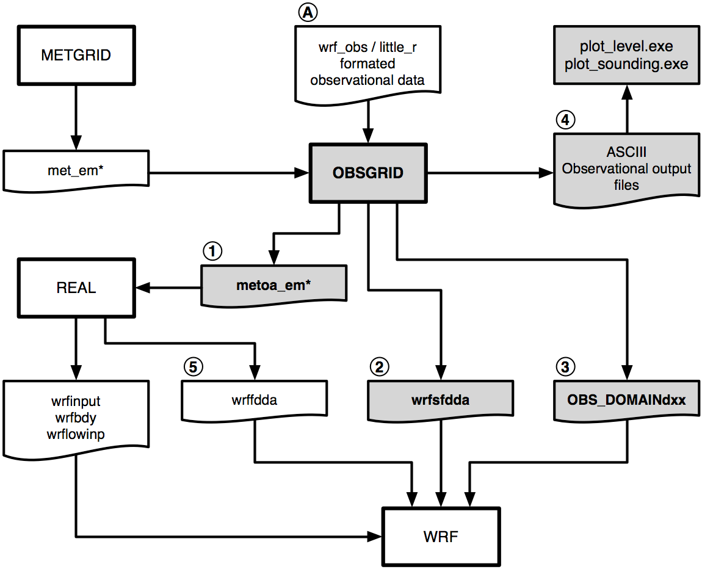

# 第7章 客观分析（OBSGRID）

## 目录

1. [简介](#Introduction)

2. [程序流程](#Program_Flow)

3. [观测数据来源](#Source_of_Obs)

4. [OBSGRID中使用的客观分析技术](#OA_tech)

5. [观测质量控制](#QC)

6. [附加观测](#Additional_Obs)

7. [地面FDDA选项](#Surface_FDDA)

8. [模型嵌套中的客观分析](#OA_Nests)

9. [如何运行OBSGRID](#How_to_run)

10. [输出文件](#Output)

11. [图形工具](#Plot_Utilities)

12. [观测格式](#Obs_Format)

13. [OBSGRID Namelist](#Namelist)

<a id=Introduction></a>

## 简介

气象模型中客观分析的目的是通过合并来自观测的信息以改进中尺度网格上的气象分析（`first guess`）。传统上，这些观测是来自地面和雷达探空仪报告的温度、湿度和风的“直接”观测。随着遥感技术的日趋成熟，研究人员和模型操作人员可以使用越来越多的“间接”观测。有效地将这些间接观察用于客观分析并非易事。通常用于间接观测的方法包括三维或四维变分技术（分别为“3DVAR”和“4DVAR”），这些技术也可以用于直接观测。

本章将讨论客观分析程序OBSGRID。有关变分技术（WRFDA）的讨论可见本用户指南第6章。

输入到OBSGRID的分析（`first guess`），是WPS软件包的METGRID部分的分析输出（有关WPS软件包的详细信息，请参见本用户指南的第3章）。

OBSGRID功能包括：

- 选择Cressman-style或Multiquadric客观分析。
	
- 为可疑的观测进行各种测试以筛选数据。
	
- 可输入伪造数据。
	
- 扩展网格：OBSGRID具有将输入模型区域缩减到输出范围的功能。利用此功能，您可以合并来自预期网格范围之外的数据，以改善边界附近的分析。若要使用此功能，用户在运行WPS时必须创建一个比最终目标区域更大的区域。

<a id=Program_Flow></a>

## 程序流程

OBSGRID在metgrid.exe之后直接运行，并使用来自metgrid.exe的`met_em*`输出文件作为输入文件。OBSGRID还需要其他观察数据（A）作为输入文件。这些观测文件的格式在本章的[观测格式](#Obs_Format)部分中进行了描述。



客观分析程序的输出文件可用于：

- 提供用于初始条件和边界条件的字段（1）。请注意，`metoa_em*`文件的格式与来自metgrid.exe的`met_em*`文件的格式相同。唯一的区别是这些文件中的字段合并了观测信息。
	
- 提供表面场以进行表面分析微调FDDA（2）。注意，将wrfsfdda文件用作WRF的输入文件时，还建议使用3-D fdda文件（wrffdda（5）–运行real.exe时创建的可选输出）作为WRF的输入文件。
	
- 提供用于观测微调的数据（3）。注意：从OBSGRID的3.1.1版本开始，该文件可以由观测微调代码直接读取，不再需要通过其他perl脚本来传递。
	
- 提供ASCII和netCDF输出（4）。这些文件包含有关使用的观测和分配的质量控制标志的信息。这些文件中的信息也可以使用提供的绘图工具进行绘图。

<a id=Source_of_Obs></a>

## 观测数据来源

OBSGRID读取用户以格式化的ASCII文本文件提供的观测数据。这使用户可以调整自己的数据以用作OBSGRID程序的输入。此格式（[`wrf_obs/little_r`格式](http://www2.mmm.ucar.edu/mm5/mm5v3/data/how_to_get_rawdata.html )）与MM5客观分析程序LITTLE_R中使用的格式相同（因此而得名）。

可以使用程序将NMC ON29和NCEP BUFR格式的文件（参见下文）转换为`wrf_obs/little_r`格式。用户负责将他们希望提供给OBSGRID的其他观测结果转换为这种格式。`utils/`目录中有一个用户提供（即不受官方支持）的程序，用于将观测文件从GTS转换为`wrf_obs/little_r`格式。

NCEP全球地面和高空观测业务数据子集，由NCAR的数据支持科（DSS）存档。

- NMC ON29格式的高空数据（从1970年代初到2000年初） http://rda.ucar.edu/datasets/ds353.4/  

- NMC ON29格式的地面数据（从1970年代初到2000年初） http://rda.ucar.edu/datasets/ds464.0/ 

- NCEP BUFR格式的高空数据（从1999年至今） http://rda.ucar.edu/datasets/ds351.0/ 

- NCEP BUFR格式的地面数据（从1999年至今） http://rda.ucar.edu/datasets/ds461.0/  

较新的数据（ds351.0和ds461.0）也提供little_r格式。 在NCAR以外，可以从Web上下载此数据，而NCAR超级计算机用户可以在NCAR/glade系统上使用该数据。该数据被分为6小时一次的窗口，这些窗口通常太大而无法在OBSGRID中使用。要将其重新排序为3小时一次的窗口，请执行以下操作：

- 获取little_r 6小时数据
	
	- 非NCAR超级计算机用户，直接从上述网站获取数据。将所有地面数据和高空数据合并（使用Unix的“cat”命令）到一个名为`rda_obs`的大文件中。
		
	- NCAR超级计算机用户，使用`util/get_rda_data.csh`脚本获取数据并创建`rda_obs`文件。您需要编辑此脚本以提供您感兴趣的日期范围。

- 编译Fortran程序`util/get_rda_data.f`。将`rda_obs`文件放在顶级OBSGRID目录中。运行`util/get_rda_data.exe`可执行文件。该可执行文件将使用`namelist.oa`中的日期范围，创建3小时一次的`OBS:<date>`文件，以供OBSGRID使用。
	
NMC Office Note 29可以在万维网上的许多地方找到，包括： http://www.emc.ncep.noaa.gov/mmb/data_processing/on29.htm 

获取little_r观测数据的另一种方法是从气象同化数据摄取系统（[MADIS](https://madis.noaa.gov/ )）下载，并使用NCAR提供的[MADIS2LITTLER工具](http://www2.mmm.ucar.edu/wrf/users/wrfda/download/madis.html )将其转换为little_r格式。请注意，要允许OBSGRID正确处理单层地面以上观测数据，必须修改MADIS2LITTLER以将这样的观测标记为探测（在`module_output.F`中，将`write_littler_onelvl`子例程修改设置为`is_sound = .TRUE.`）。

<a id=OA_tech></a>

## OBSGRID中使用的客观分析技术

### Cressman方案

OBSGRID中使用的四种客观分析技术中的三种是基于Cressman方案的，该方案通过多次连续扫描将第一猜测场向邻近的观测值微调。

标准Cressman方案为每个观测站分配一个圆形的影响半径R。每个网格点P处的第一猜测场，是通过考虑所有影响P的观测站来调整的。

计算第一猜测场和观测值之间的差异，并将这些差异值的距离加权平均值添加到P处的第一猜测值。一旦调整了所有网格点，就使用调整后的字段作为另一个调整周期的第一猜测场。随后的逐个调整均使用较小的影响半径。


### Ellipse方案

在分析压力层上的风和相对湿度（因风而强烈变形的场）时，标准Cressman方案的圆被沿着风向方向拉长成椭圆形。风越强，椭圆的偏心率就越大。该方案在低风速条件下就简化为圆形Cressman方案。


### Banana方案

在分析压力层上的风和相对湿度时，标准Cressman方案的圆在流动方向上拉长，并沿流线弯曲，变成香蕉形状。在直线流动条件下，该方案简化为Ellipse方案，在低风速条件下，该方案简化为标准Cressman方案。


 
### Multiquadric方案

Multiquadric方案使用双曲面径向基函数执行客观分析。Multiquadric技术的详细信息可见Nuss and Titley, 1994: "Use of multiquadric interpolation for meteorological objective analysis." Mon . Wea . Rev ., 122, 1611-1631。请谨慎使用此方案，因为它在只有少量观测数据的区域中可能会产生一些奇怪的结果。

<a id=QC></a>

## 观测质量控制

OBSGRID的重要组成部分是筛选不佳的观测结果。在OBSGRID中，许多这些质量控制检查是可选的。

### 独立报告的质量控制

- 总误差检查（相同值、压力随高度降低等）
	
- 去除温度和风廓线中的尖峰
	
- 调整温度廓线以去除超绝热层
	
- 不能与其他报告或第一猜测场进行比较

### ERRMAX测试

ERRMAX质量控制检查是可选的，但强烈建议使用。

- 限制对数据删除的用户控制。用户可以设置阈值，这些阈值会改变错误检查的容忍度
	
- 将观察结果与第一猜测场进行比较

- 如果差值（观测值-第一猜测场）超过某个阈值，则该观测值将被丢弃
	
- 按字段、层和一天中的时间设置不同的阈值
	
- 与良好的第一猜测场配合良好

### Buddy测试

Buddy检查是可选的，但强烈建议使用。

- 限制对数据删除的用户控制。用户可以设置权重因子，这会改变错误检查的容忍度
	
- 将观测结果与第一猜测场和附近的观测结果进行比较

- 如果某个观测点的差异值（观测值-第一猜测场）与相邻观测点的差异值的距离加权平均值相差很大，则丢弃该观测值
	
- 在数据密度好的区域中效果很好

<a id=Additional_Obs></a>

## 附加观测

在客观分析阶段，输入附加观测值或修改现有（和错误的）观测值可能是有用的工具。

在OBSGRID中，以与标准观测相同的方式（以相同的`wrf_obs/little_r`格式）向程序提供附加观测。附加观测必须与其他观测保存在同一文件中。现有（错误）的观测值可以轻松修改，因为观测值输入格式为ASCII文本。将一个观测报告标识为“bogus”仅意味着它被认为是良好的数据，但未对该报告执行任何质量控制检查。

<a id=Surface_FDDA></a>

## 地面FDDA选项

地面FDDA选项仅针对地面创建其他分析文件，通常两次分析之间的时间间隔比完整的高空分析要小（即更频繁）。这些地面分析文件可供以后在WRF中配合地面分析微调选项使用。

LAGTEM选项控制如何为地面分析文件创建第一猜测场。通常，以十二小时或六小时的时间间隔提供地面和高空第一猜测（分析时间），而地面分析间隔可以为3小时（10800秒）。因此，在分析时，将使用可用的地面第一猜测。如果将LAGTEM设置为`.FALSE.`，其他时间的地面第一猜测将从分析时间的第一猜测中临时插值。如果将LAGTEM设置为`.TRUE.`，则其他时间的地面第一猜测是前一次的客观分析。

<a id=OA_Nests></a>

## 模型嵌套中的客观分析

OBSGRID具有对嵌套执行客观分析的功能。这是通过单独的OBSGRID流程手动完成的，该流程在针对特定嵌套的met_em_d0x文件上执行。但是，通常不需要这样做，它会使用户的事务复杂化，并可能在预测中引入错误。另一方面，用户可用的额外信息，或客观分析可能在嵌套中提供的额外详细信息，使对嵌套的客观分析成为一个不错的选择。

对嵌套进行客观分析的主要原因是您具有比粗略域分辨率更大水平分辨率的观测数据。在某些情况下，嵌套上的地形也可以更好地利用地面观测值（即模型地形更好地与观测值的真实地形高度匹配）。

通过对嵌套进行客观分析而引入的主要问题是，粗糙域和嵌套之间的初始条件不一致。落在嵌套之外的观测值将用于分析粗略域，而在嵌套分析中将其丢弃。在嵌套边界处使用不同的观测值，可以得到非常不同的分析结果。

<a id=How_to_run></a>

## 如何运行OBSGRID

### 获取源代码

可以从[本网址](https://github.com/wrf-model/OBSGRID )或[本网址](https://www2.mmm.ucar.edu/wrf/users/download/get_sources_pproc_util.html )获取源代码。将tar文件解压缩（`gunzip OBSGRID.TAR.gz`，`tar -xf OBSGRID.TAR`）后，将生成一个`OBSGRID/`目录。

`cd OBSGRID`

### 生成可执行文件

构建WRF模型所需的唯一库是netCDF。用户可以在[UNIDATA主页](http://www.unidata.ucar.edu/software/netcdf/ )上找到源代码、预编译的二进制文件和文档。

要成功编译实用程序`plot_level.exe`和`plot_sounding.exe`，需要在系统上安装NCAR Graphics。这些例程对于运行OBSGRID不是必需的，但是对于显示观测值很有用。自从3.7.0版本后，提供了NCL脚本，因此不再需要这两个实用程序来绘制数据。

要配置，请键入：

`./configure`

选择配置选项之一，然后进行编译。

`./compile`

如果成功，将创建可执行文件`obsgrid.exe`。如果安装了NCAR Graphics，将创建可执行文件`plot_level.exe`和`plot_sounding.exe`。

### 准备观测文件

需要用户准备观测文件。一些数据可以从NCAR的RDA网站上获得。从1970年代初期开始的数据采用ON29格式，而1999年至今的数据则采用NCEP BUFR格式。提供了使用这些数据集的帮助。有关更多信息，请参阅本用户指南的[观测数据来源](#Source_of_Obs)。

还提供了一个用于重新格式化GTS流中的观测值的程序（不受官方支持）。可以在`OBSGRID/util`中找到它，称为`gts_cleaner.f`。该代码希望每个分析时间找到一个观测输入文件。每个文件都应包含地面和高空数据（如果有）。

### 根据您的具体情况编辑namelist

最经常更改的最关键信息是开始日期、结束日期和文件名。

应特别注意文件名的设置。观测文件的名称错误可能不会被发现，因为OBSGRID会很处理错误的文件，并且如果（错误指定的）文件中的特定时间段内没有数据，OBSGRID会为您提供无观测值的分析结果。

### 运行程序

通过调用以下命令运行程序：

`./obsgrid.exe >& obsgrid.out`

检查`obsgrid.out`文件以获取信息和运行错误。

### 检查输出文件

检查`obsgrid.out`文件中的错误消息或警告消息。该程序应该已经创建了名为`metoa_em*`的文件。也可能会创建其他输出文件，其中包含有关发现、使用和丢弃的观测数据的信息。

要检查的重要事项包括为您进行客观分析而发现的观测数，以及在各个层上使用的观测数。这可以提醒您在指定观测文件或时间间隔时可能出现的问题。此信息包含在打印输出文件中。

您可能还想尝试使用几个简单的绘图实用程序，详见下述。

还有许多其他输出文件，您可能会发现它们很有用，详见下述。

<a id=Output></a>

## 输出文件

OBSGRID程序生成一些ASCII/netCDF文件，以详细说明在该程序的时间周期内对观测数据采取的操作。为了支持用户希望绘制用于每个变量的观测图（在每个层、每个时间），将使用此信息创建一个文件。ASCII/netCDF文件主要供开发人员用于诊断目的。OBSGRID程序的主要输出是网格化的压力层数据集（`metoa_em*`文件），该数据集将传递给real.exe程序。

在下面列出的每个文件中，文本“.dn.YYYY-MM-DD_HH:mm:ss.tttt”允许OBSGRID处理的每个时间段输出一个单独的文件。日期字符串中唯一不寻常的信息是最后四个字母“tttt”，即十进制秒至十分之一秒。这些文件将取决于正在处理的区域。

### metoa_em*

这些是地面和压力层上的最终分析文件。生成此文件是运行OBSGRID的主要目标。

使用这些文件代替WPS中的`met_em*`文件来生成WRF的初始条件和边界条件。要在运行real.exe时使用这些文件，可以执行以下两项操作之一：

1. 将`metoa_em*`文件重命名或链接为`met_em*`。这样，real.exe将自动读取此文件。

2. 使用WRF的`namelist.input`文件中的`auxinput1_inname`选项覆盖real.exe使用的默认文件名。为此，在运行real.exe之前，将以下内容添加到WRF `namelist.input`文件的`&time_control`部分中（准确完整的使用下面的语法——请勿用实际数字代替`<domain>`和`<date>`）：

`auxinput1_inname = "metoa_em.d<domain>.<date>"`

### wrfsfdda_dn

在OBSGRID中使用地面FDDA选项将创建一个名为`wrfsfdda_dn`的文件。该文件包含以INTF4D间隔进行的表面分析，包括T、TH、U、V、RH、QV、PSFC、PMSL的分析，以及每个网格点250km以内的观测点计数。

由于WRF模型的输入要求，在每个时间间隔提供当前时间（`_OLD`）的数据和下次时刻（`_NEW`）的数据。由于此要求，用户必须注意在WRF fdda部分中为地面微调设置的时间间隔应该与OBSGRID中用于创建`wrfsfdda_dn`文件的时间间隔相同。这也意味着，用户可能需要OBSGRID可用的数据才能创建地面分析，该数据超出了WRF地面分析微调实际使用的最后一次分析所用数据。对于减速长度为正值，即使将在整个减速期间微调减速开始时的`_OLD`字段，WRF也需要在减速周期的开始时刻需要`_NEW`字段。

### OBS_DOMAINdxx

这些文件可在WRF中用于观测微调。该文件的格式与标准`wrf_obs/little_r`格式略有不同。有关观测微调的详细信息，请参见[观测微调用户指南](http://www2.mmm.ucar.edu/wrf/users/docs/ObsNudgingGuide.pdf )或本用户指南第5章的[观测微调](users_guide_chap5.md#Observation_Nudging)。

文件名中的“d”代表区域编号。“xx”只是一个序列号。

这些文件包含OBSGRID程序可使用的所有观测值的列表。

- 对观测值进行了分类，删除了重复项。

- 删除了分析区域之外的观测值。
 
- 删除了没有信息的观测值。

- 把每个单独位置（同一时刻不同层上）的所有报告合并为一个报告。

- 内部设置了“discard（丢弃）”标志的数据（不会发送到代码的质量控制或客观分析部分的数据）不会在此输出中列出。

- 数据经过了大量的测试，以确定报告是否在分析区域内，并且为数据提供了各种质量控制标记。除非检测到数据中的明显错误（例如海平面压力为负值），否则通常不会修改观测数据，而只会修改分配的质量控制标记。

- QC标志高于指定值（用户通过namelist控制）的数据将被设置为丢失数据。

WRF观测微调代码要求所有观测数据都在一个称为`OBS_DOMAINd01`的文件中可用（其中d是区域编号），而OBSGRID每个时刻都会创建一个此类文件。因此，要在WRF中使用这些文件，应首先将它们串联到单个文件中。为此提供了一个脚本（`run_cat_obs_files.csh`）。通过运行此脚本，原始的`OBS_DOMAINd01`文件将被移至`OBS_DOMAINd01_sav`，并且将创建一个新的`OBS_DOMAINd01`文件（包含所有时间的所有观测值）。此新文件可以直接在WRF观测微调代码中使用。

### qc_obs_raw.dn.YYYY-MM-DD_HH:mm:ss.tttt(.nc)

该文件包含OBSGRID程序可使用的所有观测值的列表。

- 对观测值进行了分类，删除了重复项。

- 删除了分析区域之外的观测值。

- 删除了没有信息的观测值。

- 把每个单独位置（同一时刻不同层上）的所有报告合并为一个报告。

- 内部设置了“discard（丢弃）”标志的数据（不会发送到代码的质量控制或客观分析部分的数据）不会在此输出中列出。

- 数据经过了大量的测试，以确定报告是否在分析区域内，并且为数据提供了各种质量控制标记。除非检测到数据中的明显错误（例如海平面压力为负值），否则通常不会修改观测数据，而只会修改分配的质量控制标记。

- 提供了两个文件，两个文件都包含相同的信息。一个是较旧的ASCII格式，而另一个是netCDF格式。

- ASCII格式文件中的数据可用作绘图工具plot_sounding.exe的输入。

- netCDF格式文件可用于绘制站点数据（`util/station.ncl`）和探空数据（`util/sounding.ncl`）。从3.7版开始可用，这是推荐的选项。

### qc_obs_used.dn.YYYY-MM-DD_HH:mm:ss.tttt(.nc)

这些文件类似于上面的“raw（原始）”文件，并且可以以相同的方式使用。但是它包含了OBSGRID程序使用的数据，也就是保存到`OBS_DOMAINdxx`文件中的数据。

### qc_obs_used_earth_relative.dn.YYYY-MM-DD_HH:mm:ss.tttt(.nc)

此文件与上面的`qc_obs_used`文件相同，除了风位于相对于地球的框架中，而不是相对于模型的框架中。这些文件的非netCDF版本可以用作模型评估工具[MET](http://www.dtcenter.org/met/users/ )的输入。

### plotobs_out.dn.YYYY-MM-DD_HH:mm:ss.tttt

此文件按变量和层列出数据，其中将已进入客观分析的每个观测与所有相关观测分组在一起，以进行绘图或其他诊断目的。该文件的第一行是输入数据所需的必要FORTRAN格式。数据列上方有标题，以帮助识别信息。以下是典型文件的几行内容。该数据可用作绘图实用程序`plot_level.exe`的输入。但是从3.7版开始，建议使用`station.ncl`脚本，该脚本使用新的netCDF文件中的数据。

```
( 3x,a8,3x,i6,3x,i5,3x,a8,3x,2(g13.6,3x),2(f7.2,3x),i7 ) 
Number of Observations 00001214 
Variable Press  Obs    Station Obs        Obs-1st   X         Y         QC 
Name     Level  Number ID      Value      Guess     Location  Location  Value 
U        1001   1      CYYT    6.39806    4.67690   161.51    122.96    0 
U        1001   2      CWRA    2.04794    0.891641  162.04    120.03    0 
U        1001   3      CWVA    1.30433   -1.80660   159.54    125.52    0 
U        1001   4      CWAR    1.20569    1.07567   159.53    121.07    0 
U        1001   5      CYQX    0.470500  -2.10306   156.58    125.17    0 
U        1001   6      CWDO    0.789376  -3.03728   155.34    127.02    0 
U        1001   7      CWDS    0.846182   2.14755   157.37    118.95    0 
```

<a id=Plot_Utilities></a>

## 图形工具

OBSGRID软件包提供了两个实用程序来绘制观测数据，包括`plot_soundings.exe`和`plot_levels.exe`。这些可选程序使用NCAR Graphics进行构建，这通常是有问题的。新的版本提供了两个新的NCL脚本来代替，即`sounding.ncl`和`station.ncl`。建议使用这些脚本而不是Fortran代码。

### sounding.ncl / plot_soundings.exe

脚本`util/sounding.ncl`用于绘制探空数据。该脚本从netCDF文件`qc_obs_raw.dn.YYYY-MM-DD_HH:mm:ss.tttt.nc`和`qc_obs_used.dn.YYYY-MM-DD_HH:mm:ss.tttt.nc`中生成探空图件。仅处理位于需要的分析层中的数据。

默认情况下，脚本将绘制目录中**所有**`qc_obs_used`文件中的数据。这可以通过使用命令行设置进行自定义。例如：

`ncl ./util/sounding.ncl 'qcOBS="raw"'`
		
从`qc_obs_raw`文件中绘制数据

`ncl util/sounding.ncl YYYY=2010 MM=6`

从2010年6月的`qc_obs_used`文件中绘制数据

可用的命令行选项包括：

命令    | 说明
--------|----
qcOBS   | 要使用的数据集，选项包括`raw`或`used`，默认为`used`
YYYY    | 要用于绘图的年份，整数格式，默认包括所有可用的年份
MM      | 要用于绘图的月份，整数格式，默认包括所有可用的月份
DD      | 要用于绘图的日，整数格式，默认包括所有可用的日
HH      | 要用于绘图的小时，整数格式，默认包括所有可用的小时
outTYPE | 输出类型，默认为绘制到屏幕上（即`x11`），其他可用的选项包括`pdf`或`ps`。本脚本创建以下输出文件：`qc_obs_<qcOBS>.sounding.<date>.<outTYPE>`，例如`qc_obs_used.sounding.2010-03-06_09.pdf`

较早的`plot_soundings.exe`程序也可以绘制探空数据。该程序从`qc_obs_raw.dn.YYYY-MM-DD_HH:mm:ss.tttt`和`qc_obs_used.dn.YYYY-MM-DD_HH:mm:ss.tttt`数据文件生成探空图件。仅处理位于需要的分析层中的数据。该程序使用`namelist.oa`文件中的`&record1`、`&record2`和`&plot_sounding`中的信息来生成所需的输出。程序创建的输出文件为：`sounding_<file_type>_<date>.cgm`。

### plot_level.exe

脚本`util/station.ncl`为每个分析层创建站点图。这些图既包含已通过所有QC测试的观测结果，也包含未通过QC测试的观测结果。未通过QC测试的观测结果根据失败的测试类型以不同的颜色绘制。该脚本从netCDF文件`qc_obs_raw.dn.YYYY-MM-DD_HH:mm:ss.tttt.nc`和`qc_obs_used.dn.YYYY-MM-DD_HH:mm:ss.tttt.nc`生成站点图。

默认情况下，脚本将绘制目录中**所有**`qc_obs_used`文件中的数据。这可以通过使用命令行设置进行自定义。例如：

`ncl ./util/station.ncl 'qcOBS="raw"'`

从`qc_obs_raw`文件中绘制数据

`ncl util/station.ncl YYYY=2010 MM=6`

从2010年6月的`qc_obs_used`文件中绘制数据

可用的命令行选项包括：

命令    | 说明
--------|----
qcOBS   | 要使用的数据集，选项包括`raw`或`used`，默认为`used`
YYYY    | 要用于绘图的年份，整数格式，默认包括所有可用的年份
MM      | 要用于绘图的月份，整数格式，默认包括所有可用的月份
DD      | 要用于绘图的日，整数格式，默认包括所有可用的日
HH      | 要用于绘图的小时，整数格式，默认包括所有可用的小时
outTYPE | 输出类型，默认为绘制到屏幕上（即`x11`），其他可用的选项包括`pdf`或`ps`。本脚本创建以下输出文件：`qc_obs_<qcOBS>.station.<date>.<outTYPE>`，例如`qc_obs_used.station.2010-03-06_09.pdf `

较早的`plot_level.exe`程序为每个分析层创建站点图。这些图中既包含已通过所有QC测试的观测结果，也包含未通过QC测试的观测结果。未通过QC测试的观测结果根据失败的测试类型以不同的颜色绘制。该程序使用`namelist.oa`文件中的`&record1`和`&record2`中的信息来根据`plotobs_out.dn.YYYY-MM-DD_HH:mm:ss.tttt`文件中的观测结果生成图件。程序创建的输出文件为：`levels_<date>.cgm`。

<a id=Obs_Format></a>

## 观测格式

为了充分利用OBSGRID程序，用户必须了解`wrf_obs/little_r`观测格式，这一点很重要。

观测在概念上是根据报告进行组织的。报告由与单个纬度/经度坐标关联的单个观测值或一组观测值组成。

例子

- 地面站报告，包括对温度、压力、湿度和风的观测。

- 高空站的探空报告，其中包含许多高度或压力层上的温度、湿度和风的观测。

- 飞机的报告，包括特定纬度/经度/高度的温度。

- 卫星观测，包括特定纬度/经度/高度的风观测。
 
`wrf_obs/little_r`观测格式的每个报告至少包含四个部分：

- 报告标题

- 一个或多个数据

- 数据结束记录

- 报告结束记录

报告标题是一个600个字符长的记录（其中许多未使用，仅需要虚拟值），其中包含有关站点和整个报告的某些信息（位置、站点ID、站点类型、站点海拔等）。下表中完整描述了报告标题记录。表中粗体的项目未使用：

**报告标题的格式**

**变量**            | **Fortran I/O 格式** | **描述**
--------------------|----------------------|---------
latitude            | F20.5         | station latitude (north positive)
longitude           | F20.5         | station longitude (east positive)
id                  | A40           | ID of station
name                | A40           | Name of station
platform            | A40           | Description of the measurement device
source              | A40           | GTS, NCAR/ADP, BOGUS, etc.
elevation           | F20.5         | station elevation (m)
num_vld_fld         | I10           | Number of valid fields in the report
**num_error**       | **I10**       | **Number of errors encountered during the decoding of this observation**
**num_warning**     | **I10**       | **Number of warnings encountered during decoding of this observation**
seq_num             | I10           | Sequence number of this observation
**num_dups**        | I10           | **Number of duplicates found for this observation**
is_sound            | L10           | T/F Above-surface or surface (i.e., all non-surface observations should use T, even above-surface single-level obs)
bogus               | L10           | T/F bogus report or normal one
discard             | L10           | T/F Duplicate and discarded (or merged) report.
**sut**             | **I10**       | **Seconds since 0000 UTC 1 January 1970**
**julian**          | **I10**       | **Day of the year**
date_char           | A20           | YYYYMMDDHHmmss
slp, qc             | F13.5, I7     | Sea-level pressure (Pa) and a QC flag
**ref_pres, qc**    | **F13.5, I7** | **Reference pressure level (for thickness) (Pa) and a QC flag**
**ground_t, qc**    | **F13.5, I7** | **Ground Temperature (T) and QC flag**
**sst, qc**         | **F13.5, I7** | **Sea-Surface Temperature (K) and QC**
**psfc, qc**        | **F13.5, I7** | **Surface pressure (Pa) and QC**
**precip, qc**      | **F13.5, I7** | **Precipitation Accumulation and QC**
**t_max, qc**       | **F13.5, I7** | **Daily maximum T (K) and QC**
**t_min, qc**       | **F13.5, I7** | **Daily minimum T (K) and QC**
**t_min_night, qc** | **F13.5, I7** | **Overnight minimum T (K) and QC**
**p_tend03, qc**    | **F13.5, I7** | **3-hour pressure change (Pa) and QC**
**p_tend24, qc**    | **F13.5, I7** | **24-hour pressure change (Pa) and QC**
**cloud_cvr, qc**   | **F13.5, I7** | **Total cloud cover (oktas) and QC**
**ceiling, qc**     | **F13.5, I7** | **Height (m) of cloud base and QC**

报告标题之后是数据。这些数据包含压力、高度、温度、露点、风速和风向的观测值。数据中还有许多其他字段未在输入中使用。每个数据记录都包含观测报告的一个层的数据。对于具有多个层的观测报告类型（例如高空站点探空报告），每个压力或高度层都有其自己的数据记录。对于具有单个层的观测报告类型（例如地面站报告或卫星的风观测），该报告将具有单个数据记录。下表总结了数据记录的内容和格式，表中粗体的项目未使用：

**数据记录的格式**

**变量**          | **Fortran I/O 格式** | **描述**
------------------|----------------------|---------
pressure, qc      | F13.5, I7     | Pressure (Pa) of observation, and QC
height, qc        | F13.5, I7     | Height (m MSL) of observation, and QC
temperature, qc   | F13.5, I7     | Temperature (K) and QC
dew_point, qc     | F13.5, I7     | Dewpoint (K) and QC
speed, qc         | F13.5, I7     | Wind speed (m/s) and QC
direction, qc     | F13.5, I7     | Wind direction (degrees) and QC
**u, qc**         | **F13.5, I7** | **u component of wind (m/s), and QC**
**v, qc**         | **F13.5, I7** | **v component of wind (m/s), and QC**
**rh, qc**        | **F13.5, I7** | **Relative Humidity (%) and QC**
**thickness, qc** | **F13.5, I7** | **Thickness (m), and QC**

数据记录的结尾是压力和高度字段都设置为-777777的数据记录。

在所有数据和数据记录结尾之后，必须有一个报告结束记录。报告结束记录仅是三个整数（详见下表，表中粗体的项目未使用），实际上并不是那么重要。

**报告结束记录的格式**

**变量**        | **Fortran I/O 格式** | **描述**
----------------|----------------------|---------
num_vld_fld     | I7     | Number of valid fields in the report
**num_error**   | **I7** | **Number of errors encountered during the decoding of the report**
**num_warning** | **I7** | **Number of warnings encountered during the decoding the report**

### QCFlags（质量控制标记）

在观测文件中，大多数气象数据字段还具有用于附加整数质量控制标记的空间。质量控制标记取值的形式为2^n，其中n为正整数值。这允许添加各种质量控制标志，也允许将总和分解为各个组成部分。以下是当前应用于观测的质量控制标志：

```
pressure interpolated from first-guess height      = 2 **  1 =      2   从第一猜测高度插入的压力
pressure int. from std. atmos. and 1st-guess height= 2 **  3 =      8   压力整数来自于标准大气和第一猜测高度
temperature and dew point both = 0                 = 2 **  4 =     16   温度和露点均等于0
wind speed and direction both = 0                  = 2 **  5 =     32   风速和风向都等于0
wind speed negative                                = 2 **  6 =     64   风速为负值
wind direction < 0 or > 360                        = 2 **  7 =    128   风向数据小于0或大于360
level vertically interpolated                      = 2 **  8 =    256   层垂直内插
value vertically extrapolated from single level    = 2 **  9 =    512   从单个层垂直外推的值
sign of temperature reversed                       = 2 ** 10 =   1024   温度反转的标记
superadiabatic level detected                      = 2 ** 11 =   2048   检测到超绝热层
vertical spike in wind speed or direction          = 2 ** 12 =   4096   风速或风向的垂直峰值
convective adjustment applied to temperature field = 2 ** 13 =   8192   应用于温度场的对流调节
no neighboring observations for buddy check        = 2 ** 14 =  16384   buddy check没有相邻观测点
---------------------------------------------------------------------- 
data outside normal analysis time and not QC-ed    = 2 ** 15 =  32768   数据超出了正常分析时间且未进行质量控制
----------------------------------------------------------------------
fails error maximum test                           = 2 ** 16 =  65536   未通过error maximum测试
fails buddy test                                   = 2 ** 17 = 131072   未通过buddy测试
observation outside of domain detected by QC       = 2 ** 18 = 262144   质量控制检测到的区域之外的观测值
```

<a id=Namelist></a>

## OBSGRID Namelist

OBSGRID的namelist文件称为`namelist.oa`，并且必须位于运行OBSGRID的目录中。该namelist文件由九个部分namelist记录组成，名称分别为`record1`到`record9`，每个记录都有一个内容松散的区域。每个namelist记录都在`namelist.oa`文件中跨越多行，并以`&record<#>`（其中<#>是namelist记录编号）开头，以斜杠`/`结尾。

namelist中的`&plot_sounding`部分仅用于上述相应的实用工具。

### Namelist record1

namelist `record1`中的数据定义了要处理的分析时间：

**Namelist变量** | **取值** | **描述**
-----------------|----------|---------
start_year       | 2000     | 要处理的开始日期的4位数年
start_month      | 01       | 要处理的开始日期的2位数月
start_day        | 24       | 要处理的开始日期的2位数日
start_hour       | 12       | 要处理的开始日期的2位数小时
end_year         | 2000     | 要处理的结束日期的4位数年
end_month        | 01       | 要处理的结束日期的2位数月
end_day          | 25       | 要处理的结束日期的2位数日
end_hour         | 12       | 要处理的结束日期的2位数小时
interval         | 21600    | 连续处理时段之间的时间间隔（单位：s）

### Namelist record2

`record2`中的数据定义模型网格和输入文件的名称：

**Namelist变量** | **取值** | **描述**
-----------------|----------|---------
grid_id                   | 1         | 要处理的区域ID 
obs_filename              | CHARACTER | 观测文件的根文件名（可能包括目录信息）。所有输入文件的格式必须为`obs_filename:<YYYY-MM-DD_HH>`。每个时间段需要一个文件。如果同时要创建wrfsfdda，则每个地面fdda时间需要类似的输入数据文件。
remove_data_above_qc_flag | 200000    | QC标志高于此值的数据将不会输出到`OBS_DOMAINdxx`文件。默认值是输出所有数据。使用`65536`删除未通过buddy和error max测试的数据。若要排除分析时间以外不能进行质量控制的数据，则使用`32768`（推荐）。这不会影响OA过程中使用的数据。
remove_unverified_data    | .FALSE.   | 通过将此参数设置为`.TRUE.`(建议值），由于压力不足以接近分析层而无法进行质量控制的任何观测将从`OBS_DOMAINdxx`文件中删除。Obs质量控制（通过将其调整到附近的分析层或将其与用户指定公差范围内的分析层进行比较）将包含在`OBS_DOMAINdxx`文件中。请参阅`&record4`中的`use_p_tolerance_one_lev`选项
trim_domain               | .FALSE.   | 设置为.TRUE.时，则此区域在输出时减小一定的范围
trim_value                | 5         | 区域各个方向上减小的网格点数

准备处理的`met_em*`文件必须在OBSGRID/目录中可用。
 
`obs_filename`和interval设置可能会引起混淆，需要一些其他说明。`obs_filename`文件的使用与在namelist `&record1`中设置的时间和时间间隔以及在namelist `&record8`中设置的F4D选项有关。`obs_filename`文件用于分析整个3D数据集，包括高空层和地面。当`F4D=.TRUE.`时，也会使用它们。也就是说，如果要为地面FDDA微调创建地面分析。`obs_filename`文件应包含在特定时间用于特定分析的所有观测值（高空和地面）。

理想情况下，每个需要进行客观分析的时间段都应有一个`obs_filename`。时间段从开始日期到结束日期按时间间隔顺序进行处理，所有这些都在namelist `&record1`中指定。所有观测文件必须具有与之关联的日期。如果找不到文件，则代码将像该文件包含零个观测值一样进行处理，然后继续进行下一个时间段。

如果选择了F4D选项，则类似地处理`obs_filename`文件以进行地表分析，这一次是按`INTF4D`指定的时间间隔进行的。

如果用户希望包括来自感兴趣的模型区域之外的观测，则geogrid.exe（WPS）需要在比感兴趣的区域稍大的区域上运行。将`trim_domain`设置为`.TRUE.`时，会按`trim_value`中设置的网格点数向下削减输入区域的所有4个方向。

在下面的示例中，目标区域是内部白色区域，共有100×100网格点。已经为外部区域（110×110网格点）运行geogrid.exe。通过将`trim_value`设置为5，将在每个方向上用5个网格点修剪输出区域，从而得到白色100×100网格点的区域。


### Namelist record3

`&record3`中的数据与程序内分配的用于观测的空间有关。这些是不经常需要修改的值：

**Namelist变量** | **取值** | **描述**
-----------------|----------|---------
max_number_of_obs       | 10000  | 每个时间段的预期最大报告数
fatal_if_exceed_max_obs | .TRUE. | T/F标志允许用户决定没有足够空间来存储所有可用观测时的处理方式

### Namelist record4

`&record4`中的数据设置质量控制选项。用户可以激活四种特定的测试：最大错误测试；伙伴测试；去除尖峰；以及去除超级绝热流失率。对于其中一些测试，用户也可以控制公差。

**Namelist变量** | **取值** | **描述**
-----------------|----------|---------
qc_psfc                    | .FALSE. | 对地面压力观测值（临时转换为海平面压力以运行质量控制）执行error max和buddy检查测试
Error Max Test（最大错误测试）：|    | 本测试中每个变量都有一个阈值。这些阈值按时间（day）、地面特征和垂直层进行缩放
qc_test_error_max          | .TRUE.  | 检查第一猜测和观测结果之间的差异
max_error_t                | 10      | 最大允许温差（K）
max_error_uv               | 13      | 最大允许水平风分量差（m/s）
max_error_z                | 8       | 未使用
max_error_rh               | 50      | 最大允许相对湿度差（%）
max_error_p                | 600     | 最大允许海平面压力差（Pa）
max_error_dewpoint         | 20      | 最大允许露点温差（K）
Buddy Check Test（伙伴测试）：|      | 本测试中每个变量都有一个阈值。这些阈值类似于标准偏差。
qc_test_buddy              | .TRUE.  | 检查单个观测值与相邻观测值之间的差异
max_buddy_t                | 8       | 最大允许温差（K）
max_buddy_uv               | 8       | 最大允许水平风分量差（m/s）
max_buddy_z                | 8       | 未使用
max_buddy_rh               | 40      | 最大允许相对湿度差（%）
max_buddy_p                | 800     | 最大允许海平面压力差（Pa）
max_buddy_dewpoint         | 20      | 最大允许露点温差（K）
buddy_weight               | 1.0     | 缩放buddy阈值的比例
Spike removal（去除峰值）：|         | 
qc_test_vert_consistency   | .FALSE. | 检查温度、露点、风速和风向的垂直峰值
去除超绝热的消失速率       |         | 
qc_test_convective_adj     | .FALSE. | 通过保留干燥的静态能量，去除sounding中任何超绝热的消失速率
对于卫星和飞机观测数据，在水平方向上通常只有一个垂直层。以下条目将确定如何处理此类数据，并在下表下方更详细地描述。|   |
use_p_tolerance_one_lev    | .FALSE. | 地面以上单层观测是直接对比附近的层（.TRUE.）进行质量控制，还是扩展到附近的层（.FALSE.）进行质量控制
max_p_tolerance_one_lev_qc | 700     | 可以直接应用质量控制的压力容差（Pa）
max_p_extend_t             | 1300    | 可以从单个温度报告扩展的压力差（Pa）
max_p_extend_w             | 1300    | 可以从单个风向报告扩展的压力差（Pa）

露点质量控制：

请注意，露点错误最大值检查和伙伴检查与相对湿度检查使用相同的湿度场。露点检查允许对湿度场进行额外的质量控制，并可能有助于干燥观测，其中相对湿度差异可能很小，但露点差异要大得多。最大露点阈值根据观测到的露点进行缩放，以增加预期露点变化较大的干燥条件下的阈值。如果用户不希望使用露点错误检查，只需将阈值设置为非常大的值。

地面以上单层观测的质量控制：

选项 1：`use_p_tolerance_one_lev = .FALSE.`

对于标记为`FM-88 SATOB`或`FM-97 AIREP`的地面以上单层观测值，会将观测值调整至最近的压力层。如果观测的压力在最接近的第一猜测层的`max_p_extend_t Pa`内，则使用标准递减率将观测的温度调整到第一猜测层，否则温度被标记为缺失。如果观测的气压在最接近的第一猜测层的`max_p_extend_w Pa`内，则直接使用风而不进行调整。无论观测压力如何，露点都被标记为缺失。观测压力改为质量控制所针对的压力层压力。

如果地面以上单层观测被标记为`FM-88 SATOB`或`FM-97 AIREP`以外的任何东西，则除非其压力恰好与第一猜测场中的一个压力层匹配，否则它不会受到质量控制。请注意，如果`use_p_tolerance_one_lev = .FALSE.`，则忽略`max_p_tolerance_one_lev_qc`。

选项 2：`use_p_tolerance_one_lev = .TRUE.`

对于所有地面以上单层观测，只要最接近的第一猜测场在观测的`max_p_tolerance_one_lev_qc Pa`范围内，观测都将受到质量控制。为了使所有地面以上单层观测值足够接近第一猜测的压力层，以便质量控制直接将最近的压力层与观测值进行比较是有效的，用户可能需要在摄取到OBSGRID之前将第一猜测插入额外的压力层。OBSGRID将打印出错误最大质量控制不可用的压力范围（即地面以上单层观测不受质量控制的压力）。有关创建客观分析的等效压力公差，请参见namelist `record9`中的`max_p_tolerance_one_lev_oa`。请注意，如果`use_p_tolerance_one_lev = .TRUE.`，则忽略`max_p_extend_t`和`max_p_extend_w`。

### Namelist record5

`&record5`中的数据用来控制OBSGRID程序可能产生的大量打印输出。这些值都是逻辑标志，其中`TRUE`将生成输出，`FALSE`将关闭输出。

`print_obs_files ; print_found_obs ; print_header ; print_analysis ;print_qc_vert ; print_qc_dry ; print_error_max ; print_buddy ;print_oa`

### Namelist record7

`&record7`中的数据涉及第一猜测场和地面FDDA分析选项的使用。总是用第一猜测。

**Namelist变量** | **取值** | **描述**
-----------------|----------|---------
use_first_guess  | .TRUE.   | 总是用第一猜测，即设置`use_first_guess=.TRUE.`
f4d              | .TRUE.   | 打开（`.TRUE.`）或关闭（`.FALSE.`）地面分析文件的创建
intf4d           | 10800    | 地面分析时间之间的时间间隔（以秒为单位）
lagtem           | .FALSE.  | 使用上一个时间段的最终地面分析作为这个时间段的第一猜测（`lagtem=.TRUE.`）；或者使用高空时间之间的时间插值作为此地面分析的第一猜测（`lagtem=.FALSE.`）

### Namelist record8

`&record8`中的数据用于客观分析之后数据的平滑。请注意，仅对分析结果的差异场（观测值减去第一猜测值）进行平滑处理，而不是对整个场进行平滑处理。

**Namelist变量**  | **取值** | **描述**
------------------|----------|---------
smooth_type       | 1 | 1 = five point stencil of 1-2-1 smoothing; 2 = smoother-desmoother
smooth_sfc_wind   | 0 | 地面风的平滑次数
smooth_sfc_temp   | 0 | 地面温度的平滑次数
smooth_sfc_rh     | 0 | 地面相对湿度的平滑次数
smooth_sfc_slp    | 0 | 海平面压力的平滑次数
smooth_upper_wind | 0 | 高空风的平滑次数
smooth_upper_temp | 0 | 高空温度的平滑次数
smooth_upper_rh   | 0 | 高空相对湿度的平滑次数

### Namelist record9 

`&record9`中的数据涉及客观分析选项。注意这里没有可以为影响半径（圆形、椭圆形或香蕉形）选择各种Cressman扩展的选项。如果选择了Cressman选项，则将根据风的情况应用椭圆或香蕉扩展。

**Namelist变量** | **取值** | **描述**
-----------------|----------|---------
oa_type                     | “Cressman” | “MQD”即multiquadric，“Cressman”即Cressman类型方案，"None"即不进行分析，此字符串区分大小写
oa_3D_type                  | “Cressman” | 将高空数据设置为“Cressman”方案，而不考虑在地面使用的方案
oa_3D_option                | 0       | 如果没有足够的观测值来执行“MQD”时，如何在“MQD”和“Cressman”之间切换
mqd_minimum_num_obs         | 30      | 用于MQD的最小观测数
mqd_maximum_num_obs         | 1000    | 用于MQD的最大观测数
radius_influence            | 5,4,3,2 | Cressman方案的影响半径（以网格点位单位）
radius_influence_sfc_mult   | 1.0     | 将地面以上影响半径乘以本数值，即可得到地面影响半径
oa_min_switch               | .TRUE.  | T=如果用于MQD的观测数太少，则切换到Cressman；F=如果观测数太少，则不进行分析
oa_max_switch               | .TRUE.  | T=如果用于MQD的观测数太多，则切换到Cressman；F=如果观测数太多，则不进行分析
scale_cressman_rh_decreases | .FALSE. | T=减少Cressman分析中的干燥度；F=不修改Cressman分析中的干燥度
oa_psfc                     | .FALSE. | T=进行地面压力客观分析；F=仅通过海平面压力分析调整地面压力
max_p_tolerance_one_lev_oa  | 700     | 可用于客观分析的地面以上单层观测的压力限值（Pa）

当`oa_type`设置为`Cressman`时，将对所有数据执行Cressman方案。

当`oa_type`设置为`None`时，将不对任何数据执行客观分析。

当`oa_type`设置为`MQD`时，可以使用多种选项来控制何时将代码恢复为Cressman方案。

- `oa_max_switch ; mqd_maximum_num_obs`

如果将开关设置为true并且超过了最大观测数，则代码将恢复为Cressman。

这是为了减少代码运行的时间，而不是出于物理原因。

建议将开关设置为true，而将最大数设置为大的值。

- `oa_min_switch ; mqd_minimum_num_obs`

如果将开关设置为true并且观测值太少，则代码将恢复为Cressman。在这种情况下，代码如何以及何时恢复为Cressman，由`oa_3D_option`参数控制。

建议将开关设置为true并以默认的最小设置开始。

- `oa_3D_type=”Cressman”`

无论其他设置如何，所有高空层数据都将使用Cressman方案。

只要有足够的观测值（`mqd_maximum_num_obs; mqd_minimum_num_obs`），地面将使用`MQD`，否则它将恢复为Cressman方案。

请注意，如果某些时间段有足够的观测值，而另一些时间段没有足够的观测值，则只在没有足够的观测值的时间段时，代码会恢复为Cressman方案。

- `oa_3D_option`

有三个选项（0,1,2）。对于所有这些选项，只要有足够的观测值（`mqd_maximum_num_obs; mqd_minimum_num_obs`），地面将使用`MQD`，否则它将恢复为Cressman方案。

请注意，如果某些时间段有足够的观测值，而另一些时间段没有足够的观测值，则只在没有足够的观测值的时间段时，代码会恢复为Cressman方案。

高空数据处理如下：

0（默认值）：只要有足够的观测值（`mqd_maximum_num_obs; mqd_minimum_num_obs`），就在高空数据执行`MQD`。一旦不再是这种情况，代码将停止，并提供有关设置哪些参数以正确运行代码的建议。

1：代码将首先检查在给定的时间内，高空的所有层和变量是否对MQD方案具有足够的观测值。如果没有，该时间段内的代码将恢复为Cressman。请注意，如果某些时间段有足够的观测值，而另一些时间段没有足够的观测值，则只在没有足够的观测值的时间段时，代码会恢复为Cressman方案。

2：该代码将检查MQD方案的每个时间、层和变量是否有足够的观测值。如果没有，代码将在该特定时间、层和变量下恢复为Cressman方案。注意，这可能导致MQD和Cressman之间的不受控制的切换。因此不建议使用此选项。

- `radius_influence`

Cressman方案有三种影响半径（RIN）的设置选项：

	- 手动：直接设置RIN和扫描次数。例如5、4、3、2将导致4次扫描。第一次将使用5个网格点作为RIN，最后一次使用2个网格点。
	
	- 自动1：将RIN设置为0，代码将根据区域的大小和325km的估计观测密度来计算RIN。默认情况下，将进行4次扫描。
	
	- 自动2：将RIN设置为负数，代码将根据区域的大小和325km的估计观测密度来计算RIN。扫描次数由设定的值控制。例如，设置为-5时将导致5次扫描。

- `radius_influence_sfc_mult`

将如上所述计算的RIN乘以本选项设置的值即可确定用于地面观测的RIN。这允许保留在地面观测的更精细的尺度结构。如果此乘数结果RIN大于100个模型网格点，则将第一次扫描的RIN缩放为100个模型网格点，并且所有后续扫描都以相同的比例缩放。这是为了防止特征在精细域上被消除。为了最小化解决方案上的`spots`，将跳过任何RIN小于4.5个模型网格点的扫描。如果将本选项设置为1.0，则用于地面观测的RIN将与用于地面以上观测的RIN一致。

- `scale_cressman_rh_decreases`

此选项的目的是减轻当通过观测在某个点诊断出的干燥需求散布到与观测点所在位置的第一猜测相比，比第一个猜测更干燥的另一点时可能发生的过度干燥。如果本项设置为true，则将干燥应用于施加到观测位置的第一猜测比第一猜测更干燥的点，然后按以下比例缩放该比例：应用干燥的点处的第一个猜测相对湿度除以位于该位置的第一个猜测相对湿度（这一段完全没看懂原文啥意思，翻译可能也不对）。

请注意，此缩放比例适用于每次Cressman扫描。详见Reen et al. 2016 (http://dx.doi.org/10.1175/JAMC-D-14-0301.1 )了解更多详细信息。

- `oa_psfc`

如果第一猜测的地面压力场​​与WRF域相比足够粗糙，则对地面压力的客观分析可以使其他区域的Obsgrid表面分析在WRF中得到更有效的利用（例如Reen 2015; http://www.arl.army.mil/arlreports/2015/ARL-TR-7447.pdf ）。这是因为地面压力分析可以更好地估计地面分析的压力，因此WRF不太可能因为与实际地面的距离太远而错误地拒绝了地面分析。如果没有足够的观测值，或者如果第一猜测的地面压力没有比WRF粗糙，则此功能很难增加价值。

- `max_p_tolerance_one_lev_oa`

如果在`record4`中设置`use_p_tolerance_one_lev = .TRUE.`，那么`max_p_tolerance_one_lev_oa`是地面以上单层观测值与客观分析中使用的压力层之间允许的压力公差（Pa）。如果在record4中设置`use_p_tolerance_one_lev = .FALSE.`，则OBSGRID不使用`max_p_tolerance_one_lev_oa`。

### Namelist plot_sounding

仅用于plot_sounding.exe实用工具

**Namelist变量** | **取值** | **描述**
-----------------|----------|---------
file_type        | “raw”    | 用于生成图件的文件类型，选项是“raw”或者“used” 
read_metoa       | .TRUE.   | 如果设置为.TRUE.，则读取`metoa_em`文件中的模型区域信息，用于在绘图上添加位置信息